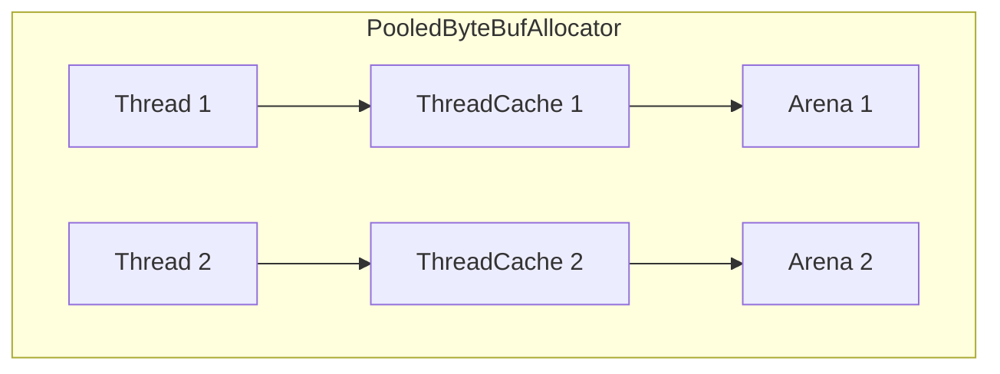

ByteBuf는 [[Netty]]에서 바이트 데이터를 다루기 위한 컨테이너다. [[Java NIO]]의 `ByteBuffer`보다 사용하기 쉽고 성능도 더 좋다. 읽기와 쓰기를 위한 별도의 인덱스, 동적 확장, [[참조 카운팅]] 기반 메모리 관리 등 네트워크 프로그래밍에 최적화된 기능을 제공한다.

---

## ByteBuffer의 문제점

Java NIO의 `ByteBuffer`는 몇 가지 사용하기 불편한 점이 있다.

```java
// ByteBuffer: 읽기/쓰기 전환이 번거롭다
ByteBuffer buffer = ByteBuffer.allocate(1024);
buffer.put((byte) 1);
buffer.put((byte) 2);
buffer.flip();  // 쓰기 → 읽기 모드 전환 (필수!)
byte b = buffer.get();
```

- 읽기/쓰기 모드 전환을 위해 `flip()` 호출 필요
- 고정 크기로 할당 후 확장 불가
- 용량을 초과하면 새 버퍼를 만들어 복사해야 함

ByteBuf는 이런 문제를 해결한다.

---

## 두 개의 인덱스

ByteBuf는 읽기 인덱스(readerIndex)와 쓰기 인덱스(writerIndex)를 분리해서 관리한다. 모드 전환 없이 읽기와 쓰기를 자유롭게 할 수 있다.

```
+-------------------+------------------+------------------+
| discardable bytes |  readable bytes  |  writable bytes  |
+-------------------+------------------+------------------+
|                   |                  |                  |
0      <=      readerIndex   <=   writerIndex    <=    capacity
```

| 영역 | 범위 | 설명 |
|-----|------|------|
| discardable | 0 ~ readerIndex | 이미 읽은 데이터 |
| readable | readerIndex ~ writerIndex | 읽을 수 있는 데이터 |
| writable | writerIndex ~ capacity | 쓸 수 있는 공간 |

```java
ByteBuf buf = Unpooled.buffer(16);

// 쓰기 (writerIndex 증가)
buf.writeInt(42);
buf.writeBytes(new byte[] {1, 2, 3});

// 읽기 (readerIndex 증가)
int value = buf.readInt();
byte[] bytes = new byte[3];
buf.readBytes(bytes);

// 인덱스 확인
System.out.println("readerIndex: " + buf.readerIndex());  // 7
System.out.println("writerIndex: " + buf.writerIndex());  // 7
System.out.println("readableBytes: " + buf.readableBytes());  // 0
```

---

## 동적 확장

ByteBuf는 용량이 부족하면 자동으로 확장된다. `maxCapacity`까지 필요에 따라 늘어난다.

```java
ByteBuf buf = Unpooled.buffer(4, 100);  // 초기 4바이트, 최대 100바이트

buf.writeInt(1);    // 4바이트 사용
buf.writeInt(2);    // 자동 확장됨
buf.writeInt(3);    // 계속 확장

System.out.println("capacity: " + buf.capacity());  // 64 (자동 확장됨)
```

확장 전략은 내부적으로 최적화되어 있다. 64바이트 미만이면 다음 2의 거듭제곱으로, 그 이상이면 4MB씩 증가한다.

---

## 메모리 유형

### Heap ByteBuf

JVM 힙 메모리에 할당된다. GC 대상이며 배열을 직접 참조할 수 있다.

```java
ByteBuf heapBuf = Unpooled.buffer(256);

if (heapBuf.hasArray()) {
    byte[] array = heapBuf.array();
    int offset = heapBuf.arrayOffset();
    // 배열 직접 접근 가능
}
```

### Direct ByteBuf

네이티브 메모리에 할당된다. I/O 작업 시 JVM 힙에서 네이티브 메모리로의 복사가 없어 더 빠르다.

```java
ByteBuf directBuf = Unpooled.directBuffer(256);

// hasArray()가 false - 배열 직접 접근 불가
if (!directBuf.hasArray()) {
    int length = directBuf.readableBytes();
    byte[] array = new byte[length];
    directBuf.getBytes(directBuf.readerIndex(), array);  // 복사 필요
}
```

### Composite ByteBuf

여러 ByteBuf를 하나처럼 다룰 수 있다. 데이터 복사 없이 버퍼들을 합칠 수 있어 [[Zero-Copy]] 최적화에 유용하다.

```java
CompositeByteBuf composite = Unpooled.compositeBuffer();

ByteBuf header = Unpooled.copiedBuffer("HTTP/1.1 200 OK\r\n", CharsetUtil.UTF_8);
ByteBuf body = Unpooled.copiedBuffer("Hello World", CharsetUtil.UTF_8);

composite.addComponents(true, header, body);

// header와 body의 내용을 복사 없이 하나처럼 읽을 수 있음
while (composite.isReadable()) {
    System.out.print((char) composite.readByte());
}
```

---

## 참조 카운팅

ByteBuf는 [[참조 카운팅]]으로 메모리를 관리한다. 참조 카운트가 0이 되면 메모리가 반환된다.

```java
ByteBuf buf = Unpooled.buffer(256);
System.out.println(buf.refCnt());  // 1

buf.retain();  // 참조 카운트 증가
System.out.println(buf.refCnt());  // 2

buf.release();  // 참조 카운트 감소
System.out.println(buf.refCnt());  // 1

buf.release();  // 0이 되면 메모리 반환
System.out.println(buf.refCnt());  // 0 (더 이상 사용 불가)
```

### 소유권 규칙

Netty에서 ByteBuf의 소유권은 명확한 규칙을 따른다.

1. **생성자가 해제 책임**: ByteBuf를 생성하거나 받은 컴포넌트가 `release()` 호출 책임
2. **전달 시 책임 이전**: 다른 핸들러로 전달하면 책임도 넘어감
3. **보관 시 retain**: 나중에 사용하려면 `retain()` 후 나중에 `release()`

```java
public void channelRead(ChannelHandlerContext ctx, Object msg) {
    ByteBuf buf = (ByteBuf) msg;

    // 방법 1: 처리 후 전달 (책임 이전)
    ctx.fireChannelRead(buf);

    // 방법 2: 처리 후 소비 (직접 해제)
    try {
        process(buf);
    } finally {
        buf.release();
    }

    // 방법 3: 보관 후 나중에 사용
    buf.retain();
    this.savedBuf = buf;
    ctx.fireChannelRead(buf);
    // 나중에 savedBuf.release() 필요
}
```

---

## 풀링 (Pooling)

ByteBuf 생성/해제 비용을 줄이기 위해 풀링을 사용한다. `PooledByteBufAllocator`가 버퍼를 재사용해서 GC 부담을 크게 줄인다.

```java
// 풀링된 버퍼 할당자 (Netty 기본값)
ByteBufAllocator allocator = PooledByteBufAllocator.DEFAULT;

// 채널의 할당자 사용 (권장)
ByteBuf buf = ctx.alloc().buffer(256);

// 처리 후 반드시 해제 (풀로 반환됨)
buf.release();
```

### 풀링 아키텍처



- **ThreadCache**: 스레드 로컬 캐시로 락 없이 빠른 할당
- **Arena**: 청크 단위 메모리 관리 (jemalloc 알고리즘)
- **PoolChunk**: 16MB 청크를 하위 영역으로 분할

---

## 읽기/쓰기 메서드

### 읽기 메서드 (readerIndex 이동)

```java
byte b = buf.readByte();
short s = buf.readShort();
int i = buf.readInt();
long l = buf.readLong();
float f = buf.readFloat();
double d = buf.readDouble();
buf.readBytes(dstArray);
buf.readBytes(dstByteBuf, length);
```

### 쓰기 메서드 (writerIndex 이동)

```java
buf.writeByte(1);
buf.writeShort(2);
buf.writeInt(3);
buf.writeLong(4L);
buf.writeFloat(1.0f);
buf.writeDouble(2.0);
buf.writeBytes(srcArray);
buf.writeBytes(srcByteBuf);
```

### Get/Set 메서드 (인덱스 불변)

```java
// 특정 위치에서 읽기 (readerIndex 변경 없음)
int value = buf.getInt(4);

// 특정 위치에 쓰기 (writerIndex 변경 없음)
buf.setInt(4, 100);
```

---

## 파생 버퍼

원본 버퍼의 뷰를 생성해서 데이터 복사 없이 일부를 참조할 수 있다.

### slice()

```java
ByteBuf buf = Unpooled.copiedBuffer("Hello World", CharsetUtil.UTF_8);

// 인덱스 6부터 5바이트의 뷰 생성
ByteBuf slice = buf.slice(6, 5);  // "World"

// 원본과 메모리 공유 - 수정하면 원본도 변경됨
slice.setByte(0, 'w');  // buf도 "Hello world"가 됨
```

### duplicate()

```java
ByteBuf dup = buf.duplicate();

// 메모리 공유, 하지만 독립적인 인덱스
dup.readerIndex(3);  // buf의 readerIndex는 그대로
```

### copy()

```java
ByteBuf copy = buf.copy();

// 완전히 새로운 복사본 - 원본과 독립적
copy.setByte(0, 'X');  // buf에 영향 없음
```

---

## 유틸리티 메서드

```java
// 읽을 수 있는 바이트 수
int readable = buf.readableBytes();

// 쓸 수 있는 바이트 수
int writable = buf.writableBytes();

// 읽은 영역 버리기 (공간 확보)
buf.discardReadBytes();

// 인덱스 초기화
buf.clear();  // readerIndex = writerIndex = 0

// 읽기 인덱스 마킹/복원
buf.markReaderIndex();
// ... 읽기 작업 ...
buf.resetReaderIndex();

// 바이트 검색
int index = buf.indexOf(0, buf.readableBytes(), (byte) '\n');
```

---

## ByteBuf 생성

```java
// Unpooled (비풀링) - 테스트나 간단한 용도
ByteBuf heapBuf = Unpooled.buffer(256);
ByteBuf directBuf = Unpooled.directBuffer(256);
ByteBuf wrapped = Unpooled.wrappedBuffer(byteArray);  // 배열 래핑, 복사 없음
ByteBuf copied = Unpooled.copiedBuffer("Hello", CharsetUtil.UTF_8);

// 풀링 - 프로덕션 권장
ByteBuf pooledBuf = PooledByteBufAllocator.DEFAULT.buffer(256);

// ChannelHandlerContext에서 (채널의 할당자 사용)
ByteBuf buf = ctx.alloc().buffer();
ByteBuf ioBuf = ctx.alloc().ioBuffer();  // I/O에 적합한 타입 자동 선택
```

---

## 누수 탐지

개발 중 ByteBuf 누수를 찾기 위해 누수 탐지 기능을 활성화할 수 있다.

```java
// JVM 옵션으로 설정
-Dio.netty.leakDetectionLevel=PARANOID

// 프로그램에서 설정
ResourceLeakDetector.setLevel(ResourceLeakDetector.Level.PARANOID);
```

| 레벨 | 설명 |
|-----|------|
| DISABLED | 탐지 안 함 |
| SIMPLE | 1%만 샘플링 (기본값) |
| ADVANCED | 1% 샘플링 + 할당 위치 추적 |
| PARANOID | 모든 버퍼 추적 (성능 저하) |

---

## References

- [[Netty]]
- [[참조 카운팅]]
- [[Zero-Copy]]
- [[Java NIO]]
