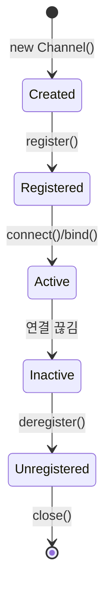
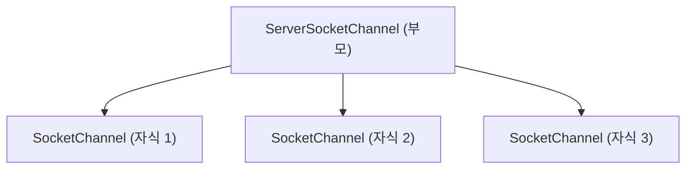

Channel은 [[Netty]]에서 네트워크 소켓에 대한 추상화를 담당하는 핵심 인터페이스다. 읽기, 쓰기, 연결, 바인딩 같은 모든 I/O 작업의 진입점 역할을 한다. 하나의 Channel은 하나의 네트워크 연결과 대응된다고 생각하면 이해하기 쉽다.

---

## Channel이 하는 일

Channel 인터페이스를 살펴보면 네트워크 프로그래밍에 필요한 거의 모든 기능이 정의되어 있다.

```java
public interface Channel extends AttributeMap, ChannelOutboundInvoker, Comparable<Channel> {
    // 현재 상태 조회
    ChannelId id();
    boolean isOpen();
    boolean isRegistered();
    boolean isActive();

    // 주소 정보
    SocketAddress localAddress();
    SocketAddress remoteAddress();

    // 핵심 컴포넌트 접근
    EventLoop eventLoop();
    ChannelPipeline pipeline();
    ByteBufAllocator alloc();

    // 부모-자식 관계 (서버 채널의 경우)
    Channel parent();
}
```

**isOpen()**: 채널이 열려있는지 확인한다. 닫힌 채널에서는 어떤 I/O 작업도 수행할 수 없다.

**isRegistered()**: 채널이 [[Netty EventLoop]]에 등록되었는지 확인한다. 등록되어야 I/O 이벤트를 처리할 수 있다.

**isActive()**: 채널이 활성 상태인지 확인한다. TCP의 경우 연결이 맺어진 상태, UDP의 경우 바인딩된 상태를 의미한다.

---

## Channel의 생명주기

Channel은 명확한 생명주기를 가진다. 각 상태 전이마다 [[Netty ChannelPipeline]]을 통해 이벤트가 전파된다.



| 상태 | 설명 | 발생 이벤트 |
|-----|------|-----------|
| Created | 채널 인스턴스가 생성됨 | - |
| Registered | EventLoop에 등록됨 | channelRegistered |
| Active | 연결 완료(TCP) 또는 바인딩 완료(UDP) | channelActive |
| Inactive | 연결이 끊어짐 | channelInactive |
| Unregistered | EventLoop에서 해제됨 | channelUnregistered |

---

## Channel 타입

Netty는 다양한 전송 방식을 지원하며, 각각에 대응하는 Channel 구현체가 있다.

### NIO 기반 (플랫폼 독립적)

```java
// TCP 서버
NioServerSocketChannel serverChannel;

// TCP 클라이언트
NioSocketChannel clientChannel;

// UDP
NioDatagramChannel datagramChannel;
```

NIO 채널은 [[Java NIO]]의 Selector를 사용해 논블로킹 I/O를 수행한다. 어떤 운영체제에서든 동작하므로 가장 범용적으로 사용된다.

### Epoll 기반 (Linux 전용)

```java
// Linux에서 더 나은 성능
EpollServerSocketChannel serverChannel;
EpollSocketChannel clientChannel;
```

Linux의 `epoll` 시스템 콜을 직접 사용해 NIO보다 더 좋은 성능을 낸다. Edge-triggered 모드 지원, 더 적은 시스템 콜 호출 등의 이점이 있다.

### KQueue 기반 (macOS/BSD 전용)

```java
// macOS에서 최적화
KQueueServerSocketChannel serverChannel;
KQueueSocketChannel clientChannel;
```

macOS와 BSD 계열에서 `kqueue`를 사용한 네이티브 최적화를 제공한다.

---

## 계층 구조

Channel은 부모-자식 관계를 가질 수 있다. 서버 소켓 채널이 클라이언트 연결을 받아들이면, 새로운 자식 채널이 생성된다.



```java
// 자식 채널에서 부모 채널 참조
Channel parent = childChannel.parent();

// 서버 채널의 경우 parent는 null
assert serverChannel.parent() == null;
```

---

## I/O 작업

Channel을 통해 수행하는 I/O 작업은 모두 비동기다. 작업을 요청하면 즉시 `ChannelFuture`를 반환하고, 실제 작업은 [[Netty EventLoop]]에서 처리된다.

### 데이터 쓰기

```java
// 방법 1: write + flush 분리
channel.write(message);     // 버퍼에만 쌓임
channel.flush();            // 실제 전송

// 방법 2: 한 번에 처리 (권장)
ChannelFuture future = channel.writeAndFlush(message);

// 완료 확인
future.addListener(f -> {
    if (f.isSuccess()) {
        System.out.println("전송 성공");
    }
});
```

`write()`는 데이터를 내부 버퍼에 쌓기만 하고, `flush()`가 호출되어야 실제로 네트워크를 통해 전송된다. 여러 메시지를 한꺼번에 보내야 할 때는 write를 여러 번 호출한 후 마지막에 flush를 한 번만 호출하는 게 효율적이다.

### 연결과 종료

```java
// 원격 서버에 연결 (클라이언트)
ChannelFuture connectFuture = channel.connect(new InetSocketAddress("example.com", 80));

// 특정 포트에 바인딩 (서버)
ChannelFuture bindFuture = channel.bind(new InetSocketAddress(8080));

// 채널 종료
ChannelFuture closeFuture = channel.close();

// 종료 대기
channel.closeFuture().sync();
```

---

## 설정 옵션

`ChannelConfig`를 통해 채널의 동작을 세밀하게 조정할 수 있다.

```java
// 개별 설정
channel.config().setConnectTimeoutMillis(5000);
channel.config().setAutoRead(true);

// Bootstrap에서 설정 (권장)
bootstrap.option(ChannelOption.SO_BACKLOG, 128)
         .option(ChannelOption.CONNECT_TIMEOUT_MILLIS, 5000)
         .childOption(ChannelOption.SO_KEEPALIVE, true)
         .childOption(ChannelOption.TCP_NODELAY, true);
```

| 옵션 | 설명 |
|-----|------|
| SO_BACKLOG | 연결 대기 큐 크기 (서버) |
| SO_KEEPALIVE | TCP Keep-Alive 활성화 |
| TCP_NODELAY | Nagle 알고리즘 비활성화 (지연 감소) |
| SO_RCVBUF | 수신 버퍼 크기 |
| SO_SNDBUF | 송신 버퍼 크기 |
| CONNECT_TIMEOUT_MILLIS | 연결 타임아웃 |

---

## 속성 저장소

Channel은 `AttributeMap`을 구현해서 임의의 데이터를 채널에 연결할 수 있다. 세션 정보나 사용자 데이터를 저장할 때 유용하다.

```java
// 속성 키 정의
public static final AttributeKey<User> USER_KEY = AttributeKey.valueOf("user");

// 속성 설정
channel.attr(USER_KEY).set(currentUser);

// 속성 조회
User user = channel.attr(USER_KEY).get();

// 핸들러에서 사용
public void channelRead(ChannelHandlerContext ctx, Object msg) {
    User user = ctx.channel().attr(USER_KEY).get();
    // 사용자별 처리 로직
}
```

---

## AbstractChannel 내부 구조

대부분의 Channel 구현체는 `AbstractChannel`을 상속받는다. 내부 구조를 이해하면 Netty의 동작 방식을 더 깊이 파악할 수 있다.

```java
public abstract class AbstractChannel extends DefaultAttributeMap implements Channel {
    private final Channel parent;
    private final ChannelId id;
    private final Unsafe unsafe;
    private final DefaultChannelPipeline pipeline;

    private volatile SocketAddress localAddress;
    private volatile SocketAddress remoteAddress;
    private volatile EventLoop eventLoop;
    private volatile boolean registered;

    protected AbstractChannel(Channel parent) {
        this.parent = parent;
        id = newId();
        unsafe = newUnsafe();
        pipeline = newChannelPipeline();
    }
}
```

**Unsafe**: 저수준 I/O 작업을 수행하는 내부 인터페이스다. 일반적인 애플리케이션에서는 직접 사용하지 않는다.

**Pipeline**: 채널 생성 시 자동으로 [[Netty ChannelPipeline]]이 생성되어 연결된다.

---

## 스레드 안전성

Channel의 모든 I/O 작업은 해당 채널에 할당된 [[Netty EventLoop]] 스레드에서 실행된다. 다른 스레드에서 `write()`를 호출해도 내부적으로 EventLoop의 태스크 큐에 추가되어 순차적으로 처리된다.

```java
// 어떤 스레드에서 호출해도 안전
new Thread(() -> {
    channel.writeAndFlush(message);  // EventLoop 큐에 추가됨
}).start();

// EventLoop 스레드인지 확인
if (channel.eventLoop().inEventLoop()) {
    // 현재 스레드가 EventLoop
    doSomething();
} else {
    // 다른 스레드에서 호출됨
    channel.eventLoop().execute(() -> doSomething());
}
```

---

## References

- [[Netty]]
- [[Netty ChannelPipeline]]
- [[Netty EventLoop]]
- [[Netty Bootstrap]]
