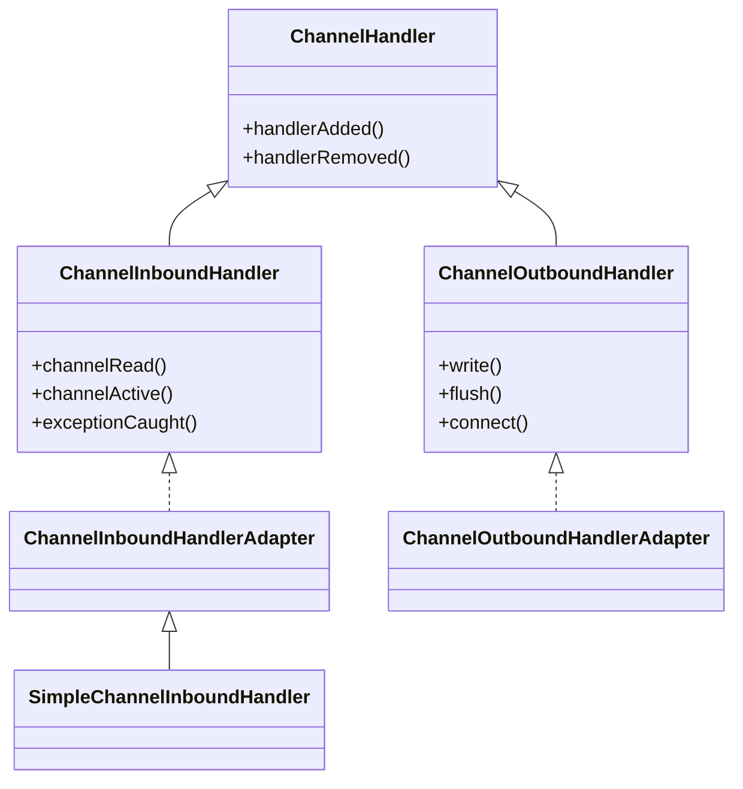

ChannelHandler는 [[Netty]]에서 실제 비즈니스 로직이 들어가는 컴포넌트다. 데이터 인코딩/디코딩, 프로토콜 처리, 예외 처리 등 거의 모든 네트워크 처리 로직이 핸들러 안에 구현된다. [[Netty ChannelPipeline]]에 여러 핸들러를 체인처럼 연결해서 복잡한 프로토콜도 모듈화된 방식으로 처리할 수 있다.

---

## 핸들러 계층 구조



---

## ChannelInboundHandler

인바운드 핸들러는 네트워크에서 들어오는 이벤트를 처리한다. 데이터 수신, 연결 상태 변경, 예외 발생 등의 이벤트를 받아 처리한다.

```java
public interface ChannelInboundHandler extends ChannelHandler {
    // 채널 생명주기
    void channelRegistered(ChannelHandlerContext ctx);
    void channelUnregistered(ChannelHandlerContext ctx);
    void channelActive(ChannelHandlerContext ctx);
    void channelInactive(ChannelHandlerContext ctx);

    // 데이터 수신
    void channelRead(ChannelHandlerContext ctx, Object msg);
    void channelReadComplete(ChannelHandlerContext ctx);

    // 기타 이벤트
    void userEventTriggered(ChannelHandlerContext ctx, Object evt);
    void channelWritabilityChanged(ChannelHandlerContext ctx);
    void exceptionCaught(ChannelHandlerContext ctx, Throwable cause);
}
```

### 주요 콜백 메서드

| 메서드 | 호출 시점 |
|-------|---------|
| channelRegistered | EventLoop에 채널이 등록될 때 |
| channelActive | 채널이 활성화될 때 (연결 완료) |
| channelRead | 데이터가 수신될 때마다 |
| channelReadComplete | 현재 읽기 작업이 완료될 때 |
| channelInactive | 채널이 비활성화될 때 |
| exceptionCaught | 예외가 발생했을 때 |

### ChannelInboundHandlerAdapter 사용

직접 인터페이스를 구현하면 모든 메서드를 오버라이드해야 한다. `ChannelInboundHandlerAdapter`를 상속하면 필요한 메서드만 오버라이드할 수 있다.

```java
public class EchoServerHandler extends ChannelInboundHandlerAdapter {

    @Override
    public void channelActive(ChannelHandlerContext ctx) {
        System.out.println("클라이언트 연결됨: " + ctx.channel().remoteAddress());
    }

    @Override
    public void channelRead(ChannelHandlerContext ctx, Object msg) {
        // 받은 데이터를 그대로 되돌려 보냄
        ctx.write(msg);
    }

    @Override
    public void channelReadComplete(ChannelHandlerContext ctx) {
        // 버퍼에 쌓인 데이터 전송
        ctx.flush();
    }

    @Override
    public void exceptionCaught(ChannelHandlerContext ctx, Throwable cause) {
        cause.printStackTrace();
        ctx.close();
    }
}
```

---

## SimpleChannelInboundHandler

특정 타입의 메시지만 처리하고 싶을 때 `SimpleChannelInboundHandler`를 사용한다. 제네릭으로 메시지 타입을 지정하면, 해당 타입의 메시지만 `channelRead0()` 메서드로 전달된다.

```java
public class StringHandler extends SimpleChannelInboundHandler<String> {

    @Override
    protected void channelRead0(ChannelHandlerContext ctx, String msg) {
        // msg는 이미 String 타입
        System.out.println("받은 문자열: " + msg);
        ctx.writeAndFlush("응답: " + msg.toUpperCase());
    }
}
```

### 자동 리소스 해제

`SimpleChannelInboundHandler`의 큰 장점은 메시지를 자동으로 해제해준다는 것이다. [[Netty ByteBuf]]처럼 [[참조 카운팅]]을 사용하는 객체도 `channelRead0()` 처리 후 자동으로 `release()`가 호출된다.

```java
// SimpleChannelInboundHandler의 내부 동작
public void channelRead(ChannelHandlerContext ctx, Object msg) {
    boolean release = true;
    try {
        if (acceptInboundMessage(msg)) {
            channelRead0(ctx, (I) msg);
        } else {
            release = false;
            ctx.fireChannelRead(msg);
        }
    } finally {
        if (release) {
            ReferenceCountUtil.release(msg);  // 자동 해제
        }
    }
}
```

만약 메시지를 다른 핸들러로 전파해야 한다면, 생성자에서 `autoRelease`를 `false`로 설정한다.

```java
public class MyHandler extends SimpleChannelInboundHandler<ByteBuf> {
    public MyHandler() {
        super(false);  // 자동 해제 비활성화
    }

    @Override
    protected void channelRead0(ChannelHandlerContext ctx, ByteBuf msg) {
        // 직접 release 호출하거나 다음 핸들러로 전파
        ctx.fireChannelRead(msg.retain());
    }
}
```

---

## ChannelOutboundHandler

아웃바운드 핸들러는 애플리케이션에서 네트워크로 나가는 작업을 가로챈다. 데이터 인코딩, 쓰기 버퍼링, 연결 관리 등을 처리한다.

```java
public interface ChannelOutboundHandler extends ChannelHandler {
    void bind(ChannelHandlerContext ctx, SocketAddress localAddress, ChannelPromise promise);
    void connect(ChannelHandlerContext ctx, SocketAddress remoteAddress,
                 SocketAddress localAddress, ChannelPromise promise);
    void disconnect(ChannelHandlerContext ctx, ChannelPromise promise);
    void close(ChannelHandlerContext ctx, ChannelPromise promise);
    void deregister(ChannelHandlerContext ctx, ChannelPromise promise);
    void read(ChannelHandlerContext ctx);
    void write(ChannelHandlerContext ctx, Object msg, ChannelPromise promise);
    void flush(ChannelHandlerContext ctx);
}
```

### ChannelOutboundHandlerAdapter 사용

```java
public class TimeoutHandler extends ChannelOutboundHandlerAdapter {

    @Override
    public void write(ChannelHandlerContext ctx, Object msg, ChannelPromise promise) {
        // 쓰기 시간 측정
        long start = System.nanoTime();

        promise.addListener(future -> {
            long elapsed = System.nanoTime() - start;
            if (elapsed > TimeUnit.SECONDS.toNanos(1)) {
                System.out.println("쓰기 지연 감지: " + elapsed + "ns");
            }
        });

        ctx.write(msg, promise);
    }
}
```

---

## ChannelDuplexHandler

인바운드와 아웃바운드 모두 처리해야 할 때 `ChannelDuplexHandler`를 사용한다. 연결 상태 추적, 타임아웃 처리 같은 양방향 로직에 유용하다.

```java
public class IdleStateHandler extends ChannelDuplexHandler {
    private long lastReadTime;
    private long lastWriteTime;

    @Override
    public void channelRead(ChannelHandlerContext ctx, Object msg) {
        lastReadTime = System.currentTimeMillis();
        ctx.fireChannelRead(msg);
    }

    @Override
    public void write(ChannelHandlerContext ctx, Object msg, ChannelPromise promise) {
        lastWriteTime = System.currentTimeMillis();
        ctx.write(msg, promise);
    }
}
```

---

## @Sharable 어노테이션

기본적으로 핸들러 인스턴스는 하나의 파이프라인에만 추가할 수 있다. 여러 채널에서 동일한 핸들러 인스턴스를 공유하려면 `@Sharable` 어노테이션을 붙여야 한다.

```java
@Sharable
public class StatelessHandler extends ChannelInboundHandlerAdapter {
    // 인스턴스 필드 없음 - 상태가 없으므로 공유 가능

    @Override
    public void channelRead(ChannelHandlerContext ctx, Object msg) {
        // 상태 없이 처리
        ctx.fireChannelRead(processMessage(msg));
    }
}

// 사용
StatelessHandler shared = new StatelessHandler();

bootstrap.childHandler(new ChannelInitializer<SocketChannel>() {
    @Override
    protected void initChannel(SocketChannel ch) {
        ch.pipeline().addLast(shared);  // 모든 채널에서 동일 인스턴스 사용
    }
});
```

**주의**: `@Sharable` 핸들러는 반드시 스레드 안전해야 한다. 인스턴스 필드를 사용하면 동시성 문제가 발생할 수 있다.

```java
// 잘못된 예 - 상태가 있으면서 @Sharable
@Sharable
public class WrongHandler extends ChannelInboundHandlerAdapter {
    private int count = 0;  // 위험! 여러 스레드에서 동시 접근

    @Override
    public void channelRead(ChannelHandlerContext ctx, Object msg) {
        count++;  // 경쟁 조건 발생
    }
}
```

---

## 이벤트 전파

핸들러에서 이벤트를 다음 핸들러로 전파하려면 `ChannelHandlerContext`의 fire 메서드를 호출한다.

```java
public class LoggingHandler extends ChannelInboundHandlerAdapter {

    @Override
    public void channelRead(ChannelHandlerContext ctx, Object msg) {
        System.out.println("수신 데이터: " + msg);

        // 다음 핸들러로 전파 (필수!)
        ctx.fireChannelRead(msg);
    }
}
```

`ctx.fireChannelRead(msg)`를 호출하지 않으면 이벤트가 다음 핸들러로 전달되지 않는다. 의도적으로 이벤트를 소비하는 경우가 아니라면 반드시 전파해야 한다.

---

## 코덱 핸들러

Netty는 인코딩/디코딩을 위한 특수한 핸들러 베이스 클래스를 제공한다.

### ByteToMessageDecoder

바이트를 메시지 객체로 변환한다.

```java
public class IntegerDecoder extends ByteToMessageDecoder {

    @Override
    protected void decode(ChannelHandlerContext ctx, ByteBuf in, List<Object> out) {
        // 4바이트 이상 있을 때만 디코딩
        if (in.readableBytes() >= 4) {
            out.add(in.readInt());
        }
    }
}
```

### MessageToByteEncoder

메시지 객체를 바이트로 변환한다.

```java
public class IntegerEncoder extends MessageToByteEncoder<Integer> {

    @Override
    protected void encode(ChannelHandlerContext ctx, Integer msg, ByteBuf out) {
        out.writeInt(msg);
    }
}
```

### MessageToMessageCodec

메시지 간 변환을 담당한다.

```java
public class HttpRequestCodec extends MessageToMessageCodec<ByteBuf, HttpRequest> {

    @Override
    protected void encode(ChannelHandlerContext ctx, HttpRequest msg, List<Object> out) {
        // HttpRequest → ByteBuf
        ByteBuf buf = ctx.alloc().buffer();
        // 인코딩 로직
        out.add(buf);
    }

    @Override
    protected void decode(ChannelHandlerContext ctx, ByteBuf msg, List<Object> out) {
        // ByteBuf → HttpRequest
        HttpRequest request = parseRequest(msg);
        out.add(request);
    }
}
```

---

## 핸들러 생명주기

```java
public class LifecycleHandler extends ChannelInboundHandlerAdapter {

    @Override
    public void handlerAdded(ChannelHandlerContext ctx) {
        // 파이프라인에 추가될 때
        System.out.println("핸들러 추가됨");
    }

    @Override
    public void handlerRemoved(ChannelHandlerContext ctx) {
        // 파이프라인에서 제거될 때
        System.out.println("핸들러 제거됨");
    }

    @Override
    public void channelRegistered(ChannelHandlerContext ctx) {
        // 채널이 EventLoop에 등록될 때
    }

    @Override
    public void channelUnregistered(ChannelHandlerContext ctx) {
        // 채널이 EventLoop에서 해제될 때
    }
}
```

호출 순서:
1. `handlerAdded` - 핸들러가 파이프라인에 추가됨
2. `channelRegistered` - 채널이 EventLoop에 등록됨
3. `channelActive` - 채널 활성화
4. `channelRead` / `channelReadComplete` - 데이터 처리
5. `channelInactive` - 채널 비활성화
6. `channelUnregistered` - EventLoop에서 해제됨
7. `handlerRemoved` - 파이프라인에서 제거됨

---

## 실제 사용 예제

HTTP 서버의 핸들러 파이프라인 구성 예:

```java
pipeline.addLast("codec", new HttpServerCodec());
pipeline.addLast("aggregator", new HttpObjectAggregator(65536));
pipeline.addLast("compressor", new HttpContentCompressor());
pipeline.addLast("handler", new HttpRequestHandler());

public class HttpRequestHandler extends SimpleChannelInboundHandler<FullHttpRequest> {

    @Override
    protected void channelRead0(ChannelHandlerContext ctx, FullHttpRequest request) {
        // HTTP 요청 처리
        String uri = request.uri();
        HttpMethod method = request.method();

        // 응답 생성
        FullHttpResponse response = new DefaultFullHttpResponse(
            HttpVersion.HTTP_1_1,
            HttpResponseStatus.OK,
            Unpooled.copiedBuffer("Hello!", CharsetUtil.UTF_8)
        );

        response.headers().set(HttpHeaderNames.CONTENT_TYPE, "text/plain");
        response.headers().setInt(HttpHeaderNames.CONTENT_LENGTH, response.content().readableBytes());

        ctx.writeAndFlush(response);
    }
}
```

---

## References

- [[Netty]]
- [[Netty ChannelPipeline]]
- [[Netty ByteBuf]]
- [[참조 카운팅]]
