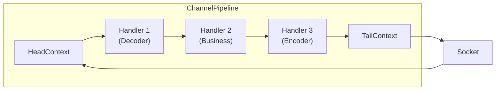
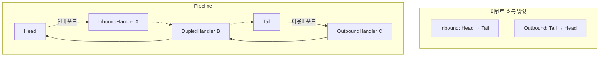
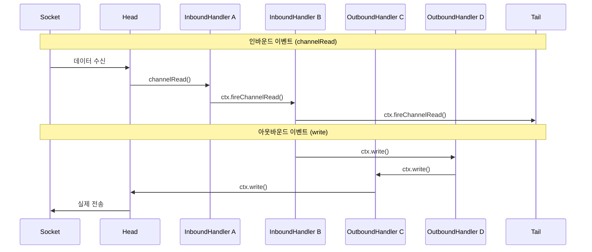

ChannelPipeline은 [[Netty]]에서 이벤트와 데이터의 흐름을 제어하는 핵심 컴포넌트다. 인터셉팅 필터 패턴(Intercepting Filter Pattern)을 구현하여, 여러 [[Netty ChannelHandler]]를 체인처럼 연결하고 순차적으로 실행시킨다.

---

## 파이프라인의 역할

네트워크 애플리케이션에서 데이터는 여러 단계의 처리를 거친다. 바이트 스트림을 객체로 변환하고, 비즈니스 로직을 적용하고, 다시 바이트로 인코딩하는 식이다. ChannelPipeline은 이런 처리 단계들을 모듈화하고 조합할 수 있게 해준다.



---

## 인바운드와 아웃바운드

파이프라인을 통과하는 이벤트는 두 방향으로 흐른다.

### 인바운드 (Inbound)

네트워크에서 데이터가 들어오면 인바운드 이벤트가 발생한다. HeadContext에서 시작해서 TailContext 방향으로 전파된다.

```
Socket.read() → HeadContext → Decoder → BusinessHandler → TailContext
```

인바운드 이벤트 종류:
- `channelRegistered`: EventLoop에 등록됨
- `channelActive`: 연결 활성화
- `channelRead`: 데이터 수신
- `channelReadComplete`: 읽기 완료
- `channelInactive`: 연결 비활성화
- `exceptionCaught`: 예외 발생

### 아웃바운드 (Outbound)

애플리케이션에서 데이터를 보내면 아웃바운드 이벤트가 발생한다. TailContext에서 시작해서 HeadContext 방향으로 전파된다.

```
BusinessHandler → Encoder → HeadContext → Socket.write()
```

아웃바운드 작업 종류:
- `bind`: 로컬 주소 바인딩
- `connect`: 원격 서버 연결
- `write`: 데이터 쓰기
- `flush`: 버퍼 플러시
- `close`: 연결 종료



---

## 핸들러 추가와 제거

파이프라인에 핸들러를 추가하는 방법은 여러 가지다.

```java
ChannelPipeline pipeline = channel.pipeline();

// 마지막에 추가
pipeline.addLast("decoder", new MyDecoder());
pipeline.addLast("handler", new MyHandler());
pipeline.addLast("encoder", new MyEncoder());

// 처음에 추가
pipeline.addFirst("logging", new LoggingHandler());

// 특정 핸들러 앞/뒤에 추가
pipeline.addBefore("handler", "validator", new ValidatorHandler());
pipeline.addAfter("decoder", "decompressor", new DecompressorHandler());

// 핸들러 제거
pipeline.remove("validator");
pipeline.remove(MyHandler.class);

// 핸들러 교체
pipeline.replace("decoder", "newDecoder", new BetterDecoder());
```

핸들러 이름은 선택사항이지만, 나중에 특정 핸들러를 찾거나 제거할 때 유용하다.

---

## 실행 순서 이해하기

```java
// 핸들러 추가 순서
pipeline.addLast("A", new InboundHandlerA());
pipeline.addLast("B", new InboundHandlerB());
pipeline.addLast("C", new OutboundHandlerC());
pipeline.addLast("D", new OutboundHandlerD());
```

위와 같이 설정했을 때:
- **인바운드 이벤트**: Head → A → B → Tail
- **아웃바운드 이벤트**: Tail → D → C → Head

인바운드 핸들러와 아웃바운드 핸들러가 섞여있어도, 각 이벤트는 해당 타입의 핸들러만 거친다.



---

## ChannelHandlerContext

각 핸들러는 `ChannelHandlerContext`를 통해 파이프라인과 상호작용한다. Context는 핸들러와 파이프라인 사이의 연결고리 역할을 한다.

```java
public class MyHandler extends ChannelInboundHandlerAdapter {
    @Override
    public void channelRead(ChannelHandlerContext ctx, Object msg) {
        // 다음 핸들러로 이벤트 전파
        ctx.fireChannelRead(msg);

        // 또는 직접 처리 후 응답
        ctx.write(response);
        ctx.flush();

        // Channel 접근
        Channel channel = ctx.channel();

        // Pipeline 접근
        ChannelPipeline pipeline = ctx.pipeline();

        // ByteBuf 할당
        ByteBuf buf = ctx.alloc().buffer();
    }
}
```

### ctx.write() vs channel.write()

```java
// ctx.write(): 현재 핸들러 이후의 아웃바운드 핸들러만 거침
ctx.write(message);

// channel.write(): 파이프라인 끝(Tail)에서 시작, 모든 아웃바운드 핸들러를 거침
ctx.channel().write(message);
```

일반적으로 `ctx.write()`를 사용하는 것이 효율적이다. 이미 처리가 끝난 핸들러를 다시 거칠 필요가 없기 때문이다.

---

## 동적 파이프라인 수정

파이프라인은 런타임에 수정할 수 있다. 프로토콜 협상 후 핸들러를 교체하거나, SSL 핸드셰이크 후 암호화 핸들러를 추가하는 경우에 유용하다.

```java
public class ProtocolSwitchHandler extends ChannelInboundHandlerAdapter {
    @Override
    public void channelRead(ChannelHandlerContext ctx, Object msg) {
        if (shouldUpgradeToWebSocket(msg)) {
            // HTTP 핸들러 제거
            ctx.pipeline().remove(HttpServerCodec.class);

            // WebSocket 핸들러 추가
            ctx.pipeline().addLast(new WebSocketFrameDecoder());
            ctx.pipeline().addLast(new WebSocketFrameEncoder());

            // 자기 자신 제거
            ctx.pipeline().remove(this);
        }
        ctx.fireChannelRead(msg);
    }
}
```

WebSocket 업그레이드 같은 프로토콜 전환이 대표적인 예다. HTTP로 핸드셰이크를 한 후, HTTP 코덱을 제거하고 WebSocket 코덱으로 교체한다.

---

## HeadContext와 TailContext

파이프라인의 양 끝에는 특별한 컨텍스트가 있다.

**HeadContext**: 파이프라인의 시작점. 실제 I/O 작업(소켓 읽기/쓰기)을 담당한다. 인바운드 이벤트의 시작점이자 아웃바운드 작업의 종착점이다.

**TailContext**: 파이프라인의 끝점. 처리되지 않은 인바운드 이벤트를 기본 처리한다. 예를 들어, 아무도 처리하지 않은 메시지는 여기서 자동으로 해제(release)된다.

```java
// TailContext의 기본 동작
public void channelRead(ChannelHandlerContext ctx, Object msg) {
    // 아무도 처리하지 않은 메시지 해제
    ReferenceCountUtil.release(msg);
}

public void exceptionCaught(ChannelHandlerContext ctx, Throwable cause) {
    // 처리되지 않은 예외 경고 로깅
    logger.warn("Uncaught exception reached tail", cause);
}
```

---

## 예외 처리

인바운드 처리 중 예외가 발생하면 `exceptionCaught` 이벤트가 다음 핸들러로 전파된다.

```java
public class ExceptionHandler extends ChannelInboundHandlerAdapter {
    @Override
    public void exceptionCaught(ChannelHandlerContext ctx, Throwable cause) {
        if (cause instanceof DecoderException) {
            // 디코딩 오류 처리
            ctx.writeAndFlush(new ErrorResponse("Invalid format"));
        } else {
            // 기타 오류
            cause.printStackTrace();
        }
        ctx.close();
    }
}
```

예외 핸들러는 파이프라인의 마지막에 추가하는 것이 좋다. 그래야 모든 핸들러에서 발생한 예외를 잡을 수 있다.

---

## ChannelInitializer

새로운 채널이 생성될 때마다 파이프라인을 초기화해야 한다. `ChannelInitializer`는 이 작업을 편리하게 해준다.

```java
ServerBootstrap b = new ServerBootstrap();
b.childHandler(new ChannelInitializer<SocketChannel>() {
    @Override
    protected void initChannel(SocketChannel ch) {
        ChannelPipeline p = ch.pipeline();

        // SSL (선택)
        if (sslContext != null) {
            p.addLast(sslContext.newHandler(ch.alloc()));
        }

        // 프로토콜 코덱
        p.addLast(new HttpServerCodec());
        p.addLast(new HttpObjectAggregator(65536));

        // 비즈니스 로직
        p.addLast(new MyBusinessHandler());

        // 예외 처리
        p.addLast(new ExceptionHandler());
    }
});
```

`ChannelInitializer`는 `initChannel()`이 호출된 후 자동으로 파이프라인에서 제거된다.

---

## 핸들러 실행 스레드

기본적으로 모든 핸들러는 채널에 할당된 [[Netty EventLoop]] 스레드에서 실행된다. 블로킹 작업이 필요한 핸들러는 별도의 `EventExecutorGroup`을 지정할 수 있다.

```java
// 블로킹 작업용 별도 스레드 풀
EventExecutorGroup blockingGroup = new DefaultEventExecutorGroup(16);

pipeline.addLast(blockingGroup, "blockingHandler", new BlockingHandler());
```

이렇게 하면 `BlockingHandler`의 메서드들은 `blockingGroup`의 스레드에서 실행되어, EventLoop 스레드를 블로킹하지 않는다.

---

## References

- [[Netty]]
- [[Netty ChannelHandler]]
- [[Netty Channel]]
- [[Netty EventLoop]]
