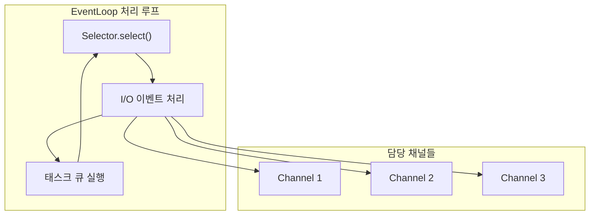
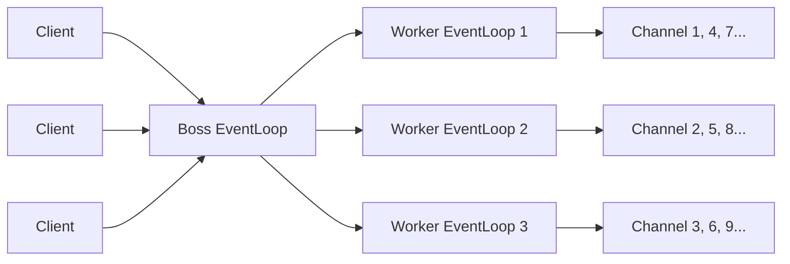
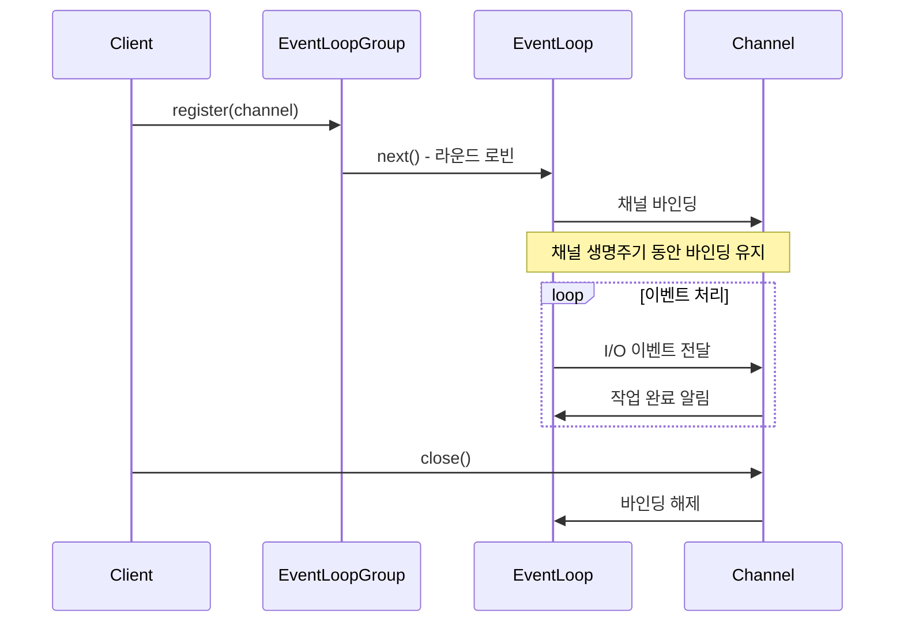

EventLoop는 [[Netty]]의 비동기 I/O 처리를 담당하는 핵심 컴포넌트다. 채널의 모든 I/O 작업과 이벤트를 처리하는 단일 스레드 실행 환경이며, [[Reactor 패턴]]을 구현한다. 하나의 EventLoop가 여러 채널을 담당하면서, 적은 수의 스레드로 수많은 동시 연결을 처리할 수 있게 해준다. [[이벤트 루프(Event Loop)]]의 일반적인 개념을 Netty에 맞게 구현한 것이다.

---

## EventLoop의 역할

EventLoop는 세 가지 핵심 역할을 수행한다.

1. **I/O 이벤트 감지**: Selector를 사용해 채널의 읽기/쓰기 준비 상태를 모니터링
2. **이벤트 처리**: 감지된 이벤트를 해당 채널의 [[Netty ChannelPipeline]]으로 전달
3. **태스크 실행**: 큐에 등록된 태스크를 순차적으로 실행



---

## 단일 스레드 보장

각 채널은 생명주기 동안 단 하나의 EventLoop에 할당된다. 이 EventLoop는 단일 스레드로 동작하므로, 해당 채널의 모든 I/O 작업은 동일한 스레드에서 실행된다.

```java
// 채널이 사용하는 EventLoop 확인
EventLoop eventLoop = channel.eventLoop();

// 현재 스레드가 EventLoop 스레드인지 확인
if (eventLoop.inEventLoop()) {
    // EventLoop 스레드에서 실행 중
    doSomething();
} else {
    // 다른 스레드에서 호출됨 - 태스크로 제출
    eventLoop.execute(() -> doSomething());
}
```

이 설계 덕분에 채널 작업에 별도의 동기화가 필요 없다. 데이터 경쟁이나 교착 상태를 걱정하지 않아도 된다.

---

## EventLoopGroup

`EventLoopGroup`은 여러 EventLoop를 관리하는 컨테이너다. 새로운 채널이 등록되면, 그룹 내의 EventLoop 중 하나에 할당된다.

```java
// NIO 기반 이벤트 루프 그룹 생성
EventLoopGroup group = new NioEventLoopGroup();

// 스레드 수 지정 (기본값: CPU 코어 수 * 2)
EventLoopGroup group = new NioEventLoopGroup(4);

// 서버에서 Boss/Worker 분리 패턴
EventLoopGroup bossGroup = new NioEventLoopGroup(1);   // 연결 수락
EventLoopGroup workerGroup = new NioEventLoopGroup();  // 데이터 처리

ServerBootstrap b = new ServerBootstrap();
b.group(bossGroup, workerGroup);
```

### Boss vs Worker

서버에서는 일반적으로 두 개의 EventLoopGroup을 사용한다.

| 그룹 | 역할 | 권장 스레드 수 |
|-----|------|-------------|
| Boss | 클라이언트 연결 수락 (accept) | 1개 (단일 포트당) |
| Worker | 실제 I/O 처리 (read/write) | CPU 코어 * 2 |



---

## 이벤트 루프 구현체

Netty는 플랫폼별로 최적화된 EventLoop 구현체를 제공한다.

### NioEventLoop (범용)

[[Java NIO]]의 Selector 기반. 모든 플랫폼에서 동작한다.

```java
EventLoopGroup group = new NioEventLoopGroup();
bootstrap.channel(NioServerSocketChannel.class);
```

### EpollEventLoop (Linux)

Linux의 `epoll` 시스템 콜 직접 사용. NIO보다 더 나은 성능.

```java
EventLoopGroup group = new EpollEventLoopGroup();
bootstrap.channel(EpollServerSocketChannel.class);
```

### KQueueEventLoop (macOS/BSD)

macOS와 BSD의 `kqueue` 사용.

```java
EventLoopGroup group = new KQueueEventLoopGroup();
bootstrap.channel(KQueueServerSocketChannel.class);
```

### IoUringEventLoop (Linux 5.1+)

최신 Linux의 `io_uring` 사용. 가장 높은 성능.

```java
EventLoopGroup group = new IoUringEventLoopGroup();
bootstrap.channel(IoUringServerSocketChannel.class);
```

---

## 태스크 실행

EventLoop는 `ScheduledExecutorService`를 구현해서 태스크 스케줄링도 지원한다.

### 즉시 실행

```java
channel.eventLoop().execute(() -> {
    // EventLoop 스레드에서 실행
    System.out.println("현재 스레드: " + Thread.currentThread().getName());
});
```

### 지연 실행

```java
channel.eventLoop().schedule(() -> {
    System.out.println("5초 후 실행");
}, 5, TimeUnit.SECONDS);
```

### 주기적 실행

```java
// 10초 후 시작, 30초 간격으로 반복
channel.eventLoop().scheduleAtFixedRate(() -> {
    System.out.println("하트비트 전송");
}, 10, 30, TimeUnit.SECONDS);
```

---

## 처리 비율 조정

EventLoop는 I/O 작업과 태스크 실행 사이의 시간 배분을 조정할 수 있다.

```java
// NioEventLoopGroup 생성 시 IO 비율 설정
NioEventLoopGroup group = new NioEventLoopGroup();

// 개별 EventLoop의 IO 비율 조정 (0-100)
// 50: I/O와 태스크에 동등한 시간 할당
// 100: I/O만 처리 (태스크 무시)
((NioEventLoop) channel.eventLoop()).setIoRatio(50);
```

기본값은 50으로, I/O 작업과 태스크에 동등한 시간을 할당한다.

---

## 스레드 모델의 이점

Netty의 단일 스레드 EventLoop 모델은 여러 장점을 제공한다.

### 락 없는 프로그래밍

하나의 채널은 항상 같은 스레드에서 처리되므로, 채널 상태 접근에 동기화가 필요 없다.

```java
public class StatefulHandler extends ChannelInboundHandlerAdapter {
    private int messageCount = 0;  // 동기화 없이 안전

    @Override
    public void channelRead(ChannelHandlerContext ctx, Object msg) {
        messageCount++;  // 동일한 EventLoop 스레드에서만 접근
        ctx.fireChannelRead(msg);
    }
}
```

### 메모리 가시성 보장

같은 스레드 내에서 실행되므로, happens-before 관계가 자동으로 성립한다.

### 컨텍스트 스위칭 최소화

I/O 작업과 핸들러 실행이 같은 스레드에서 이루어져 컨텍스트 스위칭 오버헤드가 없다.

---

## 블로킹 작업 처리

EventLoop에서 블로킹 작업을 수행하면 다른 채널들의 처리도 지연된다. 블로킹이 필요한 작업은 별도 스레드 풀로 분리해야 한다.

```java
// 블로킹 작업용 별도 스레드 풀
EventExecutorGroup blockingGroup = new DefaultEventExecutorGroup(16);

pipeline.addLast(blockingGroup, "blockingHandler", new BlockingHandler());

public class BlockingHandler extends ChannelInboundHandlerAdapter {
    @Override
    public void channelRead(ChannelHandlerContext ctx, Object msg) {
        // 이 핸들러는 blockingGroup의 스레드에서 실행됨
        Object result = blockingDatabaseCall(msg);  // DB 조회 같은 블로킹 작업
        ctx.fireChannelRead(result);
    }
}
```

---

## 종료 처리

EventLoopGroup은 graceful shutdown을 지원한다.

```java
EventLoopGroup group = new NioEventLoopGroup();

try {
    // 서버 운영
} finally {
    // 우아한 종료
    // - 새로운 태스크 수락 중지
    // - 기존 태스크 완료 대기
    // - 채널 정리
    group.shutdownGracefully().sync();
}

// 타임아웃 설정
group.shutdownGracefully(2, 15, TimeUnit.SECONDS);
// 2초 동안 quiet period (새 태스크 없으면 즉시 종료)
// 최대 15초 대기
```

---

## 채널과 EventLoop의 바인딩

채널이 EventLoop에 등록되면, 채널이 닫힐 때까지 그 바인딩은 유지된다.

```java
// 채널 등록 (보통 Bootstrap이 자동 처리)
ChannelFuture regFuture = eventLoop.register(channel);

// 등록 완료 대기
regFuture.addListener(f -> {
    if (f.isSuccess()) {
        System.out.println("채널이 EventLoop에 등록됨");
    }
});
```



---

## References

- [[Netty]]
- [[Netty Channel]]
- [[Reactor 패턴]]
- [[Java NIO]]
