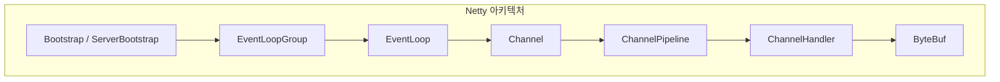
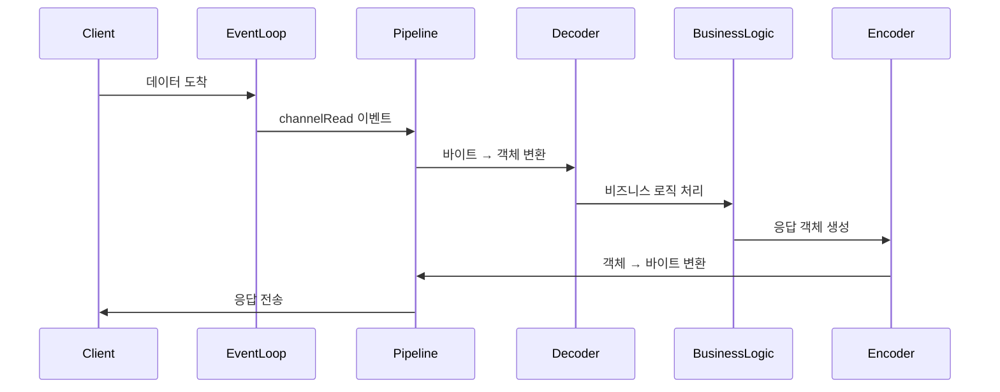

Netty는 [[비동기(Asynchronous)]] [[이벤트 루프(Event Loop)|이벤트]] 기반 네트워크 애플리케이션 프레임워크다. 고성능 프로토콜 서버와 클라이언트를 빠르게 개발할 수 있도록 설계되었으며, [[논블로킹(Non-blocking)]] I/O를 사용해 적은 스레드로 많은 연결을 처리한다. JBoss의 Trustin Lee가 2004년에 시작한 프로젝트다.

---

## 왜 Netty를 사용하는가?

[[Java NIO]]를 직접 사용해 네트워크 프로그래밍을 해본 사람이라면 그 복잡함을 알 것이다. Selector, Channel, Buffer를 올바르게 조합하고, 반쯤 도착한 메시지를 처리하며, 연결이 끊어졌을 때의 예외 상황을 다루는 일은 생각보다 까다롭다.

Netty는 이런 저수준의 복잡성을 감추고, 개발자가 비즈니스 로직에만 집중할 수 있게 해준다. 마치 JDBC를 직접 쓰는 것과 JPA를 쓰는 것의 차이라고 생각하면 된다.

```java
// Netty를 사용한 Echo 서버 - 단 몇 줄로 서버 구현
ServerBootstrap b = new ServerBootstrap();
b.group(bossGroup, workerGroup)
 .channel(NioServerSocketChannel.class)
 .childHandler(new ChannelInitializer<SocketChannel>() {
     @Override
     public void initChannel(SocketChannel ch) {
         ch.pipeline().addLast(new EchoServerHandler());
     }
 });
b.bind(8080).sync();
```

---

## 핵심 설계 철학

Netty의 설계를 관통하는 몇 가지 철학이 있다.

### 비동기와 이벤트 기반

모든 I/O 작업은 비동기로 수행된다. `write()` 메서드를 호출하면 즉시 `ChannelFuture`를 반환하고, 실제 쓰기 작업은 나중에 완료된다. 이 방식은 [[Reactor 패턴]]을 기반으로 하며, 적은 수의 스레드로 수많은 동시 연결을 처리할 수 있게 해준다.

```java
// 쓰기 작업은 즉시 반환
ChannelFuture future = channel.writeAndFlush(message);

// 완료 콜백 등록
future.addListener((ChannelFutureListener) f -> {
    if (f.isSuccess()) {
        System.out.println("메시지 전송 완료");
    } else {
        f.cause().printStackTrace();
    }
});
```

### Zero-Copy 최적화

네트워크 프로그래밍에서 데이터 복사는 성능에 큰 영향을 미친다. Netty는 [[Zero-Copy]] 기법을 적극 활용해 불필요한 메모리 복사를 최소화한다. [[Netty ByteBuf]]의 `CompositeByteBuf`나 `slice()` 메서드가 대표적인 예다.

### 확장 가능한 이벤트 모델

[[Netty ChannelPipeline]]은 인터셉팅 필터 패턴을 구현한다. 데이터가 들어오고 나가는 과정에 여러 [[Netty ChannelHandler]]를 체인처럼 연결할 수 있어, 프로토콜 처리 로직을 모듈화하기 쉽다.

---

## 아키텍처 개요



Netty의 핵심 컴포넌트는 크게 다섯 가지로 나뉜다.

| 컴포넌트 | 역할 |
|---------|------|
| [[Netty Channel]] | 네트워크 소켓에 대한 추상화. 읽기, 쓰기, 연결, 바인딩 등 I/O 작업의 진입점 |
| [[Netty ChannelPipeline]] | Handler 체인을 관리. 인바운드/아웃바운드 이벤트 흐름 제어 |
| [[Netty ChannelHandler]] | 실제 비즈니스 로직이 들어가는 곳. 데이터 변환, 프로토콜 처리 담당 |
| [[Netty EventLoop]] | I/O 이벤트를 처리하는 스레드. Channel의 생명주기 동안 모든 작업 담당 |
| [[Netty ByteBuf]] | 효율적인 바이트 버퍼 구현. [[참조 카운팅]]으로 메모리 관리 |

---

## 데이터 흐름

클라이언트에서 서버로 데이터가 전송될 때 어떤 일이 일어나는지 살펴보자.



**인바운드(Inbound)** 방향은 소켓에서 데이터를 읽어 애플리케이션으로 전달하는 흐름이다. 디코더, 비즈니스 로직 핸들러 순으로 데이터가 흘러간다.

**아웃바운드(Outbound)** 방향은 그 반대다. 애플리케이션에서 생성한 응답이 인코더를 거쳐 소켓으로 나간다.

---

## 간단한 예제: Echo 서버

받은 메시지를 그대로 돌려보내는 Echo 서버를 구현해보자.

```java
public class EchoServer {
    public static void main(String[] args) throws Exception {
        // 이벤트 루프 그룹 생성
        EventLoopGroup group = new NioEventLoopGroup();

        try {
            ServerBootstrap b = new ServerBootstrap();
            b.group(group)
             .channel(NioServerSocketChannel.class)
             .childHandler(new ChannelInitializer<SocketChannel>() {
                 @Override
                 public void initChannel(SocketChannel ch) {
                     ch.pipeline().addLast(new EchoServerHandler());
                 }
             });

            // 8080 포트에 바인딩
            ChannelFuture f = b.bind(8080).sync();
            f.channel().closeFuture().sync();
        } finally {
            group.shutdownGracefully();
        }
    }
}

// Echo 핸들러
@Sharable
public class EchoServerHandler extends ChannelInboundHandlerAdapter {
    @Override
    public void channelRead(ChannelHandlerContext ctx, Object msg) {
        ctx.write(msg);  // 받은 메시지를 그대로 쓰기 버퍼에 추가
    }

    @Override
    public void channelReadComplete(ChannelHandlerContext ctx) {
        ctx.flush();  // 버퍼의 내용을 실제로 전송
    }
}
```

---

## 지원하는 프로토콜

Netty는 다양한 프로토콜에 대한 코덱을 기본 제공한다.

- **HTTP/1.x, HTTP/2, HTTP/3**: 웹 서버, REST API 구현
- **WebSocket**: 실시간 양방향 통신
- **SSL/TLS**: 보안 통신
- **DNS**: 도메인 이름 해석
- **SMTP, Redis, Memcached**: 각종 프로토콜 클라이언트
- **Protobuf, Marshalling**: 직렬화 프레임워크 통합

---

## 누가 Netty를 사용하는가?

많은 유명 프로젝트들이 Netty를 기반으로 만들어졌다.

- **gRPC**: Google의 고성능 RPC 프레임워크
- **Apache Cassandra**: 분산 NoSQL 데이터베이스
- **Elasticsearch**: 검색 엔진의 전송 계층
- **Spring WebFlux**: 리액티브 웹 프레임워크
- **Armeria**: LINE의 마이크로서비스 프레임워크
- **Vert.x**: 폴리글랏 이벤트 기반 프레임워크

---

## 버전 정보

2026년 1월 기준, Netty의 최신 안정 버전은 **4.1.x** 시리즈다. 4.2.x에서는 HTTP/3(QUIC) 지원이 추가되었고, io_uring 기반의 리눅스 네이티브 트랜스포트도 제공한다.

Netty 4.x는 JDK 6 이상에서 실행 가능하지만, 최신 기능을 활용하려면 JDK 8 이상을 권장한다. Netty 5.x는 JDK 11 이상을 요구한다.

---

## 다음 단계

Netty를 더 깊이 이해하려면 다음 문서들을 참고하자.

- [[Netty Channel]] - 네트워크 소켓 추상화의 핵심
- [[Netty EventLoop]] - 비동기 I/O의 심장
- [[Netty ChannelPipeline]] - 핸들러 체인의 동작 원리
- [[Netty ByteBuf]] - 고성능 메모리 관리
- [[Netty Bootstrap]] - 서버와 클라이언트 초기화

---

## References

- [Netty 공식 사이트](https://netty.io/)
- [Netty GitHub 저장소](https://github.com/netty/netty)
- [Netty in Action](https://www.manning.com/books/netty-in-action) - Norman Maurer, Marvin Wolfthal
