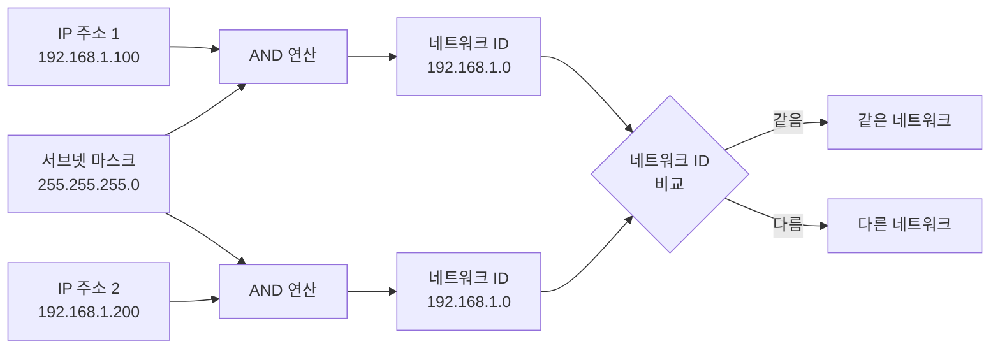
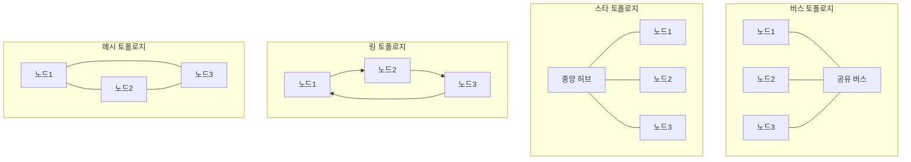

네트워크(Network)는 두 개 이상의 컴퓨터나 장치가 서로 통신할 수 있도록 연결된 시스템입니다. 네트워크를 통해 장치들은 데이터를 공유하고, 리소스를 공유하며, 서로 통신할 수 있습니다.

네트워크는 현대 정보 기술의 기반이 되며, 인터넷, 기업 내부망, 모바일 통신 등 우리가 일상적으로 사용하는 모든 통신 시스템의 근간이 됩니다. 네트워크를 이해하기 위해서는 [[IP 주소]], [[라우팅(Routing)]], [[프로토콜]] 등의 개념을 함께 이해하는 것이 중요합니다.

## 네트워크의 등장 배경

초기 컴퓨터 시스템은 독립적으로 작동하는 독립형(Standalone) 시스템이었습니다. 하지만 다음과 같은 필요성으로 인해 네트워크가 등장했습니다.

1. **자원 공유**: 고가의 프린터, 스토리지, 계산 자원을 여러 사용자가 공유할 필요가 있었습니다.
2. **정보 공유**: 데이터와 정보를 효율적으로 공유하고 전달할 방법이 필요했습니다.
3. **통신 효율성**: 물리적 거리에 상관없이 빠르고 안정적인 통신이 필요했습니다.
4. **비용 절감**: 중앙 집중식 자원 관리로 전체적인 비용을 절감할 수 있었습니다.

네트워크는 이러한 요구사항을 해결하면서, 오늘날의 인터넷과 같은 글로벌 통신 인프라로 발전했습니다.

## 네트워크의 구성 요소

네트워크는 다음과 같은 기본 구성 요소로 이루어져 있습니다:

### 1. 노드(Node)
네트워크에 연결된 모든 장치를 의미합니다. 컴퓨터, 서버, 스마트폰, 라우터, 스위치 등이 노드가 될 수 있습니다.

### 2. 링크(Link)
노드들을 연결하는 물리적 또는 논리적 통신 경로입니다. 유선 케이블, 무선 신호, 광섬유 등이 링크가 될 수 있습니다.

### 3. 프로토콜(Protocol)
네트워크에서 데이터를 전송하고 수신하기 위한 규칙과 절차의 집합입니다. [[TCP_IP]], [[HTTP]], [[Ethernet]] 등이 대표적인 프로토콜입니다.

### 4. 네트워크 장비
- **[[Router]]**: 서로 다른 네트워크를 연결하고 데이터 패킷을 목적지로 전달합니다.
- **스위치(Switch)**: 같은 네트워크 내에서 장치들을 연결하고 데이터를 전달합니다.
- **허브(Hub)**: 여러 장치를 연결하지만 스위치보다 단순한 기능을 제공합니다.
- **브리지(Bridge)**: 두 개의 네트워크 [[세그먼트]]를 연결합니다.

### 네트워크 ID와 호스트 ID

[[IP 주소]]는 두 부분으로 구성됩니다:

1. **네트워크 ID (Network ID)**: 네트워크를 식별하는 부분입니다. 같은 네트워크에 속한 모든 장치는 동일한 네트워크 ID를 가집니다.
2. **호스트 ID (Host ID)**: 네트워크 내에서 특정 장치를 식별하는 부분입니다. 같은 네트워크 내에서 각 장치는 고유한 호스트 ID를 가져야 합니다.

### 서브넷 마스크를 통한 구분

서브넷 마스크는 IP 주소의 어느 부분이 네트워크 ID이고 어느 부분이 호스트 ID인지를 나타냅니다. 서브넷 마스크의 비트가 1인 부분은 네트워크 ID, 0인 부분은 호스트 ID를 의미합니다.

**예시**:
- IP 주소: `192.168.1.100`
- 서브넷 마스크: `255.255.255.0` (또는 `/24`)

이 경우:
- 네트워크 ID: `192.168.1.0` (서브넷 마스크의 1 비트 부분)
- 호스트 ID: `100` (서브넷 마스크의 0 비트 부분)

### 같은 네트워크 판별 방법

두 장치가 같은 네트워크에 속하는지 확인하려면, 각 장치의 IP 주소와 서브넷 마스크를 AND 연산하여 네트워크 ID를 계산하고 비교합니다:



**계산 예시**:

```
장치 A:
  IP 주소:     192.168.1.100  (11000000.10101000.00000001.01100100)
  서브넷 마스크: 255.255.255.0  (11111111.11111111.11111111.00000000)
  AND 연산 결과: 192.168.1.0    (11000000.10101000.00000001.00000000)

장치 B:
  IP 주소:     192.168.1.200  (11000000.10101000.00000001.11001000)
  서브넷 마스크: 255.255.255.0  (11111111.11111111.11111111.00000000)
  AND 연산 결과: 192.168.1.0    (11000000.10101000.00000001.00000000)

결과: 네트워크 ID가 동일하므로 같은 네트워크에 속합니다.
```

### 네트워크 장비의 역할 구분

같은 네트워크와 다른 네트워크를 구분하는 것은 네트워크 장비의 역할을 이해하는 데도 중요합니다:

- **같은 네트워크**: 스위치나 허브를 통해 직접 통신합니다. [[Router]]를 거치지 않습니다.
- **다른 네트워크**: [[Router]]를 통해 통신해야 합니다. 라우터가 패킷을 다른 네트워크로 전달합니다.

예를 들어:
- `192.168.1.100`과 `192.168.1.200`은 같은 네트워크(`192.168.1.0/24`)이므로 스위치를 통해 직접 통신합니다.
- `192.168.1.100`과 `192.168.2.100`은 다른 네트워크이므로 라우터를 통해 통신해야 합니다.

자세한 내용은 [[IP 주소]]와 [[서브넷 마스크(Subnet Mask)]] 문서를 참고해주세요.

## 네트워크의 분류

### 지리적 범위에 따른 분류

#### LAN (Local Area Network)
제한된 지역(건물, 캠퍼스 등) 내에서 구성되는 네트워크입니다. 높은 전송 속도와 낮은 오류율을 특징으로 합니다.

**특징**:
- 제한된 지리적 범위 (수백 미터 ~ 수킬로미터)
- 높은 데이터 전송 속도
- 낮은 지연 시간
- 일반적으로 단일 조직이 소유하고 관리

**사용 예시**: 사무실 네트워크, 학교 캠퍼스 네트워크

#### WAN (Wide Area Network)
넓은 지리적 영역에 걸쳐 구성되는 네트워크입니다. 여러 LAN을 연결하여 구성됩니다.

**특징**:
- 넓은 지리적 범위 (수십 킬로미터 ~ 전 세계)
- 상대적으로 낮은 데이터 전송 속도
- 높은 지연 시간
- 통신 사업자의 인프라를 활용

**사용 예시**: 인터넷, 기업의 본사-지사 연결

#### MAN (Metropolitan Area Network)
도시 규모의 네트워크로, LAN과 WAN의 중간 형태입니다.

#### PAN (Personal Area Network)
개인용 장치들을 연결하는 소규모 네트워크입니다. 블루투스, USB 연결 등이 해당됩니다.

### 연결 방식에 따른 분류

#### 유선 네트워크
물리적 케이블을 통해 연결되는 네트워크입니다. 안정적이고 빠른 속도를 제공합니다.

**케이블 종류**:
- **트위스티드 페어(Twisted Pair)**: 가장 일반적인 케이블 (예: 이더넷 케이블)
- **동축 케이블(Coaxial Cable)**: 케이블 TV나 초기 이더넷에서 사용
- **광섬유(Fiber Optic)**: 매우 빠른 속도와 긴 거리 전송 가능

#### 무선 네트워크
전파를 통해 연결되는 네트워크입니다. 이동성이 높지만 유선보다 안정성이 낮을 수 있습니다.

**무선 기술**:
- **Wi-Fi**: IEEE 802.11 표준 기반의 무선 LAN
- **블루투스**: 근거리 무선 통신
- **셀룰러 네트워크**: 모바일 통신 (3G, 4G, 5G)

### 토폴로지에 따른 분류

네트워크 토폴로지는 노드들이 연결되는 물리적 또는 논리적 구조를 의미합니다.



1. **버스 토폴로지**: 모든 노드가 하나의 공유 매체에 연결
2. **스타 토폴로지**: 모든 노드가 중앙 허브에 연결
3. **링 토폴로지**: 노드들이 원형으로 연결
4. **메시 토폴로지**: 모든 노드가 서로 직접 연결

## 네트워크 계층 구조

네트워크 통신은 계층적 구조로 설계되어 있습니다. 이는 복잡한 통신 과정을 단계별로 나누어 관리하기 쉽게 만듭니다.

### OSI 7계층 모델

[[OSI 모델]]은 네트워크 통신을 7개의 계층으로 나눈 표준 모델입니다. 자세한 내용은 [[OSI 모델]] 문서를 참고해주세요.

1. **물리 계층(Physical Layer)**: 전기적 신호의 전송
2. **데이터 링크 계층(Data Link Layer)**: 같은 네트워크 내에서의 데이터 전송
3. **네트워크 계층(Network Layer)**: 다른 네트워크 간의 라우팅 ([[IP 주소]] 사용)
4. **전송 계층(Transport Layer)**: 신뢰성 있는 데이터 전송 ([[TCP]], [[UDP]])
5. **세션 계층(Session Layer)**: 통신 세션 관리
6. **표현 계층(Presentation Layer)**: 데이터 형식 변환
7. **응용 계층(Application Layer)**: 사용자 애플리케이션 ([[HTTP]], [[FTP]])

### TCP/IP 모델

실제 인터넷에서 사용되는 TCP/IP 모델은 OSI 모델을 단순화한 4계층 구조입니다:

1. **네트워크 인터페이스 계층**: 물리적 전송
2. **인터넷 계층**: IP를 통한 라우팅
3. **전송 계층**: TCP/UDP를 통한 데이터 전송
4. **응용 계층**: 애플리케이션 프로토콜

## 네트워크 프로토콜

프로토콜은 네트워크에서 통신하기 위한 규칙입니다. 주요 프로토콜들은 다음과 같습니다:

### 인터넷 계층 프로토콜

- **IP (Internet Protocol)**: 패킷을 목적지로 전달하는 프로토콜. [[IP 주소]]를 사용하여 라우팅을 수행합니다.
- **ICMP (Internet Control Message Protocol)**: 네트워크 오류 진단 및 제어 메시지 전송

### 전송 계층 프로토콜

- **TCP (Transmission Control Protocol)**: 신뢰성 있는 연결 지향 통신
- **UDP (User Datagram Protocol)**: 빠르지만 신뢰성이 낮은 비연결 통신

### 응용 계층 프로토콜

- **HTTP/HTTPS**: 웹 브라우징을 위한 프로토콜
- **FTP**: 파일 전송 프로토콜
- **SMTP**: 이메일 전송 프로토콜
- **DNS**: 도메인 이름을 IP 주소로 변환하는 프로토콜

## 네트워크 주소 체계

네트워크에서 장치를 식별하기 위해 여러 종류의 주소가 사용됩니다:

### MAC 주소 (Media Access Control Address)
데이터 링크 계층에서 사용되는 물리적 주소입니다. 네트워크 인터페이스 카드에 하드웨어적으로 할당된 고유 주소입니다.

### IP 주소 (Internet Protocol Address)
네트워크 계층에서 사용되는 논리적 주소입니다. 자세한 내용은 [[IP 주소]]를 참고해주세요.

### 포트 번호 (Port Number)
전송 계층에서 사용되며, 같은 IP 주소를 가진 장치에서 여러 애플리케이션을 구분하기 위해 사용됩니다.

## 네트워크 보안

네트워크 통신은 보안 위협에 노출될 수 있으므로 적절한 보안 조치가 필요합니다:

### 주요 보안 위협

1. **스니핑(Sniffing)**: 네트워크 트래픽을 도청하는 행위
2. **스푸핑(Spoofing)**: 다른 장치의 신원을 위조하는 행위
3. **중간자 공격(Man-in-the-Middle)**: 통신 중간에 개입하여 데이터를 가로채는 공격
4. **DDoS 공격**: 대량의 요청으로 서비스를 마비시키는 공격

### 보안 대책

1. **암호화**: [[TLS/SSL]]을 사용하여 데이터를 암호화합니다.
2. **방화벽**: 불필요한 네트워크 접근을 차단합니다.
3. **VPN**: 가상 사설 네트워크를 통해 안전한 통신 터널을 구축합니다. [[IPSec(IP Security)]]를 사용하여 네트워크 계층에서의 보안 통신을 구현할 수 있습니다.
4. **인증 및 권한 부여**: 네트워크 접근을 제어합니다.

## 네트워크 성능 최적화

네트워크 성능을 향상시키기 위한 주요 기법들:

### 캐싱
자주 요청되는 데이터를 캐시하여 네트워크 트래픽을 줄입니다. 자세한 내용은 [[캐싱(Caching)]]을 참고해주세요.

### 로드 밸런싱
여러 서버에 부하를 분산시켜 성능과 가용성을 향상시킵니다. 자세한 내용은 [[로드 밸런서(Load Balancer)]]를 참고해주세요.

### CDN (Content Delivery Network)
지리적으로 분산된 서버를 통해 콘텐츠를 제공하여 지연 시간을 줄입니다.

### 압축
데이터를 압축하여 전송량을 줄입니다.

## 네트워크 모니터링 및 관리

효율적인 네트워크 운영을 위해서는 지속적인 모니터링과 관리가 필요합니다:

1. **대역폭 모니터링**: 네트워크 사용량을 추적합니다.
2. **성능 측정**: 지연 시간, 패킷 손실 등을 측정합니다.
3. **장애 진단**: 네트워크 문제를 신속하게 발견하고 해결합니다.
4. **용량 계획**: 향후 네트워크 요구사항을 예측하고 대비합니다.

## 실제 활용 사례

1. **클라우드 컴퓨팅**: 분산된 네트워크 자원을 활용한 컴퓨팅
2. **마이크로서비스 아키텍처**: 서비스 간 네트워크 통신을 통한 분산 시스템
3. **IoT (Internet of Things)**: 다양한 장치들이 네트워크로 연결되어 통신
4. **실시간 통신**: 화상 회의, 게임 등 실시간 데이터 전송이 필요한 애플리케이션

## 결론

네트워크는 현대 정보 기술의 핵심 인프라로, 컴퓨터와 장치들이 서로 통신하고 자원을 공유할 수 있게 해줍니다. 네트워크의 계층 구조, 프로토콜, 주소 체계 등을 이해하는 것은 효과적인 네트워크 설계와 문제 해결에 필수적입니다.

네트워크를 설계하거나 운영할 때는 보안, 성능, 확장성 등을 종합적으로 고려해야 하며, [[IP 주소]], [[라우팅(Routing)]], [[프로토콜]] 등의 관련 개념들을 함께 이해하는 것이 중요합니다.

또한 현대적인 애플리케이션 개발에서는 스프링과 같은 프레임워크를 활용하여 네트워크 통신의 복잡성을 추상화하고, 더 안전하고 효율적인 네트워크 애플리케이션을 구축할 수 있습니다.

## 참고 자료

- Computer Networks, 5th Edition - Andrew S. Tanenbaum
- TCP/IP Illustrated, Volume 1 - W. Richard Stevens
- Java Network Programming, 4th Edition - Elliotte Rusty Harold
- 스프링 공식 문서

