OIDC(OpenID Connect)는 [[OAuth 2.0]] 프로토콜 위에 구축된 **간단한 신원 확인 계층(Simple Identity Layer)** 입니다. 쉽게 말해, OAuth 2.0이 '권한 부여(Authorization)'에 대한 프레임워크라면, OIDC는 여기에 '인증(Authentication)' 기능을 추가하여 **사용자가 누구인지**를 표준화된 방식으로 증명하는 프로토콜입니다.

오늘날 우리가 사용하는 "Google로 로그인", "카카오로 로그인"과 같은 소셜 로그인 기능은 대부분 OIDC를 기반으로 구현됩니다. 개발자 입장에서 사용자의 비밀번호를 직접 관리할 필요 없이, 신뢰할 수 있는 제3자(IdP, Identity Provider)에게 인증을 위임하여 보안성을 높이고 개발 복잡도를 낮출 수 있는 강력한 도구입니다.

---

## OIDC의 핵심 개념

OIDC는 OAuth 2.0의 용어를 그대로 사용하면서 몇 가지 개념을 추가합니다.

1. **ID 토큰 (ID Token)**: OIDC의 가장 핵심적인 개념입니다. 사용자의 인증 정보를 담고 있는 [[JWT(JSON Web Token)]]형식의 토큰입니다. 이 토큰을 통해 클라이언트(우리의 서비스)는 사용자가 누구인지, 그리고 성공적으로 인증을 마쳤음을 신뢰할 수 있습니다.
    
2. **OpenID Provider (OP)**: 사용자의 신원을 확인하고 인증을 수행하는 주체입니다. OAuth 2.0의 **Authorization Server** 역할에 인증 기능을 더한 것입니다. (예: Google, Kakao, Okta)
    
3. **Relying Party (RP)**: OP에게 인증을 요청하고, ID 토큰을 받아 사용자의 신원을 신뢰하는 애플리케이션입니다. OAuth 2.0의 **Client**에 해당합니다.
    
4. **UserInfo Endpoint**: ID 토큰에 담긴 정보 외에 사용자의 추가 프로필 정보(이름, 프로필 사진 등)를 얻을 수 있는 API 엔드포인트입니다. OAuth 2.0의 Access Token을 사용해 요청할 수 있습니다.
    
5. **Scope**: OIDC 요청에서는 `scope`에 반드시 `openid`를 포함해야 합니다. 이를 통해 OAuth 2.0 서버에 OIDC 인증 요청임을 알립니다. `profile`, `email` 등의 스코프를 추가하여 ID 토큰이나 UserInfo Endpoint를 통해 받고자 하는 사용자 정보의 범위를 지정할 수 있습니다.
    

---

## OIDC 인증 흐름 (Authorization Code Flow)

OIDC의 가장 대표적인 인증 흐름은 OAuth 2.0의 인가 코드 승인 흐름(Authorization Code Flow)을 기반으로 합니다. 전체 과정은 사용자와 서비스(RP), 그리고 인증 서버(OP) 간의 상호작용으로 이루어집니다.

```mermaid
sequenceDiagram
    participant User as 사용자
    participant RP as 서비스<br>(Relying Party)
    participant OP as 인증 서버<br>(OpenID Provider)

    User->>+RP: 1. 로그인 요청
    RP->>+User: 2. OP의 로그인 페이지로 리디렉션
    User->>+OP: 3. ID/PW 입력 및 인증
    OP-->>-User: 4. 정보 제공 동의 요청
    User->>+OP: 5. 동의
    OP->>User: 6. Authorization Code와 함께 RP로 리디렉션
    User->>-RP: 7. Authorization Code 전달

    Note right of RP: 사용자의 브라우저는 여기까지 관여하고,<br>이후부터는 서버 간 통신이 이루어집니다.

    RP->>+OP: 8. Authorization Code, Client ID/Secret으로 토큰 요청
    OP->>-RP: 9. ID 토큰, Access 토큰 발급
    RP->>RP: 10. ID 토큰 유효성 검증
    RP->>+User: 11. 로그인 완료 및 세션 생성
```




1. **로그인 요청**: 사용자가 우리 서비스(RP)에서 "Google로 로그인" 버튼을 클릭합니다.
    
2. **리디렉션**: RP는 OIDC 요청에 필요한 파라미터( `client_id`, `redirect_uri`, `scope=openid profile email`, `response_type=code` 등)를 포함하여 사용자를 인증 서버(OP)의 로그인 페이지로 보냅니다.
    
3. **사용자 인증**: 사용자는 OP의 페이지에서 자신의 ID와 비밀번호를 입력하여 인증을 수행합니다.
    
4. **정보 제공 동의**: 인증 성공 후, OP는 RP에게 어떤 정보(프로필, 이메일 등)가 제공될지 사용자에게 알려주고 동의를 구합니다.
    
5. **동의**: 사용자가 정보 제공에 동의합니다.
    
6. **Authorization Code 발급**: OP는 일회성 **Authorization Code**를 발급하여, 사전에 등록된 `redirect_uri`로 사용자를 돌려보냅니다.
    
7. **Code 전달**: 사용자의 브라우저는 이 Code를 가지고 RP의 `redirect_uri`로 이동하며 Code를 전달합니다.
    
8. **토큰 요청**: RP의 백엔드 서버는 받은 Authorization Code와 자신의 신원 정보(Client ID, Client Secret)를 함께 OP의 **토큰 엔드포인트**로 보내 토큰을 요청합니다. 이 과정은 프론트엔드가 아닌 서버 간의 안전한 통신으로 이루어집니다.
    
9. **토큰 발급**: OP는 Code와 클라이언트 정보를 검증한 뒤, **ID 토큰**과 **Access 토큰**을 발급하여 RP에게 전달합니다.
    
10. **ID 토큰 검증**: RP는 전달받은 ID 토큰의 서명, 만료 시간, 발급자(iss), 수신자(aud) 등을 검증하여 위변조 여부를 확인합니다. [[ID 토큰 검증 방법]]에서 자세한 내용을 확인할 수 있습니다.
    
11. **로그인 완료**: ID 토큰 검증이 완료되면, RP는 사용자가 신뢰할 수 있는 사용자임을 확인하고 서비스에 대한 세션을 생성하여 로그인을 최종적으로 완료시킵니다.
    

---

## ID 토큰 vs Access 토큰

OIDC를 사용하면 두 가지 종류의 토큰을 받게 되며, 이 둘의 용도를 명확히 구분하는 것이 매우 중요합니다.

| 구분      | **ID 토큰 (ID Token)**                 | **Access 토큰 (Access Token)**                |
| ------- | ------------------------------------ | ------------------------------------------- |
| **목적**  | **인증 (Authentication)**              | **권한 부여 (Authorization)**                   |
| **내용**  | 사용자가 누구인지에 대한 정보 (ID, 이름, 이메일 등)     | 특정 리소스(API)에 접근할 수 있는 권한 정보 (Scope)         |
| **수신자** | 클라이언트 (Relying Party)                | 리소스 서버 (Resource Server, API)               |
| **형식**  | [[JWT(JSON Web Token)]]              | 형식이 정해져 있지 않음 (JWT일 수도, 단순 문자열일 수도 있음)      |
| **역할**  | "이 사용자는 Google에서 성공적으로 로그인한 OOO입니다." | "이 토큰을 가진 클라이언트는 사용자의 프로필 API를 호출할 수 있습니다." |

**ID 토큰은 클라이언트가 사용자의 신원을 확인하기 위해 사용하며, 다른 API를 호출하는 데 사용해서는 안 됩니다.**  반면, **Access 토큰은 리소스 서버(예: Google Calendar API)에 정보를 요청할 때 사용되며, 클라이언트가 그 내용을 해석하려 해서는 안 됩니다.**

---

## 스프링 시큐리티에서의 OIDC 구현

스프링 부트 환경에서는 `spring-boot-starter-oauth2-client` 의존성 하나만으로 복잡한 OIDC 흐름을 매우 간단하게 구현할 수 있습니다.

먼저, `build.gradle`에 의존성을 추가합니다.

```Groovy
dependencies {
    implementation 'org.springframework.boot:spring-boot-starter-oauth2-client'
}
```

그 후, `application.yml`에 사용할 OP의 정보를 등록하기만 하면 됩니다. 다음은 Google을 사용하는 예시입니다.

```yaml 
spring:
  security:
    oauth2:
      client:
        registration:
          google: # 등록 ID
            client-id: YOUR_GOOGLE_CLIENT_ID
            client-secret: YOUR_GOOGLE_CLIENT_SECRET
            scope:
              - openid
              - profile
              - email
        provider:
          # registration의 google과 이름이 같으면 생략 가능
          google:
            # .well-known/openid-configuration 엔드포인트를 통해 나머지 정보를 자동으로 가져옵니다.
            issuer-uri: https://accounts.google.com
```

스프링 시큐리티는 `issuer-uri`에 명시된 주소의 **Discovery Endpoint** (`/.well-known/openid-configuration`)에 접근하여 인증/토큰 엔드포인트 주소, 서명 검증에 필요한 공개키 위치 등 OIDC에 필요한 모든 설정 정보를 자동으로 가져옵니다.

따라서 개발자는 복잡한 OIDC 흐름을 직접 코드로 구현할 필요 없이, 위와 같은 설정만으로 소셜 로그인 기능을 안전하게 활성화할 수 있습니다.

---

## OIDC를 사용하는 이유

- **표준화된 인증**: 특정 벤더에 종속되지 않는 표준 프로토콜이므로, IdP를 변경하더라도 애플리케이션의 변경을 최소화할 수 있습니다.
    
- **보안 강화**: 사용자의 비밀번호와 같은 민감한 정보를 애플리케이션이 직접 다루지 않고, 보안 전문 기업(Google, Microsoft 등)에 위임함으로써 보안 수준을 높일 수 있습니다.
    
- **통합된 사용자 경험 (SSO)**: 사용자는 하나의 계정으로 여러 서비스에 로그인할 수 있어 편리합니다.
    
- **다양한 클라이언트 지원**: 웹 애플리케이션뿐만 아니라 모바일 앱, SPA(Single Page Application) 등 다양한 환경에서 안전하게 인증을 처리할 수 있습니다.
    

---

## 결론

OIDC는 OAuth 2.0이라는 견고한 권한 부여 프레임워크 위에 '사용자 인증'이라는 필수 기능을 표준화된 방식으로 얹은 프로토콜입니다. 이를 통해 개발자는 복잡하고 위험한 인증 로직을 직접 구현하는 대신, 비즈니스 로직에 더 집중할 수 있습니다. 현대적인 애플리케이션에서 안전하고 편리한 로그인 기능을 구현하고자 한다면, OIDC는 선택이 아닌 필수적인 기술이라고 할 수 있습니다.

---

## 참고 자료

- OpenID Connect Core 1.0 specification ([https://openid.net/specs/openid-connect-core-1_0.html](https://openid.net/specs/openid-connect-core-1_0.html))
    
- OAuth 2.0 and OpenID Connect (OIDC) for Web, Mobile, and API Security ([https://www.udemy.com/course/oauth-2-and-openid-connect-in-depth/](https://www.google.com/search?q=https://www.udemy.com/course/oauth-2-and-openid-connect-in-depth/))
    
- Spring Security Documentation ([https://docs.spring.io/spring-security/reference/servlet/oauth2/client/index.html](https://docs.spring.io/spring-security/reference/servlet/oauth2/client/index.html))