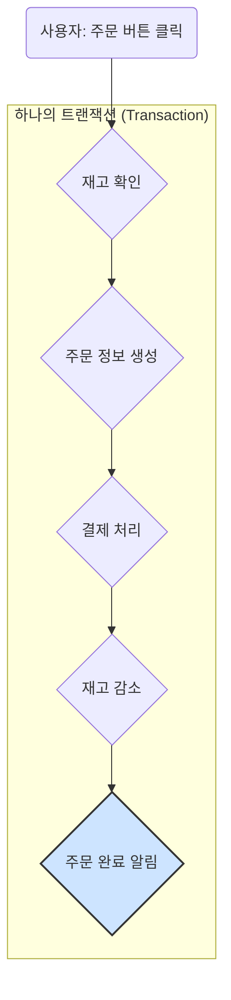

개발자라면 매일같이 접하는 '트랜잭션'이라는 개념과 가장 밀접한 기술이 바로 OLTP입니다. 우리가 만드는 대부분의 온라인 서비스가 바로 이 OLTP 시스템 위에서 동작하고 있죠. 이 글을 통해 OLTP의 정체와 핵심 원리를 명확하게 이해하실 수 있을 것입니다.

이 글은 다음과 같은 분들께 특히 도움이 될 것입니다.

- OLTP의 개념을 명확히 정립하고 싶은 백엔드 개발자
- 데이터베이스의 [[ACID 원칙]]과 [[데이터베이스 정규화]]의 중요성을 이해하고 싶은 분
- OLAP과 OLTP의 차이점을 확실히 구분하고 싶은 분

---

## 1. OLTP (Online Transaction Processing)란 무엇인가요?

**OLTP**는 **"Online Transaction Processing"**의 약자로, 우리말로는 **'온라인 트랜잭션 처리'**라고 합니다. 이름 그대로, **네트워크를 통해 들어오는 다수의 사용자 요청(트랜잭션)을 실시간으로 처리하는 데 특화된 시스템**을 의미합니다.1

여기서 핵심 키워드는 **'트랜잭션(Transaction)'**입니다. 트랜잭션이란 '더 이상 나눌 수 없는 최소한의 작업 단위'를 말합니다. 예를 들어, 우리가 온라인 쇼핑몰에서 상품을 주문하는 과정을 생각해 봅시다.

'주문'이라는 하나의 큰 작업은 위와 같이 여러 개의 작은 단위 작업으로 이루어집니다. OLTP 시스템의 역할은 이 모든 과정이 **빠르고, 안전하며, 정확하게** 완료되도록 보장하는 것입니다.2 만약 이 과정 중 하나라도 실패하면, 전체 주문 절차를 모두 없던 일(Rollback)로 되돌려 데이터의 일관성을 지켜야 합니다.

따라서 OLTP 시스템은 수많은 사용자가 동시에 요청을 보내더라도 데이터를 빠르고 정확하게 **읽고(Read), 쓰고(Write), 수정하고(Update), 삭제하는(Delete)**, 즉 **CRUD** 작업에 최적화되어 있습니다.3

---

## 2. OLTP 시스템의 핵심 원칙: ACID4

OLTP 시스템의 심장과도 같은 원칙이 있습니다. 바로 **[[ACID 원칙]]**입니다. ACID는 데이터베이스 트랜잭션이 안전하게 수행되기 위해 반드시 지켜야 할 4가지 특성을 의미합니다.

- **원자성 (Atomicity):** 트랜잭션에 포함된 모든 작업은 **전부 성공하거나 전부 실패**해야 합니다. 위 주문 예시에서 '결제 처리'는 성공했지만 '재고 감소'가 실패했다면, 결제 처리까지 모두 취소되어야 합니다. (All or Nothing)
- **일관성 (Consistency):** 트랜잭션이 성공적으로 완료되면, 데이터베이스는 **항상 일관된 상태**를 유지해야 합니다.5 예를 들어, 재고가 5개인 상품을 주문하는 트랜잭션이 성공했다면, 결과적으로 재고는 반드시 4개가 되어야 합니다. 데이터베이스의 제약 조건(예: NOT NULL, UNIQUE)은 항상 지켜져야 합니다.
    
- **고립성 (Isolation):** 여러 트랜잭션이 **동시에 실행되더라도 서로에게 영향을 주지 않고 독립적으로 실행**되는 것처럼 보여야 합니다.6 A 사용자가 재고를 확인하고 주문하는 동안, B 사용자의 주문이 끼어들어 데이터를 오염시키는 일이 없어야 합니다. [[데이터베이스의 동시성 제어]]는 이 고립성을 보장하기 위한 기술입니다.
    
- **지속성 (Durability):** 성공적으로 완료된 트랜잭션의 결과는 시스템에 장애가 발생하더라도 **영구적으로 저장**되어야 합니다.7 즉, 커밋(Commit)된 데이터는 데이터베이스 재시작이나 시스템 다운에도 사라지지 않음을 보장합니다.
    

이러한 ACID 원칙을 철저히 지킴으로써, OLTP 시스템은 금융 거래, 주문 처리, 예약 시스템 등 데이터의 정확성과 신뢰성이 절대적으로 중요한 서비스의 근간이 됩니다.

---

## 3. OLTP 시스템을 위한 설계: 데이터 정규화

OLTP 시스템은 빠르고 효율적인 CRUD 작업을 위해 데이터베이스를 설계할 때 **[[데이터베이스 정규화]]** 과정을 거칩니다.

정규화의 핵심 목표는 **데이터의 중복을 최소화**하는 것입니다. 데이터 중복을 줄이면 다음과 같은 장점을 얻을 수 있습니다.

- **쓰기/수정/삭제 성능 향상:** 예를 들어, 한 고객의 주소 정보가 여러 테이블에 중복 저장되어 있다면, 주소 변경 시 관련된 모든 테이블을 찾아 수정해야 합니다. 정규화된 테이블에서는 고객 테이블의 주소만 한 번 수정하면 되므로 작업이 단순하고 빨라집니다.
- **데이터 무결성 유지:** 데이터가 한 곳에만 저장되므로, 여러 곳에 저장된 데이터가 서로 달라지는 '데이터 불일치' 문제가 발생할 가능성을 원천적으로 차단합니다. 이를 **갱신 이상(Update Anomaly)** 문제를 해결한다고 표현합니다.
- **저장 공간 효율화:** 불필요한 데이터 중복을 제거하여 디스크 공간을 절약할 수 있습니다.

이러한 이유로 OLTP 시스템의 데이터베이스는 보통 3정규화 수준까지 정규화를 진행하는 것이 일반적입니다. 반면, 분석을 목적으로 하는 [[OLAP]] 시스템은 빠른 조회를 위해 의도적으로 중복을 허용하는 비정규화(Denormalization) 구조([[스타 스키마]])를 사용하는 경우가 많습니다.

---

## 4. OLTP vs OLAP: 명확한 비교

이제 [[OLAP]]과의 차이점이 명확하게 보이실 겁니다. 두 시스템은 서로 다른 목적을 위해 존재하며, 기술적인 특징도 완전히 다릅니다.

|   |   |   |
|---|---|---|
|**구분**|**OLTP (온라인 트랜잭션 처리)**|**OLAP (온라인 분석 처리)**|
|**주요 목적**|데이터의 **실시간 처리** 및 **안정적 저장**|데이터의 **다차원 분석** 및 **인사이트 도출**|
|**작업 유형**|짧고 빈번한 CRUD (INSERT, UPDATE, DELETE)|길고 복잡한 읽기 (SELECT)|
|**핵심 성능**|**동시 처리량** (Transactions Per Second)|**쿼리 응답 속도** (Query Latency)|
|**데이터 모델**|**정규화**된 관계형 모델|**비정규화**된 다차원 모델 (스타/눈꽃 스키마)|
|**데이터 대상**|현재 시점의 최신 데이터 (Current Data)|과거부터 누적된 대용량 데이터 (Historical Data)|
|**사용 예시**|은행 계좌 이체, 온라인 주문, 항공권 예약|월별 매출 분석, 사용자 행동 패턴 분석|

쉽게 비유하자면, **OLTP는 '도서관에 책을 정확한 위치에 빠르게 꽂는 사서'** 와 같고, **OLAP은 '여러 서가에 흩어진 특정 주제의 책들을 모아 경향을 분석하는 연구원'** 과 같습니다. 둘 다 중요하지만, 하는 일과 일하는 방식이 완전히 다른 것이죠.

---

## 마무리하며

오늘은 온라인 서비스의 심장과도 같은 **OLTP(Online Transaction Processing)**에 대해 알아보았습니다.

OLTP는 단순히 데이터를 저장하는 것을 넘어, 수많은 사용자의 동시 요청 속에서 **ACID 원칙**을 기반으로 데이터의 **정확성과 일관성, 신뢰성**을 보장하는 핵심적인 시스템입니다.9 개발자로서 OLTP의 원리를 깊이 이해하는 것은 안정적이고 효율적인 백엔드 시스템을 설계하고 구현하는 데 가장 기본이 되는 역량이라고 할 수 있습니다.

이 글이 여러분의 서비스와 데이터베이스를 바라보는 시야를 한층 더 넓혀주는 계기가 되었기를 바랍니다. 감사합니다.