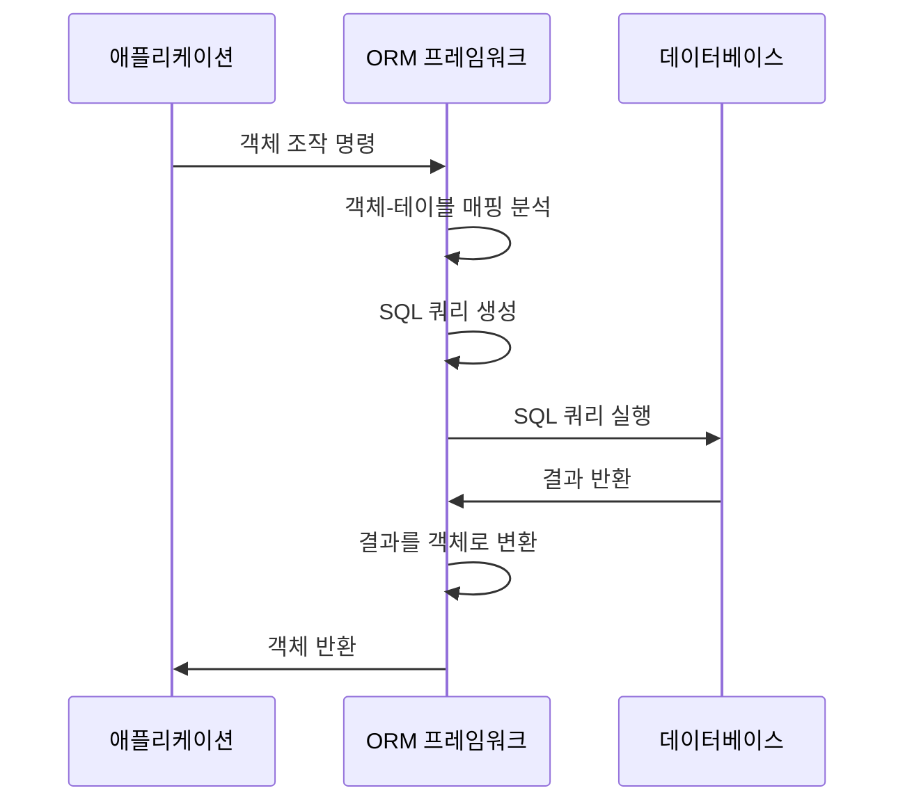

(Object-Relational Mapping)은 [[객체 지향 프로그래밍(OOP)]]의 객체와 관계형 데이터베이스의 테이블을 매핑하여 개발자가 SQL 쿼리를 직접 작성하지 않고도 객체를 통해 데이터베이스를 조작할 수 있게 해주는 기술입니다. ORM은 객체 모델과 관계형 모델 간의 불일치 문제를 해결하고, 생산성을 향상시키는 중요한 역할을 합니다.

## ORM의 기본 개념

ORM은 다음과 같은 핵심 개념에 기반합니다:

1. **객체-테이블 매핑**: 클래스는 테이블에, 객체의 인스턴스는 테이블의 행에, 객체의 필드는 테이블의 열에 매핑됩니다.
2. **관계 매핑**: 객체 간의 관계(일대일, 일대다, 다대다)를 데이터베이스의 관계로 변환합니다.
3. **쿼리 생성**: 메서드 호출이나 객체 조작을 적절한 SQL 쿼리로 변환합니다.
4. **캐싱**: 데이터베이스 접근을 최소화하기 위한 다양한 수준의 캐싱을 제공합니다.

## ORM의 장점

ORM은 개발 과정에서 다음과 같은 이점을 제공합니다:

1. **생산성 향상**: SQL 쿼리를 직접 작성할 필요가 없어 개발 시간이 단축됩니다.
2. **유지보수성 개선**: 데이터베이스 스키마 변경 시 SQL 쿼리를 일일이 수정할 필요가 없습니다.
3. **데이터베이스 독립성**: 특정 데이터베이스에 종속되지 않는 코드를 작성할 수 있습니다.
4. **객체 지향적 접근**: 데이터를 객체로 다루어 객체 지향 설계 원칙을 유지할 수 있습니다.
5. **보안성 향상**: SQL 인젝션과 같은 보안 취약점을 자동으로 방지합니다.

## ORM의 단점

ORM에도 몇 가지 한계가 있습니다:

1. **성능 이슈**: 복잡한 쿼리나, 대용량 데이터 처리 시 직접 작성한 SQL보다 성능이 떨어질 수 있습니다.
2. **학습 곡선**: ORM 프레임워크의 개념과 API를 익히는 데 시간이 필요합니다.
3. **복잡한 쿼리 처리**: 매우 복잡한 쿼리는 ORM으로 표현하기 어려울 수 있습니다.
4. **객체-관계 불일치**: 객체 모델과 관계형 모델 간의 패러다임 차이로 인한 문제가 발생할 수 있습니다.

## 주요 ORM 프레임워크

### 1. JPA (Java Persistence API)

JPA는 자바의 ORM 표준 명세로, 구현체가 아닌 인터페이스 모음입니다. 자바 애플리케이션에서 관계형 데이터베이스를 사용하는 방식을 정의한 API입니다.

```java
@Entity
public class User {
    @Id
    @GeneratedValue(strategy = GenerationType.IDENTITY)
    private Long id;
    
    private String username;
    private String email;
    
    @OneToMany(mappedBy = "user", cascade = CascadeType.ALL)
    private List<Order> orders = new ArrayList<>();
    
    // 생성자, getter, setter 생략
}
```

자세한 내용은 JPA 기본 개념과 활용을 참고해주세요.

### 2. Hibernate

Hibernate는 JPA의 구현체 중 가장 널리 사용되는 ORM 프레임워크입니다. JPA 표준을 구현하면서도 추가적인 기능을 제공합니다.

Hibernate에 대한 자세한 내용은 Hibernate 사용법과 최적화를 참고해주세요.

### 3. Spring Data JPA

Spring Data JPA는 JPA를 더 쉽게 사용할 수 있도록 추상화한 스프링의 모듈입니다. 리포지토리 인터페이스만 정의하면 구현체를 자동으로 생성해줍니다.

```java
public interface UserRepository extends JpaRepository<User, Long> {
    // 메서드 이름만으로 쿼리 생성
    List<User> findByEmailContaining(String email);
    
    // @Query 어노테이션으로 JPQL 직접 정의
    @Query("SELECT u FROM User u WHERE u.username = :username")
    User findByUsername(@Param("username") String username);
}
```

Spring Data JPA에 대한 자세한 내용은 Spring Data JPA 활용 가이드를 참고해주세요.

## ORM 동작 원리

ORM의 내부 동작은 다음과 같은 단계로 이루어집니다:



1. **메타데이터 분석**: 클래스와 필드에 적용된 어노테이션이나 XML 설정을 분석합니다.
2. **쿼리 생성**: 객체 조작 명령을 적절한 SQL 문으로 변환합니다.
3. **쿼리 실행**: 생성된 SQL을 데이터베이스에 전송하고 실행합니다.
4. **결과 매핑**: 쿼리 결과를 객체로 변환합니다.
5. **객체 캐싱**: 필요에 따라 객체를 캐시에 저장합니다.

## ORM 매핑 전략

### 1. 상속 관계 매핑

객체 지향의 상속 관계를 데이터베이스에 매핑하는 방법으로, 주로 다음 세 가지 전략이 사용됩니다:

1. **단일 테이블 전략**: 모든 자식 클래스를 하나의 테이블에 매핑합니다.
2. **조인 전략**: 부모와 자식 클래스를 각각의 테이블로 만들고 조인을 사용합니다.
3. **테이블 당 클래스 전략**: 각 구체 클래스마다 별도의 테이블을 만듭니다.

자세한 내용은 ORM 상속 관계 매핑 전략을 참고해주세요.

### 2. 연관 관계 매핑

객체 간의 관계를 데이터베이스 관계로 매핑하는 방법입니다:

1. **일대일(OneToOne)**: 한 엔티티가 다른 엔티티와 1:1 관계를 맺습니다.
2. **일대다(OneToMany)**: 한 엔티티가 여러 다른 엔티티와 관계를 맺습니다.
3. **다대일(ManyToOne)**: 여러 엔티티가 하나의 다른 엔티티와 관계를 맺습니다.
4. **다대다(ManyToMany)**: 여러 엔티티가 여러 다른 엔티티와 관계를 맺습니다.

자세한 내용은 ORM 연관 관계 매핑 전략을 참고해주세요.

## ORM 사용 시 주의사항

### 1. N+1 문제

연관 관계가 있는 엔티티를 조회할 때 발생하는 성능 문제로, 하나의 쿼리로 N개의 결과를 가져온 후 N개의 엔티티 각각에 대해 추가 쿼리가 발생하는 상황입니다.

```java
List<User> users = userRepository.findAll(); // 1번의 쿼리로 N명의 사용자를 조회

for (User user : users) {
    // 각 사용자마다 주문을 가져오는 쿼리가 실행됨 (N번의 추가 쿼리)
    List<Order> orders = user.getOrders();
}
```

이 문제는 주로 지연 로딩(Lazy Loading)을 사용할 때 발생하며, 해결 방법으로는 페치 조인(Fetch Join)이나 배치 사이즈 설정 등이 있습니다.

### 2. 영속성 컨텍스트 관리

ORM의 영속성 컨텍스트(Persistence Context)는 엔티티의 생명주기를 관리하고 변경 감지, 지연 로딩 등을 지원합니다. 영속성 컨텍스트를 적절히 관리하지 않으면 메모리 누수나 성능 저하의 원인이 될 수 있습니다.

### 3. 적절한 패치 전략 선택

연관 관계의 데이터를 언제 로딩할지 결정하는 패치 전략은 애플리케이션의 성능에 큰 영향을 미칩니다:

1. **지연 로딩(Lazy Loading)**: 연관 엔티티를 실제 사용할 때 로딩합니다.
2. **즉시 로딩(Eager Loading)**: 엔티티를 조회할 때 연관 엔티티도 함께 로딩합니다.

자세한 내용은 ORM 패치 전략과 성능 최적화를 참고해주세요.

## 스프링 부트에서의 ORM 설정

스프링 부트에서는 다음과 같이 간단하게 ORM을 설정할 수 있습니다:

1. **의존성 추가**:

```java
// build.gradle
dependencies {
    implementation 'org.springframework.boot:spring-boot-starter-data-jpa'
    implementation 'org.postgresql:postgresql' // 사용할 DB 드라이버
}
```

2. **속성 설정**:

```
# application.properties
spring.datasource.url=jdbc:postgresql://localhost:5432/mydb
spring.datasource.username=postgres
spring.datasource.password=password

spring.jpa.hibernate.ddl-auto=update
spring.jpa.show-sql=true
spring.jpa.properties.hibernate.format_sql=true
```

자세한 내용은 스프링 부트 ORM 설정 가이드를 참고해주세요.

## 실무에서의 ORM 활용

실무에서 ORM을 효과적으로 활용하기 위한 몇 가지 패턴과 전략이 있습니다:

1. **리포지토리 패턴**: 데이터 접근 로직을 캡슐화하는 리포지토리를 구현합니다.
2. **도메인 모델 패턴**: 비즈니스 로직을 엔티티에 구현합니다.
3. **DTO 활용**: 엔티티와 별도로 데이터 전송 객체를 사용하여 계층 간 데이터를 주고받습니다.
4. **트랜잭션 관리**: 스프링의 트랜잭션 관리 기능을 활용합니다.

자세한 내용은 실무에서의 ORM 활용 패턴을 참고해주세요.

## 결론

ORM은 객체 지향 프로그래밍과 관계형 데이터베이스의 간극을 효과적으로 해소하여 개발 생산성을 크게 향상시키는 기술입니다. 다만, ORM의 추상화 계층을 제대로 이해하고 적절하게 활용하는 것이 중요합니다. 성능 최적화, 트랜잭션 관리, 연관 관계 매핑 등 ORM의 다양한 측면을 잘 이해하고 응용할 때 그 진정한 가치를 발휘할 수 있습니다.

복잡한 엔터프라이즈 애플리케이션을 개발할 때 ORM은 거의 필수적인 기술이 되었으며, 특히 스프링과 같은 프레임워크와 함께 사용할 경우 그 시너지 효과를 극대화할 수 있습니다. 다만, 모든 상황에서 ORM이 최선의 선택은 아니므로, 프로젝트의 특성과 요구사항에 맞게 적절히 활용하는 것이 중요합니다.

## 참고 자료

- Java Persistence with Hibernate - Christian Bauer, Gavin King
- 스프링 부트 공식 문서(https://docs.spring.io/spring-data/jpa/docs/current/reference/html/)
- 자바 ORM 표준 JPA 프로그래밍 - 김영한