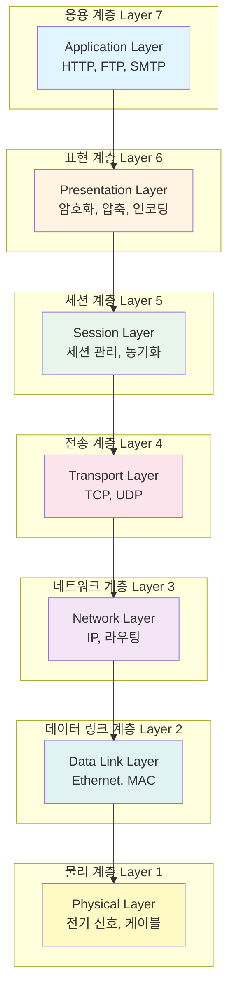
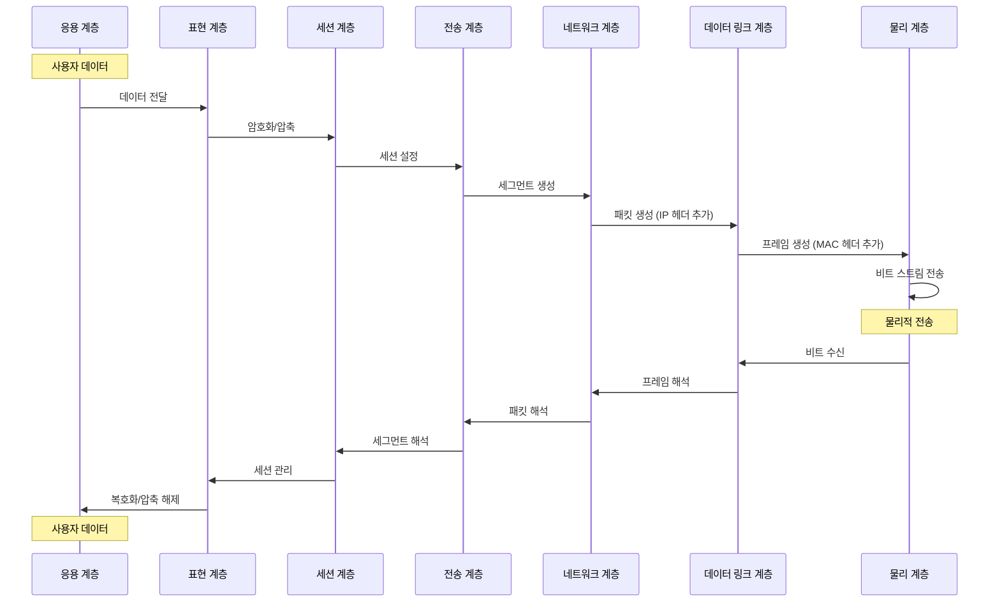

OSI 모델(Open Systems Interconnection Model)은 네트워크 통신을 7개의 계층으로 나누어 설명하는 표준 참조 모델입니다. 국제표준화기구(ISO)에서 1984년에 제정한 이 모델은 복잡한 네트워크 통신 과정을 계층별로 분리하여 이해하고 구현하기 쉽게 만듭니다.

OSI 모델은 네트워크 프로토콜의 설계와 통신 과정의 이해를 위한 개념적 프레임워크를 제공합니다. 실제 인터넷에서는 [[TCP/IP 모델]]이 더 널리 사용되지만, OSI 모델은 네트워크 통신의 원리를 이해하는 데 매우 유용한 표준입니다. OSI 모델을 이해하기 위해서는 [[Network]], [[IP 주소]], [[프로토콜]] 등의 개념을 함께 이해하는 것이 중요합니다.

## OSI 모델의 등장 배경

초기 네트워크 통신은 각 제조사마다 독자적인 프로토콜을 사용했습니다. 이로 인해 다음과 같은 문제들이 발생했습니다:

1. **호환성 문제**: 서로 다른 제조사의 장비 간 통신이 어려웠습니다.
2. **복잡성**: 네트워크 통신의 전체 과정을 한 번에 이해하기 어려웠습니다.
3. **유지보수 어려움**: 문제 발생 시 어느 부분에서 문제가 생겼는지 파악하기 어려웠습니다.
4. **표준화 부재**: 통일된 표준이 없어 개발과 교육이 어려웠습니다.

OSI 모델은 이러한 문제들을 해결하기 위해 등장했습니다. 통신 과정을 7개의 계층으로 나누어 각 계층의 역할을 명확히 정의함으로써, 복잡한 네트워크 통신을 체계적으로 이해하고 구현할 수 있게 되었습니다.

## OSI 7계층 구조

OSI 모델은 다음과 같은 7개의 계층으로 구성됩니다:



### 1. 물리 계층 (Physical Layer)

**역할**: 전기적, 기계적, 기능적 특성을 이용해 데이터를 전송합니다.

**주요 기능**:
- 비트 스트림의 전송
- 전기 신호의 변환 (디지털 ↔ 아날로그)
- 케이블, 커넥터, 허브 등의 물리적 매체

**데이터 단위**: 비트(Bit)

**예시 장비**: 케이블, 허브, 리피터

**프로토콜 예시**: 이더넷 물리 계층, USB, RS-232

### 2. 데이터 링크 계층 (Data Link Layer)

**역할**: 같은 네트워크 세그먼트 내에서 신뢰성 있는 데이터 전송을 제공합니다.

**주요 기능**:
- 프레임 단위로 데이터 전송
- 물리적 주소(MAC 주소) 사용
- 오류 검출 및 수정
- 흐름 제어

**데이터 단위**: 프레임(Frame)

**예시 장비**: 스위치, 브리지

**프로토콜 예시**: 이더넷, Wi-Fi (IEEE 802.11), PPP

**하위 계층**:
- **LLC (Logical Link Control)**: 논리적 연결 제어
- **MAC (Media Access Control)**: 매체 접근 제어

### 3. 네트워크 계층 (Network Layer)

**역할**: 서로 다른 네트워크 간의 라우팅과 논리적 주소 지정을 담당합니다.

**주요 기능**:
- [[IP 주소]]를 사용한 논리적 주소 지정
- 패킷 라우팅 (경로 선택)
- 서로 다른 네트워크 간 통신
- [[Router]]를 통한 패킷 전달

**데이터 단위**: 패킷(Packet)

**예시 장비**: [[Router]]

**프로토콜 예시**: IP, ICMP, ARP, [[라우팅(Routing)]] 프로토콜 (RIP, OSPF, BGP)

자세한 내용은 [[IP 주소]]와 [[Router]] 문서를 참고해주세요.

### 4. 전송 계층 (Transport Layer)

**역할**: 종단 간(End-to-End) 신뢰성 있는 데이터 전송을 제공합니다.

**주요 기능**:
- [[세그먼트]] 단위로 데이터 분할 및 재조립
- 포트 번호를 통한 프로세스 식별
- 오류 제어 및 재전송
- 흐름 제어 및 혼잡 제어

**데이터 단위**: [[세그먼트]](Segment) 또는 데이터그램(Datagram)

**예시 장비**: 로드 밸런서 (L4)

**프로토콜 예시**: [[TCP]], [[UDP]]

**주요 프로토콜**:
- **TCP (Transmission Control Protocol)**: 연결 지향, 신뢰성 있는 전송
- **UDP (User Datagram Protocol)**: 비연결, 빠른 전송

### 5. 세션 계층 (Session Layer)

**역할**: 통신 세션의 설정, 관리, 종료를 담당합니다.

**주요 기능**:
- 세션 설정 및 종료
- 동기화 포인트 설정
- 대화 제어 (전이중/반이중)
- 세션 복구

**데이터 단위**: 데이터(Data)

**프로토콜 예시**: NetBIOS, RPC, PPTP

**실제 활용**: 대부분의 경우 상위 계층에서 처리되며, 명시적인 프로토콜이 적습니다.

### 6. 표현 계층 (Presentation Layer)

**역할**: 데이터의 표현 형식을 변환하고 암호화/압축을 수행합니다.

**주요 기능**:
- 데이터 형식 변환 (인코딩/디코딩)
- 데이터 암호화 및 복호화
- 데이터 압축 및 해제
- 문자 코드 변환 (ASCII, EBCDIC 등)

**데이터 단위**: 데이터(Data)

**프로토콜 예시**: SSL/TLS (암호화), JPEG, MPEG (압축)

**실제 활용**: 대부분의 경우 응용 계층에서 처리됩니다.

### 7. 응용 계층 (Application Layer)

**역할**: 사용자와 네트워크 간의 인터페이스를 제공합니다.

**주요 기능**:
- 사용자 애플리케이션 서비스 제공
- 네트워크 서비스 접근
- 파일 전송, 이메일, 웹 브라우징 등

**데이터 단위**: 메시지(Message) 또는 데이터(Data)

**프로토콜 예시**: [[HTTP]], HTTPS, FTP, SMTP, DNS, Telnet, SSH

## 데이터 전송 과정

OSI 모델에서 데이터가 전송되는 과정은 다음과 같습니다:



### 캡슐화(Encapsulation)와 역캡슐화(Decapsulation)

데이터는 상위 계층에서 하위 계층으로 전달될 때 각 계층의 헤더가 추가됩니다 (캡슐화). 수신 측에서는 하위 계층에서 상위 계층으로 전달되면서 헤더가 제거됩니다 (역캡슐화).

```
송신 측 (캡슐화):
응용 계층 데이터
  ↓ + 응용 헤더
표현 계층 데이터
  ↓ + 표현 헤더
세션 계층 데이터
  ↓ + 세션 헤더
전송 계층 세그먼트
  ↓ + TCP/UDP 헤더
네트워크 계층 패킷
  ↓ + IP 헤더
데이터 링크 계층 프레임
  ↓ + MAC 헤더 + 트레일러
물리 계층 비트 스트림

수신 측 (역캡슐화):
물리 계층 비트 스트림
  ↓ - 물리 신호
데이터 링크 계층 프레임
  ↓ - MAC 헤더
네트워크 계층 패킷
  ↓ - IP 헤더
전송 계층 세그먼트
  ↓ - TCP/UDP 헤더
세션 계층 데이터
  ↓ - 세션 헤더
표현 계층 데이터
  ↓ - 표현 헤더
응용 계층 데이터
```

## OSI 모델의 계층별 특징

### 상위 계층 (5-7계층)

**특징**:
- 사용자와 가까운 계층
- 애플리케이션 로직 처리
- 주로 소프트웨어로 구현
- 호스트 간 통신

**관심사**: 데이터의 의미와 표현

### 하위 계층 (1-4계층)

**특징**:
- 네트워크와 가까운 계층
- 데이터 전송 담당
- 하드웨어와 소프트웨어 혼합 구현
- 네트워크 인프라

**관심사**: 데이터의 전송

## OSI 모델과 TCP/IP 모델의 비교

실제 인터넷에서는 OSI 모델보다 [[TCP/IP 모델]]이 더 널리 사용됩니다:

| OSI 모델 | TCP/IP 모델 | 주요 프로토콜 |
|----------|-------------|--------------|
| 7. 응용 계층 | | HTTP, FTP, SMTP |
| 6. 표현 계층 | 4. 응용 계층 | SSL/TLS |
| 5. 세션 계층 | | |
| 4. 전송 계층 | 3. 전송 계층 | TCP, UDP |
| 3. 네트워크 계층 | 2. 인터넷 계층 | IP, ICMP |
| 2. 데이터 링크 계층 | 1. 네트워크 인터페이스 계층 | 이더넷, Wi-Fi |
| 1. 물리 계층 | | 케이블, 무선 |

**차이점**:
- TCP/IP 모델은 4계층으로 단순화되어 있습니다
- TCP/IP 모델은 실제 구현에 기반한 모델입니다
- OSI 모델은 개념적 참조 모델입니다

## Java에서 OSI 모델 계층 구현 예시

Java는 각 OSI 계층에 해당하는 기능을 제공합니다:

### 응용 계층 (7계층)

```java
import java.net.http.HttpClient;
import java.net.http.HttpRequest;
import java.net.http.HttpResponse;
import java.net.URI;

// HTTP 클라이언트 (응용 계층)
public class ApplicationLayerExample {
    public static void main(String[] args) throws Exception {
        HttpClient client = HttpClient.newHttpClient();
        HttpRequest request = HttpRequest.newBuilder()
            .uri(URI.create("https://www.example.com"))
            .build();
        
        HttpResponse<String> response = client.send(
            request, 
            HttpResponse.BodyHandlers.ofString()
        );
        
        System.out.println(response.body());
    }
}
```

### 전송 계층 (4계층)

```java
import java.net.Socket;
import java.io.*;

// TCP 소켓 (전송 계층)
public class TransportLayerExample {
    public static void main(String[] args) throws IOException {
        Socket socket = new Socket("www.example.com", 80);
        
        PrintWriter out = new PrintWriter(
            socket.getOutputStream(), true
        );
        BufferedReader in = new BufferedReader(
            new InputStreamReader(socket.getInputStream())
        );
        
        // HTTP 요청 전송
        out.println("GET / HTTP/1.1");
        out.println("Host: www.example.com");
        out.println();
        
        // 응답 수신
        String line;
        while ((line = in.readLine()) != null) {
            System.out.println(line);
        }
        
        socket.close();
    }
}
```

### 네트워크 계층 (3계층)

```java
import java.net.InetAddress;
import java.net.UnknownHostException;

// IP 주소 처리 (네트워크 계층)
public class NetworkLayerExample {
    public static void main(String[] args) throws UnknownHostException {
        InetAddress address = InetAddress.getByName("www.example.com");
        System.out.println("호스트 이름: " + address.getHostName());
        System.out.println("IP 주소: " + address.getHostAddress());
        
        // 네트워크 인터페이스 확인
        try {
            java.net.NetworkInterface networkInterface = 
                java.net.NetworkInterface.getByInetAddress(address);
            if (networkInterface != null) {
                System.out.println("인터페이스: " + networkInterface.getName());
            }
        } catch (Exception e) {
            e.printStackTrace();
        }
    }
}
```

## 스프링에서 OSI 모델 계층 활용

스프링 프레임워크는 각 계층의 기능을 추상화하여 제공합니다:

### 응용 계층 (7계층) - REST API

```java
import org.springframework.web.bind.annotation.*;
import org.springframework.http.ResponseEntity;

@RestController
@RequestMapping("/api")
public class ApplicationLayerController {
    
    @GetMapping("/users/{id}")
    public ResponseEntity<User> getUser(@PathVariable Long id) {
        // HTTP 요청 처리 (응용 계층)
        User user = userService.findById(id);
        return ResponseEntity.ok(user);
    }
}
```

### 전송 계층 (4계층) - TCP 연결 관리

```java
import org.springframework.messaging.simp.stomp.*;
import org.springframework.web.socket.messaging.WebSocketStompClient;

// WebSocket을 통한 전송 계층 통신
@Service
public class TransportLayerService {
    
    public void connectToServer() {
        WebSocketStompClient stompClient = new WebSocketStompClient();
        // TCP 연결 설정 및 관리
    }
}
```

## OSI 모델의 장단점

### 장점

1. **체계적 이해**: 복잡한 네트워크 통신을 계층별로 이해할 수 있습니다.
2. **표준화**: 네트워크 통신의 표준 참조 모델로 활용됩니다.
3. **문제 해결**: 문제 발생 시 해당 계층을 쉽게 식별할 수 있습니다.
4. **교육적 가치**: 네트워크 교육에서 널리 사용됩니다.
5. **호환성**: 계층별로 독립적인 개발이 가능합니다.

### 단점

1. **복잡성**: 7계층 구조가 실제 구현보다 복잡할 수 있습니다.
2. **실제 사용**: 인터넷에서는 TCP/IP 모델이 더 널리 사용됩니다.
3. **중복**: 일부 계층의 역할이 중복될 수 있습니다.
4. **과도한 추상화**: 실제 구현과 차이가 있을 수 있습니다.

## 실제 활용 사례

1. **네트워크 설계**: 계층별로 네트워크를 설계할 때 참조 모델로 사용합니다.
2. **문제 진단**: 네트워크 문제 발생 시 어느 계층에서 문제가 발생했는지 파악합니다.
3. **프로토콜 개발**: 새로운 프로토콜 개발 시 계층별 역할을 정의합니다.
4. **교육**: 네트워크 통신 원리를 교육할 때 사용합니다.
5. **보안**: 각 계층별 보안 요구사항을 정의합니다.

## OSI 모델과 보안

각 OSI 계층마다 보안 위협과 대응 방안이 있습니다:

| 계층 | 보안 위협 | 대응 방안 |
|------|----------|----------|
| 응용 계층 | 애플리케이션 공격, SQL 인젝션 | 입력 검증, 방화벽 |
| 표현 계층 | 데이터 변조 | 암호화 (SSL/TLS) |
| 세션 계층 | 세션 하이재킹 | 세션 토큰, 타임아웃 |
| 전송 계층 | 포트 스캔, SYN 플러딩 | 방화벽, IDS/IPS |
| 네트워크 계층 | IP 스푸핑, DDoS | IP 필터링, 라우터 ACL |
| 데이터 링크 계층 | MAC 스푸핑, ARP 스푸핑 | 포트 보안, VLAN |
| 물리 계층 | 케이블 탭핑, 신호 도청 | 물리적 보안, 암호화 |

## 결론

OSI 모델은 네트워크 통신을 이해하는 데 필수적인 개념적 프레임워크입니다. 7개의 계층으로 나누어 각 계층의 역할과 책임을 명확히 정의함으로써, 복잡한 네트워크 통신 과정을 체계적으로 이해할 수 있게 해줍니다.

실제 인터넷에서는 [[TCP/IP 모델]]이 더 널리 사용되지만, OSI 모델은 네트워크 통신의 원리를 학습하고 문제를 진단하는 데 매우 유용한 도구입니다. 각 계층의 역할과 프로토콜을 이해하는 것은 효과적인 네트워크 설계와 문제 해결에 필수적입니다.

네트워크를 설계하거나 문제를 해결할 때는 OSI 모델의 계층적 구조를 활용하여, [[Network]], [[IP 주소]], [[Router]], [[TCP]], [[UDP]], [[HTTP]] 등의 관련 개념들을 함께 이해하는 것이 중요합니다.

## 참고 자료

- Computer Networks, 5th Edition - Andrew S. Tanenbaum
- TCP/IP Illustrated, Volume 1 - W. Richard Stevens
- ISO/IEC 7498-1:1994 - Information technology - Open Systems Interconnection
- 네트워크 엔지니어링 교과서 - 후지쯔

