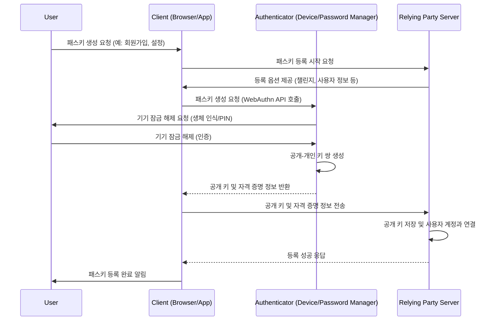
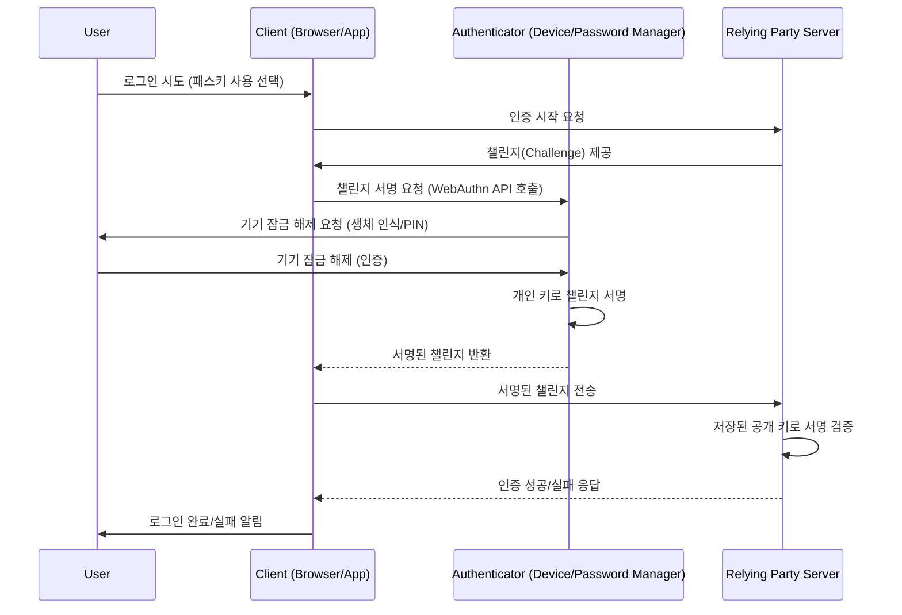

현대 디지털 환경에서 비밀번호는 보안과 편의성 사이의 오랜 딜레마였습니다. 복잡한 비밀번호를 기억하고 관리하는 것은 사용자에게 큰 부담이었고, 피싱과 같은 공격에 취약하다는 문제점도 있었습니다. 이러한 문제들을 해결하기 위해 등장한 것이 바로 **Passkey(패스키)**입니다.

## 1. Passkey(패스키)란 무엇인가요?

패스키는 기존의 사용자 이름과 비밀번호 조합을 대체하는 새로운 형태의 디지털 자격 증명입니다. 쉽게 말해, 웹사이트나 애플리케이션에 로그인할 때 더 이상 비밀번호를 입력할 필요 없이, 스마트폰의 생체 인식(지문, 얼굴 인식)이나 PIN 번호와 같은 장치 내 인증 방식을 사용하여 안전하게 로그인할 수 있도록 해주는 기술입니다.

패스키는 특정 웹사이트나 서비스에 연결된 고유한 디지털 키 쌍으로 작동합니다. 이 키 쌍은 사용자의 장치(예: 스마트폰, 컴퓨터)에 안전하게 저장되며, 사용자가 로그인할 때 이 키를 사용하여 본인임을 증명합니다.

## 2. 왜 Passkey를 사용해야 할까요?

패스키는 사용자 경험과 보안 측면에서 기존 비밀번호 방식에 비해 여러 가지 혁신적인 장점을 제공합니다.

### 2.1. 향상된 보안성

*   **피싱 공격 방어**: 패스키는 특정 웹사이트나 앱의 도메인에 바인딩되어 작동하므로, 사용자가 가짜 웹사이트에 속아 인증 정보를 입력하더라도 패스키가 작동하지 않습니다. 이는 피싱 공격에 대한 강력한 방어 수단이 됩니다.
*   **비밀번호 유출 위험 제거**: 서버에 비밀번호가 저장되지 않으므로, 데이터 유출 사고가 발생하더라도 사용자 비밀번호가 노출될 위험이 없습니다.
*   **강력한 암호화**: [[공개 키 암호화 (Public Key Cryptography)]]를 사용하여 무작위 대입 공격이나 자격 증명 스터핑(Credential Stuffing) 공격으로부터 보호됩니다.
*   **추가 인증 불필요**: 패스키 자체가 강력한 다단계 인증(MFA)의 역할을 하므로, SMS OTP와 같은 추가 인증 절차가 필요 없어집니다.

### 2.2. 개선된 사용자 경험

*   **간편하고 빠른 로그인**: 비밀번호를 기억하거나 입력할 필요 없이, 기기 잠금 해제 방식([[생체 인식 (Biometrics)]], PIN)으로 간편하게 로그인할 수 있습니다. 이는 로그인 시간을 단축시키고 사용자 편의성을 크게 향상시킵니다.
*   **기기 간 동기화**: 패스키는 비밀번호 관리자(예: 구글 비밀번호 관리자, iCloud 키체인)를 통해 여러 기기 간에 안전하게 동기화될 수 있어, 새로운 기기에서도 별도의 등록 없이 바로 사용할 수 있습니다.
*   **사용자 부담 감소**: 사용자가 복잡한 비밀번호를 만들고 기억하며 관리해야 하는 부담이 사라집니다.
*   **IT 관리 부담 감소**: 비밀번호 재설정 요청이 줄어들어 기업의 IT 지원 비용을 절감할 수 있습니다.

## 3. Passkey, WebAuthn, FIDO의 관계

패스키, WebAuthn, FIDO는 서로 밀접하게 연결되어 차세대 인증 기술을 구성합니다.

*   **FIDO (Fast IDentity Online) Alliance**: 비밀번호 의존도를 줄이고 로그인 과정을 간소화하며 인터넷을 더 안전하게 만드는 것을 목표로 하는 개방형 산업 협회입니다. FIDO Alliance는 다양한 인증 표준을 개발하고 있습니다.
*   **FIDO 표준**: 패스키는 FIDO 표준을 기반으로 하는 FIDO 인증 자격 증명입니다. 특히 **FIDO2**는 FIDO Alliance가 개발한 온라인 보안 인증 표준 세트로, WebAuthn과 CTAP(Client to Authenticator Protocols) 두 가지 주요 구성 요소로 이루어져 있습니다.
*   **WebAuthn (Web Authentication API)**: W3C(World Wide Web Consortium)와 FIDO Alliance가 협력하여 개발한 웹 표준이자 자바스크립트 API입니다. WebAuthn은 웹 애플리케이션이 공개 키 암호화를 사용하여 비밀번호 없는 인증을 구현할 수 있도록 합니다. 패스키는 WebAuthn 표준을 사용하여 생성되는 자격 증명의 한 유형이며, WebAuthn은 패스키를 가능하게 하는 기반 기술 사양입니다. 즉, WebAuthn은 브라우저가 패스키를 생성하고 관리하는 데 필요한 인터페이스를 제공합니다.
*   **CTAP (Client to Authenticator Protocols)**: WebAuthn을 보완하는 프로토콜로, 로밍 인증자(예: 하드웨어 보안 키)와의 통신을 가능하게 합니다.

요약하자면, FIDO Alliance는 표준(FIDO2)을 정의하고, WebAuthn은 이러한 표준을 웹 브라우저에서 구현하는 API이며, 패스키는 이 구현을 통해 사용자에게 제공되는 사용자 친화적인 자격 증명(FIDO 자격 증명)입니다.

## 4. Passkey의 작동 원리 (개념적 이해)

패스키는 [[공개 키 암호화 (Public Key Cryptography)]] 기술을 기반으로 작동합니다. 사용자가 웹사이트나 애플리케이션에서 패스키를 생성할 때, 사용자 기기에서 [[공개-개인 키 쌍 (Public-Private Key Pair)]]이 생성됩니다. 이 중 공개 키만 서비스 제공자([[신뢰 당사자 (Relying Party)]]) 서버에 저장되고, 개인 키는 사용자 기기에 안전하게 보관됩니다. 개인 키는 웹사이트와 공유되거나 기기와 서버 간에 전송되지 않습니다.

### 4.1. 패스키 등록 과정

패스키를 등록하는 과정은 다음과 같습니다.

1.  **사용자 요청**: 사용자가 웹사이트나 앱에서 패스키 생성을 시작합니다. (예: 회원가입 시, 보안 설정에서)
2.  **키 쌍 생성**: 사용자의 기기([[인증자 (Authenticator)]])는 해당 서비스에 고유한 공개-개인 키 쌍을 생성합니다.
3.  **개인 키 저장**: 생성된 개인 키는 사용자 기기(예: 스마트폰, 컴퓨터) 또는 패스키를 지원하는 비밀번호 관리자(예: 구글 비밀번호 관리자, iCloud 키체인)에 안전하게 저장됩니다.
4.  **공개 키 전송**: 공개 키는 서비스 제공자([[신뢰 당사자 (Relying Party)]]) 서버로 전송되어 사용자 계정과 연결되어 저장됩니다.
5.  **사용자 확인**: 이 과정에서 사용자는 기기 잠금 해제([[생체 인식 (Biometrics)]], PIN 등)를 통해 본인임을 확인합니다.

### 4.2. 패스키 인증 과정

패스키를 이용한 로그인 과정은 다음과 같습니다.

1.  **로그인 시도**: 사용자가 서비스에 로그인하려고 시도하고 패스키 사용을 선택합니다.
2.  **챌린지 요청**: 신뢰 당사자 서버는 사용자 기기에 [[챌린지 (Challenge)]]라고 불리는 무작위 데이터를 전송합니다.
3.  **개인 키 서명**: 사용자 기기([[인증자 (Authenticator)]])는 사용자의 생체 인식(지문, 얼굴 인식) 또는 PIN을 통해 본인 확인을 거친 후, 보관하고 있던 개인 키로 이 챌린지에 서명합니다.
4.  **서명 전송**: 서명된 챌린지는 다시 신뢰 당사자 서버로 전송됩니다.
5.  **서명 검증**: 서버는 이전에 저장해 둔 공개 키를 사용하여 서명의 유효성을 검증합니다.
6.  **인증 완료**: 서명이 유효하면 사용자의 신원이 확인되고 로그인이 완료됩니다.

이 과정에서 개인 키는 기기를 벗어나지 않으며, 서버는 공개 키만으로 사용자의 신원을 확인할 수 있어 보안성이 크게 향상됩니다.

## 결론

패스키는 비밀번호가 가진 보안 및 사용성 문제를 해결하며, 더 안전하고 편리한 디지털 인증 시대를 열고 있습니다. [[공개 키 암호화 (Public Key Cryptography)]]와 [[생체 인식 (Biometrics)]] 기술을 기반으로 피싱 공격에 강력하게 저항하고, 사용자에게는 간편한 로그인 경험을 제공합니다. FIDO Alliance의 표준화 노력과 WebAuthn API의 확산을 통해 패스키는 점차 보편적인 인증 방식으로 자리 잡을 것으로 기대됩니다.

---
### [[공개 키 암호화 (Public Key Cryptography)]]
공개 키 암호화는 두 개의 서로 다른 키, 즉 공개 키(Public Key)와 개인 키(Private Key)를 사용하는 암호화 방식입니다. 공개 키는 누구나 알 수 있도록 공개되어 데이터를 암호화하는 데 사용되며, 개인 키는 소유자만 가지고 있어 암호화된 데이터를 복호화하는 데 사용됩니다. 이 방식은 데이터를 안전하게 전송하고, 메시지의 발신자를 인증하는 데 활용됩니다.

### [[공개-개인 키 쌍 (Public-Private Key Pair)]]
공개-개인 키 쌍은 공개 키 암호화 시스템에서 함께 작동하는 두 개의 암호화 키입니다. 한 키로 암호화된 데이터는 다른 키로만 복호화할 수 있도록 수학적으로 연결되어 있습니다. 공개 키는 공유될 수 있지만, 개인 키는 소유자만 안전하게 보관해야 합니다.

### 챌린지(Challenge)
Passkey 개념에서 '챌린지'는 보안 메커니즘의 중요한 부분입니다.

#### 챌린지의 역할

챌린지는 서버가 클라이언트에게 무작위로 생성된 데이터를 전송하여, 클라이언트가 이 데이터를 사용하여 암호화된 응답을 생성하도록 요구하는 과정입니다. 이 응답은 클라이언트가 자신이 주장하는 신원을 가지고 있음을 증명하는 데 사용됩니다.

#### 챌린지-응답 메커니즘

1. **서버 챌린지 생성**: 서버는 로그인 또는 트랜잭션 서명과 같은 특정 작업에 대해 고유하고 예측 불가능한 챌린지 값을 생성합니다.
2. **클라이언트 응답**: 클라이언트는 이 챌린지 값을 사용하여 개인 키로 서명하거나 암호화된 응답을 생성합니다.
3. **서버 검증**: 서버는 클라이언트로부터 받은 응답을 공개 키로 검증하여, 클라이언트가 올바른 개인 키를 소유하고 있는지 확인합니다.

이 메커니즘은 [[재전송 공격(Replay Attack)]]을 방지하는 데 필수적입니다. 매번 새로운 챌린지가 사용되므로, 공격자가 이전에 가로챈 응답을 재사용하여 인증을 시도하는 것을 막을 수 있습니다.

### [[인증자 (Authenticator)]]
인증자는 사용자의 신원을 확인하는 데 사용되는 장치 또는 소프트웨어입니다. 패스키 맥락에서는 사용자의 스마트폰, 컴퓨터, 태블릿 또는 하드웨어 보안 키 등이 인증자 역할을 할 수 있습니다. 인증자는 개인 키를 안전하게 저장하고, 사용자의 생체 인식이나 PIN을 통해 본인 확인을 수행합니다.

### [[신뢰 당사자 (Relying Party)]]
신뢰 당사자(RP)는 사용자 인증을 요청하고 그 결과를 신뢰하는 서비스 또는 애플리케이션을 의미합니다. 웹사이트나 모바일 앱이 대표적인 신뢰 당사자입니다. 신뢰 당사자 서버는 사용자의 공개 키를 저장하고, 인증 과정에서 클라이언트로부터 받은 서명을 검증하는 역할을 합니다.

### [[생체 인식 (Biometrics)]]
생체 인식은 개인의 고유한 생물학적 특성(예: 지문, 얼굴, 홍채, 음성)을 사용하여 신원을 확인하는 기술입니다. 패스키 인증에서는 사용자가 기기 잠금을 해제하고 본인임을 증명하는 수단으로 널리 활용됩니다.

## 참고 자료

*   Passkeys - Google for Developers
*   Passkeys Explained: What Is a Passkey and How Do Passkeys Work? - Dashlane
*   Passkeys: Passwordless Authentication - FIDO Alliance
*   Passwordless Authentication With Passkey: How It Works and Why It Matters | Medium
*   What is a Passkey? - Yubico
*   What is a Passkey? Secure Signins - Microsoft
*   Passkeys developer guide for relying parties | Authentication
*   WebAuthn and Passkeys
*   Benefits and challenges of passkeys in the enterprise | TechTarget
*   Costs and Benefits of Implementation of Support for Passkeys
*   Passkey's Passwordless Authentication - Google Safety Center
*   How Passkeys Work
*   How Do They Work? - Passkeys.io
*   Passkey user flows - Yubico Developers
*   How passkeys work - Yubico Developers
*   What are passkeys and how do they work? - Clerk
*   What Is a Passkey & How Does It Work? - Descope
*   Server-side passkey registration | Sign in with Google for Web
*   A Crash Course in Passkeys and WebAuthn | by James Collerton | Medium
*   Passkey Authentication: What Is It & How to Implement It - SuperTokens
*   Passkeys (WebAuthn) - Logto docs
*   Create a passkey for passwordless logins | Articles - web.dev
*   WebAuthn: How it Works & Example Flows - Descope
*   WebAuthn and Passkey 101 - Logto blog