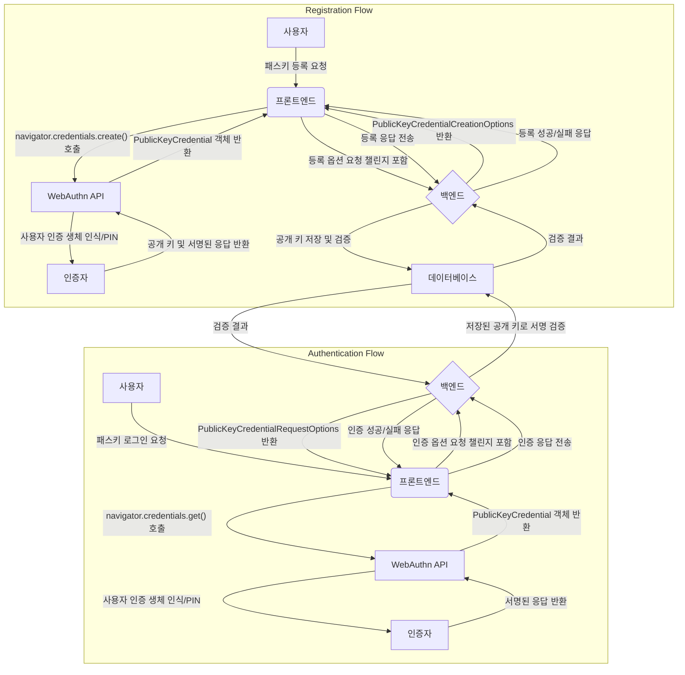

## Passkey 구현: 프론트엔드 TypeScript WebAuthn 활용

현대 웹 환경에서 사용자 인증은 보안과 편의성이라는 두 가지 중요한 축을 중심으로 발전하고 있습니다. 전통적인 비밀번호 기반 인증 방식은 피싱 공격, 비밀번호 재사용 등으로 인해 보안에 취약하며 사용자 경험 또한 좋지 않습니다. 이러한 문제점을 해결하기 위해 등장한 것이 바로 **패스키(Passkey)**입니다. 패스키는 비밀번호를 대체하는 차세대 인증 기술로, [[WebAuthn]] 표준을 기반으로 합니다. 이 글에서는 프론트엔드에서 TypeScript와 WebAuthn API를 활용하여 패스키를 구현하는 방법에 대해 자세히 설명해 드립니다.

### 패스키란 무엇이며 왜 중요한가요?

패스키는 사용자가 비밀번호 없이 웹사이트나 애플리케이션에 로그인할 수 있도록 하는 디지털 자격 증명입니다. 이는 사용자의 기기(스마트폰, 노트북 등)에 안전하게 저장되며, 생체 인식(지문, 얼굴 인식)이나 PIN 등을 통해 인증됩니다.

패스키의 주요 이점은 다음과 같습니다.

*   **피싱 방지**: 패스키는 특정 웹사이트 또는 애플리케이션에 바인딩되어 있어, 사용자가 가짜 사이트에 속아 인증 정보를 입력하더라도 해당 정보가 악용될 수 없습니다.
*   **향상된 사용자 경험**: 사용자는 복잡한 비밀번호를 기억하거나 입력할 필요 없이, 기기의 잠금 해제 방식과 동일하게 간편하게 로그인할 수 있습니다.
*   **보안 강화**: 공개 키 암호화를 사용하며, 개인 키는 사용자 기기에서 절대 외부로 노출되지 않습니다. 서버에는 공개 키만 저장되므로 데이터 유출 시에도 사용자 계정의 보안이 유지됩니다.
*   **다중 기기 지원**: 한 기기에서 생성된 패스키는 다른 기기에서도 동기화되어 사용할 수 있어, 새로운 기기에서 다시 등록할 필요가 없습니다.

패스키는 [[FIDO2]] 표준의 핵심 구성 요소인 WebAuthn API를 통해 구현됩니다.

### WebAuthn 개요

[[WebAuthn (Web Authentication API)]]은 웹 애플리케이션이 공개 키 암호화를 사용하여 강력한 인증을 수행할 수 있도록 하는 W3C 및 FIDO 표준입니다. WebAuthn은 다음과 같은 주요 구성 요소로 이루어져 있습니다.

*   **사용자(User)**: 인증을 시도하는 개인입니다.
*   **사용자 에이전트(User Agent)**: 웹 브라우저와 같이 WebAuthn API 호출을 처리하고 인증 프로세스를 관리하는 역할을 합니다.
*   **인증자(Authenticator)**: 사용자의 신원을 확인하기 위한 암호화 키를 생성하고 저장하는 하드웨어 또는 소프트웨어 구성 요소입니다. (예: 지문 센서, 얼굴 인식, 보안 키, OS 내장 인증 기능)
*   **신뢰 당사자(Relying Party, RP)**: 사용자가 접근하려는 웹 서비스 또는 애플리케이션입니다.

WebAuthn의 핵심은 [[공개 키 암호화]]를 사용하여 비밀번호 대신 비대칭 키 쌍(공개 키와 개인 키)을 사용하는 것입니다. 개인 키는 사용자 기기에 안전하게 보관되고, 공개 키는 서버에 저장됩니다. 인증 과정에서 서버는 [[챌린지(Challenge)]]를 발행하고, 인증자는 개인 키로 이 챌린지에 서명하여 서버에 보냅니다. 서버는 저장된 공개 키로 서명을 검증하여 사용자의 신원을 확인합니다.

### 프론트엔드 TypeScript WebAuthn 구현

프론트엔드에서 WebAuthn을 구현하기 위해서는 HTTPS 환경이 필수적입니다. 또한, 챌린지 생성 및 인증 결과 검증을 위한 백엔드 서버가 필요합니다. 여기서는 `navigator.credentials.create()`를 사용한 등록과 `navigator.credentials.get()`을 사용한 인증 두 가지 주요 흐름을 TypeScript 코드로 살펴보겠습니다.

#### 1. 패스키 등록 (Registration)

패스키 등록 과정은 사용자가 새로운 계정을 생성하거나 기존 계정에 패스키를 추가할 때 발생합니다.

**흐름:**

1.  프론트엔드는 백엔드에 패스키 등록을 위한 옵션(챌린지, 사용자 정보, RP 정보 등)을 요청합니다.
2.  백엔드는 무작위로 생성된 챌린지 및 기타 필요한 정보를 포함하는 `PublicKeyCredentialCreationOptions` 객체를 생성하여 프론트엔드에 전달합니다.
3.  프론트엔드는 `navigator.credentials.create()` 메서드를 호출하여 사용자에게 인증자(예: 지문 인식)를 통한 등록을 요청합니다.
4.  사용자가 인증을 완료하면, 인증자는 공개 키와 함께 서명된 응답을 브라우저에 반환합니다.
5.  프론트엔드는 이 응답을 백엔드로 전송합니다.
6.  백엔드는 수신된 응답을 검증하고, 공개 키를 사용자 계정과 연결하여 저장합니다.

**TypeScript 코드 예시:**

```typescript
// 필요한 타입 정의 (실제 프로젝트에서는 @simplewebauthn/types 등 라이브러리 사용 권장)
interface RegistrationOptions {
  rp: { id: string; name: string; };
  user: { id: string; name: string; displayName: string; };
  challenge: string; // Base64URL 인코딩된 챌린지
  pubKeyCredParams: Array<{ type: string; alg: number; }>;
  timeout?: number;
  attestation?: AttestationConveyancePreference;
  excludeCredentials?: PublicKeyCredentialDescriptor[];
}

interface RegistrationResponse {
  id: string;
  rawId: string;
  response: AuthenticatorAttestationResponse;
  type: string;
  clientExtensionResults: AuthenticationExtensionsClientOutputs;
}

// Base64URL 문자열을 ArrayBuffer로 디코딩하는 헬퍼 함수 (실제 라이브러리 사용 권장)
function base64urlToArrayBuffer(base64url: string): ArrayBuffer {
  const base64 = base64url.replace(/-/g, '+').replace(/_/g, '/');
  const pad = base64.length % 4;
  if (pad) {
    base64 += new Array(5 - pad).join('=');
  }
  return Uint8Array.from(atob(base64), c => c.charCodeAt(0)).buffer;
}

async function registerPasskey(username: string, userId: string): Promise<void> {
  try {
    // 1. 백엔드로부터 등록 옵션 요청
    const response = await fetch('/api/generate-registration-options', {
      method: 'POST',
      headers: { 'Content-Type': 'application/json' },
      body: JSON.stringify({ username, userId }),
    });
    const options: RegistrationOptions = await response.json();

    // 챌린지 및 기타 ArrayBuffer로 변환해야 하는 필드 처리
    options.challenge = base64urlToArrayBuffer(options.challenge) as any;
    if (options.user && options.user.id) {
      options.user.id = base64urlToArrayBuffer(options.user.id) as any;
    }
    if (options.excludeCredentials) {
      options.excludeCredentials.forEach(cred => {
        cred.id = base64urlToArrayBuffer(cred.id);
      });
    }

    // 2. WebAuthn API 호출
    const credential = await navigator.credentials.create({
      publicKey: options as PublicKeyCredentialCreationOptions,
    });

    // 3. 생성된 자격 증명(credential)을 백엔드로 전송하여 검증 및 저장
    const registrationResponse: RegistrationResponse = {
      id: credential.id,
      rawId: ArrayBufferToBase64url(credential.rawId),
      response: {
        clientDataJSON: ArrayBufferToBase64url(credential.response.clientDataJSON),
        attestationObject: ArrayBufferToBase64url(credential.response.attestationObject),
      } as AuthenticatorAttestationResponse,
      type: credential.type,
      clientExtensionResults: credential.clientExtensionResults,
    };

    const verificationResponse = await fetch('/api/verify-registration', {
      method: 'POST',
      headers: { 'Content-Type': 'application/json' },
      body: JSON.stringify(registrationResponse),
    });

    if (verificationResponse.ok) {
      console.log('패스키 등록 성공입니다.');
    } else {
      const errorData = await verificationResponse.json();
      console.error('패스키 등록 실패입니다:', errorData.message);
    }
  } catch (error) {
    console.error('패스키 등록 중 오류 발생입니다:', error);
  }
}

// ArrayBuffer를 Base64URL 문자열로 인코딩하는 헬퍼 함수 (실제 라이브러리 사용 권장)
function ArrayBufferToBase64url(buffer: ArrayBuffer): string {
  return btoa(String.fromCharCode(...new Uint8Array(buffer)))
    .replace(/\+/g, '-')
    .replace(/\//g, '_')
    .replace(/=/g, '');
}
```

#### 2. 패스키 인증 (Authentication)

패스키 인증 과정은 사용자가 이전에 등록된 패스키를 사용하여 로그인할 때 발생합니다.

**흐름:**

1.  프론트엔드는 백엔드에 패스키 인증을 위한 옵션(챌린지, 허용된 자격 증명 ID 목록 등)을 요청합니다.
2.  백엔드는 무작위로 생성된 챌린지 및 기타 필요한 정보를 포함하는 `PublicKeyCredentialRequestOptions` 객체를 생성하여 프론트엔드에 전달합니다.
3.  프론트엔드는 `navigator.credentials.get()` 메서드를 호출하여 사용자에게 인증자(예: 지문 인식)를 통한 인증을 요청합니다.
4.  사용자가 인증을 완료하면, 인증자는 서명된 응답을 브라우저에 반환합니다.
5.  프론트엔드는 이 응답을 백엔드로 전송합니다.
6.  백엔드는 수신된 응답을 검증하고, 서명이 유효하면 사용자를 로그인 처리합니다.

**TypeScript 코드 예시:**

```typescript
// 필요한 타입 정의 (실제 프로젝트에서는 @simplewebauthn/types 등 라이브러리 사용 권장)
interface AuthenticationOptions {
  challenge: string; // Base64URL 인코딩된 챌린지
  timeout?: number;
  rpId?: string;
  allowCredentials?: Array<{ id: string; type: string; transports?: AuthenticatorTransport[] }>;
  userVerification?: UserVerificationRequirement;
}

interface AuthenticationResponse {
  id: string;
  rawId: string;
  response: AuthenticatorAssertionResponse;
  type: string;
  clientExtensionResults: AuthenticationExtensionsClientOutputs;
}

async function authenticatePasskey(username?: string): Promise<void> {
  try {
    // 1. 백엔드로부터 인증 옵션 요청 (username은 선택 사항, usernameless 로그인 지원 시)
    const response = await fetch('/api/generate-authentication-options', {
      method: 'POST',
      headers: { 'Content-Type': 'application/json' },
      body: JSON.stringify({ username }),
    });
    const options: AuthenticationOptions = await response.json();

    // 챌린지 및 기타 ArrayBuffer로 변환해야 하는 필드 처리
    options.challenge = base64urlToArrayBuffer(options.challenge) as any;
    if (options.allowCredentials) {
      options.allowCredentials.forEach(cred => {
        cred.id = base64urlToArrayBuffer(cred.id);
      });
    }

    // 2. WebAuthn API 호출
    const credential = await navigator.credentials.get({
      publicKey: options as PublicKeyCredentialRequestOptions,
    });

    // 3. 생성된 자격 증명(credential)을 백엔드로 전송하여 검증
    const authenticationResponse: AuthenticationResponse = {
      id: credential.id,
      rawId: ArrayBufferToBase64url(credential.rawId),
      response: {
        clientDataJSON: ArrayBufferToBase64url(credential.response.clientDataJSON),
        authenticatorData: ArrayBufferToBase64url(credential.response.authenticatorData),
        signature: ArrayBufferToBase64url(credential.response.signature),
        userHandle: credential.response.userHandle ? ArrayBufferToBase64url(credential.response.userHandle) : null,
      } as AuthenticatorAssertionResponse,
      type: credential.type,
      clientExtensionResults: credential.clientExtensionResults,
    };

    const verificationResponse = await fetch('/api/verify-authentication', {
      method: 'POST',
      headers: { 'Content-Type': 'application/json' },
      body: JSON.stringify(authenticationResponse),
    });

    if (verificationResponse.ok) {
      console.log('패스키 인증 성공입니다.');
      // 로그인 성공 후 리다이렉션 또는 UI 업데이트
    } else {
      const errorData = await verificationResponse.json();
      console.error('패스키 인증 실패입니다:', errorData.message);
    }
  } catch (error) {
    console.error('패스키 인증 중 오류 발생입니다:', error);
  }
}
```

#### 데이터 형식 처리 및 라이브러리 활용

WebAuthn API는 `ArrayBuffer`와 같은 바이너리 데이터 형식을 사용합니다. 하지만 네트워크를 통해 데이터를 주고받을 때는 일반적으로 Base64URL 인코딩된 문자열을 사용해야 합니다. 위 예시 코드에 포함된 `base64urlToArrayBuffer` 및 `ArrayBufferToBase64url` 함수는 이러한 변환을 위한 기본적인 헬퍼 함수입니다.

실제 프로덕션 환경에서는 이러한 데이터 변환 및 WebAuthn 사양의 복잡한 검증 로직을 직접 구현하기보다는 [[SimpleWebAuthn]]과 같은 검증된 라이브러리를 사용하는 것이 강력히 권장됩니다. `SimpleWebAuthn`은 TypeScript 기반으로 프론트엔드(`@simplewebauthn/browser`)와 백엔드(`@simplewebauthn/server`) 모두를 위한 기능을 제공하여 구현을 크게 단순화할 수 있습니다.


#### WebAuthn 인증 흐름 다이어그램

WebAuthn의 등록 및 인증 흐름은 다음과 같이 시각화할 수 있습니다.



*   **백엔드 검증의 중요성**: 프론트엔드에서 받은 WebAuthn 응답은 반드시 백엔드에서 철저히 검증해야 합니다. 챌린지 일치 여부, RP ID 확인, 서명 유효성 검사 등은 보안에 매우 중요합니다.
*   **사용자 경험**: 패스키는 사용자에게 새로운 개념일 수 있으므로, 등록 및 로그인 과정에서 명확하고 이해하기 쉬운 안내 메시지를 제공해야 합니다.
*   **에러 핸들링**: `navigator.credentials` 호출 시 발생할 수 있는 다양한 오류(사용자 취소, 지원되지 않는 환경 등)를 적절히 처리하여 사용자에게 피드백을 제공해야 합니다.
*   **점진적 도입**: 기존 비밀번호 인증과 함께 패스키를 선택적 로그인 옵션으로 제공하여 사용자들이 점진적으로 전환할 수 있도록 유도하는 것이 좋습니다.
*   **조건부 UI**: 사용자의 기기에서 패스키가 지원되는지 여부를 확인하여 적절한 UI를 제공하는 [[조건부 UI]]를 고려할 수 있습니다.

### 결론

패스키는 비밀번호 없는 미래를 향한 중요한 발걸음이며, WebAuthn API는 이를 가능하게 하는 핵심 기술입니다. 프론트엔드에서 TypeScript와 WebAuthn을 활용하여 패스키를 구현함으로써, 개발자는 사용자에게 더욱 안전하고 편리한 인증 경험을 제공할 수 있습니다. 초기 구현에는 학습 곡선이 있을 수 있지만, `SimpleWebAuthn`과 같은 라이브러리의 도움을 받아 복잡성을 줄이고 견고한 인증 시스템을 구축할 수 있습니다.

## 참고 자료

*   Passkeys - Google for Developers.
*   Web Authentication API - MDN Web Docs.
*   A Short Introduction to WebAuthn Authentication. - Auth0.
*   WebAuthn Guide.
*   Say Goodbye to Passwords: How Passkeys Are Reinventing Online Security - LoginRadius.
*   What Is a Passkey & How Does It Work? - Descope.
*   Implementation of Web Biometric Authentication on React + Node js (SimpleWebAuthn).
*   WebAuthn and Passkeys.
*   WebAuthn Client Registration - Yubico Developers.
*   Passkeys for Developers.
*   Build it Yourself - Develop - WebAuthn.wtf.
*   WebAuthn: How it Works & Example Flows - Descope.
*   A curated list of awesome WebAuthn and Passkey resources - GitHub.
*   WebAuthn and Passkey 101 - Logto blog.
*   Next-Gen Web Authentication. How to use WebAuthn, hardware keys, and… | by Vladimir Prus | Medium.
*   SimpleWebAuthn.
*   Server-side passkey registration | Sign in with Google for Web.
