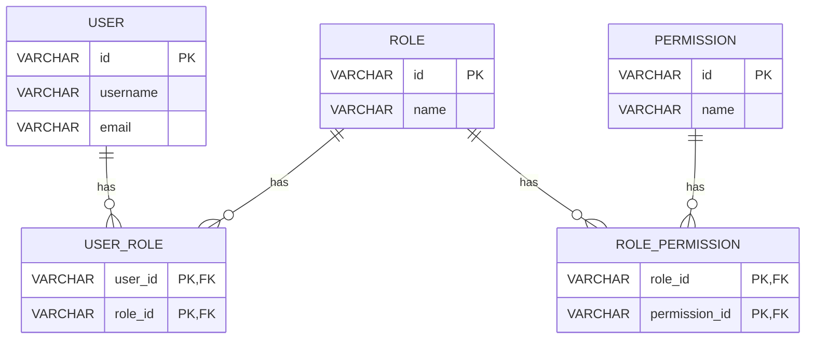

[[역할 기반 접근 제어(RBAC)]]는 현대 소프트웨어 시스템에서 효율적이고 안전한 권한 관리를 위한 핵심적인 모델입니다. 이 가이드는 RBAC를 실제 시스템에 구현하기 위한 개발 관점의 접근 방법과 모범 사례를 제공합니다.

## 1. RBAC 구현의 핵심 단계

RBAC를 시스템에 성공적으로 구현하기 위해서는 다음과 같은 핵심 단계를 따르는 것이 중요합니다.

### 1.1. 역할(Role) 및 권한(Permission) 정의

가장 먼저 해야 할 일은 시스템 내에서 필요한 역할과 각 역할이 수행할 수 있는 권한을 명확하게 정의하는 것입니다. 이는 비즈니스 요구사항과 조직의 구조를 면밀히 분석하여 이루어져야 합니다.

-   **역할 정의**: 시스템 사용자의 직무, 책임, 기능에 따라 역할을 정의합니다. (예: `ADMIN`, `MANAGER`, `USER`, `GUEST`, `PRODUCT_VIEWER`, `ORDER_CREATOR`)
-   **권한 정의**: 각 역할이 특정 리소스에 대해 수행할 수 있는 최소 단위의 작업을 정의합니다. 권한은 보통 `[리소스]:[액션]` 형태로 정의됩니다. (예: `PRODUCT:READ`, `PRODUCT:WRITE`, `ORDER:CREATE`, `USER:DELETE`)

**모범 사례:**
-   **최소 권한 원칙 준수**: 각 역할에는 해당 직무를 수행하는 데 필요한 최소한의 권한만 부여합니다. [[최소 권한 원칙]]을 참고해주세요.
-   **역할 폭발 방지**: 너무 세분화된 역할을 정의하여 역할의 수가 과도하게 늘어나지 않도록 주의합니다. 역할 간의 중복을 최소화하고 계층 구조를 고려할 수 있습니다.

### 1.2. 데이터 모델 설계

정의된 역할과 권한을 저장하고 관리하기 위한 데이터베이스 스키마를 설계합니다. 일반적으로 사용자, 역할, 권한 테이블과 이들 간의 관계를 나타내는 매핑 테이블이 필요합니다.

-   **`User` 테이블**: 사용자 정보 (ID, 이름, 이메일 등)
-   **`Role` 테이블**: 역할 정보 (ID, 역할명 등)
-   **`Permission` 테이블**: 권한 정보 (ID, 권한명 등)
-   **`UserRole` 테이블 (매핑)**: 사용자-역할 관계 (User ID, Role ID)
-   **`RolePermission` 테이블 (매핑)**: 역할-권한 관계 (Role ID, Permission ID)



### 1.3. 인터페이스 정의

RBAC 시스템의 각 핵심 컴포넌트(역할, 권한, 사용자-역할 매핑, 역할-권한 매핑)는 명확한 인터페이스를 통해 상호작용하도록 설계하는 것이 좋습니다. 이는 시스템의 모듈성을 높이고, 향후 구현 변경에 유연하게 대응할 수 있도록 합니다.

자세한 내용은 [[RBAC 인터페이스 정의]]를 참고해주세요.

### 1.4. 권한 부여 로직 구현

사용자의 요청이 들어왔을 때, 해당 사용자가 요청된 리소스에 대해 특정 작업을 수행할 권한이 있는지 확인하는 로직을 구현합니다. 이는 주로 애플리케이션의 서비스 계층이나 컨트롤러 계층에서 이루어집니다.

## 2. Spring Security를 활용한 RBAC 구현 (Java 예시)

Java 기반의 웹 애플리케이션에서는 [[Spring Security]] 프레임워크를 활용하여 RBAC를 효과적으로 구현할 수 있습니다. Spring Security는 강력한 인증(Authentication) 및 인가(Authorization) 기능을 제공합니다.

### 2.1. 의존성 추가

`build.gradle` (Gradle) 또는 `pom.xml` (Maven)에 Spring Security 의존성을 추가합니다.

```gradle
// build.gradle
implementation 'org.springframework.boot:spring-boot-starter-security'
implementation 'org.springframework.boot:spring-boot-starter-data-jpa' // 데이터베이스 연동 시
implementation 'com.mysql:mysql-connector-j' // 사용하는 DB 드라이버
```

### 2.2. 사용자 및 역할/권한 엔티티

위에서 설계한 데이터 모델에 따라 JPA 엔티티를 정의합니다.

```java
// User.java
@Entity
@Table(name = "users")
public class User {
    @Id @GeneratedValue(strategy = GenerationType.IDENTITY)
    private Long id;
    private String username;
    private String password;

    @ManyToMany(fetch = FetchType.EAGER)
    @JoinTable(
        name = "user_roles",
        joinColumns = @JoinColumn(name = "user_id"),
        inverseJoinColumns = @JoinColumn(name = "role_id"))
    private Set<Role> roles = new HashSet<>();

    // Getters and Setters
}

// Role.java
@Entity
@Table(name = "roles")
public class Role {
    @Id @GeneratedValue(strategy = GenerationType.IDENTITY)
    private Long id;
    private String name; // 예: ROLE_ADMIN, ROLE_USER

    @ManyToMany(fetch = FetchType.EAGER)
    @JoinTable(
        name = "role_permissions",
        joinColumns = @JoinColumn(name = "role_id"),
        inverseJoinColumns = @JoinColumn(name = "permission_id"))
    private Set<Permission> permissions = new HashSet<>();

    // Getters and Setters
}

// Permission.java
@Entity
@Table(name = "permissions")
public class Permission {
    @Id @GeneratedValue(strategy = GenerationType.IDENTITY)
    private Long id;
    private String name; // 예: PRODUCT:READ, USER:DELETE

    // Getters and Setters
}
```

### 2.3. UserDetailsService 구현

Spring Security는 사용자 정보를 로드하기 위해 `UserDetailsService` 인터페이스를 사용합니다. 이 인터페이스를 구현하여 데이터베이스에서 사용자, 역할, 권한 정보를 가져오도록 합니다.

```java
@Service
public class CustomUserDetailsService implements UserDetailsService {

    @Autowired
    private UserRepository userRepository;

    @Override
    @Transactional
    public UserDetails loadUserByUsername(String username) throws UsernameNotFoundException {
        User user = userRepository.findByUsername(username)
                .orElseThrow(() -> new UsernameNotFoundException("User not found with username: " + username));

        // 사용자에게 부여된 모든 권한(Permission)을 수집
        Set<GrantedAuthority> authorities = user.getRoles().stream()
                .flatMap(role -> {
                    Set<GrantedAuthority> roleAuthorities = role.getPermissions().stream()
                            .map(permission -> new SimpleGrantedAuthority(permission.getName()))
                            .collect(Collectors.toSet());
                    // 역할 자체도 권한으로 추가 (예: ROLE_ADMIN)
                    roleAuthorities.add(new SimpleGrantedAuthority(role.getName()));
                    return roleAuthorities.stream();
                })
                .collect(Collectors.toSet());

        return new org.springframework.security.core.userdetails.User(
                user.getUsername(),
                user.getPassword(),
                authorities);
    }
}
```

### 2.4. Spring Security 설정

`SecurityFilterChain`을 구성하여 URL 기반 및 메서드 기반 인가를 설정합니다.

```java
@Configuration
@EnableWebSecurity
@EnableMethodSecurity // 메서드 수준 보안 활성화
public class SecurityConfig {

    @Autowired
    private CustomUserDetailsService customUserDetailsService;

    @Bean
    public PasswordEncoder passwordEncoder() {
        return new BCryptPasswordEncoder();
    }

    @Bean
    public SecurityFilterChain securityFilterChain(HttpSecurity http) throws Exception {
        http
            .csrf(AbstractHttpConfigurer::disable) // CSRF 비활성화 (API 서버의 경우)
            .authorizeHttpRequests(authorize -> authorize
                // URL 패턴에 따른 권한 설정 (예: /admin/** 경로는 'ROLE_ADMIN' 역할만 접근 가능)
                .requestMatchers("/admin/**").hasRole("ADMIN")
                // 특정 권한(Permission)이 필요한 경로 (예: /products/write는 'PRODUCT:WRITE' 권한 필요)
                .requestMatchers(HttpMethod.POST, "/products").hasAuthority("PRODUCT:WRITE")
                .requestMatchers(HttpMethod.DELETE, "/products/**").hasAuthority("PRODUCT:DELETE")
                .anyRequest().authenticated() // 나머지 요청은 인증된 사용자만 접근 가능
            )
            .formLogin(withDefaults()); // 폼 로그인 활성화 (필요에 따라 커스터마이징)
        return http.build();
    }

    @Bean
    public DaoAuthenticationProvider authenticationProvider() {
        DaoAuthenticationProvider authProvider = new DaoAuthenticationProvider();
        authProvider.setUserDetailsService(customUserDetailsService);
        authProvider.setPasswordEncoder(passwordEncoder());
        return authProvider;
    }
}
```

### 2.5. 컨트롤러 및 서비스 계층에서 인가 적용

메서드 수준에서 `@PreAuthorize` 어노테이션을 사용하여 세밀한 인가 제어를 할 수 있습니다.

```java
@RestController
@RequestMapping("/products")
public class ProductController {

    @GetMapping
    @PreAuthorize("hasAuthority('PRODUCT:READ')") // 'PRODUCT:READ' 권한이 있는 사용자만 접근 가능
    public String getAllProducts() {
        return "List of all products";
    }

    @PostMapping
    @PreAuthorize("hasAuthority('PRODUCT:WRITE')") // 'PRODUCT:WRITE' 권한이 있는 사용자만 접근 가능
    public String createProduct() {
        return "Product created";
    }

    @DeleteMapping("/{id}")
    @PreAuthorize("hasAuthority('PRODUCT:DELETE')") // 'PRODUCT:DELETE' 권한이 있는 사용자만 접근 가능
    public String deleteProduct(@PathVariable Long id) {
        return "Product " + id + " deleted";
    }
}
```

## 3. 세분화된 리소스 인스턴스 제어 (Fine-Grained Resource Instance Control)

RBAC는 역할 기반으로 권한을 부여하므로, 특정 리소스의 *인스턴스*에 대한 접근 제어(예: '1번 사용자만 자신의 프로필을 수정할 수 있다', '관리자만 1번 사용자를 삭제할 수 있다')와 같이 매우 세분화된 제어에는 한계가 있습니다. 이러한 경우에는 Spring Security의 `@PreAuthorize` 어노테이션과 SpEL(Spring Expression Language)을 활용하여 [[속성 기반 접근 제어(ABAC)]]의 요소를 결합할 수 있습니다.

### 3.1. 특정 사용자 삭제 권한 제어 예시

예를 들어, `UserController`에서 특정 `userId`를 가진 사용자를 삭제하는 메서드에 대해 다음과 같이 권한을 제어할 수 있습니다.

```java
@RestController
@RequestMapping("/users")
public class UserController {

    @Autowired
    private UserService userService; // 사용자 정보를 조회하는 서비스

    // 현재 인증된 사용자가 ADMIN 역할을 가지고 있거나,
    // 삭제하려는 사용자(id)가 현재 인증된 사용자와 동일한 경우에만 삭제 허용
    @DeleteMapping("/{id}")
    @PreAuthorize("hasRole('ADMIN') or #id == authentication.principal.id")
    public String deleteUser(@PathVariable Long id) {
        userService.deleteUser(id);
        return "User " + id + " deleted successfully";
    }
}
```

**설명:**
-   `hasRole('ADMIN')`: 현재 인증된 사용자가 `ADMIN` 역할을 가지고 있는지 확인합니다.
-   `#id`: `@PathVariable`로 넘어온 `id` 값을 참조합니다.
-   `authentication.principal.id`: 현재 인증된 사용자의 `UserDetails` 객체에서 `id` 속성을 참조합니다. `authentication.principal`은 일반적으로 `UserDetails` 인터페이스를 구현한 객체이며, 여기에 `id` 필드가 있다고 가정합니다. 실제 구현에서는 `UserDetails` 구현체에 `id` 필드를 추가해야 합니다.

이처럼 `@PreAuthorize`와 SpEL을 사용하면 메서드 파라미터, 현재 인증된 사용자 정보, 심지어 서비스 메서드 내에서 조회한 객체의 속성까지 활용하여 매우 유연하고 동적인 접근 제어 로직을 구현할 수 있습니다.

## 4. RBAC 구현 시 고려사항

-   **계층적 역할(Hierarchical Roles)**: 역할 간에 상위/하위 관계를 설정하여 상위 역할이 하위 역할의 모든 권한을 상속받도록 할 수 있습니다. (예: `ADMIN` 역할이 `MANAGER` 역할의 권용을 포함)
-   **역할 활성화(Role Activation)**: 사용자가 여러 역할을 가질 때, 특정 세션에서 어떤 역할을 활성화할지 선택하도록 할 수 있습니다. (예: 일반 사용자 역할로 로그인로 로그인 후, 필요 시 관리자 역할로 전환)
-   **동적 권한 부여**: 특정 조건(예: 시간, IP 주소, 데이터 내용)에 따라 동적으로 권한을 부여하거나 회수해야 하는 경우, [[속성 기반 접근 제어(ABAC)]]와의 조합을 고려할 수 있습니다. ABAC 구현에 대한 자세한 내용은 [[ABAC 개발 가이드]]를 참고해주세요.
-   **감사 및 로깅**: 모든 접근 시도와 권한 부여/거부 이력을 상세히 로깅하여 보안 감사 및 문제 발생 시 추적에 활용합니다.
-   **성능 최적화**: 대규모 시스템에서는 권한 확인 과정이 성능 병목이 될 수 있으므로, 캐싱 전략이나 효율적인 쿼리 설계를 고려해야 합니다.
-   **관리 비용 절감**: 새로운 기능 추가에 따른 RBAC 관리 비용을 줄이는 전략은 [[기능 추가에 따른 RBAC 관리 비용 절감 전략]]을 참고해주세요.

## 결론

RBAC는 시스템의 보안을 강화하고 관리 효율성을 높이는 강력한 도구입니다. 역할과 권한을 명확하게 정의하고, Spring Security와 같은 검증된 프레임워크를 활용하여 구현함으로써 안전하고 확장 가능한 애플리케이션을 구축할 수 있습니다. 초기 설계 단계에서 비즈니스 요구사항을 충분히 분석하고, [[최소 권한 원칙]]을 준수하며, 지속적인 검토와 개선을 통해 시스템의 보안 수준을 유지하는 것이 중요합니다.

## 참고 자료

-   [[역할 기반 접근 제어(RBAC)]]
-   [[Spring Security]]
-   [[최소 권한 원칙]]
-   [[접근 제어 모델]]
-   [[속성 기반 접근 제어(ABAC)]]
-   Spring Security Documentation: [https://docs.spring.io/spring-security/reference/](https://docs.spring.io/spring-security/reference/)
