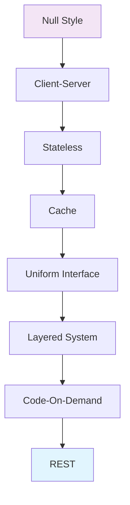
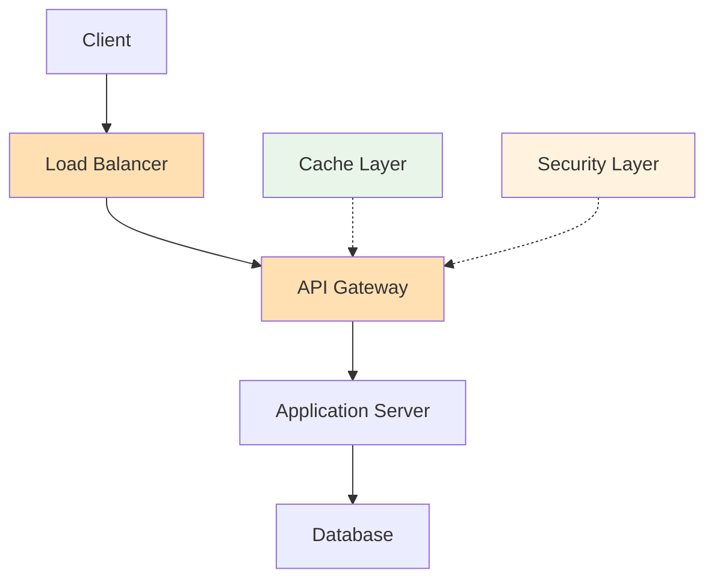

RESTful API는 현대 웹 개발에서 가장 널리 사용되는 아키텍처 스타일입니다. 하지만 REST의 본질적 의미와 설계 원칙을 제대로 이해하고 적용하는 개발자는 많지 않습니다. 이는 REST가 단순한 HTTP 메서드 사용법이 아니라, 분산 시스템을 위한 정교한 아키텍처 철학에 기반하기 때문입니다.

REST(Representational State Transfer)는 Roy Thomas Fielding이 2000년 UC 어바인에서 발표한 박사논문 "Architectural Styles and the Design of Network-based Software Architectures"에서 처음 제시된 개념입니다. 이 논문은 단순히 웹 API 설계 가이드가 아니라, 네트워크 기반 소프트웨어 아키텍처의 근본 원리를 탐구한 학술적 연구입니다.

## 소프트웨어 아키텍처의 기초 이해

Fielding의 논문 첫 번째 장에서는 소프트웨어 아키텍처를 "시스템 작동 중 실행 시간 요소들의 추상화"로 정의합니다. 이는 정적인 코드 구조가 아니라 동적인 시스템 동작에 초점을 맞춘 관점입니다.

소프트웨어 아키텍처는 다음 세 가지 핵심 요소로 구성됩니다:

1. **컴포넌트(Components)**: 인터페이스를 통해 데이터 변환을 제공하는 추상적 단위
2. **커넥터(Connectors)**: 컴포넌트 간 통신을 중재하는 매개체
3. **데이터(Data)**: 특정 제약 조건 하에서 주고받는 정보

이러한 아키텍처 관점은 단순히 클래스나 모듈 수준의 설계를 넘어서, 시스템 전체의 상호작용 패턴을 다룹니다. [[소프트웨어 아키텍처 관점]]에 대한 자세한 내용을 참고해주세요.

## REST 아키텍처 스타일의 탄생

REST는 "null style"에서 시작하여 점진적으로 아키텍처 제약 조건을 적용해가며 도출된 하이브리드 아키텍처 스타일입니다. 이는 기존의 다양한 네트워크 아키텍처 스타일들의 장점을 선별적으로 결합한 결과입니다.



각 제약 조건은 특정한 품질 속성을 개선하기 위해 도입되었습니다:

- **확장성(Scalability)**: 서버 부하 감소와 상태 없는 통신
- **단순성(Simplicity)**: 균일한 인터페이스와 계층화
- **신뢰성(Reliability)**: 캐시와 상태 없는 상호작용
- **성능(Performance)**: 중간 처리와 캐시 활용

## REST의 6가지 핵심 제약 조건

### 1. 클라이언트-서버 (Client-Server)

관심사의 분리를 통해 클라이언트와 서버의 독립적 진화를 가능하게 합니다. 클라이언트는 사용자 인터페이스와 관련된 관심사를, 서버는 데이터 저장과 관련된 관심사를 처리합니다.

```java
@RestController
@RequestMapping("/api/users")
public class UserController {
    
    private final UserService userService;
    
    // 클라이언트는 사용자 인터페이스 로직만 처리
    // 서버는 비즈니스 로직과 데이터 관리만 담당
    @GetMapping("/{id}")
    public ResponseEntity<UserDto> getUser(@PathVariable Long id) {
        UserDto user = userService.findById(id);
        return ResponseEntity.ok(user);
    }
}
```

### 2. 무상태성 (Stateless)

클라이언트에서 서버로의 각 요청은 해당 요청을 이해하는 데 필요한 모든 정보를 포함해야 합니다. 서버는 클라이언트의 상태를 저장하지 않습니다.

이 제약 조건의 이점:
- **가시성(Visibility)**: 요청 하나만으로 완전한 상호작용을 이해할 수 있습니다
- **신뢰성(Reliability)**: 부분적 실패로부터의 복구가 용이합니다
- **확장성(Scalability)**: 서버가 요청 간 상태를 유지할 필요가 없어 자원이 빠르게 해제됩니다

### 3. 캐시 (Cache)

응답 데이터는 캐시 가능(cacheable) 또는 캐시 불가능(non-cacheable)으로 암시적 또는 명시적으로 라벨링되어야 합니다. 캐시 제약 조건은 클라이언트-서버 상호작용의 일부를 제거할 수 있는 기능을 추가합니다.

```java
@GetMapping("/{id}")
public ResponseEntity<UserDto> getUser(@PathVariable Long id) {
    UserDto user = userService.findById(id);
    
    // 캐시 제어 헤더 설정
    return ResponseEntity.ok()
        .cacheControl(CacheControl.maxAge(Duration.ofMinutes(30)))
        .eTag(user.getVersion().toString())
        .body(user);
}
```

### 4. 균일한 인터페이스 (Uniform Interface)

REST의 핵심 특징으로, 컴포넌트 간 상호작용을 단순화하고 분리합니다. 이는 네 가지 제약 조건으로 구성됩니다:

- **자원 식별**: URI를 통한 자원 식별
- **표현을 통한 자원 조작**: 표현과 메타데이터로 자원 조작
- **자기 서술적 메시지**: 메시지 처리에 필요한 모든 정보 포함
- **애플리케이션 상태의 엔진으로서의 하이퍼미디어(HATEOAS)**: 하이퍼링크를 통한 상태 전이

자세한 내용은 [[HATEOAS (Hypermedia as the Engine of Application State)]]를 참고해주세요.

### 5. 계층화된 시스템 (Layered System)

아키텍처를 계층으로 구성하여 각 컴포넌트가 인접한 계층과만 상호작용하도록 제한합니다. 이를 통해 시스템 복잡성을 제한하고 독립성을 촉진합니다.



### 6. 주문형 코드 (Code-On-Demand) - 선택사항

서버가 실행 가능한 코드를 클라이언트에 전송하여 클라이언트의 기능을 확장할 수 있게 합니다. 이는 REST의 유일한 선택적 제약 조건입니다.

## REST 아키텍처 요소

### 데이터 요소

**자원(Resources)**은 REST의 핵심 추상화입니다. 자원은 특정 시점의 엔티티 집합에 대한 개념적 매핑이지, 엔티티 자체가 아닙니다.

**자원 식별자**는 특정 자원을 식별하는 데 사용됩니다. 웹에서는 URI가 이 역할을 담당합니다.

**표현(Representations)**은 자원의 현재 또는 의도된 상태를 캡처합니다. 표현은 데이터와 해당 데이터를 설명하는 메타데이터로 구성됩니다.

```java
@Entity
public class User {
    // 엔티티 (실제 데이터)
    @Id
    private Long id;
    private String name;
    private String email;
    // ... 기타 필드
}

public class UserDto {
    // 표현 (Representation)
    private Long id;
    private String name;
    private String email;
    private String profileUrl; // 하이퍼링크
    // ... 기타 필드
}
```

### 커넥터

REST에서 정의하는 커넥터 유형:
- **클라이언트**: 서비스 요청을 시작하는 커넥터
- **서버**: 요청을 수신하고 적절한 응답을 보내는 커넥터
- **캐시**: 요청/응답을 저장하여 성능을 개선하는 커넥터
- **해결자(Resolver)**: 자원 식별자를 네트워크 주소로 변환하는 커넥터
- **터널**: 단순히 중계 역할을 하는 커넥터

### 컴포넌트

- **오리진 서버**: 주어진 자원에 대한 정의적 소스
- **게이트웨이**: 다른 서비스들 위에 캡슐화 레이어를 제공하는 중간 컴포넌트
- **프록시**: 클라이언트에 의해 선택되는 중간 컴포넌트
- **사용자 에이전트**: 요청을 시작하는 클라이언트

## 스프링에서의 RESTful API 구현

스프링 프레임워크는 REST 원칙을 효과적으로 구현할 수 있는 다양한 기능을 제공합니다:

```java
@RestController
@RequestMapping("/api/books")
public class BookController {
    
    private final BookService bookService;
    
    // 자원 조회 (GET)
    @GetMapping("/{id}")
    public ResponseEntity<BookDto> getBook(@PathVariable Long id) {
        BookDto book = bookService.findById(id);
        return ResponseEntity.ok()
            .cacheControl(CacheControl.maxAge(Duration.ofHours(1)))
            .body(book);
    }
    
    // 자원 생성 (POST)
    @PostMapping
    public ResponseEntity<BookDto> createBook(@Valid @RequestBody CreateBookRequest request) {
        BookDto createdBook = bookService.create(request);
        URI location = linkTo(methodOn(BookController.class)
            .getBook(createdBook.getId())).toUri();
        
        return ResponseEntity.created(location).body(createdBook);
    }
    
    // 자원 수정 (PUT)
    @PutMapping("/{id}")
    public ResponseEntity<BookDto> updateBook(
        @PathVariable Long id,
        @Valid @RequestBody UpdateBookRequest request) {
        
        BookDto updatedBook = bookService.update(id, request);
        return ResponseEntity.ok(updatedBook);
    }
    
    // 자원 삭제 (DELETE)
    @DeleteMapping("/{id}")
    public ResponseEntity<Void> deleteBook(@PathVariable Long id) {
        bookService.delete(id);
        return ResponseEntity.noContent().build();
    }
}
```

스프링의 RESTful 웹 서비스 구현에 대한 자세한 내용은 [[스프링 REST API 설계 원칙]]을 참고해주세요.

## REST 제약 조건 위반 사례

Fielding은 논문에서 일반적인 REST 제약 조건 위반 사례들을 언급했습니다:

### 1. 쿠키 사용

HTTP 쿠키는 무상태성 제약 조건을 위반합니다. 서버가 클라이언트 상태를 유지하게 되어 확장성과 신뢰성을 저해합니다.

### 2. 프레임 사용

HTML 프레임은 균일한 인터페이스를 방해하며, 사용자가 현재 상태를 북마크하거나 직접 조작하는 것을 어렵게 만듭니다.

### 3. RPC 스타일 API

많은 개발자들이 REST를 오해하여 RPC(Remote Procedure Call) 스타일로 API를 설계합니다:

```java
// RPC 스타일 (REST가 아님)
@PostMapping("/api/calculateTotalPrice")
public BigDecimal calculateTotalPrice(@RequestBody CalculationRequest request) {
    return calculationService.calculate(request);
}

// RESTful 스타일
@PostMapping("/api/price-calculations")
public ResponseEntity<PriceCalculation> createPriceCalculation(
    @RequestBody PriceCalculationRequest request) {
    
    PriceCalculation result = calculationService.createCalculation(request);
    return ResponseEntity.created(locationOf(result)).body(result);
}
```

## REST의 현실적 적용과 트레이드오프

Fielding의 논문은 이상적인 REST 아키텍처를 제시하지만, 실제 개발에서는 다양한 트레이드오프를 고려해야 합니다:

### 성능 vs 네트워크 효율성

무상태성은 각 요청에 컨텍스트 정보를 반복적으로 전송해야 하므로 네트워크 오버헤드가 증가할 수 있습니다. 이를 완화하기 위해:

- **압축**: gzip 등을 사용하여 페이로드 크기 감소
- **토큰 기반 인증**: 상태를 유지하지 않으면서도 효율적인 인증 방식
- **캐싱 전략**: 적극적인 캐시 활용으로 네트워크 트래픽 감소

### HATEOAS의 복잡성

완전한 HATEOAS 구현은 복잡하고 오버헤드가 클 수 있습니다. 실용적인 접근법:

- **부분적 HATEOAS**: 핵심 네비게이션 링크만 포함
- **HAL(Hypertext Application Language)**: 표준화된 하이퍼미디어 형식 사용
- **점진적 적용**: 중요한 자원부터 하이퍼링크 적용

자세한 HATEOAS 구현 전략은 실용적인 HATEOAS 구현 방법를 참고해주세요.

## REST의 영향과 교훈

Fielding의 REST 논문은 HTTP와 URI 표준 개발에 직접적인 영향을 미쳤으며, 현대 웹 아키텍처의 기초가 되었습니다. 논문에서 도출된 주요 교훈:

### 1. HTTP는 RPC가 아니다

HTTP는 분산 객체 시스템을 위한 전송 프로토콜이 아니라, 분산 하이퍼미디어 시스템을 위한 애플리케이션 프로토콜입니다.

### 2. 네트워크 기반 API vs 라이브러리 기반 API

네트워크 기반 API는 라이브러리 기반 API와 다른 설계 철학을 요구합니다. 네트워크 지연성, 부분적 실패, 독립적 배포 등을 고려해야 합니다.

### 3. 미디어 타입의 중요성

적절한 미디어 타입 선택과 점진적 처리는 성능과 진화 가능성에 큰 영향을 미칩니다.

## 현대적 적용: 마이크로서비스와 REST

REST 원칙은 [[마이크로서비스 아키텍처(Microservice Architecture)]]에서 더욱 중요해졌습니다:

- **서비스 간 통신**: 무상태성과 균일한 인터페이스로 서비스 간 결합도 감소
- **독립적 배포**: 클라이언트-서버 분리로 서비스별 독립적 진화 가능
- **장애 격리**: 계층화된 시스템으로 장애 전파 방지

## 결론

Roy Fielding의 REST 논문은 단순한 웹 API 가이드라인이 아니라, 분산 시스템의 근본적인 설계 원칙을 제시한 학술적 연구입니다. REST의 6가지 제약 조건은 각각 특정한 품질 속성을 달성하기 위해 신중하게 선택되었으며, 이들의 조합이 현대 웹의 확장성과 신뢰성을 가능하게 했습니다.

실제 개발에서는 완벽한 REST 준수보다는 비즈니스 요구사항과 기술적 제약 사이의 균형을 찾는 것이 중요합니다. 하지만 REST의 핵심 원칙을 이해하고 있다면, 언제 어떤 제약 조건을 완화할지에 대해 더 나은 판단을 내릴 수 있습니다.

REST는 여전히 진화하고 있으며, GraphQL, gRPC 등의 새로운 기술들과 함께 사용되고 있습니다. 각 기술의 장단점을 이해하고 상황에 맞는 선택을 하는 것이 현명한 아키텍트의 자세입니다.

## 참고 자료

- Fielding, Roy Thomas. "Architectural Styles and the Design of Network-based Software Architectures." PhD dissertation, University of California, Irvine, 2000.
- Richardson, Leonard, and Sam Ruby. "RESTful Web Services." O'Reilly Media, 2007.
- Spring Framework Reference Documentation: Web on Servlet Stack
- RFC 7231: Hypertext Transfer Protocol (HTTP/1.1): Semantics and Content 