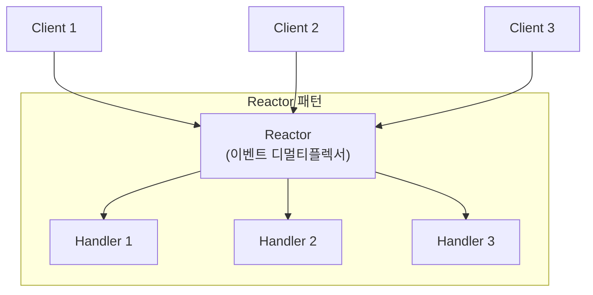
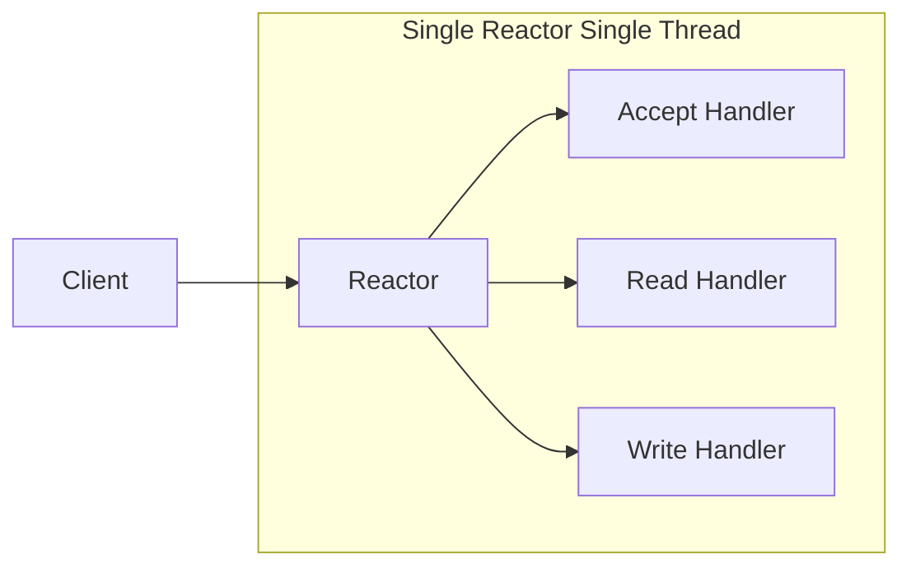
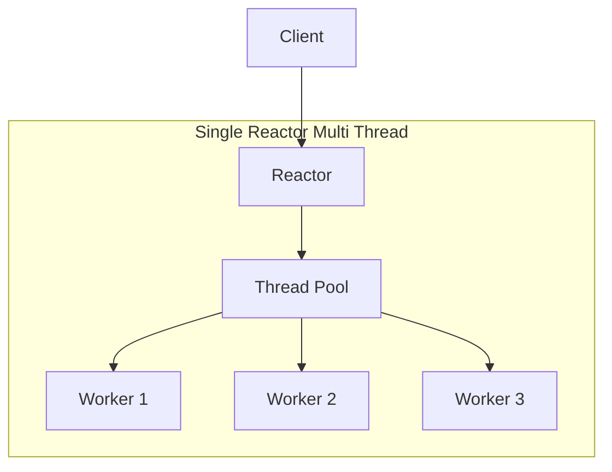
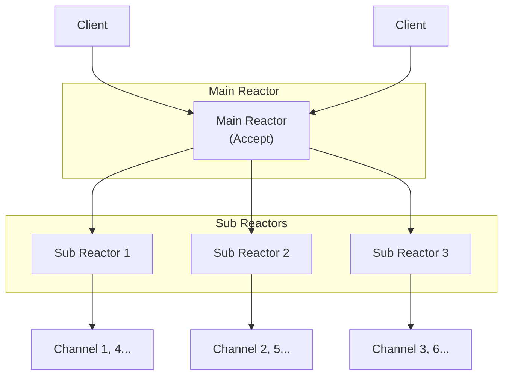

---
tags:
  - design-pattern
  - concurrency
  - networking
---

Reactor 패턴은 동시성 I/O 이벤트를 효율적으로 처리하기 위한 [[이벤트 루프(Event Loop)]] 기반 핸들링 패턴이다. [[IO 멀티플렉싱(IO Multiplexing)]]을 활용해 단일 스레드에서 여러 연결을 처리한다. [[Netty]]의 [[Netty EventLoop]]가 이 패턴을 기반으로 설계되었으며, Node.js, Nginx, Redis 등 많은 고성능 네트워크 시스템이 이 패턴을 사용한다.

---

## 전통적인 스레드 기반 모델의 한계

클라이언트마다 스레드를 할당하는 전통적인 모델은 간단하지만 확장성에 문제가 있다.

```java
// 전통적인 방식: Connection per Thread
ServerSocket serverSocket = new ServerSocket(8080);
while (true) {
    Socket socket = serverSocket.accept();
    new Thread(() -> handle(socket)).start();  // 연결마다 새 스레드
}
```

**문제점:**
- 수천 개의 동시 연결 → 수천 개의 스레드 필요
- 스레드 생성/소멸 비용
- 컨텍스트 스위칭 오버헤드
- 메모리 사용량 증가 (스레드당 스택 메모리)

---

## Reactor 패턴의 핵심 아이디어

Reactor 패턴은 I/O 이벤트를 하나의 스레드(또는 적은 수의 스레드)에서 다중화(multiplexing)해서 처리한다.



**핵심 개념:**
1. **Reactor**: 이벤트를 감지하고 적절한 핸들러로 디스패치
2. **Handler**: 실제 이벤트 처리 로직
3. **Demultiplexer**: 여러 입력 소스에서 동시에 이벤트를 대기 (select/epoll/kqueue)

---

## 단일 Reactor 단일 스레드

가장 단순한 구현. 모든 작업이 하나의 스레드에서 실행된다.



```java
public class SingleReactor implements Runnable {
    private final Selector selector;
    private final ServerSocketChannel serverChannel;

    public SingleReactor(int port) throws IOException {
        selector = Selector.open();
        serverChannel = ServerSocketChannel.open();
        serverChannel.socket().bind(new InetSocketAddress(port));
        serverChannel.configureBlocking(false);
        serverChannel.register(selector, SelectionKey.OP_ACCEPT, new Acceptor());
    }

    public void run() {
        while (!Thread.interrupted()) {
            selector.select();  // 이벤트 대기
            Set<SelectionKey> keys = selector.selectedKeys();
            for (SelectionKey key : keys) {
                dispatch(key);  // 핸들러로 디스패치
            }
            keys.clear();
        }
    }

    void dispatch(SelectionKey key) {
        Runnable handler = (Runnable) key.attachment();
        if (handler != null) {
            handler.run();
        }
    }
}
```

**장점:** 단순함, 동기화 불필요
**단점:** CPU 멀티코어 활용 불가, 핸들러가 블로킹되면 전체 지연

---

## 단일 Reactor 다중 스레드

Reactor는 하나지만, 핸들러 실행은 스레드 풀에서 처리한다.



```java
// 핸들러 실행을 스레드 풀에 위임
ExecutorService pool = Executors.newFixedThreadPool(8);

void dispatch(SelectionKey key) {
    Runnable handler = (Runnable) key.attachment();
    if (handler != null) {
        pool.execute(handler);  // 스레드 풀에서 실행
    }
}
```

**장점:** 멀티코어 활용, 블로킹 핸들러 허용
**단점:** 단일 Reactor가 병목이 될 수 있음

---

## 다중 Reactor 다중 스레드 (Main-Sub Reactor)

[[Netty]]가 채택한 모델. 연결 수락(accept)과 I/O 처리를 분리한다.



```java
// Netty에서의 구현
EventLoopGroup bossGroup = new NioEventLoopGroup(1);    // Main Reactor
EventLoopGroup workerGroup = new NioEventLoopGroup();   // Sub Reactors

ServerBootstrap b = new ServerBootstrap();
b.group(bossGroup, workerGroup)  // 분리된 Reactor 그룹
 .channel(NioServerSocketChannel.class)
 .childHandler(new MyInitializer());
```

**Main Reactor (Boss):**
- 클라이언트 연결 수락만 담당
- 새 연결을 Sub Reactor에 분배

**Sub Reactor (Worker):**
- 할당받은 채널들의 I/O 이벤트 처리
- 각 Sub Reactor가 자신의 채널들을 전담

**장점:**
- 연결 수락이 I/O 처리에 영향받지 않음
- 완전한 멀티코어 활용
- 최고 수준의 확장성

---

## Reactor 패턴의 이벤트 루프

Reactor의 핵심은 이벤트 루프다. 무한 루프를 돌면서 이벤트를 감지하고 처리한다.

```java
// 기본 이벤트 루프 구조
while (running) {
    // 1. 이벤트 대기 (블로킹)
    int readyCount = selector.select();

    // 2. 준비된 이벤트 처리
    if (readyCount > 0) {
        Set<SelectionKey> keys = selector.selectedKeys();
        Iterator<SelectionKey> it = keys.iterator();

        while (it.hasNext()) {
            SelectionKey key = it.next();
            it.remove();

            if (key.isAcceptable()) {
                handleAccept(key);
            }
            if (key.isReadable()) {
                handleRead(key);
            }
            if (key.isWritable()) {
                handleWrite(key);
            }
        }
    }

    // 3. 예약된 태스크 실행
    runScheduledTasks();
}
```

---

## Netty에서의 Reactor 패턴

[[Netty EventLoop]]는 Reactor 패턴을 정교하게 구현한다.

```java
// NioEventLoop의 단순화된 run() 메서드
protected void run() {
    while (true) {
        // 1. I/O 이벤트 대기
        int selected = selector.select(timeout);

        // 2. I/O 이벤트 처리
        processSelectedKeys();

        // 3. 태스크 큐 실행
        runAllTasks();
    }
}
```

**특징:**
- 단일 스레드로 채널 관리 → 동기화 불필요
- I/O와 태스크 처리 비율 조절 가능 (`ioRatio`)
- Selector 최적화 (epoll bug 우회 등)

---

## 프로액터 패턴과의 비교

Reactor와 비슷하지만 다른 패턴으로 Proactor가 있다.

| 특성 | Reactor | Proactor |
|-----|---------|----------|
| I/O 완료 시점 | 동기 (준비되면 직접 읽기) | 비동기 (OS가 완료 후 알림) |
| 버퍼 관리 | 애플리케이션 | OS |
| OS 지원 | 광범위 (select/poll/epoll) | 제한적 (Windows IOCP) |
| 복잡도 | 상대적으로 단순 | 더 복잡 |

Reactor는 "I/O가 **준비**되면 알려줘"
Proactor는 "I/O가 **완료**되면 알려줘"

---

## 실제 사용 사례

| 시스템 | Reactor 사용 방식 |
|-------|------------------|
| Netty | Multi-Reactor (Boss/Worker) |
| Nginx | Single-Reactor per Worker |
| Redis | Single-Reactor Single-Thread |
| Node.js | Single-Reactor (libuv) |
| Tomcat NIO | Single-Reactor per Acceptor |

---

## References

- [[Netty]]
- [[Netty EventLoop]]
- [[Java NIO]]
- [Scalable IO in Java - Doug Lea](http://gee.cs.oswego.edu/dl/cpjslides/nio.pdf)
