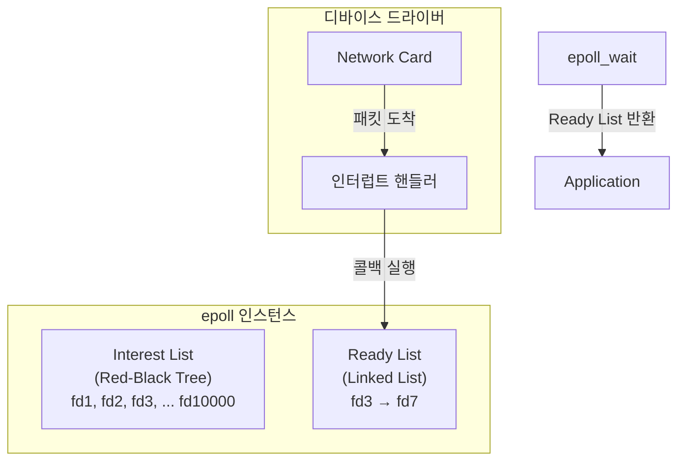
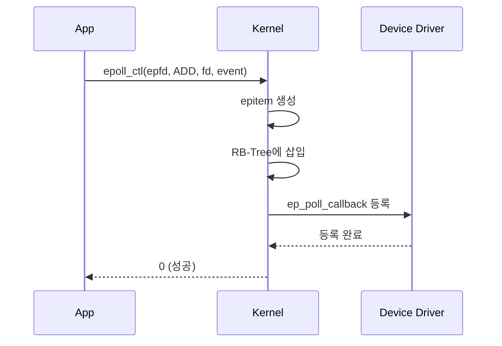
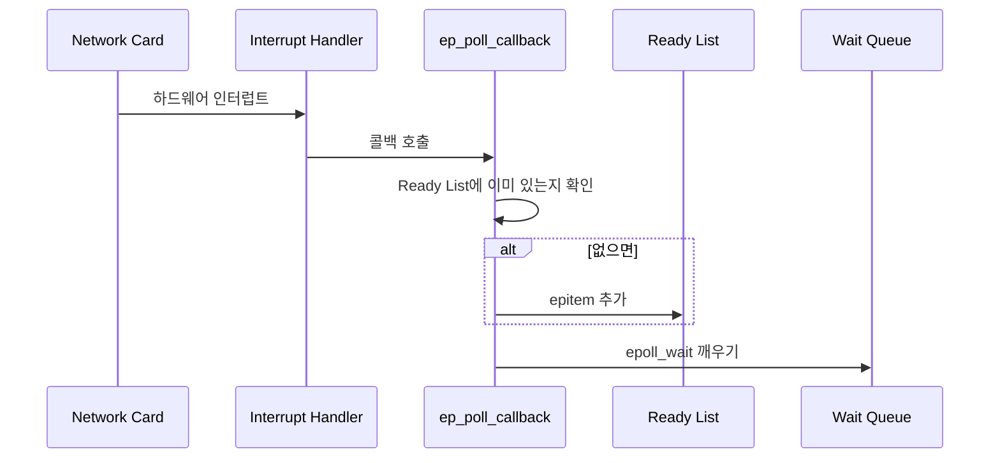

---
tags:
  - linux
  - io
  - kernel
---

Ready List는 [[epoll]]이 O(1) 성능을 달성하는 핵심 자료구조다. 이벤트가 발생한 파일 디스크립터만 저장하는 연결 리스트로, 커널이 콜백 방식으로 관리한다. [[poll]]이나 [[select]]는 모든 fd를 순회해야 하지만, epoll은 Ready List만 확인하면 된다.

---

## 동작 원리



### 핵심 포인트

1. **Interest List**: 감시 대상인 모든 fd (Red-Black Tree)
2. **Ready List**: 이벤트가 발생한 fd만 (Linked List)
3. **콜백**: 이벤트 발생 시 커널이 자동으로 Ready List에 추가

---

## 왜 O(1)인가?

### poll의 경우: O(n)

```
poll() 호출
    ↓
커널이 10,000개 fd 전부 검사
    ↓
ready인 fd 2개 발견
    ↓
전체 배열 반환
    ↓
유저가 10,000개 순회하며 ready 찾기
```

### epoll의 경우: O(1)

```
이벤트 발생 (비동기)
    ↓
커널 콜백이 Ready List에 fd 추가
    ↓
epoll_wait() 호출
    ↓
Ready List만 반환 (2개)
    ↓
유저가 2개만 처리
```

검색이 필요 없다. Ready List에 있는 것이 곧 ready인 fd다.

---

## 커널 내부 구조

epoll은 `eventpoll` 구조체로 관리된다:

```c
struct eventpoll {
    spinlock_t lock;           // Ready List 보호
    struct mutex mtx;          // 동시 수정 방지

    wait_queue_head_t wq;      // epoll_wait 대기 큐
    wait_queue_head_t poll_wait;

    struct list_head rdllist;  // Ready List (핵심!)
    struct rb_root_cached rbr; // Interest List (RB-Tree)
};
```

각 fd는 `epitem` 구조체로 표현된다:

```c
struct epitem {
    struct rb_node rbn;        // RB-Tree 노드
    struct list_head rdllink;  // Ready List 링크
    struct epoll_filefd ffd;   // 파일 디스크립터
    struct eventpoll *ep;      // 소속 epoll 인스턴스
    struct epoll_event event;  // 이벤트 정보
};
```

---

## 콜백 등록 과정

`epoll_ctl(ADD)` 호출 시:



등록된 콜백 `ep_poll_callback`은 해당 fd에서 이벤트 발생 시 호출된다.

---

## 이벤트 발생 시

네트워크 패킷이 도착하면:



중요한 점:
- **epoll_wait를 호출하지 않아도** Ready List는 갱신된다
- 이미 Ready List에 있으면 중복 추가하지 않는다

---

## Ready List와 Level/Edge Triggered

### Level Triggered (기본)

```
데이터 100바이트 도착
    ↓
Ready List에 fd 추가
    ↓
epoll_wait() → fd 반환
    ↓
50바이트만 읽음
    ↓
아직 50바이트 있음
    ↓
Ready List에 fd 유지 (또는 재추가)
    ↓
다음 epoll_wait()도 fd 반환
```

### Edge Triggered

```
데이터 100바이트 도착
    ↓
Ready List에 fd 추가
    ↓
epoll_wait() → fd 반환
    ↓
Ready List에서 fd 제거
    ↓
50바이트만 읽음 (실수!)
    ↓
새 데이터 올 때까지 Ready List에 추가 안 됨
    ↓
다음 epoll_wait() → 블로킹 (50바이트 남아있는데!)
```

Edge Triggered에서는 반드시 EAGAIN까지 읽어야 한다.

---

## Starvation 방지

Ready List에 fd가 많으면 어떻게 될까?

```c
int nfds = epoll_wait(epfd, events, maxevents, timeout);
```

`maxevents`보다 ready fd가 많으면, epoll은 **라운드 로빈** 방식으로 순환한다:

```
Ready List: [fd1, fd2, fd3, fd4, fd5]
maxevents: 2

1차 호출 → [fd1, fd2] 반환
2차 호출 → [fd3, fd4] 반환
3차 호출 → [fd5, fd1] 반환  // 순환
```

특정 fd만 계속 처리되는 기아(starvation) 현상을 방지한다.

---

## 성능 특성

| 작업 | 시간복잡도 | 설명 |
|------|-----------|------|
| fd 등록 | O(log n) | RB-Tree 삽입 |
| fd 삭제 | O(log n) | RB-Tree 삭제 |
| 이벤트 추가 | O(1) | Ready List에 링크 |
| epoll_wait | O(ready) | ready 개수만큼 복사 |

ready가 적으면 전체 fd 수와 무관하게 빠르다.

---

## References

- [[epoll]]
- [[poll]]
- [[IO 멀티플렉싱(IO Multiplexing)]]
- [Understanding Epoll in Linux Kernel](https://server.hk/blog/understanding-epoll-in-linux-kernel-a-deep-dive-into-efficient-i-o-multiplexing/)
- [How epoll works efficiently](https://www.sobyte.net/post/2022-04/epoll-efficiently/)
