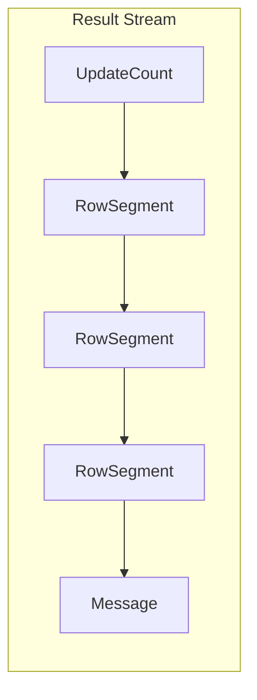

Result는 R2DBC에서 쿼리 실행 결과를 표현하는 인터페이스다. 행(Row) 데이터, 업데이트 카운트, 에러 메시지 등을 스트림 형태로 제공한다. 한 번만 소비할 수 있으며 forward-only로 동작한다.

---

## 핵심 특성

Result는 다음과 같은 특성을 가진다.

1. **일회성 소비**: 한 번 읽으면 다시 읽을 수 없다
2. **Forward-only**: 앞으로만 이동 가능
3. **세그먼트 기반**: 다양한 유형의 결과를 세그먼트로 표현



## Segment 유형

Result는 여러 종류의 Segment로 구성된다.

### RowSegment

SELECT 쿼리의 결과 행이다.

```java
result.map((row, metadata) -> {
    return new User(
        row.get("id", Long.class),
        row.get("name", String.class),
        row.get("email", String.class)
    );
});
```

### UpdateCount

INSERT, UPDATE, DELETE 등의 영향받은 행 수다.

```java
result.getRowsUpdated()
    .subscribe(count -> System.out.println("Affected rows: " + count));
```

### Message

에러나 경고 메시지다.

```java
result.flatMap(segment -> {
    if (segment instanceof Result.Message) {
        Result.Message msg = (Result.Message) segment;
        System.out.println("Warning: " + msg.message());
    }
    return Mono.empty();
});
```

## 결과 처리 메서드

### map()

행 데이터를 원하는 타입으로 변환한다.

```java
// Row와 RowMetadata를 사용
Flux<User> users = Flux.from(result.map((row, metadata) -> {
    return new User(
        row.get("id", Long.class),
        row.get("name", String.class)
    );
}));

// Readable만 사용 (간단한 경우)
Flux<String> names = Flux.from(result.map(readable ->
    readable.get("name", String.class)
));
```

### getRowsUpdated()

업데이트 카운트의 합계를 반환한다.

```java
Mono<Long> totalUpdated = Mono.from(result.getRowsUpdated());
```

### filter()

특정 유형의 세그먼트만 선택한다.

```java
// 행 데이터만 처리
result.filter(segment -> segment instanceof Result.RowSegment)
    .map(readable -> ...);
```

### flatMap()

세그먼트 레벨에서 세밀한 처리가 필요할 때 사용한다.

```java
result.flatMap(segment -> {
    if (segment instanceof Result.RowSegment) {
        Row row = ((Result.RowSegment) segment).row();
        return Mono.just(processRow(row));
    } else if (segment instanceof Result.UpdateCount) {
        long count = ((Result.UpdateCount) segment).value();
        return Mono.just("Updated: " + count);
    } else if (segment instanceof Result.Message) {
        return Mono.error(((Result.Message) segment).exception());
    }
    return Mono.empty();
});
```

## Row 인터페이스

Row는 개별 결과 행의 데이터에 접근하는 인터페이스다.

### 컬럼 접근

```java
// 인덱스로 접근 (0-based)
String name = row.get(0, String.class);

// 이름으로 접근 (대소문자 무시)
String name = row.get("name", String.class);
String name = row.get("NAME", String.class);  // 동일

// 기본 타입 매핑
Object value = row.get("column_name");
```

### RowMetadata

컬럼 정보를 제공한다.

```java
result.map((row, metadata) -> {
    // 컬럼 개수
    int columnCount = metadata.getColumnMetadatas().size();

    // 특정 컬럼 정보
    ColumnMetadata col = metadata.getColumnMetadata("name");
    String columnName = col.getName();
    Class<?> javaType = col.getJavaType();

    // 컬럼 존재 여부
    boolean hasEmail = metadata.contains("email");

    return processRow(row);
});
```

## NULL 처리

NULL 값을 읽으면 Java의 `null`이 반환된다.

```java
String email = row.get("email", String.class);
if (email == null) {
    // email 컬럼이 NULL인 경우
}
```

## 타입 변환

R2DBC 드라이버는 데이터베이스 타입을 Java 타입으로 변환한다. 변환 규칙은 드라이버마다 다를 수 있다.

| MySQL 타입 | Java 타입 |
|-----------|----------|
| INT | Integer |
| BIGINT | Long |
| VARCHAR | String |
| DATETIME | LocalDateTime |
| BLOB | ByteBuffer, Blob |
| JSON | String |

```java
// 명시적 타입 지정
LocalDateTime createdAt = row.get("created_at", LocalDateTime.class);

// 다른 타입으로 변환 요청 (드라이버가 지원하는 경우)
String ageStr = row.get("age", String.class);  // INT를 String으로
```

## Stored Procedure 결과

저장 프로시저의 OUT 파라미터는 `OutParameters`로 접근한다.

```java
result.map(readable -> {
    if (readable instanceof OutParameters) {
        OutParameters out = (OutParameters) readable;
        return out.get("output_param", String.class);
    }
    return null;
});
```

## References

- [[R2DBC 동작 원리]]
- [[Statement]]
- [[Codec]]
