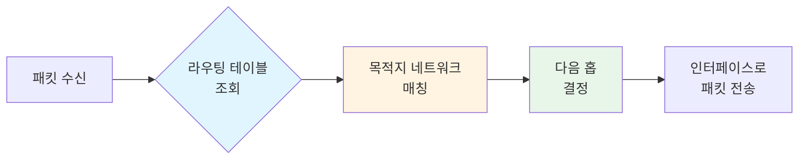
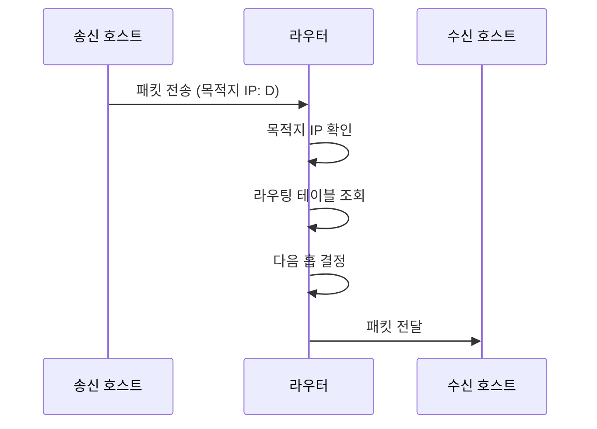

라우터(Router)는 서로 다른 [[Network]]를 연결하고 데이터 패킷을 목적지로 전달하는 네트워크 장비입니다. 라우터는 [[IP 주소]]를 기반으로 패킷의 최적 경로를 결정하고, [[라우팅(Routing)]] 테이블을 사용하여 패킷을 올바른 목적지로 전달합니다.

라우터는 [[OSI 모델]]의 네트워크 계층(3계층)에서 동작하며, 인터넷의 핵심 인프라 중 하나입니다. 라우터를 이해하기 위해서는 [[Network]], [[IP 주소]], [[라우팅(Routing)]], [[OSI 모델]] 등의 개념을 함께 이해하는 것이 중요합니다.

## 라우터의 등장 배경

초기 네트워크는 단일 [[세그먼트]]로 구성되어 있었습니다. 하지만 네트워크가 확장되면서 다음과 같은 문제들이 발생했습니다:

1. **브로드캐스트 스톰**: 단일 네트워크에서 브로드캐스트 트래픽이 과도하게 증가하여 성능 저하가 발생했습니다.
2. **확장성 제한**: 하나의 네트워크에 너무 많은 장치가 연결되면 관리가 어려워졌습니다.
3. **보안 문제**: 모든 장치가 같은 네트워크에 있으면 보안 정책 적용이 어려웠습니다.
4. **지리적 제약**: 멀리 떨어진 네트워크를 연결할 방법이 필요했습니다.

라우터는 이러한 문제들을 해결하기 위해 등장했습니다. 라우터는 네트워크를 논리적으로 분리하고, 서로 다른 네트워크 간의 통신을 가능하게 하며, 브로드캐스트 도메인을 분리하여 네트워크 효율성을 향상시킵니다.

## 라우터의 기본 기능

### 1. 패킷 포워딩 (Packet Forwarding)
라우터는 수신한 패킷의 목적지 [[IP 주소]]를 확인하고, 라우팅 테이블을 참조하여 다음 홉(Next Hop)으로 패킷을 전달합니다.

### 2. 경로 결정 (Path Determination)
목적지까지의 여러 경로 중에서 최적의 경로를 선택합니다. 이는 라우팅 알고리즘과 라우팅 프로토콜에 의해 결정됩니다.

### 3. 네트워크 분리
서로 다른 네트워크를 연결하면서도 각 네트워크를 논리적으로 분리하여 브로드캐스트 도메인을 나눕니다.

### 4. 보안 및 필터링
액세스 제어 리스트(ACL)를 사용하여 특정 트래픽을 차단하거나 허용할 수 있습니다.

## 라우터의 구조

라우터는 다음과 같은 주요 구성 요소로 이루어져 있습니다:

### 1. CPU
라우팅 테이블 관리, 라우팅 프로토콜 실행, 패킷 처리 등의 작업을 수행합니다.

### 2. 메모리
- **RAM**: 실행 중인 설정과 라우팅 테이블을 저장합니다.
- **NVRAM**: 시작 설정(Startup Configuration)을 저장합니다.
- **Flash**: 운영 체제(OS) 이미지를 저장합니다.
- **ROM**: 부팅 프로그램을 저장합니다.

### 3. 인터페이스
- **LAN 인터페이스**: 로컬 네트워크에 연결
- **WAN 인터페이스**: 원격 네트워크에 연결
- **콘솔 포트**: 관리 목적의 직렬 연결

## 라우팅 테이블 (Routing Table)

라우팅 테이블은 라우터가 패킷을 전달할 때 참조하는 경로 정보의 데이터베이스입니다. 각 항목은 다음과 같은 정보를 포함합니다:



### 라우팅 테이블 항목 구성

- **목적지 네트워크**: 패킷이 도달해야 할 네트워크 주소
- **서브넷 마스크**: 네트워크 ID와 호스트 ID를 구분하는 마스크
- **다음 홉(Next Hop)**: 패킷을 전달할 다음 라우터의 IP 주소
- **인터페이스**: 패킷을 전송할 물리적 인터페이스
- **메트릭(Metric)**: 경로의 비용이나 우선순위

### 라우팅 테이블 예시

```
목적지 네트워크      서브넷 마스크        다음 홉          인터페이스    메트릭
192.168.1.0         255.255.255.0      직접 연결        eth0         0
10.0.0.0            255.0.0.0         192.168.1.1      eth0         1
0.0.0.0             0.0.0.0           192.168.1.254    eth0         10
```

## 라우팅 프로토콜

라우터는 라우팅 프로토콜을 사용하여 네트워크 경로 정보를 교환하고 라우팅 테이블을 자동으로 업데이트합니다.

### 정적 라우팅 (Static Routing)
관리자가 수동으로 라우팅 테이블을 구성하는 방식입니다.

**장점**:
- 설정이 간단하고 예측 가능합니다
- 라우터의 CPU와 메모리 사용량이 적습니다
- 보안이 강화됩니다

**단점**:
- 네트워크 변경 시 수동으로 업데이트해야 합니다
- 대규모 네트워크에서는 관리가 어렵습니다

### 동적 라우팅 (Dynamic Routing)
라우터가 자동으로 경로 정보를 교환하여 라우팅 테이블을 업데이트하는 방식입니다.

**장점**:
- 네트워크 변경에 자동으로 대응합니다
- 대규모 네트워크에서 효율적입니다
- 장애 발생 시 자동으로 대체 경로를 찾습니다

**단점**:
- 라우터의 리소스를 더 많이 사용합니다
- 설정이 복잡할 수 있습니다

### 주요 라우팅 프로토콜

#### 1. RIP (Routing Information Protocol)
- 거리 벡터 알고리즘 사용
- 홉 수(Hop Count)를 메트릭으로 사용
- 최대 15홉까지 지원
- 소규모 네트워크에 적합

#### 2. OSPF (Open Shortest Path First)
- 링크 상태 알고리즘 사용
- 대규모 네트워크에 적합
- 빠른 수렴 시간
- 영역(Area) 개념으로 확장성 제공

#### 3. BGP (Border Gateway Protocol)
- 경로 벡터 알고리즘 사용
- 인터넷의 핵심 라우팅 프로토콜
- AS(Autonomous System) 간 라우팅에 사용

## 라우터의 동작 과정

패킷이 라우터를 통과하는 과정은 다음과 같습니다:



### 상세 동작 단계

1. **패킷 수신**: 라우터는 인터페이스로부터 패킷을 수신합니다.

2. **목적지 확인**: 패킷 헤더에서 목적지 [[IP 주소]]를 추출합니다.

3. **라우팅 테이블 조회**: 목적지 IP 주소와 일치하는 네트워크를 라우팅 테이블에서 찾습니다.

4. **경로 선택**: 여러 경로가 있는 경우 메트릭을 기준으로 최적 경로를 선택합니다.

5. **패킷 전달**: 선택된 인터페이스를 통해 다음 홉으로 패킷을 전송합니다.

6. **TTL 감소**: 패킷의 TTL(Time To Live) 값을 감소시키고, 0이 되면 패킷을 폐기합니다.

## 라우터와 다른 네트워크 장비의 차이

### 라우터 vs 스위치

| 구분 | 라우터 | 스위치 |
|------|--------|--------|
| 동작 계층 | 네트워크 계층 (3계층) | 데이터 링크 계층 (2계층) |
| 주소 사용 | [[IP 주소]] | MAC 주소 |
| 브로드캐스트 | 차단 | 전달 |
| 네트워크 분리 | 가능 | 불가능 |

### 라우터 vs 허브

| 구분 | 라우터 | 허브 |
|------|--------|------|
| 동작 방식 | 지능적 라우팅 | 단순 반복 |
| 충돌 도메인 | 분리 | 공유 |
| 성능 | 높음 | 낮음 |

## 라우터의 종류

### 1. 엔터프라이즈 라우터
대규모 기업 네트워크에서 사용되는 고성능 라우터입니다.

**특징**:
- 높은 처리 용량
- 다양한 인터페이스 지원
- 고급 보안 기능
- 복잡한 라우팅 프로토콜 지원

### 2. 소비자 라우터
가정이나 소규모 사무실에서 사용되는 라우터입니다.

**특징**:
- 간단한 설정
- 내장 스위치 및 무선 AP 기능
- NAT 기능 포함
- 저렴한 가격

### 3. 코어 라우터
인터넷 백본에서 사용되는 초고성능 라우터입니다.

**특징**:
- 매우 높은 처리 속도
- 대용량 인터페이스
- 고가용성 설계
- BGP 프로토콜 지원

## 라우터 설정 예시

### 정적 라우트 추가

```bash
# Linux/Unix에서 정적 라우트 추가
route add -net 10.0.0.0 netmask 255.0.0.0 gw 192.168.1.1

# Windows에서 정적 라우트 추가
route add 10.0.0.0 mask 255.0.0.0 192.168.1.1
```

### 라우팅 테이블 확인

```bash
# Linux/Unix
route -n
# 또는
ip route show

# Windows
route print
```

## Java에서 라우팅 정보 확인

Java에서는 시스템의 라우팅 테이블을 직접 조회할 수는 없지만, 네트워크 인터페이스 정보를 확인할 수 있습니다:

```java
import java.net.*;
import java.util.Enumeration;

public class NetworkInterfaceExample {
    public static void main(String[] args) throws SocketException {
        Enumeration<NetworkInterface> interfaces = NetworkInterface.getNetworkInterfaces();
        
        while (interfaces.hasMoreElements()) {
            NetworkInterface networkInterface = interfaces.nextElement();
            System.out.println("인터페이스 이름: " + networkInterface.getName());
            System.out.println("표시 이름: " + networkInterface.getDisplayName());
            
            Enumeration<InetAddress> addresses = networkInterface.getInetAddresses();
            while (addresses.hasMoreElements()) {
                InetAddress address = addresses.nextElement();
                System.out.println("  IP 주소: " + address.getHostAddress());
            }
            System.out.println();
        }
    }
}
```

## 스프링에서 라우팅 활용

스프링 클라우드 게이트웨이에서는 라우팅 규칙을 설정할 수 있습니다:

```java
import org.springframework.cloud.gateway.route.RouteLocator;
import org.springframework.cloud.gateway.route.builder.RouteLocatorBuilder;
import org.springframework.context.annotation.Bean;
import org.springframework.context.annotation.Configuration;

@Configuration
public class GatewayConfig {
    
    @Bean
    public RouteLocator customRouteLocator(RouteLocatorBuilder builder) {
        return builder.routes()
            .route("user-service", r -> r
                .path("/api/users/**")
                .uri("lb://user-service"))
            .route("order-service", r -> r
                .path("/api/orders/**")
                .uri("lb://order-service"))
            .build();
    }
}
```

## 라우터 보안

라우터는 네트워크의 관문 역할을 하므로 보안이 매우 중요합니다:

### 주요 보안 조치

1. **액세스 제어**: 관리자 접근을 제한하고 강력한 비밀번호를 사용합니다.
2. **ACL 설정**: 불필요한 트래픽을 차단합니다.
3. **라우팅 프로토콜 인증**: 라우팅 정보 교환 시 인증을 사용합니다.
4. **펌웨어 업데이트**: 보안 패치를 정기적으로 적용합니다.
5. **로깅 및 모니터링**: 의심스러운 활동을 추적합니다.

## 라우터 성능 최적화

라우터의 성능을 향상시키기 위한 방법들:

### 1. 라우팅 테이블 최적화
- 불필요한 라우트 제거
- 라우트 요약(Route Summarization) 사용
- 정적 라우트와 동적 라우트의 균형 유지

### 2. 하드웨어 업그레이드
- CPU 성능 향상
- 메모리 용량 증가
- 고속 인터페이스 사용

### 3. 라우팅 프로토콜 튜닝
- 적절한 라우팅 프로토콜 선택
- 타이머 값 최적화
- 메트릭 값 조정

## 실제 활용 사례

1. **인터넷 연결**: 가정이나 사무실의 네트워크를 인터넷에 연결합니다.
2. **VPN 구축**: 원격 사무실을 본사 네트워크에 연결합니다.
3. **네트워크 분리**: 보안을 위해 네트워크를 논리적으로 분리합니다.
4. **로드 밸런싱**: 여러 경로를 통해 트래픽을 분산시킵니다.
5. **재해 복구**: 장애 발생 시 대체 경로를 제공합니다.

## 결론

라우터는 네트워크의 핵심 장비로, 서로 다른 네트워크를 연결하고 데이터 패킷을 올바른 목적지로 전달하는 역할을 합니다. 라우터의 동작 원리, 라우팅 테이블, 라우팅 프로토콜 등을 이해하는 것은 효과적인 네트워크 설계와 관리에 필수적입니다.

라우터를 선택하고 설정할 때는 네트워크 규모, 성능 요구사항, 보안 요구사항 등을 종합적으로 고려해야 하며, [[Network]], [[IP 주소]], [[라우팅(Routing)]] 등의 관련 개념들을 함께 이해하는 것이 중요합니다.

또한 현대적인 애플리케이션 아키텍처에서는 스프링 클라우드 게이트웨이와 같은 소프트웨어 라우터를 활용하여 애플리케이션 레벨의 라우팅을 구현할 수 있습니다.

## 참고 자료

- Computer Networks, 5th Edition - Andrew S. Tanenbaum
- TCP/IP Illustrated, Volume 1 - W. Richard Stevens
- CCNA Routing and Switching Study Guide - Todd Lammle
- 스프링 클라우드 게이트웨이 공식 문서

