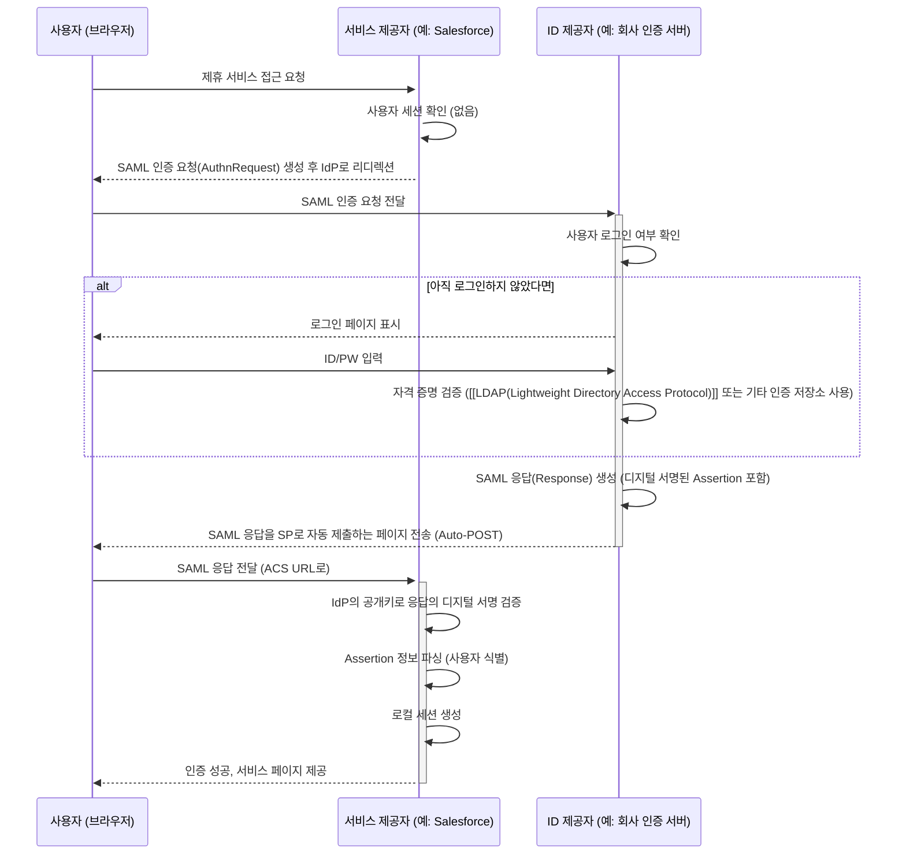
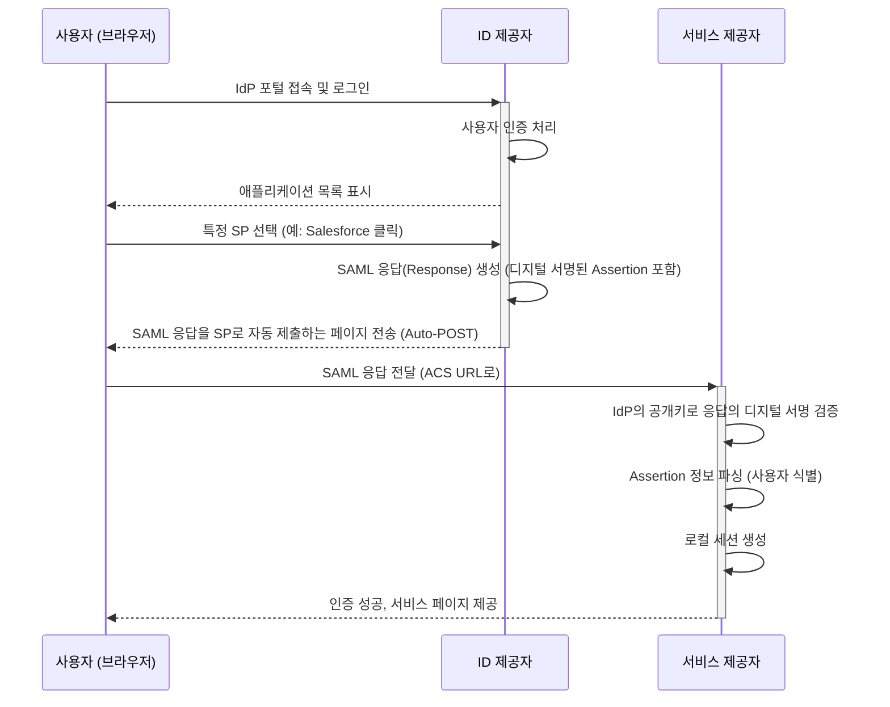

SAML(Security Assertion Markup Language)은 서로 다른 보안 도메인(Security Domain)을 가진 시스템끼리 안전하게 [[Authentication|인증]] 및 [[Authorization|인가]] 데이터를 교환하기 위해 만들어진 **XML 기반의 개방형 표준**입니다. 마치 여러 국가가 '여권'이라는 표준화된 문서를 통해 여행자의 신원을 상호 인정해주는 것처럼, SAML은 서비스 제공자(SP)가 신원 제공자(IdP)의 인증 결과를 신뢰하고 사용자의 로그인을 허용할 수 있도록 해주는 디지털 여권과 같습니다.

SAML은 OASIS(Organization for the Advancement of Structured Information Standards)에서 표준화되었으며, 현재 가장 널리 사용되는 버전은 **SAML 2.0**입니다. SAML 1.0과 1.1도 존재하지만, 대부분의 현대적인 구현은 SAML 2.0을 기반으로 합니다.

이번 글에서는 SAML의 핵심 구성 요소와 동작 방식을 깊이 있게 파헤쳐 보겠습니다.

---

## SAML의 핵심

SAML의 모든 것은 **어설션(Assertion)** 이라는 데이터 조각을 중심으로 이루어집니다. 어설션은 IdP가 사용자에 대해 **디지털로 서명한 XML 문서**이며, 사용자의 신원에 대한 여러 '주장(Statement)'을 담고 있습니다. SP는 이 어설션의 유효성을 검증함으로써 사용자를 신뢰하고 로그인시킬 수 있습니다.

어설션은 주로 세 가지 종류의 정보를 담습니다.

1. **인증 어설션 (Authentication Statement)**: 사용자가 **언제, 어떤 방식**(예: 비밀번호, MFA)으로 IdP로부터 성공적으로 인증받았는지를 명시합니다.
    
2. **속성 어설션 (Attribute Statement)**: 사용자에 대한 구체적인 정보, 즉 **속성(Attribute)** 을 포함합니다. 예를 들어 사용자의 이메일 주소, 이름, 부서, 역할(Role) 등이 여기에 해당합니다. SP는 이 정보를 바탕으로 사용자에게 개인화된 서비스를 제공하거나 내부 권한을 부여할 수 있습니다.
    
3. **권한 결정 어설션 (Authorization Decision Statement)**: 사용자가 특정 리소스에 대해 **수행할 수 있는 작업**(예: 읽기, 쓰기)에 대한 허용 여부를 나타냅니다.
    

이 모든 정보는 IdP의 [[디지털 서명]]을 통해 위변조가 불가능하도록 보호되므로, SP는 안심하고 이 어설션의 내용을 신뢰할 수 있습니다.

---

## SAML의 동작 흐름

SAML 인증 흐름에는 여러 방식이 있지만, 가장 일반적인 시나리오는 사용자가 서비스를 먼저 방문하는 **SP-Initiated Flow**입니다. 이 흐름을 통해 IdP와 SP가 어떻게 상호작용하는지 살펴보겠습니다.

마치 A 회사의 직원이 B 회사의 제휴 서비스에 접근하는 상황을 상상해볼 수 있습니다.

### SP-Initiated Flow (서비스 제공자 시작 흐름)




이 흐름의 핵심은 다음과 같습니다.

1. **SP는 사용자의 비밀번호를 절대 알지 못합니다.** 모든 인증 과정은 전적으로 IdP에서만 이루어집니다.
    
2. SP는 IdP가 누구인지만 알면 됩니다. IdP의 **메타데이터(Metadata)** 파일을 통해 IdP의 식별자, 인증서(공개키), 통신할 엔드포인트(URL) 정보를 미리 교환하고 신뢰 관계를 설정합니다.
    
3. 모든 통신은 사용자의 브라우저를 통해 **리디렉션(Redirect)** 방식으로 이루어지므로, SP와 IdP 서버가 직접 통신할 필요가 없습니다. 이는 **방화벽 설정 등을 단순화하는 장점**이 있습니다.

### IdP-Initiated Flow (ID 제공자 시작 흐름)

SP-Initiated Flow와 달리, IdP-Initiated Flow는 사용자가 먼저 IdP에 로그인한 후, IdP의 대시보드나 애플리케이션 목록에서 특정 SP를 선택하여 접근하는 방식입니다.



IdP-Initiated Flow의 특징:
- 사용자가 IdP 포털에서 여러 애플리케이션을 한눈에 볼 수 있어 편리합니다.
- SP는 `AuthnRequest`를 받지 않고 바로 `Response`를 받게 됩니다.
- 일부 SP는 IdP-Initiated Flow를 지원하지 않을 수 있으므로, 사전에 확인이 필요합니다.

### SAML 바인딩 (Binding)

SAML 메시지를 전송하는 방식을 **바인딩(Binding)**이라고 합니다. SAML 2.0은 여러 바인딩을 지원합니다:

1. **HTTP Redirect Binding**: GET 요청을 통해 SAML 메시지를 URL 쿼리 파라미터로 전송합니다. URL 길이 제한이 있어 작은 메시지에 적합합니다.

2. **HTTP POST Binding**: POST 요청을 통해 SAML 메시지를 HTML 폼의 hidden 필드로 전송합니다. 가장 널리 사용되는 방식으로, 큰 메시지도 전송 가능합니다.

3. **HTTP Artifact Binding**: 실제 SAML 메시지 대신 짧은 아티팩트(Artifact)를 전송하고, SP가 백채널(Back-channel)을 통해 IdP로부터 실제 메시지를 가져옵니다. 보안이 강화되지만 구현이 복잡합니다.

4. **SOAP Binding**: SOAP 프로토콜을 사용하여 서버 간 직접 통신을 합니다. 주로 백채널 통신에 사용됩니다.

### SAML 프로파일 (Profile)

SAML 프로파일은 특정 사용 사례에 맞춘 SAML 메시지 교환 패턴을 정의합니다:

- **Web Browser SSO Profile**: 웹 브라우저를 통한 SSO를 위한 가장 일반적인 프로파일입니다.
- **Enhanced Client or Proxy (ECP) Profile**: SOAP를 사용하는 클라이언트나 프록시를 위한 프로파일입니다.
- **Single Logout (SLO) Profile**: 여러 SP에서 동시에 로그아웃하는 프로파일입니다.

---

## SAML vs OIDC: 무엇이 다른가요?

SSO를 이야기할 때 SAML과 함께 자주 언급되는 것이 [[OIDC(OpenID Connect)]]입니다. 둘은 목적은 같지만, 태생과 기술 스택이 다릅니다.

|구분|SAML 2.0|OIDC (OAuth 2.0 기반)|
|---|---|---|
|**주요 목적**|**인증 (Authentication)**|**인증 (Authentication)**|
|**기반 기술**|**XML**, SOAP|**JSON**, REST/API|
|**토큰/어설션**|SAML Assertion (XML)|ID Token (JWT)|
|**주 사용처**|기업(Enterprise) 환경, B2B 웹 SSO|모바일 앱, SPA, 최신 웹 서비스|
|**복잡성**|상대적으로 복잡하고 무거움|비교적 가볍고 구현이 용이함|

간단히 말해, **SAML은 강력하고 성숙한 표준으로 기업 환경의 웹 기반 SSO에 최적화**되어 있습니다. 반면, **OIDC는 OAuth 2.0의 인가 프레임워크를 기반으로 하여 모바일과 현대적인 웹 환경에서 더 간결하고 유연하게 인증을 처리**할 수 있도록 설계되었습니다.

어떤 기술을 선택할지는 서비스의 대상 고객, 연동해야 할 시스템의 종류, 개발 환경 등을 종합적으로 고려하여 결정해야 합니다.

---

## 스프링 시큐리티를 이용한 SAML SP 구현 예시

Spring Security는 `spring-security-saml2-service-provider` 모듈을 통해 SAML 2.0 기반의 서비스 제공자(SP) 구현을 지원합니다.

### 1. 의존성 추가 (`build.gradle.kts`)

```kotlin
dependencies {
    implementation("org.springframework.boot:spring-boot-starter-security")
    implementation("org.springframework.security:spring-security-saml2-service-provider")
    implementation("org.springframework.boot:spring-boot-starter-web")
}
```

### 2. 설정 파일 작성 (`application.yml`)

IdP의 메타데이터를 등록하는 것이 가장 핵심적인 설정입니다. IdP로부터 메타데이터 URL을 제공받으면 설정이 매우 간단해집니다.

```yaml
spring:
  security:
    saml2:
      relyingparty:
        registration:
          # 'my-idp'는 이 IdP 등록 정보에 대한 임의의 ID입니다.
          my-idp:
            identityprovider:
              # IdP의 메타데이터를 가져올 수 있는 URL
              metadata-uri: https://idp.example.com/saml/metadata
              # 우리 서비스(SP)를 식별하는 고유한 ID
              entity-id: "{baseUrl}/saml2/service-provider-metadata/{registrationId}"
```

### 3. 보안 설정 클래스 작성

마지막으로, SAML 로그인을 활성화하도록 `SecurityConfig`를 구성합니다.

```java
import org.springframework.context.annotation.Bean;
import org.springframework.context.annotation.Configuration;
import org.springframework.security.config.annotation.web.builders.HttpSecurity;
import org.springframework.security.config.annotation.web.configuration.EnableWebSecurity;
import org.springframework.security.web.SecurityFilterChain;

import static org.springframework.security.config.Customizer.withDefaults;

@Configuration
@EnableWebSecurity
public class SecurityConfig {

    @Bean
    public SecurityFilterChain securityFilterChain(HttpSecurity http) throws Exception {
        http
            .authorizeHttpRequests(authorize -> authorize
                .anyRequest().authenticated()
            )
            .saml2Login(withDefaults()); // SAML 2.0 로그인 기능 활성화
        return http.build();
    }
}
```

이것만으로도 애플리케이션은 IdP(`my-idp`)와의 SAML 기반 SSO 연동을 위한 기본적인 준비를 마치게 됩니다. 사용자가 접근하면 자동으로 IdP 로그인 페이지로 리디렉션됩니다. 실제 운영 환경에서는 SAML 키 및 인증서 관리가 추가로 필요합니다.

### 4. SAML 메타데이터 이해하기

SAML 메타데이터는 IdP와 SP가 서로를 식별하고 통신하는 데 필요한 정보를 담은 XML 문서입니다. 메타데이터에는 다음 정보가 포함됩니다:

- **Entity ID**: IdP 또는 SP를 고유하게 식별하는 URI
- **SSO URL**: Single Sign-On 요청을 보낼 엔드포인트
- **ACS URL (Assertion Consumer Service URL)**: SAML 응답을 받을 SP의 엔드포인트
- **인증서 (Certificate)**: 디지털 서명 검증에 사용되는 공개키
- **지원하는 바인딩**: HTTP POST, HTTP Redirect 등

메타데이터는 보통 XML 파일 형태로 교환되며, URL을 통해 동적으로 가져올 수도 있습니다.

```xml
<!-- IdP 메타데이터 예시 (간소화) -->
<EntityDescriptor entityID="https://idp.example.com/metadata">
  <IDPSSODescriptor protocolSupportEnumeration="urn:oasis:names:tc:SAML:2.0:protocol">
    <KeyDescriptor use="signing">
      <KeyInfo>
        <X509Data>
          <X509Certificate>MIIDXTCCAkWgAwIBAgIJAK...</X509Certificate>
        </X509Data>
      </KeyInfo>
    </KeyDescriptor>
    <SingleSignOnService 
      Binding="urn:oasis:names:tc:SAML:2.0:bindings:HTTP-Redirect"
      Location="https://idp.example.com/sso"/>
  </IDPSSODescriptor>
</EntityDescriptor>
```

### 5. 고급 설정: 속성 매핑 및 사용자 정보 추출

SAML 응답에서 사용자 정보를 추출하여 애플리케이션의 사용자 객체로 변환하는 예시입니다.

```java
import org.springframework.security.core.authority.SimpleGrantedAuthority;
import org.springframework.security.core.userdetails.User;
import org.springframework.security.core.userdetails.UserDetails;
import org.springframework.security.saml2.provider.service.authentication.Saml2AuthenticatedPrincipal;
import org.springframework.security.saml2.provider.service.authentication.Saml2Authentication;

@Component
public class Saml2UserDetailsService implements Converter<Saml2Authentication, UserDetails> {
    
    @Override
    public UserDetails convert(Saml2Authentication authentication) {
        Saml2AuthenticatedPrincipal principal = (Saml2AuthenticatedPrincipal) authentication.getPrincipal();
        
        // SAML Assertion에서 속성 추출
        String username = principal.getName(); // NameID 또는 지정된 속성
        String email = principal.getFirstAttribute("email");
        String department = principal.getFirstAttribute("department");
        
        // 역할(Role) 정보 추출
        List<SimpleGrantedAuthority> authorities = principal.getAttribute("roles")
            .stream()
            .map(role -> new SimpleGrantedAuthority("ROLE_" + role))
            .collect(Collectors.toList());
        
        return User.builder()
            .username(username)
            .email(email)
            .authorities(authorities)
            .build();
    }
}
```

```java
@Configuration
@EnableWebSecurity
public class SecurityConfig {
    
    @Autowired
    private Saml2UserDetailsService saml2UserDetailsService;
    
    @Bean
    public SecurityFilterChain securityFilterChain(HttpSecurity http) throws Exception {
        http
            .authorizeHttpRequests(authorize -> authorize
                .anyRequest().authenticated()
            )
            .saml2Login(saml2 -> saml2
                .userDetailsService(saml2UserDetailsService)
            );
        return http.build();
    }
}
```

---

## 보안 고려사항

SAML을 구현할 때 다음 보안 사항들을 반드시 고려해야 합니다:

1. **HTTPS 사용**: 모든 SAML 통신은 HTTPS를 통해 암호화되어야 합니다. 평문 HTTP를 사용하면 중간자 공격(Man-in-the-Middle)에 취약합니다.

2. **디지털 서명 검증**: SP는 반드시 IdP의 공개키를 사용하여 SAML 응답의 서명을 검증해야 합니다. 서명이 유효하지 않으면 응답을 거부해야 합니다.

3. **Assertion 만료 시간 검증**: Assertion에는 `NotBefore`와 `NotOnOrAfter` 속성이 있어 유효 기간을 명시합니다. SP는 이 시간을 검증하여 만료된 Assertion을 거부해야 합니다.

4. **재전송 공격(Replay Attack) 방지**: 동일한 Assertion이 재사용되는 것을 방지하기 위해, SP는 이미 처리한 Assertion ID를 기록하고 중복 요청을 거부해야 합니다.

5. **ACS URL 검증**: SP는 SAML 응답이 올바른 ACS URL로 전송되었는지 확인해야 합니다. 예상하지 않은 URL로 전송된 응답은 거부해야 합니다.

6. **RelayState 검증**: RelayState는 CSRF 공격에 악용될 수 있으므로, 신뢰할 수 있는 값인지 검증해야 합니다.

7. **인증서 관리**: IdP의 인증서가 만료되거나 갱신될 수 있으므로, 정기적으로 메타데이터를 갱신하고 인증서를 검증해야 합니다.

## 실제 사용 사례

SAML은 다음과 같은 시나리오에서 널리 사용됩니다:

- **기업 SSO**: 직원들이 회사 인증 시스템으로 여러 SaaS 서비스(Salesforce, Office 365, Slack 등)에 로그인
- **B2B 통합**: 파트너사 직원들이 자사의 인증 시스템을 통해 상대방 서비스에 접근
- **교육 기관**: 학생과 교직원이 학교 계정으로 다양한 교육 플랫폼에 접근
- **정부 기관**: 공무원들이 정부 인증 시스템을 통해 여러 정부 서비스에 접근

## 결론

SAML은 XML 기반의 다소 무거운 프로토콜이라는 인식 때문에 최근에는 OIDC에 자리를 내어주는 듯 보이지만, **수많은 기업용 솔루션(SaaS)과 레거시 시스템이 여전히 SAML을 표준으로 지원**하고 있어 그 중요성은 여전합니다. 기업 간의 파트너십이나 B2B 서비스를 구축하는 개발자라면 반드시 이해하고 있어야 할 기술입니다.

SAML의 핵심은 **IdP와 SP 간의 '신뢰(Trust)'를 '디지털 서명된 Assertion'이라는 표준화된 방식으로 구축**하는 것입니다. 이 원리를 이해한다면, 복잡해 보이는 SAML의 동작 방식도 명확하게 파악할 수 있을 것입니다.

---

## 참고 자료

- [SAML V2.0 Technical Overview (OASIS)](http://docs.oasis-open.org/security/saml/v2.0/saml-tech-overview-2.0-os.pdf)
- [SAML 2.0 Core Specification (OASIS)](http://docs.oasis-open.org/security/saml/v2.0/saml-core-2.0-os.pdf)
- [SAML 2.0 Bindings Specification (OASIS)](http://docs.oasis-open.org/security/saml/v2.0/saml-bindings-2.0-os.pdf)
- [SAML 2.0 Profiles Specification (OASIS)](http://docs.oasis-open.org/security/saml/v2.0/saml-profiles-2.0-os.pdf)
- [Spring Security Documentation - SAML 2.0 Service Provider](https://docs.spring.io/spring-security/reference/servlet/saml2/login/index.html)
- [How SAML Authentication Works (Auth0)](https://auth0.com/docs/authenticate/protocols/saml)
- [SAML Security Cheat Sheet (OWASP)](https://cheatsheetseries.owasp.org/cheatsheets/SAML_Security_Cheat_Sheet.html)