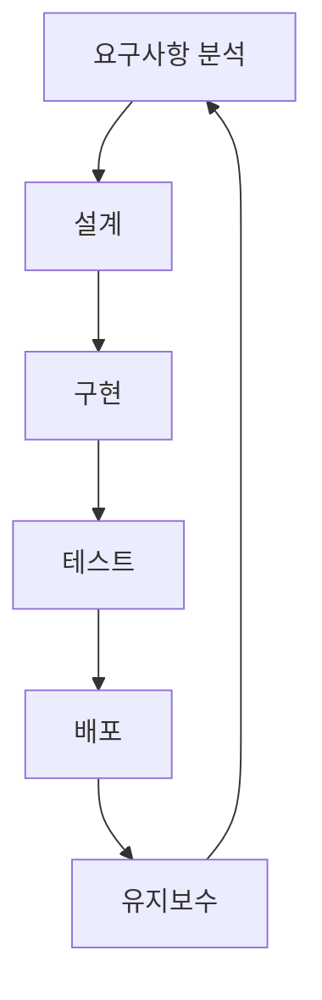

안녕하세요! 오늘은 모든 개발자, 기획자, PM이 반드시 알아야 할 기본 중의 기본, **SDLC(Software Development Life Cycle)**, 즉 '소프트웨어 개발 생명주기'에 대해 이야기해보려 합니다.

우리가 집을 지을 때 설계도 없이 무작정 벽돌부터 쌓지 않듯이, 소프트웨어를 개발할 때도 체계적인 계획과 과정이 필요합니다. SDLC는 바로 그 '체계적인 과정'을 정의한 **하나의 프레임워크**입니다. 간단히 말해, 아이디어가 하나의 완성된 소프트웨어로 탄생하고, 사용자의 손에 전달되어 유지보수되기까지의 전 과정을 단계별로 나눈 것이죠.

---

## SDLC는 왜 중요한가요?

"그냥 잘 만들면 되는 거 아닌가요?"라고 생각할 수도 있습니다. 하지만 SDLC를 따르는 것은 성공적인 프로젝트를 위해 매우 중요합니다.

- **예측 가능성 및 관리 용이성**: 프로젝트의 각 단계에서 무엇을 해야 할지 명확해지므로, **전체 일정을 예측**하고 **리소스를 효율적으로 관리**할 수 있습니다.
- **품질 향상**: 각 단계마다 테스트와 검증을 거치면서 버그를 조기에 발견하고 소프트웨어의 전반적인 품질을 높일 수 있습니다.
- **명확한 의사소통**: 개발자, 기획자, 디자이너 등 모든 팀원이 동일한 프로세스를 이해하고 소통하여 혼선을 줄입니다.
- **비용 및 시간 절감**: 체계적인 접근은 불필요한 재작업을 줄여 결과적으로 프로젝트의 비용과 시간을 절약해 줍니다.

---

## ⚙️ SDLC의 핵심 6단계

SDLC는 여러 모델이 있지만, 거의 모든 모델이 공통적으로 포함하는 핵심적인 단계들이 있습니다. 이 과정은 폭포수처럼 한 방향으로 흐르기도 하고, **애자일**처럼 반복적으로 순환하기도 합니다.

### 1. 요구사항 분석 (Requirements Analysis)

- **무엇을(What) 만드는가?** 를 정의하는 단계입니다.
- 고객, 사용자, 이해관계자로부터 필요한 기능과 비기능적 요구사항(성능, 보안 등)을 수집하고 분석하여 명확하게 문서화합니다.
- 이 단계의 산출물로 [[요구사항 명세서(Software Requirements Specification, SRS)]]가 만들어집니다.

### 2. 설계 (Design)

- **어떻게(How) 만들 것인가?** 를 구체화하는 단계입니다.
- 요구사항을 바탕으로 소프트웨어의 전체적인 구조와 세부 기능을 설계합니다.
- **[[아키텍처 설계(Architecture Design)]]**: 시스템의 전체적인 구조, 데이터베이스 모델, 사용할 기술 스택 등을 결정합니다.
- **[[상세 설계(저수준 설계)]]**: 각 모듈과 컴포넌트가 내부적으로 어떻게 동작할지를 상세하게 설계합니다.

### 3. 구현 (Implementation)

- 설계도를 바탕으로 실제 코드를 작성하는, 개발의 핵심 단계입니다.
- 설계 단계에서 정의한 프로그래밍 언어, 프레임워크 등을 사용하여 소프트웨어를 실체로 만듭니다.

### 4. [[테스트 (Testing)]]

- 구현된 소프트웨어가 요구사항에 맞게 정확히 동작하는지 검증하는 단계입니다.
- 버그나 결함을 찾아내고 수정하여 소프트웨어의 안정성과 품질을 보장합니다.

### 5. 배포 (Deployment)

- 테스트를 통과한 소프트웨어를 실제 사용자가 사용할 수 있도록 서버에 출시하고 전달하는 단계입니다.
- 최근에는 CI/CD 파이프라인을 통해 이 과정을 자동화하여 더 빠르고 안정적으로 배포합니다.

### 6. 유지보수 (Maintenance)

- 배포 이후 발생하는 문제(버그)를 해결하고, 변화하는 비즈니스 환경이나 사용자 요구에 맞춰 기능을 개선하거나 새로운 기능을 추가하는 단계입니다.
- 소프트웨어는 살아있는 유기체와 같아서, 유지보수를 통해 그 생명을 연장해 나갑니다.

---

## 🌊 다양한 SDLC 모델들

모든 프로젝트가 똑같지 않기 때문에, 프로젝트의 성격과 규모, 팀의 특성에 따라 다양한 SDLC 모델이 존재합니다. 어떤 모델을 선택하느냐가 프로젝트의 성패를 좌우하기도 합니다.

- **폭포수 모델(Waterfall Model)**: 가장 전통적인 모델로, 각 단계를 순차적으로 한 번씩만 진행합니다. 요구사항이 명확하고 변경 가능성이 적은 프로젝트에 적합합니다.
- **애자일 모델(Agile Model)**: 계획, 개발, 테스트를 짧은 주기로 반복하며 빠르게 프로토타입을 만들고 지속적으로 개선해 나갑니다. 요구사항이 유동적인 현대의 많은 프로젝트에서 선호됩니다. 대표적인 방법론으로 스크럼(Scrum)과 칸반(Kanban)이 있습니다.
- **[[모델(Model)]]**: 폭포수 모델의 확장된 형태로, 각 개발 단계에 상응하는 테스트 단계를 강조하여 테스트와 검증을 중요하게 다룹니다.
- **나선형 모델(Spiral Model)**: 폭포수 모델의 체계성과 애자일 모델의 반복적인 특징을 결합하고, '위험 분석'을 통해 리스크를 최소화하는 데 중점을 둔 모델입니다. 대규모의 복잡한 프로젝트에 적합합니다.

---

## ✨ 마치며

SDLC는 단순히 따라야 할 규칙이 아니라, 우리가 더 나은 소프트웨어를 더 효율적으로 만들기 위한 **나침반**과 같습니다. 어떤 멋진 기능을 구현하는 것도 중요하지만, 그 기능이 탄생하기까지의 전체적인 여정을 이해하는 것은 개발자로서의 성장에 큰 밑거름이 될 것입니다.

자신이 참여하고 있는 프로젝트는 어떤 SDLC 모델을 따르고 있는지, 현재 어느 단계에 있는지 한번 생각해보는 것은 어떨까요? 성공적인 프로젝트를 위한 첫걸음은 바로 이 SDLC를 이해하는 것에서부터 시작됩니다.

---

### 📚 참고 자료

1. IBM - What is the software development life cycle?: [https://www.ibm.com/topics/sdlc](https://www.ibm.com/topics/sdlc)
2. Atlassian - The 7 phases of the system development life cycle: [https://www.atlassian.com/continuous-delivery/principles/software-development-life-cycle](https://www.google.com/search?q=https://www.atlassian.com/continuous-delivery/principles/software-development-life-cycle)
3. GeeksforGeeks - Software Development Life Cycle (SDLC): [https://www.geeksforgeeks.org/software-development-life-cycle-sdlc/](https://www.geeksforgeeks.org/software-development-life-cycle-sdlc/)