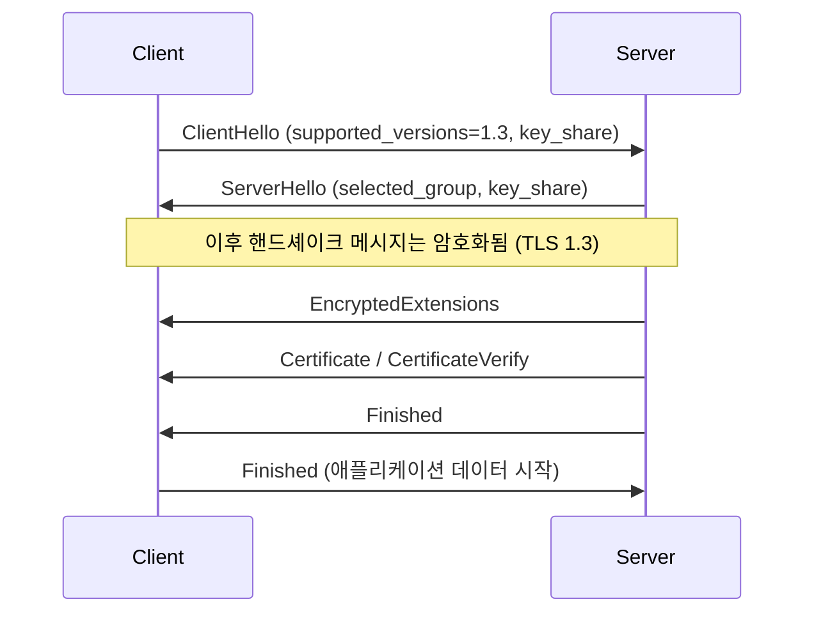

백엔드 개발을 하다 보면 "TLS가 어떻게 실제로 데이터를 못 보게 만드는가?"라는 질문을 한 번쯤 하게 됩니다. 인증서가 있고 암호화를 한다는 말은 익숙하지만, 비밀키와 공개키, 그리고 세션 키가 수학적으로 어떻게 얽혀 돌아가는지까지는 흐릿해지기 쉽습니다. 이 글은 일반적인 백엔드 개발자가 TLS의 "기밀성"이 수학으로 어떻게 구현되는지, 즉 공격자가 네트워크를 엿보더라도 내용물을 읽지 못하게 만드는 과정을 처음부터 끝까지 자연스럽게 이해하도록 돕는 설명입니다. 

## 1) 개념 정의: TLS의 기밀성이란 무엇인가?

기밀성이란 전송 중인 데이터의 내용을 제3자가 읽을 수 없도록 보장하는 성질입니다. TLS는 다음의 두 단계를 결합해 기밀성을 만듭니다. 첫째, 수학적으로 안전한 방법으로 "세션 키"를 비밀리에 공유합니다. 둘째, 공유된 세션 키로 대칭키 암호(AES‑GCM 또는 ChaCha20‑Poly1305 등)를 사용해 실제 애플리케이션 데이터를 암호화합니다. 공격자가 패킷을 모두 수집하더라도 세션 키를 알 수 없기 때문에 원본 데이터를 복원하지 못합니다.

## 2) 등장 배경: 왜 이런 구성이 필요한가?

웹은 중간에 수많은 라우터와 스위치를 거치며 전달됩니다. 수동 공격자는 트래픽을 그대로 복사해서 저장할 수 있고, 능동 공격자는 중간에 끼어들어 통신을 변조할 수도 있습니다. 단순히 서버 공개키로 데이터를 암호화하기만 하면 될 것처럼 보이지만, 매 요청마다 공개키 암호를 직접 쓰면 느리고(계산이 복잡합니다) 과거 세션의 기밀성까지 장기 키 유출에 취약해질 수 있습니다. 그래서 TLS는 "한 번의 수학적 절차로 안전하게 공유한 랜덤한 비밀값"으로부터 빠른 대칭키를 만들어, 이후 모든 데이터는 그 대칭키로 빠르게 암호화하도록 설계되어 있습니다.

## 2-1) TLS 1.3 핵심 변경점 (RFC 8446)

TLS 1.3은 기존 버전과 비교해 기밀성과 성능을 크게 개선하였습니다[^4]. 핵심은 다음과 같습니다.

1. **키 교환 단순화**: 정적 RSA 키 교환과 DH를 제거하고, **(EC)DHE** 또는 **PSK(+ECDHE)**만 사용합니다. 전방향 보안이 기본입니다.
2. **핸드셰이크 암호화 확대**: `ServerHello` 이후의 핸드셰이크 메시지(`EncryptedExtensions`, `Certificate`, `CertificateVerify`, `Finished`)는 모두 암호화됩니다.
3. **HKDF 기반 키 스케줄**: 표준화된 `HKDF-Extract`, `HKDF-Expand-Label`로 early/handshake/application/resumption 시크릿을 체계적으로 파생합니다.
4. **AEAD 전용 암호군**: 레코드 암호화는 AEAD만 허용합니다. 필수 구현은 `TLS_AES_128_GCM_SHA256`이며, `TLS_AES_256_GCM_SHA384`, `TLS_CHACHA20_POLY1305_SHA256` 구현이 권장됩니다.
5. **0-RTT(선행 데이터)**: PSK 재개 시 선택적으로 0-RTT를 지원하지만, 재생 공격 위험 때문에 안전한 범위에서만 사용해야 합니다.
6. **기능 정리**: 재협상(renegotiation) 제거, 압축 제거, 안전하지 않은 레거시 기능 정리로 표면을 줄였습니다.

## 3) 해결 방법: 수학으로 보는 키 합의와 데이터 암호화

핵심 단계는 셋입니다. (a) 키 합의/전달로 비밀 공유, (b) 키 도출 함수로 세션 키 생성, (c) 대칭키 암호로 데이터 암호화입니다. TLS에서는 역사적으로 RSA를 이용한 키 전달과, 현대적으로는 ECDHE를 이용한 키 합의를 많이 사용합니다.

### 3-1. RSA로 보는 기밀성의 수학 (역사적 배경, TLS 1.3에서는 제거)

RSA는 큰 정수의 소인수분해가 어렵다는 사실에 기반한 공개키 암호입니다. 이는 "두 개의 큰 소수를 곱한 수를 다시 소수로 분해하는 것이 어렵다"는 수학적 원리를 이용한 것입니다.

#### RSA 키 생성 과정

서버는 다음과 같은 과정으로 키를 만듭니다:

1. **두 개의 큰 소수 선택**: $p$와 $q$라는 매우 큰 소수를 선택합니다.
2. **합성수 생성**: 이 두 소수를 곱해 $N = pq$를 만듭니다.
3. **오일러 피함수 계산**: $\varphi(N) = (p-1)(q-1)$를 계산합니다.
4. **공개 지수 선택**: $e$라는 작은 수(보통 65537)를 선택합니다. 이는 공개키의 일부가 됩니다.
5. **개인 지수 계산**: $ed \equiv 1 \pmod{\varphi(N)}$을 만족하는 $d$를 계산합니다.

#### 오일러 피함수

오일러 피함수 $\varphi(N)$는 RSA에서 매우 중요한 역할을 합니다:

- **$\varphi(N)$의 의미**: 1부터 $N-1$까지의 정수 중에서 $N$과 서로소인 수의 개수를 나타냅니다.
- **RSA에서의 계산**: $N = pq$일 때, $\varphi(N) = (p-1)(q-1)$로 간단히 계산할 수 있습니다.
- **개인 지수 계산의 핵심**: 개인 지수 $d$를 구하기 위해 $ed \equiv 1 \pmod{\varphi(N)}$을 만족해야 합니다. 이는 $d$가 $e$의 모듈러 역원이어야 함을 의미합니다[^1][^2].
- **암호화/복호화의 수학적 근거**: 오일러 정리에 의해 $m^{\varphi(N)} \equiv 1 \pmod N$이 성립하고, 이를 통해 $m^{ed} \equiv m \pmod N$이 보장됩니다.

즉, 오일러 피함수는 RSA가 수학적으로 올바르게 작동하도록 하는 핵심 요소입니다.

**공개키**는 $(N, e)$이고, **개인키**는 $(N, d)$입니다.

#### 공개 지수와 개인 지수의 역할

- **공개 지수 $e$**: 암호화에 사용되는 지수입니다. 누구나 알 수 있는 공개된 값으로, 데이터를 암호화할 때 사용합니다.
- **개인 지수 $d$**: 복호화에 사용되는 지수입니다. 서버만 알고 있는 비밀 값으로, 암호화된 데이터를 원래대로 되돌릴 때 사용합니다.

#### RSA 암호화/복호화 과정

클라이언트가 공유할 임시 비밀값(프리마스터 시크릿) $m$을 만들었다고 합시다. RSA 키 전달에서는 다음과 같이 작동합니다:

1. **암호화**: 클라이언트는 $c = m^e \bmod N$을 계산해 서버에게 전송합니다.
2. **복호화**: 서버는 $m = c^d \bmod N$을 계산해 원본 비밀값을 복원합니다.

이는 수학적으로 $m^{ed} \equiv m \pmod N$이 성립하기 때문입니다. 공격자가 암호문 $c$와 공개키 $(N, e)$를 모두 보더라도, $m$을 얻으려면 $N$의 소인수분해를 풀어야 하는데, 충분히 큰 $N$에서는 계산적으로 불가능합니다.

실제 구현에서는 안전한 패딩(OAEP)을 써서 수학적 약점을 보완합니다.

#### RSA의 한계와 현대적 대안

현대 TLS에서는 순수 RSA 키 전달보다, 다음에 설명할 ECDHE 기반 키 합의를 기본으로 사용합니다. 이유는 "전방향 보안"을 위해서입니다[^3]. RSA를 사용하면 서버의 개인키가 유출될 경우 과거의 모든 통신이 위험해질 수 있기 때문입니다. 특히 TLS 1.3에서는 RSA 키 교환 자체가 제거되었고, RSA는 인증서 서명 등 "서명" 용도로만 사용됩니다[^4].

### 3-2. ECDHE로 보는 기밀성의 수학

RSA의 한계를 극복하기 위해 현대 TLS에서는 ECDHE(Elliptic Curve Diffie‑Hellman Ephemeral)를 주로 사용합니다. ECDHE는 타원곡선 위의 이산로그 문제(풀이가 극도로 어렵습니다)를 이용해, 통신 양측이 네트워크 위로는 공개 가능한 정보만 주고받으면서 동일한 비밀을 합의하는 방법입니다. TLS 1.3에서는 필요 시 `HelloRetryRequest`로 그룹을 재협상할 수 있습니다.

#### ECDHE 키 교환 과정

1. **공통 곡선과 생성점 설정**: 미리 정해진 타원곡선과 그 위의 생성점 $G$를 사용합니다.
2. **클라이언트의 개인값 생성**: 클라이언트는 임의의 개인 스칼라 $a$를 선택하고, 공개점 $A = aG$를 계산해 서버에게 보냅니다.
3. **서버의 개인값 생성**: 서버도 개인 스칼라 $b$를 선택하고, 공개점 $B = bG$를 계산해 클라이언트에게 보냅니다.
4. **공유 비밀 계산**: 양측 모두 다음의 동일한 공유 비밀점을 계산합니다.

$$S = aB = a(bG) = (ab)G = b(aG) = bA$$

#### ECDHE의 보안성과 장점

공격자는 $G$, $A$, $B$를 모두 알지만, $a$나 $b$를 알아내려면 타원곡선 이산로그 문제를 풀어야 합니다. 이는 현재 기술로는 계산적으로 불가능한 문제입니다.

또한 $a, b$를 매 세션마다 새로 선택하는(ephemeral) 덕분에 설령 훗날 서버의 장기 개인키가 유출되어도 과거의 $a, b$는 복원되지 않아 과거 트래픽의 기밀성이 보존됩니다. 이것이 바로 "전방향 보안"의 핵심입니다.

### 3-3. HKDF로 세션 키를 만든다

RSA나 ECDHE를 통해 공유된 비밀값($m$ 또는 $S$)을 그대로 사용하지는 않습니다. 대신 키 도출 함수인 HKDF(HMAC‑based Key Derivation Function)를 사용해 실제 암호화에 사용할 세션 키를 생성합니다.

#### 왜 키 도출이 필요한가?

1. **키 품질 향상**: 공유된 비밀값을 그대로 사용하면 예측 가능한 패턴이 있을 수 있습니다. HKDF는 이를 고품질의 균일한 랜덤 키로 변환합니다.
2. **용도별 분리**: 클라이언트 송신용, 서버 송신용 등 서로 다른 용도의 키를 생성할 수 있습니다.
3. **길이 조정**: 필요한 길이의 키를 생성할 수 있습니다.

#### HKDF 작동 과정

HKDF는 두 단계로 작동합니다:

1. **추출 단계**: $\mathrm{PRK} = \mathrm{HMAC}_{\mathrm{hash}}(\text{salt}, \text{IKM})$
2. **확장 단계**: $\mathrm{OKM} = \mathrm{HKDF\text{-}Expand}(\mathrm{PRK}, \text{info}, \text{L})$

여기서:
- **IKM**: 입력 키 재료 (RSA에서 복호된 $m$ 또는 ECDHE의 좌표 값)
- **PRK**: 추출 단계 결과 (고품질의 랜덤 키)
- **OKM**: 길이 $L$의 최종 출력 키

이 OKM에서 클라이언트 송신용, 서버 송신용 등 방향별로 다른 세션 키가 생성됩니다.

#### TLS 1.3 키 스케줄 한눈에 보기

표기만 간단히 소개하면 다음과 같습니다(세부 라벨은 RFC 8446 정의를 따릅니다[^4]).

- **Early Secret**: `HKDF-Extract(0, PSK)` → 0-RTT와 관련된 파생에 사용합니다.
- **Handshake Secret**: `HKDF-Extract(DHE, Early Secret)` → `client/server_handshake_traffic_secret` 파생 후 핸드셰이크 암호화에 사용합니다.
- **Master Secret**: `HKDF-Extract(0, Handshake Secret)` → `client/server_application_traffic_secret_0`로 확장되어 애플리케이션 데이터 암호화에 사용합니다.
- **Resumption Master Secret**: 세션 재개(PSK)용 비밀을 파생합니다.

라벨 부착 확장은 `HKDF-Expand-Label(Secret, Label, Transcript-Hash, L)` 형태로 수행되며, 트랜스크립트 해시가 핸드셰이크 전 과정을 바인딩해 중간 변조를 방지합니다.

### 3-4. 대칭키 암호로 실제 데이터를 암호화한다

이제 HKDF를 통해 생성된 세션 키를 사용해 실제 애플리케이션 데이터를 암호화합니다. 이 단계에서는 공개키 암호보다 훨씬 빠른 대칭키 암호를 사용합니다.

#### AES-GCM 암호화 방식

널리 사용되는 AES‑GCM은 다음과 같은 특징을 가집니다:

1. **블록 암호의 스트림화**: AES 블록 암호를 카운터 모드로 사용해 스트림처럼 동작시킵니다.
2. **인증과 암호화의 결합**: 데이터를 암호화하면서 동시에 인증 태그를 생성해 변조를 감지할 수 있습니다.
3. **고속 처리**: 하드웨어 가속을 통해 매우 빠르게 처리됩니다.

#### 논스(Nonce)의 중요성

기밀성 관점에서 가장 중요한 것은 "같은 키로 같은 논스(nonce)를 두 번 사용하지 않는 것"입니다. 논스는 암호화할 때마다 사용하는 고유한 값으로, 같은 평문이라도 다른 암호문을 생성하게 만듭니다.

GCM에서 논스가 겹치면 원본 데이터가 새어 나올 수 있으므로, TLS 스택은 핸드셰이크에서 난수를 주고받고, 각 레코드에 논스를 안전하게 배정해 이 위험을 피합니다.

TLS 1.3에서 AEAD 레코드 논스는 "고정 IV"와 64비트 시퀀스 번호를 XOR하여 구성합니다(필요 시 왼쪽 0-패딩). 이 방식은 키와 별개로 각 레코드마다 고유한 논스를 보장합니다[^4].

### (선택) 핸드셰이크 개요 시각화

개념 흐름이 어렵게 느껴진다면, 한 번만 시각화로 정리해 보겠습니다.

## 4) 핵심 특징: 왜 이 구성이 강한가?

이 구성의 강점은 계산적으로 풀 수 없는 문제에 기반한다는 점입니다. RSA는 큰 정수 소인수분해의 어려움에, ECDHE는 타원곡선 이산로그의 어려움에 기반합니다. 또한 세션 키는 매 연결마다 새로 만들어지므로 한 번의 키 유출이 전체 과거 통신을 깨뜨리지 않습니다. 마지막으로, 대칭키 암호는 하드웨어 가속과 함께 매우 빠르게 동작해 실무 트래픽에도 부담이 적습니다.

## 5) 실제 구현과 활용: 백엔드 개발자의 체크리스트

실무에서는 수학 그 자체보다 "스택이 올바른 선택을 하도록" 설정하는 일이 중요합니다. 서버는 ECDHE 기반 암호군과 AES‑GCM 또는 ChaCha20‑Poly1305를 우선 선택하도록 구성하고, RSA 키 전달은 비활성화하는 것이 일반적입니다. 인증서는 신뢰할 수 있는 CA에서 발급받고, 클라이언트는 인증서 검증(체인, 만료, OCSP/CRL)을 정확히 수행해야 합니다. 프레임워크와 라이브러리는 최신 버전을 사용하여 안전한 기본값을 확보하는 것이 좋습니다.

- **프로토콜/암호군 권고**: TLS 1.3 활성화, 우선순위는 `TLS_AES_128_GCM_SHA256` → `TLS_AES_256_GCM_SHA384` → `TLS_CHACHA20_POLY1305_SHA256` 순으로 구성하는 것을 권장합니다[^4].
- **PSK/재개**: 세션 재개(PSK)를 사용할 경우, 키 수명과 저장소 관리 정책을 명확히 하십시오.
- **레거시 비활성화**: 정적 RSA 키 교환, RC4/3DES 등 구식 암호군, 재협상은 비활성화합니다.

## 6) 주의사항 및 모범 사례

첫째, 난수의 품질이 기밀성의 바탕입니다. 개인 스칼라나 논스는 반드시 암호학적 난수 생성기에서 생성해야 합니다. 둘째, 동일한 키로 GCM 논스를 재사용하지 않도록 스택을 최신으로 유지하고 재전송 시퀀스를 주의깊게 다뤄야 합니다. 셋째, 가능한 한 ECDHE를 사용해 전방향 보안을 확보하십시오. 넷째, RSA를 사용할 일이 있다면 안전한 패딩(OAEP)을 사용하고 충분한 키 길이를 유지해야 합니다. 다섯째, **0-RTT 데이터는 재생 가능**하므로, 인증·결제·상태 변경과 같이 비멱등 작업에는 사용하지 마시고, 캐시 조회 등 멱등 요청에 한정하는 것이 안전합니다[^4]. 마지막으로, 라이브러리 기본 설정을 신뢰하되, 배포 전 강제 암호군, 최소 프로토콜 버전, 인증서 검증 로직을 점검하는 습관이 중요합니다.

## 마무리

TLS의 기밀성은 마법이 아니라 수학입니다. 공개키 수학으로 세션 키를 안전하게 공유하고, 키 도출 함수로 균일한 비밀키를 만들어, 대칭키 암호로 실제 데이터를 숨깁니다. 이 세 단계를 이해하면, 네트워크 어딘가에서 패킷을 모두 복사해 가도 왜 내용을 읽을 수 없는지 자연스럽게 납득할 수 있습니다. 이제 로그를 보며 핸드셰이크가 왜 실패했는지, 어떤 암호군이 협상되었는지, 그리고 설정을 어떻게 바꿔야 더 안전해지는지를 훨씬 수월하게 판단하실 수 있을 것입니다.

---

[^1]: **수학 기호 설명**: $=$와 $\equiv$의 차이
    - **$=$ (등호)**: 완전히 같은 값을 의미합니다. 예: $N = pq$는 $N$이 정확히 $p$와 $q$의 곱과 같다는 뜻입니다.
    - **$\equiv$ (합동 기호)**: 모듈러 연산에서 나머지가 같다는 의미입니다. 예: $ed \equiv 1 \pmod{\varphi(N)}$는 $ed$를 $\varphi(N)$으로 나눈 나머지가 1과 같다는 뜻입니다.
    
    **구체적인 예시**:
    - $7 \equiv 2 \pmod{5}$: 7을 5로 나눈 나머지는 2와 같습니다 (7 = 5×1 + 2)
    - $ed \equiv 1 \pmod{\varphi(N)}$: $ed$를 $\varphi(N)$으로 나눈 나머지는 1과 같습니다

[^2]: **$1 \pmod{\varphi(N)}$의 의미**: 
    - 이는 "$\varphi(N)$으로 나눈 나머지가 1"이라는 뜻입니다.
    - 즉, $ed$를 $\varphi(N)$으로 나눈 나머지가 1이어야 한다는 의미입니다.
    - 수학적으로 표현하면: $ed = k \cdot \varphi(N) + 1$ (여기서 $k$는 정수)
    
    **왜 1이어야 하는가?**
    - 오일러 정리에 의해 $m^{\varphi(N)} \equiv 1 \pmod N$이 성립합니다.
    - 따라서 $m^{ed} = m^{k \cdot \varphi(N) + 1} = (m^{\varphi(N)})^k \cdot m \equiv 1^k \cdot m \equiv m \pmod N$
    - 이렇게 해야 암호화한 것을 다시 복호화할 수 있습니다.

[^3]: **전방향 보안(Forward Secrecy)**: 
    - 현재의 통신이 미래에 키가 유출되더라도 안전하게 보호되는 성질입니다.
    - **RSA의 문제점**: 서버의 장기 개인키가 유출되면, 공격자가 과거에 저장해둔 암호화된 세션 키를 모두 복호화할 수 있습니다.
    - **ECDHE의 장점**: 매 세션마다 새로운 임시 키($a, b$)를 사용하므로, 장기 키가 유출되어도 과거 세션의 키는 복원할 수 없습니다.
    - **실제 의미**: 오늘의 통신이 10년 후에 키가 유출되어도 여전히 안전하다는 보장입니다.
[^4]: **RFC 8446 (TLS 1.3)**: 표준 전문은 IETF Datatracker에서 확인할 수 있습니다. `https://datatracker.ietf.org/doc/html/rfc8446`