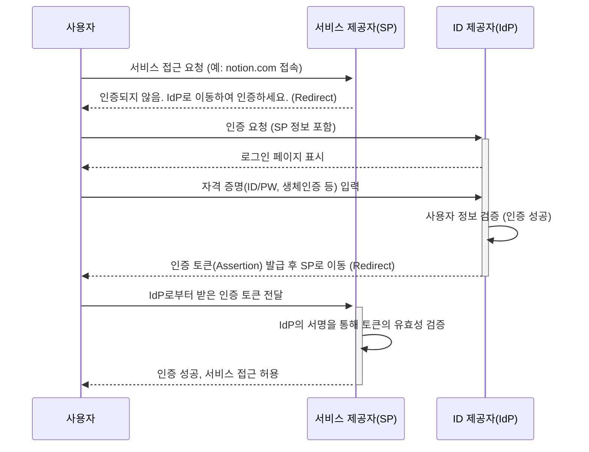

**SSO(Single Sign-On)** 는 단 한 번의 로그인으로 여러 개의 서로 다른 애플리케이션이나 서비스를 추가적인 인증 절차 없이 이용할 수 있게 해주는 **인증 통합 기술**입니다. 사용자는 하나의 계정 정보만 기억하면 되므로 편의성이 극대화되고, 기업은 중앙에서 사용자의 접근을 통제할 수 있어 보안이 강화됩니다.

오늘날 수많은 웹과 앱 서비스를 사용하는 환경에서 SSO는 더 이상 선택이 아닌 필수가 되어가고 있습니다. SSO의 동작 원리를 정확히 이해하기 위해서는 먼저 [[Authentication|인증]]과 [[Authorization|인가]]의 개념을 명확히 구분하는 것이 중요합니다.

---

## SSO는 왜 필요할까요?

SSO가 등장하기 전, 우리는 모든 서비스마다 별개의 ID와 비밀번호를 생성하고 관리해야 했습니다. 이로 인해 여러 문제가 발생했습니다.

1. **비밀번호 피로(Password Fatigue)**: 사용자는 수많은 계정 정보를 기억하는 데 어려움을 느끼고, 이는 서비스 이탈로 이어지기도 합니다.
    
2. **보안 취약성 증가**: 관리가 어려워지자 사용자들은 여러 서비스에 동일하거나 **예측하기 쉬운 비밀번호를 사용하는 경향**이 생겼습니다. 이는 하나의 계정이 탈취되면 다른 서비스까지 연쇄적으로 위험해지는 결과를 초래합니다.
    
3. **관리 비용 증가**: 기업의 IT 부서는 직원들의 빈번한 비밀번호 초기화 요청을 처리하는 데 많은 시간과 비용을 소모해야 했습니다.
    

SSO는 이러한 문제들을 **중앙화된 인증 시스템**을 통해 해결합니다. 사용자의 신원을 한 곳에서만 확인하고, 그 신뢰를 바탕으로 여러 서비스에 대한 접근을 허용하는 방식입니다.

---

## SSO의 핵심 구성 요소와 동작 원리

SSO 시스템은 크게 세 가지 주요 행위자로 구성됩니다.

- **사용자(User)**: 서비스에 접근하려는 주체입니다.
    
- **ID 제공자(Identity Provider, IdP)**: 사용자의 신원을 확인하고 인증을 책임지는 시스템입니다. (예: Google, Okta, 사내 인증 서버)
    
- **서비스 제공자(Service Provider, SP)**: 사용자가 이용하려는 애플리케이션이나 서비스입니다. (예: Google Workspace, Notion, Salesforce)
    

SSO의 기본적인 인증 흐름은 다음과 같습니다. 마치 놀이공원에서 자유이용권 팔찌를 한 번 착용한 후 모든 놀이기구를 별도의 표 검사 없이 이용하는 것과 비슷합니다.



이 과정의 핵심은 **SP가 사용자의 비밀번호를 직접 다루지 않는다**는 점입니다. SP는 자신이 신뢰하는 IdP가 발급한 **인증 토큰(디지털 서명이 포함된 신분증)**의 유효성만 검증하여 로그인을 처리합니다. 이로 인해 민감한 사용자 정보가 여러 서비스에 분산되지 않아 보안이 강화됩니다.

---

## 대표적인 SSO 프로토콜

SSO를 구현하기 위해 IdP와 SP는 서로 약속된 규칙, 즉 프로토콜을 따라 통신해야 합니다. 대표적인 프로토콜은 다음과 같습니다.

- **[[SAML(Security Assertion Markup Language)]]**: XML 기반의 표준으로, 주로 기업 환경의 웹 기반 SSO에서 널리 사용됩니다. 안정적이고 강력한 기능을 제공하지만, 구조가 다소 복잡하다는 특징이 있습니다.
    
- **[[OAuth 2.0]]**: 엄밀히 말해 인증(Authentication) 프로토콜이 아닌 **인가(Authorization) 프레임워크**입니다. 사용자를 대신하여 특정 서비스(SP)가 다른 서비스(IdP)의 리소스에 접근할 수 있도록 권한을 위임하는 데 사용됩니다. "Google 계정으로 로그인하기" 기능이 대표적인 예시이며, 실제로는 인증 목적으로도 널리 활용됩니다.
    
- **[[OIDC(OpenID Connect)]]**: OAuth 2.0 위에 구축된 **인증 계층**입니다. OAuth 2.0이 제공하는 접근 토큰(Access Token) 외에, 사용자의 신원 정보가 담긴 **ID 토큰(ID Token)**을 추가로 제공하여 인증 과정을 표준화했습니다. JSON/REST 기반으로 동작하여 현대적인 웹 및 모바일 환경에 적합하고 구현이 비교적 간편해 현재 가장 널리 사용되는 프로토콜입니다.

---

## 스프링 시큐리티를 이용한 SSO 구현 예시

Spring Boot 환경에서는 `spring-boot-starter-oauth2-client` 의존성을 추가하는 것만으로 매우 간단하게 OIDC 기반의 SSO를 구현할 수 있습니다. 다음은 Google 로그인을 연동하는 예시입니다.

### 1. 의존성 추가 (`build.gradle.kts`)

먼저, 프로젝트에 OAuth 2.0 클라이언트 라이브러리를 추가합니다.

```kotlin
dependencies {
    implementation("org.springframework.boot:spring-boot-starter-oauth2-client")
    implementation("org.springframework.boot:spring-boot-starter-security")
    implementation("org.springframework.boot:spring-boot-starter-web")
}
```

### 2. 설정 파일 작성 (`application.yml`)

`application.yml` 파일에 Google Cloud Platform에서 발급받은 클라이언트 ID와 시크릿 키 정보를 등록합니다.

```yaml
spring:
  security:
    oauth2:
      client:
        registration:
          google:
            client-id: YOUR_GOOGLE_CLIENT_ID
            client-secret: YOUR_GOOGLE_CLIENT_SECRET
            scope:
              - openid
              - profile
              - email
```

`scope`에 `openid`가 포함된 것이 OIDC 프로토콜을 사용하겠다는 의미입니다.

### 3. 보안 설정 클래스 작성

마지막으로, `SecurityConfig` 클래스를 작성하여 OAuth 2.0 로그인을 활성화합니다.

```java
import org.springframework.context.annotation.Bean;
import org.springframework.context.annotation.Configuration;
import org.springframework.security.config.annotation.web.builders.HttpSecurity;
import org.springframework.security.config.annotation.web.configuration.EnableWebSecurity;
import org.springframework.security.web.SecurityFilterChain;

import static org.springframework.security.config.Customizer.withDefaults;

@Configuration
@EnableWebSecurity
public class SecurityConfig {

    @Bean
    public SecurityFilterChain securityFilterChain(HttpSecurity http) throws Exception {
        http
            .authorizeHttpRequests(authorize -> authorize
                .anyRequest().authenticated() // 모든 요청에 대해 인증을 요구
            )
            .oauth2Login(withDefaults()); // OAuth 2.0 로그인 기능 활성화, 기본 설정 사용
        return http.build();
    }
}
```

위와 같이 설정하면 애플리케이션 실행 시 별도의 로그인 페이지 구현 없이 스프링 시큐리티가 제공하는 기본 로그인 선택 페이지(`/oauth2/authorization/google` 링크 포함)로 리디렉션됩니다.

---

## SSO의 장점과 단점

SSO는 강력한 솔루션이지만 모든 기술에는 장단점이 공존합니다.

### 장점

- **사용자 경험 향상**: 여러 개의 비밀번호를 기억할 필요가 없어 서비스 접근성이 크게 향상됩니다.
    
- **보안 강화**: 인증 지점이 중앙화되므로 [[MFA(Multi-Factor Authentication)]]와 같은 강화된 인증 정책을 일관되게 적용하기 쉽고, 사용자 접근 기록을 한 곳에서 관리할 수 있습니다.
    
- **관리 효율성 증대**: IT 부서는 개별 시스템의 계정을 관리하는 대신 중앙 IdP만 관리하면 되므로 운영 부담이 줄어듭니다.
    

### 단점

- **단일 장애점(Single Point of Failure)**: 만약 IdP 시스템에 장애가 발생하면, 해당 IdP에 의존하는 모든 서비스에 로그인이 불가능해집니다.
    
- **단일 공격점(Single Point of Compromise)**: 공격자가 IdP 계정(마스터 키)을 탈취할 경우, 연결된 모든 서비스의 접근 권한을 획득하게 됩니다. 따라서 IdP 자체의 보안을 매우 높은 수준으로 유지해야 합니다.
    
- **초기 구축의 복잡성**: 기존 시스템에 SSO를 도입하고 연동하는 과정은 프로토콜에 대한 깊은 이해가 필요하며 복잡할 수 있습니다.
    

---

## 결론

SSO는 분산된 디지털 환경에서 **편의성**과 **보안**이라는 두 마리 토끼를 잡기 위한 효과적인 해결책입니다. 이는 단순히 로그인을 한 번만 하는 기술을 넘어, 사용자의 디지털 신원을 안전하게 관리하고 서비스 간의 신뢰를 구축하는 핵심적인 인프라입니다.

SSO를 성공적으로 도입하기 위해서는 그 동작 원리와 표준 프로토콜을 명확히 이해하고, 중앙화된 인증 시스템이 갖는 장점과 잠재적인 위험을 모두 고려하여 신중하게 설계하고 운영해야 합니다. 앞으로는 [[패스워드리스(Passwordless)]]나 [[제로 트러스트 아키텍처(Zero Trust Architecture)]]와 같은 새로운 패러다임과 결합하여 더욱 발전해 나갈 것으로 기대됩니다.

---

## 참고 자료

- [SAML V2.0 Technical Overview](https://www.google.com/search?q=http://docs.oasis-open.org/security/saml/v2.0/saml-tech-overview-2.0-os.pdf)
    
- [The OAuth 2.0 Authorization Framework (RFC 6749)](https://tools.ietf.org/html/rfc6749)
    
- [OpenID Connect Core 1.0 specification](https://openid.net/specs/openid-connect-core-1_0.html)
    
- [Spring Security Documentation - OAuth 2.0 Login](https://docs.spring.io/spring-security/reference/servlet/oauth2/login/index.html)