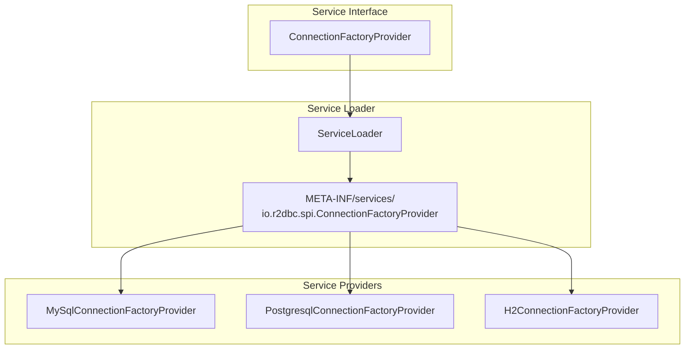
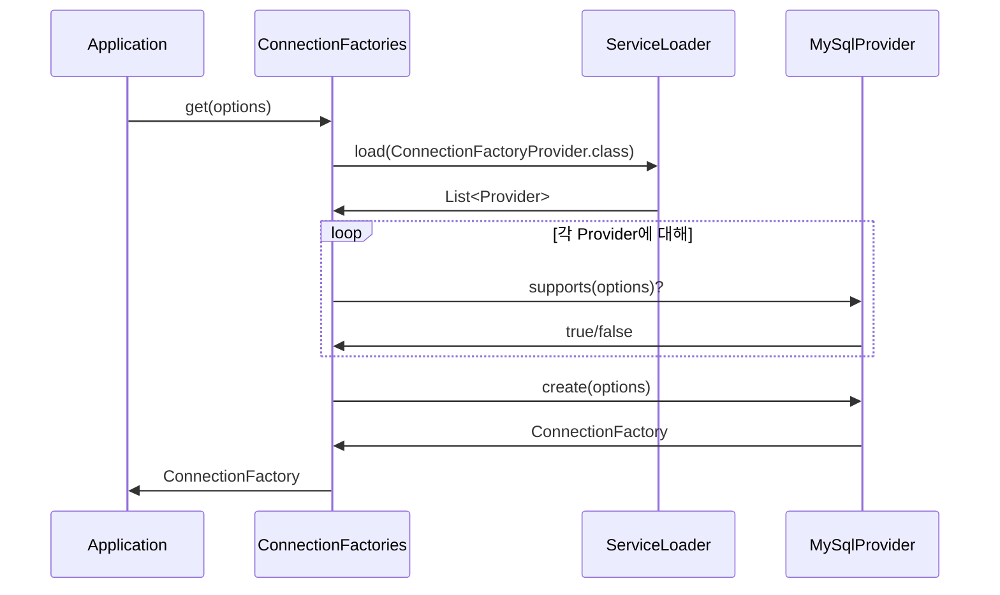

---
tags:
  - java
  - design-pattern
---

Service Provider Interface(SPI)는 확장 가능한 애플리케이션을 만들기 위한 자바의 표준 메커니즘이다. 인터페이스를 정의하고, 구현체를 런타임에 발견하여 로드하는 패턴으로, R2DBC와 JDBC 모두 이 패턴을 사용한다.

---

## 핵심 개념

SPI는 세 가지 구성요소로 이루어진다.

1. **서비스 인터페이스**: 기능을 정의하는 인터페이스
2. **서비스 프로바이더**: 인터페이스를 구현한 클래스
3. **서비스 로더**: 구현체를 발견하고 로드하는 메커니즘



## ServiceLoader의 동작

`java.util.ServiceLoader`가 이 패턴의 핵심이다. 클래스패스에서 `META-INF/services/` 디렉토리를 스캔하여 구현체를 발견한다.

### 서비스 정의 파일

r2dbc-mysql 드라이버의 경우, 다음 파일이 존재한다.

`META-INF/services/io.r2dbc.spi.ConnectionFactoryProvider`:
```
io.asyncer.r2dbc.mysql.MySqlConnectionFactoryProvider
```

### 서비스 로딩

```java
ServiceLoader<ConnectionFactoryProvider> loader =
    ServiceLoader.load(ConnectionFactoryProvider.class);

for (ConnectionFactoryProvider provider : loader) {
    if (provider.supports(options)) {
        return provider.create(options);
    }
}
```

## R2DBC에서의 SPI 구조

R2DBC SPI는 다음 인터페이스들로 구성된다.

### ConnectionFactoryProvider

드라이버 발견의 진입점이다.

```java
public interface ConnectionFactoryProvider {
    // 이 드라이버가 주어진 옵션을 지원하는지
    boolean supports(ConnectionFactoryOptions options);

    // ConnectionFactory 생성
    ConnectionFactory create(ConnectionFactoryOptions options);

    // 드라이버 식별자 (예: "mysql", "postgresql")
    String getDriver();
}
```

### ConnectionFactories 유틸리티

R2DBC는 `ConnectionFactories` 클래스를 통해 드라이버 발견을 추상화한다.

```java
// URL 방식
ConnectionFactory factory = ConnectionFactories.get(
    "r2dbc:mysql://localhost:3306/mydb"
);

// 옵션 방식
ConnectionFactory factory = ConnectionFactories.get(
    ConnectionFactoryOptions.builder()
        .option(DRIVER, "mysql")
        .option(HOST, "localhost")
        .build()
);
```

내부적으로 `ConnectionFactories.get()`은 다음과 같이 동작한다.



## SPI의 장점

### 느슨한 결합

애플리케이션 코드는 구체적인 드라이버 클래스를 알 필요가 없다.

```java
// 드라이버 클래스 직접 참조 없음
ConnectionFactory factory = ConnectionFactories.get("r2dbc:mysql://...");
```

### 런타임 확장

새로운 드라이버를 클래스패스에 추가하기만 하면 자동으로 사용 가능하다. 코드 변경이 필요 없다.

### 테스트 용이성

테스트용 Mock 드라이버를 쉽게 주입할 수 있다.

## JDBC와의 비교

JDBC도 같은 SPI 패턴을 사용한다.

| 구성요소 | JDBC | R2DBC |
|---------|------|-------|
| 서비스 인터페이스 | `java.sql.Driver` | `io.r2dbc.spi.ConnectionFactoryProvider` |
| 서비스 파일 | `META-INF/services/java.sql.Driver` | `META-INF/services/io.r2dbc.spi.ConnectionFactoryProvider` |
| 팩토리 클래스 | `DriverManager` | `ConnectionFactories` |

## 커스텀 프로바이더 구현

자체 R2DBC 드라이버를 만들려면 다음을 구현한다.

```java
public class CustomConnectionFactoryProvider
    implements ConnectionFactoryProvider {

    @Override
    public boolean supports(ConnectionFactoryOptions options) {
        return options.getValue(DRIVER).equals("custom");
    }

    @Override
    public ConnectionFactory create(ConnectionFactoryOptions options) {
        return new CustomConnectionFactory(options);
    }

    @Override
    public String getDriver() {
        return "custom";
    }
}
```

그리고 서비스 파일을 생성한다.

`META-INF/services/io.r2dbc.spi.ConnectionFactoryProvider`:
```
com.example.CustomConnectionFactoryProvider
```

## References

- [Java ServiceLoader 문서](https://docs.oracle.com/javase/8/docs/api/java/util/ServiceLoader.html)
- [[R2DBC 동작 원리]]
- [[ConnectionFactory]]
