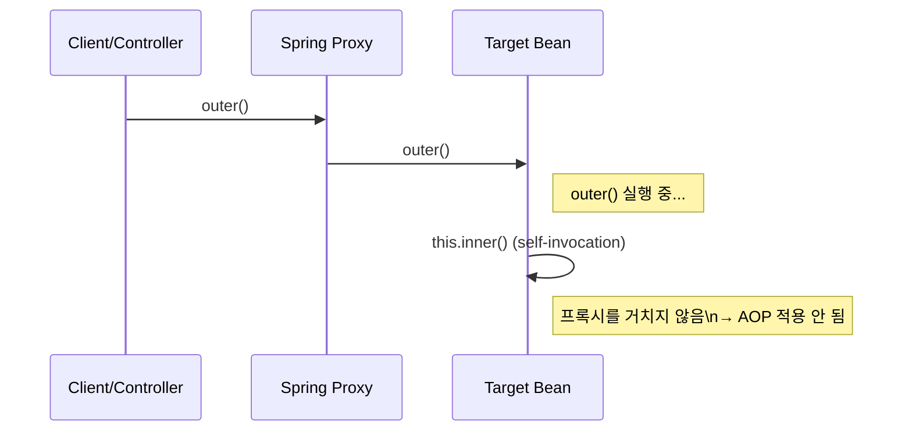

Spring에서 `@Transactional`, `@Async`, `@Cacheable` 같은 기능은 대부분 **프록시 기반 AOP**로 동작합니다. 이때 같은 빈(같은 클래스) 내부에서 메서드를 호출하면 프록시를 거치지 않아, 기대한 동작이 적용되지 않을 수 있습니다. 이 현상을 **self-invocation(자기 호출)** 문제라고 합니다.

## self-invocation(자기 호출)

같은 스프링 빈(같은 클래스) 안에서 `this.someMethod()`(또는 `someMethod()`)처럼 **내부 메서드를 내부에서 호출**하는 상황을 의미합니다.

문제는 호출 대상 메서드에 `@Transactional` 같은 AOP 기반 어노테이션이 붙어 있을 때 발생합니다. 외부에서 호출될 때는 프록시가 개입하지만, 내부 호출은 프록시를 거치지 않기 때문에 트랜잭션/비동기/캐시 등의 부가 로직이 실행되지 않을 수 있습니다.

## Proxy 기반 AOP의 한계

Spring AOP는 기본적으로 **프록시(Proxy) 기반**입니다. 클라이언트는 실제 객체(target)가 아니라 프록시를 호출하고, 프록시는 메서드 실행 전후로 트랜잭션 시작/커밋, 비동기 실행, 캐시 처리 같은 로직을 적용합니다.



동일 클래스 내부 호출은 호출 경로가 `Client → Proxy → Target`이 아니라 `Target → Target`으로 이어집니다. 이 과정에서는 프록시가 개입하지 못하므로 AOP가 적용되지 않습니다.

프록시 개념은 [[프록시 패턴 (Proxy Pattern)]]도 참고할 만합니다.

## `@Transactional` 미적용

예를 들어, 아래 코드는 `save()`가 트랜잭션 안에서 실행될 것으로 기대할 수 있습니다.

```java
@Service
public class PaymentService {

    public void pay() {
        // 결제 처리...
        save(); // 같은 클래스 내부 호출 (self-invocation)
    }

    @Transactional
    public void save() {
        // DB 저장 로직...
    }
}
```

하지만 `pay()`가 `save()`를 직접 호출하면 `save()`는 프록시를 거치지 않습니다. 이 경우 트랜잭션이 시작되지 않거나, 다음처럼 특정 옵션만 적용되지 않는 형태로 나타날 수 있습니다.

- `@Transactional(propagation = REQUIRES_NEW)`가 동작하지 않아 “새 트랜잭션”이 열리지 않음
- `@Transactional(readOnly = true)` 같은 설정이 기대대로 적용되지 않음

트랜잭션 자체 개념은 [[트랜잭션(Transaction)]] 문서가 배경 지식으로 도움이 됩니다.

## 자주 영향을 받는 어노테이션

프록시 기반으로 동작하는 기능들은 대체로 같은 방식으로 영향을 받습니다.

- `@Transactional`
- `@Async` (자기 호출이면 비동기로 실행되지 않음: [[Spring Async]]에서도 “자체 호출 불가능”으로 언급되는 케이스)
- `@Cacheable`, `@CachePut`, `@CacheEvict`
- `@Retryable`(spring-retry), `@CircuitBreaker`(resilience4j의 스프링 어노테이션) 등 AOP 기반 기능 전반

## 해결 방법 (권장 순서)

### 1) 다른 빈으로 분리해서 호출하기

가장 권장되는 방식은 트랜잭션/비동기/캐시가 필요한 메서드를 **다른 빈으로 분리**하여 호출 경계를 만드는 것입니다. 이렇게 하면 호출이 항상 프록시를 경유합니다.

```java
@Service
public class PaymentService {
    private final PaymentWriter paymentWriter;

    public PaymentService(PaymentWriter paymentWriter) {
        this.paymentWriter = paymentWriter;
    }

    public void pay() {
        // 결제 처리...
        paymentWriter.save();
    }
}

@Service
public class PaymentWriter {
    @Transactional
    public void save() {
        // DB 저장 로직...
    }
}
```

실무에서는 `*TxService`, `*Facade`, `*Worker` 같은 이름을 사용하기도 합니다. 중요한 것은 “프록시를 타는 경계”를 코드 구조로 분리하는 것입니다.

### 2) “자기 자신”의 프록시를 주입받아 호출하기

리팩토링이 어렵고 단기 대응이 필요하다면, 자기 자신의 프록시를 주입받아 프록시를 통해 호출하도록 우회할 수 있습니다.

```java
@Service
public class PaymentService {
    private final ObjectProvider<PaymentService> selfProvider;

    public PaymentService(ObjectProvider<PaymentService> selfProvider) {
        this.selfProvider = selfProvider;
    }

    public void pay() {
        selfProvider.getObject().save(); // 프록시 경유
    }

    @Transactional
    public void save() {}
}
```

다만 이 방식은 클래스 책임이 커지는 방향으로 이어질 수 있어, 가능하면 1번(빈 분리)을 우선 고려하는 편이 안전합니다.

### 3) `AopContext.currentProxy()` 사용

`AopContext.currentProxy()`를 사용하면 내부 호출을 프록시 경유로 강제할 수 있지만, `exposeProxy=true` 설정이 필요하고 코드가 Spring AOP에 강하게 결합됩니다. 레거시 유지보수 등 특수한 상황이 아니라면 우선순위를 낮게 두는 편이 좋습니다.

### 4) AspectJ 위빙(컴파일/로드 타임)

프록시 대신 바이트코드 위빙(AspectJ)을 사용하면 self-invocation에도 어드바이스를 적용할 수 있습니다. 다만 빌드/운영 복잡도가 증가하므로 팀/프로젝트 차원의 결정이 필요합니다.

## 결론

self-invocation은 “프록시 기반 AOP”라는 구현 방식에서 자연스럽게 발생하는 제약입니다. 같은 빈 내부 호출은 프록시를 거치지 않기 때문에 `@Transactional`, `@Async`, `@Cacheable` 같은 기능이 적용되지 않을 수 있습니다. 가장 단순한 해결은 AOP를 적용할 메서드를 다른 빈으로 분리해 호출 경계를 만드는 것입니다.

## 참고 자료

- Spring Framework Reference - AOP Proxying (https://docs.spring.io/spring-framework/reference/core/aop/proxying.html)
- Spring Framework Reference - Declarative Transaction Management (https://docs.spring.io/spring-framework/reference/data-access/transaction/declarative.html)
- Spring Framework Reference - Cache Abstraction (https://docs.spring.io/spring-framework/reference/integration/cache.html)
- Spring Framework Reference - Task Execution and Scheduling (https://docs.spring.io/spring-framework/reference/integration/scheduling.html)
- Spring Framework Javadoc - `AopContext` (https://docs.spring.io/spring-framework/docs/current/javadoc-api/org/springframework/aop/framework/AopContext.html)
- Spring Framework Javadoc - `@EnableAspectJAutoProxy` (https://docs.spring.io/spring-framework/docs/current/javadoc-api/org/springframework/context/annotation/EnableAspectJAutoProxy.html)
