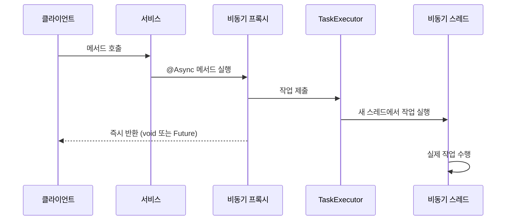

Spring Framework에서 제공하는 비동기 처리 기능인 Async는 시간이 오래 걸리는 작업을 별도의 스레드에서 실행하여 애플리케이션의 응답성과 성능을 향상시키는 중요한 기능입니다. Spring Async의 동작 원리를 이해하면 더 효율적인 애플리케이션을 설계하고 구현할 수 있습니다.

## Spring Async란?

Spring Async는 Spring Framework에서 제공하는 비동기 처리 기능으로, 메서드 호출을 비동기적으로 실행할 수 있게 해주는 기능입니다. 이 기능을 사용하면 시간이 오래 걸리는 작업(예: 외부 API 호출, 이메일 전송, 파일 처리 등)을 별도의 스레드에서 실행하여 호출자 스레드가 차단되지 않도록 할 수 있습니다.

비동기 처리에 대한 자세한 개념은 [[비동기 프로그래밍]]을 참고해주세요.

## Spring Async의 핵심 컴포넌트

Spring Async의 동작 원리를 이해하기 위해서는 다음과 같은 핵심 컴포넌트들을 알아야 합니다:

1. **@EnableAsync**: 비동기 처리 기능을 활성화하는 어노테이션
2. **@Async**: 비동기적으로 실행할 메서드에 붙이는 어노테이션
3. **TaskExecutor**: 비동기 작업을 실행하는 실행자 인터페이스
4. **AsyncTaskExecutor**: TaskExecutor의 확장으로, 비동기 작업을 위한 추가 기능 제공

## Spring Async 내부 동작 원리

Spring Async의 동작 원리를 시각화하면 다음과 같습니다:



Spring Async는 [[AOP(Aspect-Oriented Programming)]]를 기반으로 동작합니다. @Async가 적용된 메서드를 호출하면 다음과 같은 과정이 발생합니다:

1. Spring은 @Async가 지정된 클래스나 메서드에 대해 [[프록시(Proxy)]]를 생성합니다.
2. 클라이언트가 @Async 메서드를 호출하면, 실제로는 프록시 객체의 메서드가 호출됩니다.
3. 프록시는 원래 메서드 호출을 가로채서 TaskExecutor에게 작업을 위임합니다.
4. TaskExecutor는 설정된 스레드 풀에서 스레드를 할당하여 해당 작업을 비동기적으로 실행합니다.
5. 프록시는 메서드의 반환 유형에 따라 즉시 void를 반환하거나 Future 객체를 반환합니다.

이러한 과정은 모두 스프링 컨테이너가 관리하며, 개발자는 비동기 처리 로직에만 집중할 수 있습니다.

## @Async 어노테이션 활성화

Spring에서 비동기 기능을 사용하기 위해서는 먼저 @EnableAsync 어노테이션을 통해 비동기 처리를 활성화해야 합니다:

```java
@Configuration
@EnableAsync
public class AsyncConfig {
    
    @Bean
    public Executor taskExecutor() {
        ThreadPoolTaskExecutor executor = new ThreadPoolTaskExecutor();
        executor.setCorePoolSize(5);
        executor.setMaxPoolSize(10);
        executor.setQueueCapacity(25);
        executor.setThreadNamePrefix("MyAsync-");
        executor.initialize();
        return executor;
    }
}
```

@EnableAsync 어노테이션은 내부적으로 AsyncConfigurationSelector를 사용하여 ProxyAsyncConfiguration 또는 AspectJAsyncConfiguration을 가져옵니다. 이 구성은 AsyncAnnotationBeanPostProcessor를 등록하여 @Async 어노테이션이 붙은 메서드를 처리합니다.

자세한 스프링 설정 관련 정보는 [[스프링 어노테이션 기반 설정]]을 참고해주세요.

## @Async 어노테이션 사용

@Async 어노테이션은 메서드 또는 클래스 레벨에 적용할 수 있습니다:

```java
@Service
public class EmailService {
    
    @Async
    public void sendEmail(String to, String subject) {
        // 시간이 오래 걸리는 이메일 전송 로직
        // ...
    }
    
    @Async
    public CompletableFuture<Boolean> sendEmailWithResult(String to, String subject) {
        // 이메일 전송 로직
        boolean success = true; // 실제 전송 결과
        return CompletableFuture.completedFuture(success);
    }
}
```

@Async 어노테이션을 사용할 때의 주요 고려사항:

1. **Spring 관리 빈에만 적용 가능**: @Async는 Spring이 관리하는 빈에만 적용됩니다.
2. **자체 호출 불가능**: 같은 클래스 내에서 @Async 메서드를 직접 호출하면 비동기로 동작하지 않습니다.
3. **public 메서드에만 적용 권장**: 프록시 기반의 AOP 특성상 public 메서드에만 사용하는 것이 좋습니다.

@Async 메서드 호출에 대한 자세한 내용은 [[Spring AOP 프록시 메커니즘]]을 참고해주세요.

## TaskExecutor 선택과 동작

Spring Async는 기본적으로 SimpleAsyncTaskExecutor를 사용하지만, 이는 매 요청마다 새로운 스레드를 생성하므로 프로덕션 환경에서는 권장되지 않습니다. 따라서 적절한 TaskExecutor를 직접 구성하는 것이 중요합니다.

Spring은 다양한 TaskExecutor 구현체를 제공합니다:

1. **ThreadPoolTaskExecutor**: 가장 일반적으로 사용되는 Executor로, 스레드 풀을 관리합니다.
2. **SimpleAsyncTaskExecutor**: 매 요청마다 새 스레드를 생성합니다(스레드 풀이 아님).
3. **SyncTaskExecutor**: 비동기가 아닌 동기적으로 작업을 처리합니다(테스트용).
4. **ConcurrentTaskExecutor**: java.util.concurrent.Executor를 감싸는 어댑터입니다.

TaskExecutor 선택 시 고려해야 할 사항:

- 동시에 처리해야 할 작업의 수
- 작업의 특성(CPU 바운드 또는 I/O 바운드)
- 시스템 리소스(메모리, CPU 코어 수)
- 작업의 우선순위와 타임아웃 요구사항

자세한 내용은 [[Spring TaskExecutor 구현체 비교]]를 참고해주세요.

## 예외 처리

비동기 메서드에서 발생하는 예외는 호출자에게 자동으로 전파되지 않습니다. 이는 비동기 메서드가 별도의 스레드에서 실행되기 때문입니다.

예외 처리를 위한 방법:

1. **AsyncUncaughtExceptionHandler 구현**:

```java
@Configuration
@EnableAsync
public class AsyncConfig implements AsyncConfigurer {
    
    @Override
    public Executor getAsyncExecutor() {
        // TaskExecutor 구성
        return new ThreadPoolTaskExecutor();
    }
    
    @Override
    public AsyncUncaughtExceptionHandler getAsyncUncaughtExceptionHandler() {
        return new CustomAsyncExceptionHandler();
    }
}

public class CustomAsyncExceptionHandler implements AsyncUncaughtExceptionHandler {
    
    @Override
    public void handleUncaughtException(Throwable ex, Method method, Object... params) {
        // 예외 처리 로직
    }
}
```

2. **Future 또는 CompletableFuture 사용**:

```java
@Async
public CompletableFuture<String> processAsync() {
    try {
        // 비동기 작업
        return CompletableFuture.completedFuture("결과");
    } catch (Exception e) {
        CompletableFuture<String> future = new CompletableFuture<>();
        future.completeExceptionally(e);
        return future;
    }
}
```

비동기 작업의 예외 처리에 대한 자세한 내용은 [[Spring 비동기 예외 처리 전략]]을 참고해주세요.
## 주의사항 및 제한사항

Spring Async를 사용할 때 주의해야 할 사항들이 있습니다:

1. **@Async 자체 호출**: 같은 클래스 내에서 @Async 메서드를 직접 호출하면 비동기로 동작하지 않습니다.
2. **프록시 제한**: 기본적으로 Spring AOP는 public 메서드에만 적용됩니다.
3. **트랜잭션 전파**: 비동기 메서드는 별도의 스레드에서 실행되므로 호출자의 트랜잭션이 전파되지 않습니다.
4. **보안 컨텍스트**: SecurityContext는 기본적으로 비동기 스레드로 전파되지 않습니다.
5. **예외 처리**: 비동기 메서드의 예외는 호출자에게 자동으로 전파되지 않습니다.

이러한 제한사항에 대한 자세한 내용은 [[Spring Async 제한사항 및 해결 방법]]을 참고해주세요.

## 실제 사용 사례

Spring Async는 다양한 상황에서 유용하게 활용될 수 있습니다:

1. **이메일 전송**: 사용자 응답을 차단하지 않고 백그라운드에서 이메일을 보냅니다.
2. **파일 처리**: 대용량 파일 업로드, 다운로드, 처리를 비동기적으로 수행합니다.
3. **외부 API 호출**: 응답 시간이 길거나 불안정한 외부 서비스 호출을 비동기적으로 처리합니다.
4. **일괄 처리**: 대용량 데이터 배치 처리 작업을 비동기적으로 처리합니다.
5. **병렬 처리**: 여러 독립적인 작업을 병렬로 처리하여 전체 처리 시간을 단축합니다.

실제 사용 사례에 대한 자세한 예제는 [[Spring Async 실전 활용 사례]]를 참고해주세요.

## 결론

Spring Async는 Spring Framework에서 제공하는 강력한 비동기 처리 기능으로, AOP 기반의 프록시 메커니즘을 통해 메서드 호출을 비동기적으로 처리합니다. @Async 어노테이션과 적절한 TaskExecutor 구성을 통해 애플리케이션의 성능과 응답성을 크게 향상시킬 수 있습니다.

하지만 효과적으로 사용하기 위해서는 스레드 풀 관리, 예외 처리, 반환 유형, 트랜잭션 및 보안 컨텍스트 전파 등 여러 측면을 고려해야 합니다. 이러한 개념을 잘 이해하고 적용한다면, Spring Async를 통해 더 효율적이고 확장성 있는 애플리케이션을 구축할 수 있습니다.

현대 애플리케이션 개발에서는 비동기 처리가 점점 더 중요해지고 있으며, Spring Async는 이러한 요구사항을 쉽게 구현할 수 있는 효과적인 도구입니다. 특히 [[WebFlux]], [[Reactor]], [[CompletableFuture]]와 같은 다른 비동기 프로그래밍 모델과 함께 사용할 때 더욱 강력한 기능을 발휘할 수 있습니다.

## 참고 자료

- Spring Framework 공식 문서 (https://docs.spring.io/spring-framework/docs/current/reference/html/integration.html#scheduling)
- Spring in Action, 6th Edition - Craig Walls
- Modern Java in Action - Raoul-Gabriel Urma, Mario Fusco, Alan Mycroft
- 자바 병렬 프로그래밍 - Brian Goetz