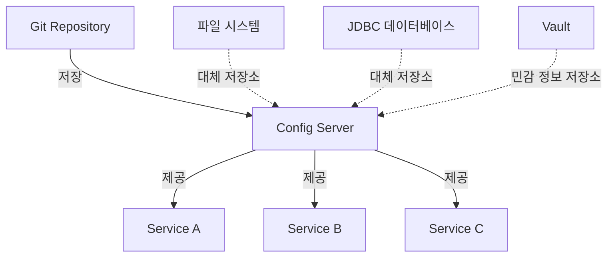

Spring Cloud Config는 분산 시스템에서 설정 관리를 위한 서버 및 클라이언트 지원을 제공하는 프레임워크입니다. 이 도구는 [[마이크로서비스 아키텍처(Microservice Architecture)]]서 여러 애플리케이션과 환경에 걸쳐 일관된 구성을 중앙에서 관리할 수 있게 해줍니다.

Spring Cloud Config를 사용하면 개발, 테스트, 스테이징, 프로덕션과 같은 다양한 환경에서 애플리케이션의 구성을 외부화하고 중앙에서 관리할 수 있습니다. 이는 [[12-Factor App]] 방법론의 핵심 원칙 중 하나인 "구성의 외부화"를 실현하는 방법입니다.

## 주요 개념

Spring Cloud Config는 크게 두 가지 주요 컴포넌트로 구성됩니다:

1. **Config Server**: 외부화된 설정 속성을 제공하는 중앙 서버
2. **Config Client**: Config Server에서 속성을 가져오는 애플리케이션

이 구조는 설정 정보를 애플리케이션과 분리하여 다음과 같은 이점을 제공합니다:

- 설정 변경 시 애플리케이션을 다시 빌드하거나 배포할 필요가 없습니다
- 여러 환경과 애플리케이션에서 설정 공유가 가능합니다
- 설정에 대한 버전 관리가 가능합니다
- 설정 변경 이력 추적이 용이합니다

## 아키텍처

Spring Cloud Config의 기본 아키텍처는 다음과 같습니다:



Config Server는 Git과 같은 버전 관리 시스템을 백엔드 저장소로 사용하여 설정 파일을 관리합니다. 각 마이크로서비스 애플리케이션은 Config Client를 통해 시작 시 또는 런타임에 필요한 설정을 Config Server로부터 가져옵니다.

## Config Server 설정

Config Server를 설정하는 과정은 다음과 같습니다:

### 1. 의존성 추가

```java
// build.gradle
dependencies {
    implementation 'org.springframework.cloud:spring-cloud-config-server'
    implementation 'org.springframework.boot:spring-boot-starter-web'
}
```

### 2. 애플리케이션 설정

```java
@SpringBootApplication
@EnableConfigServer
public class ConfigServerApplication {
    public static void main(String[] args) {
        SpringApplication.run(ConfigServerApplication.class, args);
    }
}
```

### 3. 속성 설정

```yaml
# application.yml
server:
  port: 8888

spring:
  cloud:
    config:
      server:
        git:
          uri: https://github.com/company/config-repo
          search-paths: '{application}/{profile}'
          default-label: main
```

위 설정에서 Config Server는 Git 저장소에서 설정 파일을 가져오며, 애플리케이션 이름과 프로필에 따라 설정 파일을 찾습니다. Git 이외에도 파일 시스템, JDBC, Vault 등 다양한 백엔드 저장소를 지원합니다.

자세한 Config Server 설정 옵션은 [[Spring Cloud Config Server 설정 옵션]]을 참고해주세요.

## Config Client 설정

마이크로서비스 애플리케이션에서 Config Server를 사용하기 위한 설정 방법입니다:

### 1. 의존성 추가

```java
// build.gradle
dependencies {
    implementation 'org.springframework.cloud:spring-cloud-starter-config'
    implementation 'org.springframework.boot:spring-boot-starter-web'
}
```

### 2. 부트스트랩 설정

Config Client는 애플리케이션 시작 전에 설정을 가져오기 위해 bootstrap.yml 파일을 사용합니다:

```yaml
# bootstrap.yml (Spring Boot 2.4 이전) 또는 application.yml (Spring Boot 2.4 이후)
spring:
  application:
    name: my-service
  profiles:
    active: dev
  config:
    import: "optional:configserver:http://localhost:8888"
  cloud:
    config:
      fail-fast: true
      retry:
        max-attempts: 6
        initial-interval: 1000
        max-interval: 2000
        multiplier: 1.1
```

Spring Boot 2.4 이후부터는 `spring.config.import` 속성을 사용하여 Config Server를 명시합니다.

## 설정 파일 구성 방법

Config Server의 저장소에서 설정 파일은 다음과 같은 네이밍 패턴을 따릅니다:

- `{application}-{profile}.yml` 또는 `{application}-{profile}.properties`
- `{application}.yml` 또는 `{application}.properties`
- `application-{profile}.yml` 또는 `application-{profile}.properties`
- `application.yml` 또는 `application.properties`

여기서:

- `{application}`은 클라이언트의 `spring.application.name` 값입니다
- `{profile}`은 클라이언트의 `spring.profiles.active` 값입니다

설정 파일 우선순위는 위에서 아래 순서대로 적용됩니다.

## 동적 설정 갱신

Spring Cloud Config는 애플리케이션을 재시작하지 않고도 설정을 갱신할 수 있는 기능을 제공합니다. 이를 위해서는 다음과 같은 설정이 필요합니다:

### 1. Actuator 의존성 추가

```java
// build.gradle
dependencies {
    implementation 'org.springframework.boot:spring-boot-starter-actuator'
}
```

### 2. Refresh 엔드포인트 활성화

```yaml
# application.yml
management:
  endpoints:
    web:
      exposure:
        include: health,info,refresh
```

### 3. 설정 갱신이 필요한 빈에 @RefreshScope 어노테이션 추가

```java
@RestController
@RefreshScope
public class MessageController {
    
    @Value("${message:Hello default}")
    private String message;
    
    @GetMapping("/message")
    public String getMessage() {
        return message;
    }
}
```

설정이 변경된 후, `/actuator/refresh` 엔드포인트를 호출하면 @RefreshScope가 적용된 빈이 다시 생성되어 새로운 설정 값이 적용됩니다.

대규모 마이크로서비스 환경에서는 각 서비스의 `/actuator/refresh` 엔드포인트를 수동으로 호출하는 것이 비효율적입니다. 이런 경우 [[Spring Cloud Bus]]를 사용하여 모든 애플리케이션에 설정 변경 이벤트를 브로드캐스트할 수 있습니다.

## 보안 설정

Config Server에는 민감한 설정 정보가 포함될 수 있으므로 적절한 보안 조치가 필요합니다:

### 1. Config Server 보안

```java
// build.gradle
dependencies {
    implementation 'org.springframework.boot:spring-boot-starter-security'
}
```

```yaml
# application.yml
spring:
  security:
    user:
      name: configuser
      password: configpassword

# 또는 보다 복잡한 보안 설정
```

### 2. 클라이언트 인증 설정

```yaml
# bootstrap.yml 또는 application.yml
spring:
  cloud:
    config:
      uri: http://localhost:8888
      username: configuser
      password: configpassword
```

### 3. 암호화 및 민감 정보 처리

Spring Cloud Config는 대칭 또는 비대칭 암호화를 통해 민감한 정보를 보호할 수 있습니다:

```yaml
# bootstrap.yml 또는 application.yml (Config Server)
encrypt:
  key: my-symmetric-key  # 대칭 키 암호화

# 또는 비대칭 키 암호화
encrypt:
  key-store:
    location: classpath:keystore.jks
    password: keystorepass
    alias: configkey
    secret: keypass
```

설정 파일에서는 암호화된 값을 `{cipher}` 접두사로 표시합니다:

```yaml
# application.yml
datasource:
  password: '{cipher}AQA...'
```

민감 정보 관리에 대한 자세한 내용은 [[Spring Cloud Config 보안 관리]]를 참고해주세요.

## 고급 기능

### 1. 프로필별 설정

Spring Cloud Config는 Spring의 프로필 기능을 활용하여 환경별로 다른 설정을 제공합니다:

```yaml
# my-service-dev.yml
server:
  port: 8080

# my-service-prod.yml
server:
  port: 9090
```

### 2. 속성 오버라이드

Config Server는 다양한 레벨에서 속성을 오버라이드할 수 있는 메커니즘을 제공합니다:

```yaml
# application.yml (모든 서비스에 적용)
logging:
  level:
    root: INFO

# my-service.yml (특정 서비스에 적용)
logging:
  level:
    com.example.myservice: DEBUG
```

### 3. 환경 변수와 통합

Config Server는 환경 변수를 통한 설정 오버라이드도 지원합니다:

```yaml
# my-service.yml
message: Hello, ${USER_NAME:World}!
```

여기서 `USER_NAME` 환경 변수가 설정되어 있으면 해당 값을 사용하고, 없으면 기본값 `World`를 사용합니다.

## Spring Cloud Config와 다른 Spring Cloud 컴포넌트 통합

Spring Cloud Config는 다른 Spring Cloud 컴포넌트와 원활하게 통합됩니다:

### 1. Spring Cloud Bus

앞서 언급했듯이, Spring Cloud Bus는 설정 변경 이벤트를 모든 서비스에 브로드캐스트하는 데 사용됩니다:

```java
// build.gradle
dependencies {
    implementation 'org.springframework.cloud:spring-cloud-starter-bus-amqp'
}
```

```yaml
# application.yml
spring:
  rabbitmq:
    host: localhost
    port: 5672
    username: guest
    password: guest
```

설정 변경 후 `/actuator/busrefresh` 엔드포인트를 호출하면 모든 서비스에 설정 변경 이벤트가 전파됩니다.

### 2. Spring Cloud Netflix Eureka

서비스 디스커버리를 위한 Eureka와 함께 사용할 수 있습니다:

```yaml
# application.yml (Config Server)
eureka:
  client:
    serviceUrl:
      defaultZone: http://localhost:8761/eureka/
```

```yaml
# bootstrap.yml 또는 application.yml (Config Client)
spring:
  cloud:
    config:
      discovery:
        enabled: true
        service-id: CONFIG-SERVER
```

이 설정을 통해 클라이언트는 Eureka를 통해 Config Server를 찾을 수 있습니다.

Spring Cloud 컴포넌트와의 통합에 대한 자세한 내용은 [[Spring Cloud 컴포넌트 통합]]을 참고해주세요.

## 장단점

### 장점

- 중앙 집중식 구성 관리를 통한 일관성 유지
- 설정의 버전 관리 지원으로 변경 추적 및 롤백 용이
- 환경별 설정 분리 지원
- 설정 변경 시 애플리케이션 재시작 불필요
- 민감 정보 암호화 기능 제공
- Spring 생태계와의 원활한 통합

### 단점

- 추가적인 인프라 컴포넌트 관리 필요
- 설정 서버가 단일 실패 지점(SPOF)이 될 수 있음
- 초기 부트스트랩 과정에서 지연 발생 가능
- 설정 저장소 접근 실패 시 애플리케이션 시작 실패 위험

Spring Cloud Config의 대안 및 보완책에 대한 내용은 [[구성 관리 패턴과 대안]]을 참고해주세요.

## 실제 사용 사례

Spring Cloud Config는 다음과 같은 상황에서 유용하게 활용됩니다:

### 1. 마이크로서비스 환경

여러 마이크로서비스에서 공통 설정을 공유하고 환경별 설정을 관리해야 하는 경우

### 2. 다중 환경 배포

개발, 테스트, 스테이징, 프로덕션 등 여러 환경에 걸쳐 일관된 설정 관리가 필요한 경우

### 3. 동적 설정 변경

런타임에 애플리케이션 설정을 변경해야 하는 경우 (예: 로깅 레벨 조정, 기능 플래그 변경)

### 4. 민감 정보 관리

API 키, 데이터베이스 자격 증명과 같은 민감한 설정을 안전하게 관리해야 하는 경우

## 모범 사례

### 1. 저장소 구성

설정 저장소를 효과적으로 구성하는 방법:

```
config-repo/
├── application.yml           # 공통 설정
├── application-dev.yml       # 개발 환경 공통 설정
├── application-prod.yml      # 프로덕션 환경 공통 설정
├── service-a.yml             # service-a 기본 설정
├── service-a-dev.yml         # service-a 개발 환경 설정
└── service-a-prod.yml        # service-a 프로덕션 환경 설정
```

### 2. 보안 강화

- 민감한 정보는 반드시 암호화
- Config Server에 적절한 접근 제어 적용
- Vault와 같은 보안 저장소 활용 고려

### 3. 고가용성 설계

- Config Server를 여러 인스턴스로 구성하여 가용성 향상
- 설정 저장소 복제 구성
- 로컬 캐싱 활용으로, Config Server 일시적 장애 대응

자세한 모범 사례는 [[Spring Cloud Config 모범 사례]]를 참고해주세요.

## 결론

Spring Cloud Config는 분산 시스템에서 설정 관리의 복잡성을 크게 줄여주는 강력한 도구입니다. 중앙 집중식 관리, 버전 제어, 동적 갱신 등의 기능을 통해 다양한 환경과 서비스에 걸쳐 일관된 설정을 유지할 수 있습니다.

특히 마이크로서비스 아키텍처에서는 Spring Cloud Config가 거의 필수적인 컴포넌트로 자리 잡고 있으며, Spring의 다른 클라우드 네이티브 도구들과 함께 사용하면 클라우드 환경에서 효과적인 애플리케이션 관리가 가능합니다.

다만, Config Server가 단일 실패 지점이 될 수 있으므로 고가용성 설계와 적절한 폴백 메커니즘을 함께 고려해야 합니다. 또한, 보안 측면에서도 민감 정보 보호를 위한 암호화와 접근 제어를 철저히 구현해야 합니다.

Spring Cloud Config를 도입할 때는 프로젝트의 규모와 요구사항을 고려하여 적절한 설계와 구성을 선택하는 것이 중요합니다.

## 참고 자료

- Spring Cloud Config 공식 문서 (https://docs.spring.io/spring-cloud-config/docs/current/reference/html/)
- Spring Boot in Action - Craig Walls
- Cloud Native Spring in Action - Thomas Vitale
- Microservices Patterns - Chris Richardson