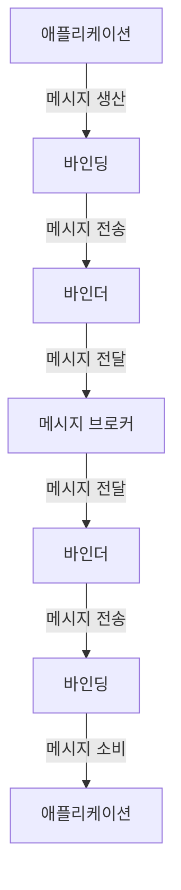

Spring Cloud Stream은 메시지 기반 마이크로서비스를 쉽게 구축할 수 있도록 하는 프레임워크입니다. 이 프레임워크는 [[메시지 브로커(Message Broker)]]와 애플리케이션 간의 통합을 간소화하여, 개발자가 비즈니스 로직에 집중할 수 있도록 도와줍니다.

## Spring Cloud Stream의 개념

Spring Cloud Stream은 Spring Boot와 Spring Integration의 개념을 기반으로 하며, 메시지 주도 마이크로서비스를 쉽게 개발할 수 있는 프로그래밍 모델을 제공합니다. 이 프레임워크의 핵심 철학은 비즈니스 로직과 메시지 인프라 사이의 관심사 분리입니다.

가장 중요한 특징은 메시지 브로커에 독립적인 개발이 가능하다는 점입니다. 애플리케이션 코드는 특정 메시지 브로커 기술에 종속되지 않으며, 설정 변경만으로 다른 메시지 브로커로 전환할 수 있습니다.

## 핵심 구성 요소

Spring Cloud Stream의 핵심 구성 요소는 다음과 같습니다:

### 1. 바인더(Binder)

바인더는 메시지 브로커와의 통합을 담당하는 컴포넌트입니다. Spring Cloud Stream은 다양한 메시지 브로커에 대한 바인더 구현체를 제공합니다:

- Kafka Binder: Apache Kafka 연동
- RabbitMQ Binder: RabbitMQ 연동
- Amazon Kinesis Binder: Amazon Kinesis 연동
- Google PubSub Binder: Google Cloud Pub/Sub 연동

바인더에 대한 자세한 내용은 [[Spring Cloud Stream Binder]]를 참고해주세요.

### 2. 바인딩(Binding)

바인딩은 외부 메시징 시스템과 애플리케이션 간의 브리지 역할을 합니다. 입력 바인딩(Input Binding)은 메시지를 소비하고, 출력 바인딩(Output Binding)은 메시지를 생산합니다.

### 3. 메시지 채널(Message Channel)

메시지 채널은 메시지가 이동하는 파이프라인입니다. Spring Cloud Stream은 두 가지 주요 채널 인터페이스를 제공합니다:

- `Source`: 메시지를 보내는 인터페이스
- `Sink`: 메시지를 받는 인터페이스

Spring Cloud Stream 3.0부터는 함수형 프로그래밍 모델을 도입하여 이러한 인터페이스 대신 Java 함수를 사용할 수 있게 되었습니다.

## 아키텍처

Spring Cloud Stream의 아키텍처를 시각적으로 표현하면 다음과 같습니다:



이 아키텍처는 애플리케이션과 메시지 브로커 사이에 명확한 경계를 설정하여 관심사를 분리합니다.

## 함수형 프로그래밍 모델

Spring Cloud Stream 3.0부터는 함수형 프로그래밍 모델을 지원합니다. 이 모델은 아래와 같은 함수형 인터페이스를 기반으로 합니다:

- `java.util.function.Supplier`: 메시지 생산자
- `java.util.function.Consumer`: 메시지 소비자
- `java.util.function.Function`: 메시지 프로세서(소비 및 생산)

이 함수형 모델은 더 간결하고 직관적인 코드를 작성할 수 있게 해줍니다.

## Spring Cloud Stream 애플리케이션 구현 예시

아래는 Spring Cloud Stream을 사용하여 간단한 메시지 처리 서비스를 구현하는 예시입니다:

```java
@SpringBootApplication
@EnableBinding(Processor.class)
public class StreamProcessingApplication {

    public static void main(String[] args) {
        SpringApplication.run(StreamProcessingApplication.class, args);
    }

    @StreamListener(Processor.INPUT)
    @SendTo(Processor.OUTPUT)
    public String processMessage(String message) {
        return message.toUpperCase();
    }
}
```

위 예시는 Spring Cloud Stream 2.x 버전의 코드입니다. 3.x 버전에서는 함수형 모델을 사용하여 다음과 같이 작성할 수 있습니다:

```java
@SpringBootApplication
public class StreamProcessingApplication {

    public static void main(String[] args) {
        SpringApplication.run(StreamProcessingApplication.class, args);
    }

    @Bean
    public Function<String, String> processMessage() {
        return message -> message.toUpperCase();
    }
}
```

## 설정 방법

Spring Cloud Stream 애플리케이션 설정은 `application.yml` 또는 `application.properties` 파일에서 수행됩니다. 다음은 Kafka 바인더를 사용하는 설정 예시입니다:

```yaml
spring:
  cloud:
    stream:
      bindings:
        processMessage-in-0:
          destination: input-topic
          group: processing-group
        processMessage-out-0:
          destination: output-topic
      kafka:
        binder:
          brokers: localhost:9092
```

여기서 `processMessage-in-0`와 `processMessage-out-0`는 함수명에 기반한 자동 생성된 채널 이름입니다.

설정에 대한 자세한 내용은 [[Spring Cloud Stream 설정 가이드]]를 참고해주세요.

## Consumer Group

Spring Cloud Stream은 메시지 브로커의 컨슈머 그룹 개념을 지원합니다. 이를 통해 여러 인스턴스가 동일한 메시지를 처리하지 않도록 보장하여 수평적 확장성을 제공합니다.

```yaml
spring:
  cloud:
    stream:
      bindings:
        input:
          group: order-processing-group
```

컨슈머 그룹에 대한 자세한 내용은 [[메시지 브로커의 컨슈머 그룹]]을 참고해주세요.

## 파티셔닝(Partitioning)

Spring Cloud Stream은 메시지 파티셔닝을 지원하여 관련 데이터가 동일한 컨슈머 인스턴스에서 처리되도록 보장합니다. 이는 메시지의 순서를 보존해야 하는 경우나 상태 기반 처리에 유용합니다.

```yaml
spring:
  cloud:
    stream:
      bindings:
        output:
          destination: partitioned-topic
          producer:
            partition-key-expression: headers['partitionKey']
            partition-count: 5
        input:
          destination: partitioned-topic
          group: order-processing-group
          consumer:
            partitioned: true
            instance-index: 0
            instance-count: 5
```

파티셔닝에 대한 자세한 내용은 [[Spring Cloud Stream 파티셔닝]]을 참고해주세요.

## 컨텐츠 타입 변환

Spring Cloud Stream은 다양한 메시지 컨텐츠 타입 변환을 지원합니다. 기본적으로 JSON 형식이 사용되지만, 설정을 통해 변경할 수 있습니다:

```yaml
spring:
  cloud:
    stream:
      bindings:
        input:
          content-type: application/json
        output:
          content-type: application/xml
```

지원되는 컨텐츠 타입에는 `application/json`, `application/xml`, `application/x-java-serialized-object`, `text/plain` 등이 있습니다.

## 에러 처리

Spring Cloud Stream은 메시지 처리 중 발생하는 에러를 관리하기 위한 다양한 방법을 제공합니다:

1. **재시도(Retry)**: 일시적인 오류에 대해 메시지 처리를 재시도합니다.
2. **데드 레터 큐(DLQ)**: 처리에 실패한 메시지를 별도의 큐로 보냅니다.

```yaml
spring:
  cloud:
    stream:
      bindings:
        input:
          consumer:
            max-attempts: 3
            back-off-initial-interval: 1000
            back-off-max-interval: 10000
            back-off-multiplier: 2.0
            default-retryable: true
      rabbit:
        bindings:
          input:
            consumer:
              auto-bind-dlq: true
              republish-to-dlq: true
```

에러 처리에 대한 자세한 내용은 [[Spring Cloud Stream 에러 처리]]를 참고해주세요.

## 테스트

Spring Cloud Stream 애플리케이션 테스트는 `spring-cloud-stream-test-support` 모듈을 사용하여 수행할 수 있습니다. 이 모듈은 메시지 브로커 없이도 바인딩을 테스트할 수 있는 기능을 제공합니다.

```java
@SpringBootTest
@Import(TestChannelBinderConfiguration.class)
public class StreamProcessingTests {

    @Autowired
    private InputDestination input;
    
    @Autowired
    private OutputDestination output;
    
    @Test
    public void testProcessMessage() {
        input.send(new GenericMessage<>("hello"));
        Message<byte[]> outputMessage = output.receive();
        assertEquals("HELLO", new String(outputMessage.getPayload()));
    }
}
```

테스트에 대한 자세한 내용은 [[Spring Cloud Stream 테스트 가이드]]를 참고해주세요.

## Spring Cloud Stream과 Spring Cloud Function 통합

Spring Cloud Stream 3.0부터는 Spring Cloud Function과의 통합이 강화되었습니다. 이를 통해 [[서버리스(Serverless)]] 아키텍처와 같은 다양한 실행 환경에서 동일한 비즈니스 로직을 재사용할 수 있습니다.

```java
@SpringBootApplication
public class FunctionStreamApplication {

    public static void main(String[] args) {
        SpringApplication.run(FunctionStreamApplication.class, args);
    }

    @Bean
    public Function<String, String> uppercase() {
        return String::toUpperCase;
    }
}
```

이 함수는 Spring Cloud Function을 통해 HTTP 엔드포인트로 노출되거나, Spring Cloud Stream을 통해 메시지 기반 서비스로 사용될 수 있습니다.

## Spring Cloud Stream의 장점

Spring Cloud Stream의 주요 장점은 다음과 같습니다:

1. **메시지 브로커 독립성**: 애플리케이션 코드를 변경하지 않고도 다른 메시지 브로커로 전환할 수 있습니다.
2. **간소화된 프로그래밍 모델**: 개발자는 비즈니스 로직에만 집중할 수 있습니다.
3. **자동 설정**: Spring Boot의 자동 설정 기능을 통해 쉽게 설정할 수 있습니다.
4. **확장성**: 메시징 인프라의 확장성 기능(파티셔닝, 컨슈머 그룹 등)을 활용할 수 있습니다.
5. **테스트 용이성**: 내장된 테스트 도구를 통해 메시지 브로커 없이도 테스트할 수 있습니다.
6. **함수형 프로그래밍 지원**: Java 8 함수형 인터페이스를 활용한 간결한 코드 작성이 가능합니다.

## Spring Cloud Stream의 단점

물론 Spring Cloud Stream에도 몇 가지 단점이 있습니다:

1. **학습 곡선**: 메시징 개념과 Spring Cloud Stream의 추상화를 이해하는 데 시간이 필요합니다.
2. **디버깅 복잡성**: 분산 메시징 시스템의 특성상 디버깅이 복잡할 수 있습니다.
3. **설정 복잡성**: 고급 기능을 사용할 때 설정이 복잡해질 수 있습니다.
4. **추가적인 인프라 요구사항**: 메시지 브로커(Kafka, RabbitMQ 등)를 설정하고 관리해야 합니다.

## 사용 사례

Spring Cloud Stream은 다음과 같은 상황에서 특히 유용합니다:

1. **이벤트 기반 마이크로서비스**: 서비스 간 비동기 통신이 필요한 경우
2. **실시간 데이터 처리**: 스트리밍 데이터를 처리해야 하는 경우
3. **분산 시스템 통합**: 다양한 시스템 간의 데이터 흐름을 관리해야 하는 경우
4. **[[이벤트 소싱(Event Sourcing)]]**: 상태 변화를 이벤트로 저장하고 처리해야 하는 경우
5. **[[CQRS(Command Query Responsibility Segregation)]]**: 명령과 쿼리 책임을 분리하는 아키텍처

## Spring Cloud Stream과 다른 메시징 솔루션 비교

Spring Cloud Stream과 유사한 다른 메시징 솔루션들의 비교는 [[메시징 솔루션 비교]]를 참고해주세요.

## Spring Cloud Stream의 미래

Spring Cloud Stream은 지속적으로 발전하고 있으며, 최근 릴리스에서는 다음과 같은 개선 사항이 추가되었습니다:

1. **함수형 프로그래밍 모델**: 더 간결하고 직관적인 코드 작성을 위한 함수형 인터페이스 지원
2. **다양한 메시지 브로커 지원**: 더 많은 메시지 브로커에 대한 바인더 구현
3. **성능 최적화**: 메시지 처리 성능 향상
4. **Reactive Streams 지원**: Reactive Programming 패러다임 통합

향후에는 [[클라우드 네이티브(Cloud Native)]] 환경에서의 더 나은 통합과 [[서버리스(Serverless)]] 아키텍처에 대한 지원이 강화될 것으로 예상됩니다.

## 결론

Spring Cloud Stream은 메시지 기반 마이크로서비스 개발을 위한 강력하고 유연한 프레임워크입니다. 메시지 브로커와의 통합을 추상화하여 개발자가 비즈니스 로직에 집중할 수 있게 해주며, 다양한 메시징 패턴과 기능을 제공합니다.

특히 함수형 프로그래밍 모델의 도입으로 더욱 간결하고 유지보수하기 쉬운 코드를 작성할 수 있게 되었습니다. 메시지 기반 아키텍처를 고려하고 있다면, Spring Cloud Stream은 매우 유용한 선택이 될 수 있습니다.

효과적인 Spring Cloud Stream 애플리케이션 개발을 위해서는 메시징 개념과 패턴에 대한 이해가 필요하며, 특히 [[메시지 브로커(Message Broker)]]의 특성을 잘 파악하는 것이 중요합니다.

## 참고 자료

- Spring Cloud Stream 공식 문서 (https://spring.io/projects/spring-cloud-stream)
- Spring Cloud Stream 레퍼런스 가이드 (https://docs.spring.io/spring-cloud-stream/docs/current/reference/html/)
- Messaging Patterns in Microservices Architecture - Mark Richards
- Enterprise Integration Patterns - Gregor Hohpe & Bobby Woolf