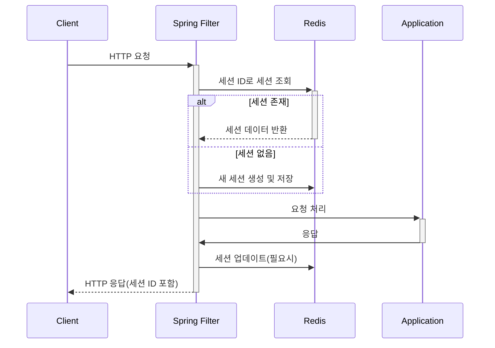

Spring Session은 서블릿 기반 애플리케이션의 세션 관리를 위한 프레임워크입니다. 이 글에서는 Spring Session이 Redis를 이용해 세션 데이터를 저장하고 관리하는 방식에 대해 자세히 알아보겠습니다.

## Spring Session의 필요성

분산 환경에서 애플리케이션을 운영할 때, 세션 관리는 중요한 문제입니다. 여러 서버에 로드 밸런싱된 환경에서 한 서버에 저장된 세션은 다른 서버에서 접근할 수 없기 때문입니다. Spring Session은 이러한 문제를 해결하기 위해 세션 저장소를 외부화하여 여러 서버 간에 세션을 공유할 수 있게 해줍니다.

## Redis를 사용한 세션 저장의 장점

Redis는 인메모리 데이터 저장소로, 다음과 같은 이유로 세션 저장소로 적합합니다:

1. **빠른 읽기/쓰기 성능**: 메모리 기반 저장소이기 때문에 빠른 응답 시간을 제공합니다.
2. **만료 시간 설정**: Redis의 키-값 만료 기능을 활용하여 세션 타임아웃을 쉽게 구현할 수 있습니다.
3. **데이터 지속성**: AOF(Append-Only File)나 RDB 스냅샷을 통해 데이터 지속성을 보장할 수 있습니다.
4. **확장성**: Redis 클러스터를 통해 수평적 확장이 가능합니다.

## Spring Redis Session의 동작 원리

Spring Redis Session은 HTTP 세션을 Redis에 저장하고 관리합니다. 그 동작 방식은 다음과 같습니다:



### 세션 저장 구조

Spring Redis Session은 다음과 같은 Redis 데이터 구조를 사용하여 세션을 저장합니다:

1. **세션 데이터**: Hash 타입으로 저장
    
    - Key: `spring:session:sessions:{sessionId}`
    - Fields:
        - `sessionAttr:{attributeName}`: 세션 속성 값
        - `creationTime`: 세션 생성 시간
        - `lastAccessedTime`: 마지막 접근 시간
        - `maxInactiveInterval`: 세션 만료 시간(초)
2. **만료 인덱스**: Set 타입으로 저장
    
    - Key: `spring:session:expirations:{expirationTime}`
    - Values: `expires:{sessionId}`
3. **세션 ID 인덱스**: 값이 없는 키
    
    - Key: `expires:{sessionId}`
    - 이 키는 세션의 실제 만료 시간을 가지며, Redis의 키 만료 기능을 활용합니다.

## 세션 만료 처리 전략

Spring Redis Session은 두 가지 방식으로 세션 만료를 처리합니다:

1. **Redis의 키 만료 기능**: 세션 키에 TTL(Time-To-Live)을 설정하여 자동으로 만료되도록 합니다.
    
2. **명시적인 만료 처리**: `RedisSessionExpirationPolicy` 클래스를 통해 만료된 세션을 정리합니다. 이 클래스는 다음과 같은 작업을 수행합니다:
    
    - 세션의 만료 시간을 다음 분으로 반올림하여 해당 시간에 만료될 세션들을 그룹화합니다.
    - 주기적으로 `cleanExpiredSessions()` 메서드를 호출하여 만료된 세션을 정리합니다.
    - 서버가 재시작되는 등의 상황에서도 세션 만료가 제대로 처리되도록 Redis 키 자체에도 만료 시간을 설정합니다.

## 세션 만료 시간 계산

세션의 만료 시간은 다음과 같은 방식으로 계산됩니다:

```java
static long expiresInMillis(Session session) {
    int maxInactiveInSeconds = (int) session.getMaxInactiveInterval().getSeconds();
    long lastAccessedTimeInMillis = session.getLastAccessedTime().toEpochMilli();
    return lastAccessedTimeInMillis + TimeUnit.SECONDS.toMillis(maxInactiveInSeconds);
}
```

이 값을 다음 분으로 반올림하여 만료 시간 인덱스의 키로 사용합니다:

```java
static long roundUpToNextMinute(long timeInMs) {
    Calendar date = Calendar.getInstance();
    date.setTimeInMillis(timeInMs);
    date.add(Calendar.MINUTE, 1);
    date.clear(Calendar.SECOND);
    date.clear(Calendar.MILLISECOND);
    return date.getTimeInMillis();
}
```

## 세션 변경 감지 및 저장

세션 속성이 변경될 때마다 Redis에 저장해야 하는데, Spring Session은 `RedisSession` 클래스를 통해 변경 사항을 추적합니다. 세션 속성이 수정되면 해당 속성을 'dirty'로 표시하고, 요청이 완료될 때 변경된 속성만 Redis에 업데이트합니다.

## Spring Redis Session 설정 방법

Spring Boot에서 Redis Session을 사용하려면 다음과 같이 설정합니다:

1. **의존성 추가**:

```xml
<dependency>
    <groupId>org.springframework.session</groupId>
    <artifactId>spring-session-data-redis</artifactId>
</dependency>
<dependency>
    <groupId>org.springframework.boot</groupId>
    <artifactId>spring-boot-starter-data-redis</artifactId>
</dependency>
```

2. **설정 클래스 작성**:

```java
@Configuration
@EnableRedisHttpSession
public class SessionConfig {
    
    @Bean
    public LettuceConnectionFactory redisConnectionFactory() {
        return new LettuceConnectionFactory();
    }
}
```

3. **application.properties 설정**:

```properties
spring.redis.host=localhost
spring.redis.port=6379
spring.session.store-type=redis
spring.session.redis.namespace=spring:session
spring.session.redis.flush-mode=on-save
spring.session.timeout=1800s
```

## 세션 정리 메커니즘

`RedisSessionExpirationPolicy` 클래스는 세션 만료를 처리하는 핵심 클래스입니다. 이 클래스는 다음과 같은 작업을 수행합니다:

1. **세션 삭제 시**: `onDelete` 메서드를 통해 만료 인덱스에서 세션을 제거합니다.
2. **세션 만료 시간 업데이트 시**: `onExpirationUpdated` 메서드를 통해 만료 인덱스를 업데이트합니다.
3. **만료된 세션 정리**: `cleanExpiredSessions` 메서드를 통해 이전 분에 만료된 세션을 정리합니다.

다음은 만료된 세션을 정리하는 코드의 핵심 부분입니다:

```java
void cleanExpiredSessions() {
    long now = System.currentTimeMillis();
    long prevMin = roundDownMinute(now);

    String expirationKey = getExpirationKey(prevMin);
    Set<Object> sessionsToExpire = this.redis.boundSetOps(expirationKey).members();
    this.redis.delete(expirationKey);
    for (Object session : sessionsToExpire) {
        String sessionKey = getSessionKey((String) session);
        touch(sessionKey);
    }
}

private void touch(String key) {
    this.redis.hasKey(key);
}
```

이 코드는 이전 분에 만료 예정이었던 세션들을 가져와 `touch` 메서드를 호출합니다. `touch` 메서드는 간단히 키의 존재 여부를 확인하는데, 이미 TTL이 만료된 키는 이 시점에 자동으로 삭제됩니다.

## 성능 최적화

Spring Redis Session은 성능 최적화를 위해 다음과 같은 전략을 사용합니다:

1. **변경된 속성만 저장**: 세션의 모든 속성이 아닌 변경된 속성만 Redis에 업데이트합니다.
2. **지연 저장**: 요청이 완료될 때까지 세션 저장을 지연시킵니다.
3. **세션 정보 인덱싱**: 빠른 검색을 위해 다양한 인덱스를 유지합니다.
4. **만료 시간 그룹화**: 비슷한 시간에 만료되는 세션을 그룹화하여 효율적으로 관리합니다.

## 주의사항 및 모범 사례

Spring Redis Session을 사용할 때 고려해야 할 몇 가지 사항들:

1. **세션 크기 관리**: 세션에 너무 많은 데이터를 저장하면 성능이 저하될 수 있습니다. 꼭 필요한 데이터만 세션에 저장하세요.
2. **적절한 만료 시간 설정**: 보안과 리소스 사용 측면에서 적절한 세션 만료 시간을 설정하는 것이 중요합니다.
3. **Redis 연결 풀 관리**: 많은 요청을 처리하는 애플리케이션의 경우, Redis 연결 풀을 적절히 설정해야 합니다.
4. **직렬화 방식 선택**: 기본적으로 JDK 직렬화를 사용하지만, JSON 직렬화 등 다른 방식을 선택할 수도 있습니다.

## 세션 데이터 디버깅

Redis에 저장된 세션 데이터를 확인하고 싶다면 Redis CLI를 사용할 수 있습니다:

```bash
# 모든 세션 키 조회
redis-cli keys "spring:session:sessions:*"

# 특정 세션의 모든 필드 조회
redis-cli hgetall "spring:session:sessions:{sessionId}"

# 만료 인덱스 조회
redis-cli smembers "spring:session:expirations:{timestamp}"
```

## 결론

Spring Redis Session은 분산 환경에서 효과적인 세션 관리를 위한 강력한 솔루션입니다. Redis의 빠른 속도와 Spring의 추상화 계층을 결합하여 개발자가 세션 관리의 복잡성을 신경 쓰지 않고도 확장 가능한 애플리케이션을 구축할 수 있게 해줍니다.

세션 저장 방식을 이해하면 애플리케이션의 동작을 더 잘 파악할 수 있고, 문제가 발생했을 때 효과적으로 디버깅할 수 있습니다. 또한, 이러한 이해를 바탕으로 성능과 보안을 더욱 향상시킬 수 있습니다.

[[Redis]]와 [[Spring Session]]에 대한 더 자세한 내용은 해당 링크를 참고하시기 바랍니다.

## 참고 자료

- Spring Session 공식 문서: https://docs.spring.io/spring-session/docs/current/reference/html5/
- Redis 공식 문서: https://redis.io/documentation
- Spring Data Redis 문서: https://docs.spring.io/spring-data/redis/docs/current/reference/html/