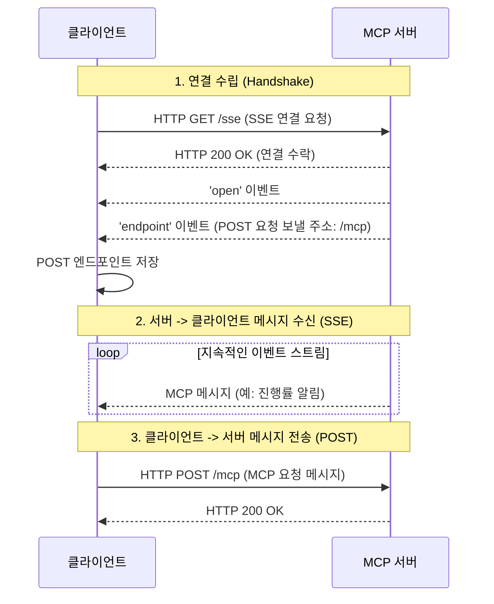

`SseClientTransport`는 [[MCP Client]]가 서버와 통신하기 위해 선택할 수 있는 여러 MCP 전송 계층(Transport Layer) 중 하나입니다. 이 방식의 핵심은 **서버-전송 이벤트(Server-Sent Events, SSE)** 기술을 사용하여 서버로부터의 메시지 수신을 전담하고, 클라이언트에서 서버로의 메시지 전송은 별도의 HTTP POST 요청을 사용하는 **비대칭적인 통신 구조**에 있습니다.

이 글에서는 `SseClientTransport`의 동작 원리와 특징을 자세히 알아보고, 어떤 상황에서 이 통신 방식을 사용하는 것이 가장 효과적인지 살펴보겠습니다.

---

### SseClientTransport의 핵심 동작 원리

`SseClientTransport`의 가장 큰 특징은 메시지를 받는 경로와 보내는 경로가 다르다는 점입니다. 이는 Server-Sent Events (SSE) 프로토콜의 특성에서 기인합니다.

- **메시지 수신 (Server -> Client)**: 클라이언트는 서버의 특정 엔드포인트(코드에서는 `/sse`)로 HTTP GET 요청을 보내고, 이 연결을 계속 유지합니다. 서버는 이 연결을 통해 클라이언트에게 데이터를 실시간으로 '푸시'할 수 있습니다.
- **메시지 전송 (Client -> Server)**: 클라이언트가 서버에게 메시지를 보내야 할 때는, SSE 연결과는 별개로 새로운 HTTP POST 요청을 생성하여 전송합니다.

이러한 비대칭적인 통신 흐름은 다음과 같이 시각화할 수 있습니다.

이 다이어그램에서 볼 수 있듯, `SseClientTransport`는 두 개의 독립적인 채널을 통해 통신을 관리합니다. 서버로부터의 데이터는 지속적인 SSE 스트림을 통해 수신하고, 서버로의 데이터 전송은 필요할 때마다 일회성 POST 요청을 사용합니다.

### 연결 수립 과정 상세 분석

`SseClientTransport`의 `start()` 메서드는 위 다이어그램의 '연결 수립' 과정을 담당합니다.

1. 클라이언트는 Ktor `HttpClient`를 사용하여 서버의 `/sse` 주소로 `sseSession`을 요청합니다.
2. 연결이 성공적으로 열리면, 서버는 먼저 `open` 이벤트를 보내 연결이 수립되었음을 알립니다.
3. 그 직후, 서버는 `endpoint` 이벤트를 통해 클라이언트가 메시지를 보낼 때 사용해야 할 POST 요청 주소(예: `/mcp`)를 알려줍니다. `SseClientTransport`는 이 주소를 내부적으로 저장합니다.
4. 이 과정이 모두 성공적으로 완료되어야 클라이언트는 메시지를 주고받을 준비를 마칩니다. 만약 중간에 오류가 발생하면 연결은 즉시 종료됩니다.

---

### SseClientTransport는 언제 사용해야 할까요?

이러한 구조적 특징 때문에 `SseClientTransport`는 모든 상황에 적합한 만능 해결책은 아닙니다. 이 방식이 빛을 발하는 특정 시나리오가 있습니다.

#### 적합한 경우 (Pros)

- **서버 주도적 업데이트가 많을 때**: 빌드 진행률, 로그 스트리밍, 파일 변경 감지 알림 등 서버가 클라이언트에게 비동기적으로 계속해서 정보를 보내야 하는 경우에 매우 효율적입니다.
- **표준 HTTP 인프라를 활용해야 할 때**: [[WebSocketClientTransport]]와 달리 방화벽이나 프록시 환경에서 특별한 설정 없이도 잘 동작하는 경향이 있습니다.
- **클라이언트의 요청 빈도가 낮을 때**: 클라이언트가 서버에 요청을 가끔 보내고, 주로 서버의 응답을 수신 대기하는 애플리케이션에 적합합니다.

#### 고려가 필요한 경우 (Cons)

- **낮은 지연 시간의 양방향 통신이 필요할 때**: 클라이언트가 서버에 매우 빈번하게 요청을 보내야 한다면, 매번 POST 요청을 새로 생성하는 오버헤드 때문에 [[WebSocketClientTransport]]에 비해 지연 시간이 길어질 수 있습니다.
- **복잡한 상태 관리가 필요할 때**: 수신 채널과 발신 채널이 분리되어 있어 네트워크 상태를 통합적으로 관리하기가 상대적으로 복잡할 수 있습니다.

---
### 결론

`SseClientTransport`는 [[MCP Client]]의 통신 방식에 유연성을 더해주는 중요한 옵션입니다. 특히 서버가 생성하는 데이터를 실시간으로 클라이언트에 전달해야 하는 요구사항이 있을 때, 표준 HTTP 기술을 기반으로 안정적이고 효율적인 통신 채널을 제공합니다. 애플리케이션의 통신 패턴을 정확히 파악하고, [[WebSocketClientTransport]]와 같은 다른 방식과 장단점을 비교하여 가장 적절한 전송 계층을 선택하는 것이 중요합니다.

### 참고 자료

- [MDN - Server-Sent Events 사용하기](https://developer.mozilla.org/ko/docs/Web/API/Server-sent_events/Using_server-sent_events)
- [Ktor - Server-Sent Events (SSE)](https://www.google.com/search?q=https://ktor.io/docs/sse.html)