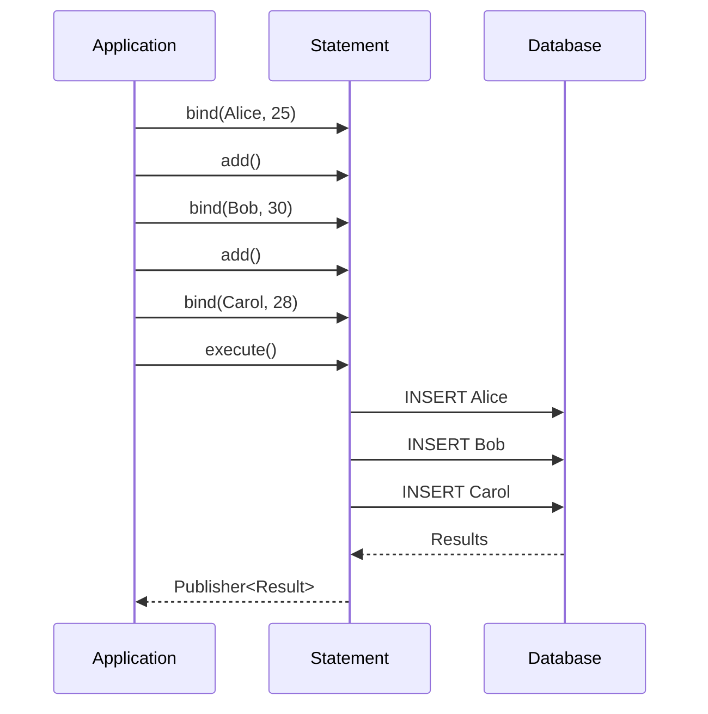
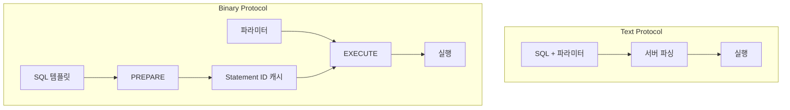

---
tags:
  - r2dbc
  - database
---

Statement는 R2DBC에서 SQL 문을 표현하고 실행하는 인터페이스다. 파라미터 바인딩, 배치 실행, Prepared Statement 등을 지원하며, 실행 결과로 `Publisher<Result>`를 반환한다.

---

## 기본 사용법

Connection에서 Statement를 생성하고 실행한다.

```java
connection.createStatement("SELECT * FROM users WHERE id = $1")
    .bind(0, 42)
    .execute()
    .flatMap(result -> result.map((row, meta) -> row.get("name", String.class)))
    .subscribe(System.out::println);
```

## 파라미터 바인딩

### 인덱스 기반 바인딩

0부터 시작하는 인덱스로 파라미터를 바인딩한다. 플레이스홀더 문법은 드라이버마다 다르다.

```java
// MySQL, H2: ? 사용
connection.createStatement("SELECT * FROM users WHERE age > ? AND city = ?")
    .bind(0, 25)
    .bind(1, "Seoul")
    .execute();

// PostgreSQL: $1, $2 사용
connection.createStatement("SELECT * FROM users WHERE age > $1 AND city = $2")
    .bind(0, 25)
    .bind(1, "Seoul")
    .execute();
```

### 이름 기반 바인딩

일부 드라이버는 이름 기반 바인딩도 지원한다.

```java
connection.createStatement("SELECT * FROM users WHERE name = :name")
    .bind("name", "Alice")
    .execute();
```

### NULL 바인딩

NULL 값은 `bindNull()`을 사용하며 타입을 명시해야 한다.

```java
connection.createStatement("INSERT INTO users (name, email) VALUES ($1, $2)")
    .bind(0, "Alice")
    .bindNull(1, String.class)  // email은 NULL
    .execute();
```

## 배치 실행

`add()` 메서드로 동일한 SQL에 다른 파라미터를 여러 번 실행할 수 있다.

```java
Statement statement = connection.createStatement(
    "INSERT INTO users (name, age) VALUES ($1, $2)"
);

statement.bind(0, "Alice").bind(1, 25).add();
statement.bind(0, "Bob").bind(1, 30).add();
statement.bind(0, "Carol").bind(1, 28);

statement.execute()
    .flatMap(Result::getRowsUpdated)
    .subscribe(count -> System.out.println("Inserted: " + count));
```



## fetchSize 설정

대량의 결과를 처리할 때 `fetchSize`를 설정하여 메모리 사용을 제어할 수 있다.

```java
connection.createStatement("SELECT * FROM large_table")
    .fetchSize(100)  // 한 번에 100개씩 가져오기
    .execute();
```

이 설정은 [[역압력(back pressure)|Backpressure]]와 함께 동작하여 소비자가 처리할 수 있는 속도에 맞춰 데이터를 가져온다.

## 자동 생성된 키 반환

INSERT 후 자동 생성된 키(예: AUTO_INCREMENT)를 받으려면 `returnGeneratedValues()`를 사용한다.

```java
connection.createStatement("INSERT INTO users (name) VALUES ($1)")
    .bind(0, "Alice")
    .returnGeneratedValues("id")
    .execute()
    .flatMap(result -> result.map((row, meta) -> row.get("id", Long.class)))
    .subscribe(id -> System.out.println("Generated ID: " + id));
```

## 드라이버별 Statement 구현

### r2dbc-mysql의 두 가지 실행 방식

r2dbc-mysql은 상황에 따라 다른 실행 전략을 사용한다.

**Text Protocol (기본)**
```
SQL 문자열 + 파라미터 → 완성된 SQL → 서버로 전송
```

파라미터가 SQL 문자열에 직접 포함되어 전송된다. 단순하고 오버헤드가 적다.

**Binary Protocol (Prepared Statement)**
```
SQL 템플릿 → PREPARE → 파라미터 별도 전송 → EXECUTE
```

서버가 SQL을 먼저 파싱하고, 파라미터는 바이너리로 전송된다. 동일 쿼리 반복 시 효율적이다.



## Statement vs Batch

R2DBC는 두 가지 배치 방식을 제공한다.

| 방식 | 용도 | 예시 |
|-----|------|------|
| `Statement.add()` | 동일 SQL, 다른 파라미터 | INSERT 대량 삽입 |
| `Batch` | 다른 SQL 여러 개 | 스키마 마이그레이션 |

```java
// Batch 사용 예시
connection.createBatch()
    .add("CREATE TABLE users (id INT)")
    .add("CREATE TABLE orders (id INT)")
    .add("INSERT INTO users VALUES (1)")
    .execute();
```

## References

- [[R2DBC 동작 원리]]
- [[Result]]
- [[역압력(back pressure)|Backpressure]]
