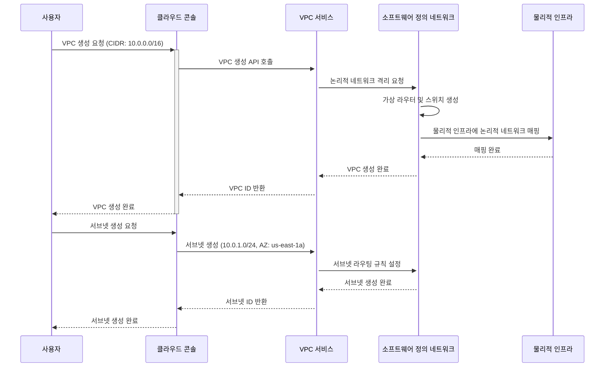
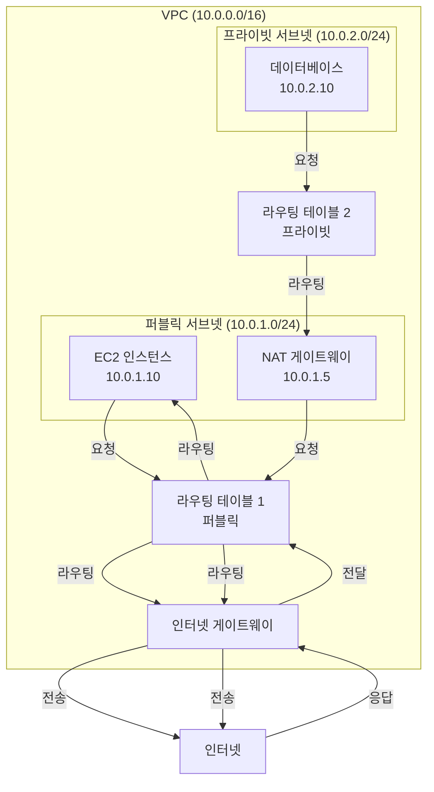
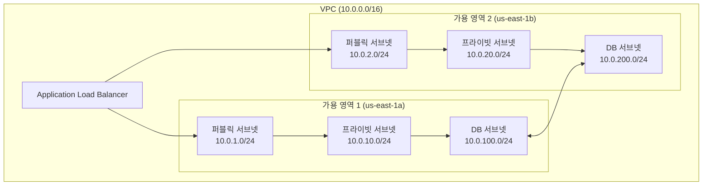
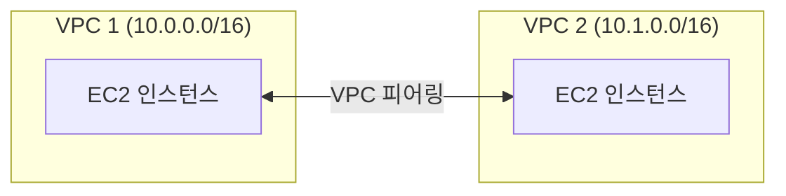
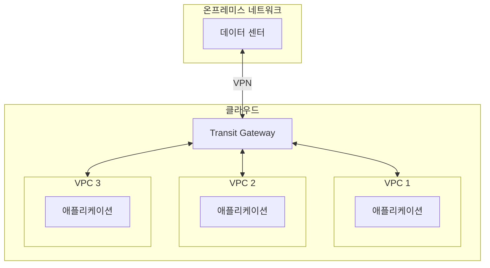

VPC(Virtual Private Cloud)는 클라우드 제공자가 제공하는 **논리적으로 격리된 가상 네트워크 환경**입니다. 마치 클라우드 내부에 자신만의 사설 네트워크를 구축하는 것처럼, 사용자는 VPC를 통해 IP 주소 범위, 서브넷, 라우팅 테이블, 게이트웨이 등을 완전히 제어할 수 있습니다.

VPC는 클라우드 컴퓨팅의 핵심 인프라 구성 요소로, AWS, Google Cloud Platform(GCP), Microsoft Azure 등 모든 주요 클라우드 제공자가 제공하는 기본 서비스입니다. VPC를 이해하기 위해서는 [[Network]], [[서브넷(Subnet)]], [[CIDR(Classless Inter-Domain Routing)]], [[라우팅(Routing)]], [[Router]] 등의 개념을 함께 이해하는 것이 중요합니다.

이번 글에서는 VPC의 핵심 구성 요소와 동작 방식을 깊이 있게 파헤쳐 보겠습니다.

---

## VPC의 핵심

VPC의 모든 것은 **논리적 네트워크 격리(Logical Network Isolation)**를 중심으로 이루어집니다. VPC는 클라우드 제공자의 물리적 인프라 위에 구축되지만, 각 VPC는 완전히 독립적인 네트워크 공간으로 동작합니다. 한 VPC의 리소스는 기본적으로 다른 VPC의 리소스와 통신할 수 없으며, 이는 보안과 네트워크 관리의 기반이 됩니다.

VPC는 주로 다음과 같은 핵심 구성 요소로 이루어집니다:

1. **IP 주소 범위 (CIDR 블록)**: VPC가 사용할 수 있는 IP 주소 공간을 정의합니다. 예를 들어 `10.0.0.0/16`은 10.0.0.0부터 10.0.255.255까지의 65,536개의 IP 주소를 의미합니다.

2. **서브넷 (Subnet)**: VPC 내부를 더 작은 네트워크 단위로 나눈 것입니다. 각 서브넷은 특정 가용 영역(Availability Zone)에 속하며, 퍼블릭 서브넷과 프라이빗 서브넷으로 구분됩니다.

3. **라우팅 테이블 (Route Table)**: 서브넷 내 리소스의 트래픽이 어디로 향할지 결정하는 규칙의 집합입니다. 인터넷 게이트웨이, NAT 게이트웨이, VPC 피어링 연결 등을 통해 트래픽을 라우팅합니다.

4. **인터넷 게이트웨이 (Internet Gateway)**: VPC와 인터넷 간의 통신을 가능하게 하는 게이트웨이입니다. 퍼블릭 서브넷의 리소스가 인터넷에 접근하거나 인터넷에서 접근받을 수 있게 합니다.

5. **NAT 게이트웨이 (NAT Gateway)**: 프라이빗 서브넷의 리소스가 인터넷에 아웃바운드 연결을 할 수 있게 하면서, 인터넷에서 직접 접근할 수 없도록 보호합니다.

6. **보안 그룹 (Security Group)**: 리소스 레벨의 가상 방화벽으로, 인바운드 및 아웃바운드 트래픽을 제어합니다.

7. **네트워크 ACL (Network ACL)**: 서브넷 레벨의 방화벽으로, 서브넷 전체의 트래픽을 제어합니다.

이 모든 구성 요소가 함께 작동하여 안전하고 확장 가능한 클라우드 네트워크 환경을 구축합니다.

---

## VPC의 동작 원리

VPC는 클라우드 제공자의 물리적 네트워크 인프라 위에 구축된 가상화된 네트워크 계층입니다. 사용자가 VPC를 생성하면, 클라우드 제공자는 하이퍼바이저와 소프트웨어 정의 네트워킹(SDN) 기술을 사용하여 논리적으로 격리된 네트워크 공간을 할당합니다.

### VPC 생성 및 구성 흐름



### 트래픽 흐름 예시

VPC 내부에서 EC2 인스턴스가 인터넷에 접근하는 과정을 살펴보겠습니다:



이 흐름의 핵심은 다음과 같습니다:

1. **라우팅 테이블이 트래픽의 목적지를 결정합니다**: 각 서브넷은 라우팅 테이블과 연결되어 있으며, 라우팅 테이블의 규칙에 따라 트래픽이 적절한 게이트웨이로 전달됩니다.

2. **퍼블릭 서브넷은 인터넷 게이트웨이를 통해 직접 인터넷에 접근합니다**: 퍼블릭 IP를 가진 리소스는 인터넷 게이트웨이를 통해 양방향 통신이 가능합니다.

3. **프라이빗 서브넷은 NAT 게이트웨이를 통해 아웃바운드만 가능합니다**: 프라이빗 서브넷의 리소스는 NAT 게이트웨이를 통해 인터넷에 요청을 보낼 수 있지만, 인터넷에서 직접 접근할 수 없습니다.

---

## 주요 클라우드 제공자별 VPC

### AWS VPC

AWS의 VPC는 가장 널리 사용되는 VPC 구현 중 하나입니다.

**주요 특징**:
- 리전(Region)별로 독립적인 VPC를 생성할 수 있습니다.
- 각 VPC는 최대 5개의 IPv4 CIDR 블록을 가질 수 있습니다.
- VPC 피어링, Transit Gateway, VPN 연결 등을 통해 다른 VPC나 온프레미스 네트워크와 연결할 수 있습니다.

**핵심 구성 요소**:
- **VPC**: 기본 네트워크 컨테이너
- **서브넷**: 가용 영역 내의 IP 주소 범위
- **인터넷 게이트웨이**: VPC와 인터넷 간의 연결
- **NAT 게이트웨이**: 프라이빗 서브넷의 아웃바운드 인터넷 접근
- **VPC 엔드포인트**: AWS 서비스에 프라이빗 연결
- **보안 그룹**: 인스턴스 레벨 방화벽
- **네트워크 ACL**: 서브넷 레벨 방화벽

**예시 구성**:

```yaml
VPC:
  CIDR: 10.0.0.0/16
  서브넷:
    - 퍼블릭 서브넷 1: 10.0.1.0/24 (us-east-1a)
    - 퍼블릭 서브넷 2: 10.0.2.0/24 (us-east-1b)
    - 프라이빗 서브넷 1: 10.0.10.0/24 (us-east-1a)
    - 프라이빗 서브넷 2: 10.0.20.0/24 (us-east-1b)
    - 데이터베이스 서브넷 1: 10.0.100.0/24 (us-east-1a)
    - 데이터베이스 서브넷 2: 10.0.200.0/24 (us-east-1b)
  게이트웨이:
    - 인터넷 게이트웨이: 1개
    - NAT 게이트웨이: 2개 (각 가용 영역별)
```

### Google Cloud VPC

Google Cloud의 VPC는 **글로벌 VPC**라는 독특한 특징을 가지고 있습니다.

**주요 특징**:
- VPC 네트워크가 리전에 종속되지 않고 글로벌하게 동작합니다.
- 서브넷은 리전별로 생성되지만, VPC 자체는 전역적으로 관리됩니다.
- 자동 모드와 커스텀 모드 두 가지 VPC 생성 방식을 제공합니다.

**핵심 구성 요소**:
- **VPC 네트워크**: 글로벌 네트워크 컨테이너
- **서브넷**: 리전별 IP 주소 범위
- **라우팅**: 자동 또는 커스텀 라우팅 규칙
- **방화벽 규칙**: 네트워크 레벨 방화벽
- **Cloud NAT**: 프라이빗 인스턴스의 아웃바운드 인터넷 접근
- **VPC 피어링**: VPC 간 프라이빗 연결

**예시 구성**:

```yaml
VPC 네트워크:
  이름: my-vpc-network
  모드: 커스텀
  서브넷:
    - 서브넷 1: 10.1.0.0/24 (us-central1)
    - 서브넷 2: 10.2.0.0/24 (us-east1)
    - 서브넷 3: 10.3.0.0/24 (asia-northeast1)
  방화벽 규칙:
    - allow-ssh: SSH 접근 허용
    - allow-http: HTTP 트래픽 허용
    - deny-all: 기본 거부 규칙
```

### Azure Virtual Network (VNet)

Microsoft Azure의 VPC는 **Virtual Network (VNet)**라는 이름으로 제공됩니다.

**주요 특징**:
- 리소스 그룹 내에서 VNet을 생성합니다.
- 서브넷, 네트워크 보안 그룹(NSG), 사용자 정의 라우팅(UDR) 등을 지원합니다.
- Azure의 다양한 서비스와 통합되어 있습니다.

**핵심 구성 요소**:
- **Virtual Network**: 기본 네트워크 컨테이너
- **서브넷**: VNet 내부의 IP 주소 범위
- **네트워크 보안 그룹 (NSG)**: 서브넷 및 네트워크 인터페이스 레벨 방화벽
- **가상 네트워크 게이트웨이**: VPN 및 ExpressRoute 연결
- **NAT 게이트웨이**: 아웃바운드 인터넷 접근
- **Private Endpoint**: Azure 서비스에 프라이빗 연결

**예시 구성**:

```yaml
Virtual Network:
  이름: my-vnet
  주소 공간: 10.0.0.0/16
  서브넷:
    - 서브넷 1: 10.0.1.0/24 (서브넷1)
    - 서브넷 2: 10.0.2.0/24 (서브넷2)
  네트워크 보안 그룹:
    - NSG-Web: 웹 서버용 규칙
    - NSG-DB: 데이터베이스용 규칙
```

---

## VPC 설계 모범 사례

### 1. IP 주소 범위 설계

VPC를 설계할 때 가장 중요한 것은 **IP 주소 범위(CIDR 블록)를 신중하게 선택**하는 것입니다.

**원칙**:
- **충돌 방지**: 온프레미스 네트워크나 다른 VPC와 IP 주소 범위가 겹치지 않도록 해야 합니다.
- **확장성 고려**: 향후 확장을 고려하여 충분한 주소 공간을 할당해야 합니다.
- **표준화**: 조직 내에서 일관된 IP 주소 할당 체계를 사용해야 합니다.

**권장 사항**:
- 프로덕션 VPC: `10.0.0.0/16` (65,536개 주소)
- 개발/테스트 VPC: `10.1.0.0/16` 또는 `10.2.0.0/16`
- 서브넷 크기: `/24` (256개 주소) 또는 `/26` (64개 주소) 권장

**예시**:

```
프로덕션 환경:
  VPC: 10.0.0.0/16
    - 퍼블릭 서브넷: 10.0.1.0/24, 10.0.2.0/24
    - 프라이빗 서브넷: 10.0.10.0/24, 10.0.20.0/24
    - 데이터베이스 서브넷: 10.0.100.0/24, 10.0.200.0/24

개발 환경:
  VPC: 10.1.0.0/16
    - 퍼블릭 서브넷: 10.1.1.0/24
    - 프라이빗 서브넷: 10.1.10.0/24
```

### 2. 다중 가용 영역(AZ) 구성

고가용성을 위해 **최소 2개 이상의 가용 영역에 서브넷을 분산** 배치해야 합니다.

**장점**:
- 단일 가용 영역 장애 시에도 서비스 지속 가능
- 로드 밸런서를 통한 트래픽 분산
- 데이터베이스 복제 및 백업 전략 구현 가능

**예시 구성**:



### 3. 서브넷 전략

서브넷은 **기능별, 보안 요구사항별로 분리**하는 것이 좋습니다.

**서브넷 유형**:
1. **퍼블릭 서브넷**: 인터넷 게이트웨이를 통해 인터넷에 직접 접근 가능
   - 웹 서버, 로드 밸런서, NAT 게이트웨이 등

2. **프라이빗 서브넷**: 인터넷에 직접 노출되지 않음
   - 애플리케이션 서버, 내부 API 서버 등
   - NAT 게이트웨이를 통한 아웃바운드 인터넷 접근 가능

3. **데이터베이스 서브넷**: 가장 제한적인 접근
   - 데이터베이스 서버, 캐시 서버 등
   - 프라이빗 서브넷에서만 접근 가능

**예시**:

```
VPC: 10.0.0.0/16

퍼블릭 서브넷:
  - 10.0.1.0/24 (AZ-1): 웹 서버, 로드 밸런서
  - 10.0.2.0/24 (AZ-2): 웹 서버, 로드 밸런서

프라이빗 서브넷:
  - 10.0.10.0/24 (AZ-1): 애플리케이션 서버
  - 10.0.20.0/24 (AZ-2): 애플리케이션 서버

데이터베이스 서브넷:
  - 10.0.100.0/24 (AZ-1): RDS, ElastiCache
  - 10.0.200.0/24 (AZ-2): RDS, ElastiCache (복제본)
```

### 4. 보안 그룹 및 네트워크 ACL 설계

**보안 그룹 (Security Group)**:
- 상태 저장(Stateful) 방화벽
- 인스턴스 레벨에서 트래픽 제어
- 기본적으로 모든 인바운드 트래픽 거부, 모든 아웃바운드 트래픽 허용

**네트워크 ACL (Network ACL)**:
- 상태 비저장(Stateless) 방화벽
- 서브넷 레벨에서 트래픽 제어
- 인바운드 및 아웃바운드 모두 명시적으로 규칙 설정 필요

**모범 사례**:
- **최소 권한 원칙**: 필요한 최소한의 트래픽만 허용
- **보안 그룹을 우선 사용**: 더 세밀한 제어가 가능하고 상태 저장 방식이 편리함
- **네트워크 ACL은 추가 보안 레이어**: 서브넷 전체에 대한 추가 보호가 필요한 경우 사용

**예시 보안 그룹 규칙**:

```yaml
웹 서버 보안 그룹:
  인바운드:
    - HTTP (80): 0.0.0.0/0
    - HTTPS (443): 0.0.0.0/0
    - SSH (22): 관리자 IP만
  아웃바운드:
    - 모든 트래픽 허용

애플리케이션 서버 보안 그룹:
  인바운드:
    - HTTP (8080): 웹 서버 보안 그룹만
    - SSH (22): 관리자 IP만
  아웃바운드:
    - 모든 트래픽 허용

데이터베이스 보안 그룹:
  인바운드:
    - MySQL (3306): 애플리케이션 서버 보안 그룹만
  아웃바운드:
    - 없음 (아웃바운드 불필요)
```

---

## VPC 연결 옵션

### 1. VPC 피어링 (VPC Peering)

같은 리전 또는 다른 리전의 VPC를 직접 연결하는 방법입니다.

**특징**:
- 프라이빗 IP 주소를 사용한 직접 통신
- 단일 홉(Single Hop) 연결로 낮은 지연시간
- 양방향 연결 설정 필요

**사용 사례**:
- 프로덕션과 개발 환경 간 데이터 공유
- 여러 팀의 VPC 간 통신
- 마이크로서비스 아키텍처에서 서비스 간 통신

**제한사항**:
- CIDR 블록이 겹치면 피어링 불가
- 전이적(Transitive) 라우팅 불가 (A-B, B-C 피어링이 있어도 A-C 직접 통신 불가)



### 2. Transit Gateway

여러 VPC와 온프레미스 네트워크를 중앙 집중식으로 연결하는 허브입니다.

**특징**:
- 중앙 집중식 라우팅 관리
- 전이적 라우팅 지원
- VPN 및 Direct Connect 통합

**사용 사례**:
- 여러 VPC를 하나의 중앙 허브로 연결
- 온프레미스 네트워크와 여러 VPC 연결
- 복잡한 네트워크 토폴로지 관리



### 3. VPN 연결

온프레미스 네트워크와 VPC를 안전하게 연결하는 방법입니다.

**유형**:
- **Site-to-Site VPN**: 온프레미스 네트워크와 VPC 간 지속적인 연결
- **Client VPN**: 개별 사용자가 VPC에 안전하게 접근

**특징**:
- IPSec 프로토콜 사용
- 인터넷을 통한 암호화된 연결
- Direct Connect보다 저렴하지만 대역폭과 지연시간 제약

---

## 보안 고려사항

VPC를 설계하고 운영할 때 다음 보안 사항들을 반드시 고려해야 합니다:

### 1. 네트워크 격리

- **서브넷 분리**: 기능별, 보안 요구사항별로 서브넷을 분리
- **보안 그룹**: 최소 권한 원칙에 따라 엄격한 규칙 설정
- **네트워크 ACL**: 서브넷 레벨의 추가 보안 레이어

### 2. 트래픽 암호화

- **VPC 내부 통신**: 민감한 데이터는 TLS/SSL로 암호화
- **VPN 연결**: IPSec을 통한 암호화된 터널
- **VPC 엔드포인트**: AWS 서비스와의 프라이빗 연결 (트래픽이 인터넷을 거치지 않음)

### 3. 모니터링 및 로깅

- **VPC Flow Logs**: 네트워크 트래픽 로깅 및 분석
- **CloudTrail**: API 호출 로깅
- **보안 그룹 규칙 모니터링**: 불필요한 규칙 정기 점검

### 4. 접근 제어

- **IAM 정책**: VPC 리소스에 대한 접근 제어
- **네트워크 경계**: 퍼블릭 서브넷 최소화
- **Bastion Host**: 프라이빗 서브넷 접근을 위한 점프 서버

---

## 실제 사용 사례

### 사례 1: 3-Tier 웹 애플리케이션

가장 일반적인 VPC 구성으로, 웹 서버, 애플리케이션 서버, 데이터베이스를 계층적으로 분리합니다.

```
VPC: 10.0.0.0/16

퍼블릭 서브넷 (10.0.1.0/24, 10.0.2.0/24):
  - 웹 서버 (Apache/Nginx)
  - Application Load Balancer
  - NAT 게이트웨이

프라이빗 서브넷 (10.0.10.0/24, 10.0.20.0/24):
  - 애플리케이션 서버 (Tomcat, Node.js 등)
  - 내부 API 서버

데이터베이스 서브넷 (10.0.100.0/24, 10.0.200.0/24):
  - RDS (MySQL/PostgreSQL)
  - ElastiCache (Redis)
```

### 사례 2: 마이크로서비스 아키텍처

각 마이크로서비스를 별도 서브넷으로 분리하고, 서비스 메시(Service Mesh)를 통해 통신합니다.

```
VPC: 10.0.0.0/16

서비스별 서브넷:
  - 사용자 서비스: 10.0.1.0/24
  - 주문 서비스: 10.0.2.0/24
  - 결제 서비스: 10.0.3.0/24
  - 인벤토리 서비스: 10.0.4.0/24

공유 서브넷:
  - API 게이트웨이: 10.0.10.0/24
  - 메시지 큐: 10.0.20.0/24
  - 데이터베이스: 10.0.100.0/24
```

### 사례 3: 하이브리드 클라우드

온프레미스 데이터 센터와 클라우드 VPC를 연결하여 하이브리드 환경을 구축합니다.

```
온프레미스 네트워크 (192.168.0.0/16)
    |
    | VPN 또는 Direct Connect
    |
클라우드 VPC (10.0.0.0/16)
    |
    | Transit Gateway
    |
다른 VPC들 (10.1.0.0/16, 10.2.0.0/16)
```

---

## VPC vs 전통적인 데이터 센터 네트워크

VPC는 전통적인 온프레미스 데이터 센터의 네트워크 개념을 클라우드로 가져온 것입니다. 하지만 몇 가지 중요한 차이점이 있습니다:

| 구분 | 전통적인 데이터 센터 | VPC |
|------|-------------------|-----|
| **물리적 인프라** | 자체 구축 및 관리 필요 | 클라우드 제공자가 관리 |
| **확장성** | 물리적 제약으로 확장 어려움 | API 호출로 즉시 확장 가능 |
| **비용** | 초기 투자 비용 높음 | 사용한 만큼만 지불 (OpEx) |
| **관리 복잡도** | 네트워크 장비 직접 관리 | 소프트웨어 기반 관리 |
| **가용성** | 단일 장애점 존재 가능 | 다중 가용 영역으로 고가용성 |
| **보안** | 물리적 + 논리적 보안 | 논리적 보안 중심 |

---

## 결론

VPC는 클라우드 인프라의 핵심 구성 요소로, 안전하고 확장 가능한 네트워크 환경을 구축하는 기반이 됩니다. VPC를 올바르게 이해하고 설계하면, 클라우드 기반 애플리케이션의 보안성, 가용성, 성능을 크게 향상시킬 수 있습니다.

VPC의 핵심은 **논리적 네트워크 격리를 통해 보안을 강화하고, 서브넷과 라우팅을 통해 트래픽을 효율적으로 관리**하는 것입니다. 이 원리를 이해한다면, 복잡해 보이는 VPC 구성도 명확하게 설계하고 운영할 수 있을 것입니다.

VPC를 설계할 때는 IP 주소 범위, 서브넷 전략, 보안 그룹, 연결 옵션 등을 종합적으로 고려해야 하며, [[Network]], [[서브넷(Subnet)]], [[CIDR(Classless Inter-Domain Routing)]], [[라우팅(Routing)]], [[Router]] 등의 관련 개념들을 함께 이해하는 것이 중요합니다.

---

## 참고 자료

- [AWS VPC 사용 설명서](https://docs.aws.amazon.com/vpc/)
- [Google Cloud VPC 문서](https://cloud.google.com/vpc/docs)
- [Azure Virtual Network 문서](https://docs.microsoft.com/azure/virtual-network/)
- [AWS Well-Architected Framework - 네트워크 설계](https://docs.aws.amazon.com/wellarchitected/latest/framework/networking.html)
- [RFC 1918 - Private Internet Address Allocation](https://tools.ietf.org/html/rfc1918)
- [Software-Defined Networking (SDN) 개념](https://www.opennetworking.org/sdn-definition/)

