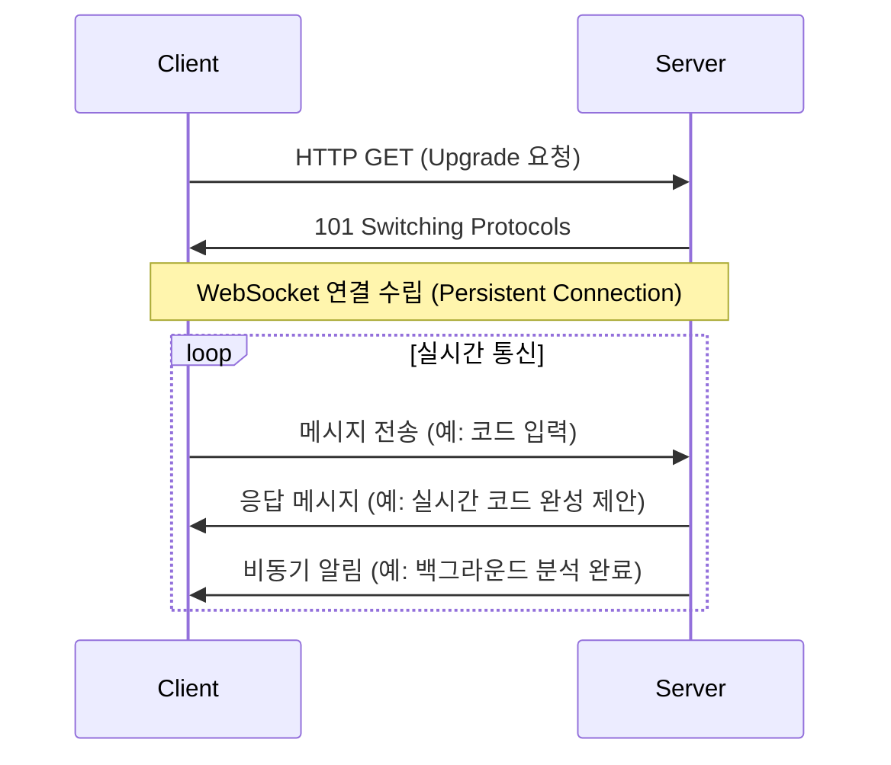

[[MCP Client]]에서 우리는 MCP 클라이언트가 전송 계층(Transport Layer)을 통해 다양한 통신 방식에 적응할 수 있다는 점을 살펴보았습니다. 오늘은 그중에서도 가장 동적이고 실시간 상호작용에 특화된 **`WebSocketClientTransport`**에 대해 깊이 있게 알아보겠습니다.

`WebSocketClientTransport`는 이름에서 알 수 있듯이 웹소켓(WebSocket) 프로토콜을 사용하여 MCP 서버와 통신하는 전송 계층의 구체적인 구현체입니다. AI 모델과 즉각적인 피드백을 주고받아야 하는 고성능 애플리케이션을 구축할 때, 이 구현체는 가장 이상적인 선택이 될 수 있습니다.

---

### 웹소켓의 핵심

`WebSocketClientTransport`를 이해하기 위해서는 먼저 웹소켓의 본질을 알아야 합니다. 기존의 HTTP 통신이 클라이언트의 요청이 있어야만 서버가 응답할 수 있는 단방향, 비연결성 모델인 반면, 웹소켓은 최초 연결 후에는 클라이언트와 서버가 서로에게 언제든지 메시지를 보낼 수 있는 **전이중(Full-Duplex) 통신** 채널을 제공합니다.

이러한 특징 덕분에 불필요한 HTTP 연결 수립 오버헤드가 없으며, 매우 낮은 지연 시간(Low Latency)으로 데이터를 주고받을 수 있습니다. 이는 과거의 HTTP 폴링과 롱폴링 같은 기술들과 비교할 때 훨씬 효율적이고 성능이 뛰어납니다.

---

### `WebSocketClientTransport`의 역할과 구조

`WebSocketClientTransport`는 [[MCP Client]]와 MCP 서버 사이에서 웹소켓 통신을 책임지는 중개자입니다. MCP kotlin-sdk 코드를 통해 그 구조를 살펴보면 다음과 같은 핵심적인 역할을 수행함을 알 수 있습니다.

1. **세션 초기화 (`initializeSession`)**: `HttpClient`를 사용하여 지정된 URL과 웹소켓 핸드셰이크를 수행하고, `WebSocketSession` 객체를 생성합니다. 이 과정에서 `Sec-WebSocket-Protocol` 헤더에 `mcp`를 명시하여 서버에 우리가 MCP 통신을 원한다는 것을 알립니다. 이는 프로토콜 수준의 협상을 위해 매우 중요합니다.
    
2. **메시지 수신 루프**: `WebSocketMcpTransport`의 `start()` 메서드 내에서, 생성된 세션의 `incoming` 채널을 지속적으로 감시하는 코루틴(Coroutine)을 실행합니다. 서버로부터 새로운 메시지가 도착하면, 이를 [[JSON-RPC]] 메시지로 디코딩하여 상위 계층인 `MCP Client`로 전달합니다.
    
3. **메시지 전송 (`send`)**: `MCP Client`가 서버로 메시지를 보내고자 할 때, `send()` 메서드는 `WebSocketSession`을 통해 메시지를 웹소켓 채널로 직접 전송합니다.
    

이처럼 `WebSocketClientTransport`는 복잡한 웹소켓의 내부 동작, 연결 관리, 메시지 직렬화 등을 캡슐화하여, `MCP Client`가 오직 '메시지를 주고받는다'는 본질적인 기능에만 집중할 수 있도록 돕습니다.

---

### 언제 `WebSocketClientTransport`를 선택해야 할까요?

MCP 전송 계층(Transport Layer)에는 여러 구현체가 존재하기 때문에, 상황에 맞는 기술을 선택하는 것이 중요합니다. `WebSocketClientTransport`는 다음과 같은 시나리오에서 가장 강력한 힘을 발휘합니다.

- **실시간 코드 완성**: 사용자가 코드를 입력하는 즉시 AI 모델이 완성 제안을 스트리밍 형태로 제공해야 할 때.
- **대화형 AI 디버깅**: 사용자와 AI가 대화하며 중단점(Breakpoint)을 설정하고 변숫값을 실시간으로 확인하는 등 상호작용이 필요할 때.
- **AI 기반 라이브 코딩 세션**: 여러 개발자가 AI의 도움을 받으며 동시에 코드를 편집하는 협업 도구를 구축할 때.
- **긴급 알림 및 상태 업데이트**: AI 모델이 백그라운드에서 코드 분석을 수행하다가 중요한 문제(예: 보안 취약점)를 발견했을 때 즉시 사용자에게 알려야 할 때.

반면, 단순히 문서 요약을 요청하거나 가끔 코드 생성을 요청하는 등 비주기적이고 단발적인 통신만 필요하다면, 연결 유지 비용이 없는 [[SseClientTransport]]나 다른 HTTP 기반 통신 방식이 더 적합할 수 있습니다.
### 결론

`WebSocketClientTransport`는 MCP 아키텍처에서 **실시간성과 상호작용**을 담당하는 핵심적인 통신 구현체입니다. 웹소켓의 낮은 지연 시간과 양방향 통신 능력을 활용하여, 사용자의 입력에 즉각적으로 반응하는 동적인 AI 기반 개발 도구를 만들 수 있습니다. 애플리케이션의 요구사항이 실시간 피드백과 지속적인 상호작용을 필요로 한다면, `WebSocketClientTransport`는 단연 최고의 선택이 될 것입니다.

### 참고 자료

- [RFC 6455 - The WebSocket Protocol](https://tools.ietf.org/html/rfc6455)
- [Spring Framework Documentation: WebSocket Support](https://www.google.com/search?q=https://docs.spring.io/spring-framework/docs/current/reference/html/web.html%23websocket)