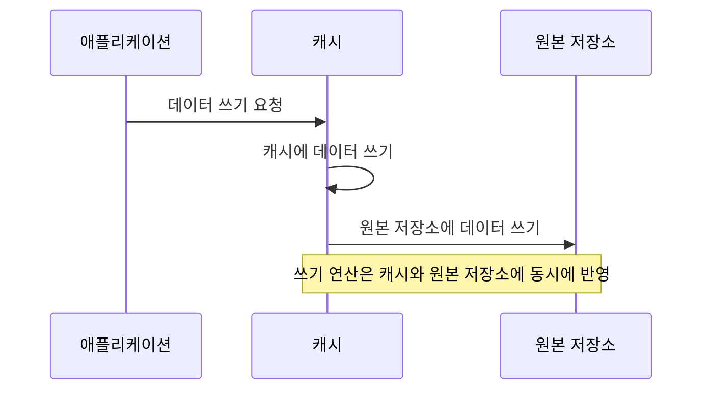

Write-Through 캐시는 애플리케이션이 데이터를 캐시에 쓰면, 그 데이터가 즉시 원본 데이터 저장소(예: 데이터베이스)에도 반영되는 방식의 캐싱 전략입니다. 즉, 쓰기 연산이 발생할 때 캐시와 원본 저장소에 동시에 데이터를 저장합니다.

## 작동 방식

Write-Through 캐시의 기본적인 작동 흐름은 다음과 같습니다.

1. **읽기(Read) 연산:**
   - 애플리케이션이 데이터를 요청하면 먼저 캐시에서 해당 데이터를 찾습니다.
   - 캐시에 데이터가 있으면(**cache hit**), 데이터를 반환합니다.
   - 캐시에 데이터가 없으면(**cache miss**), 원본 저장소에서 데이터를 가져와 캐시에 저장한 후 반환합니다.

2. **쓰기(Write) 연산:**
   - 애플리케이션이 데이터를 쓰면, 캐시와 원본 저장소에 동시에 데이터를 갱신합니다.

### Mermaid 다이어그램

## 장점

- **데이터 일관성 유지:** 캐시와 원본 저장소의 데이터가 항상 동기화되어 일관성을 유지합니다.
- **단순한 구현:** 쓰기 연산 시 캐시와 원본 저장소에 동시에 쓰기만 하면 되므로 구현이 비교적 간단합니다.
- **캐시 갱신 불필요:** 데이터 변경 시 캐시를 별도로 갱신할 필요가 없습니다.
- **일관성 부족**: Miniservice 처럼 하나의 데이터 저장소를 다수의 어플리케이션이 이용하는 경우 캐시와 원본 저장소에 불일치가 발생할 수 있습니다.

## 단점

- **쓰기 지연 증가:** 쓰기 연산 시 캐시와 원본 저장소에 모두 쓰기 때문에 지연(latency)이 증가할 수 있습니다.
- **원본 저장소 부하 증가:** 모든 쓰기 연산이 원본 저장소에 전달되므로 부하가 감소하지 않습니다.
- **확장성 제약:** 높은 쓰기 처리량이 필요한 시스템에서는 성능이 저하될 수 있습니다.

## 활용 사례

- **데이터 일관성이 중요한 시스템:** 재무 데이터나 사용자 계정 정보와 같이 데이터 일관성이 핵심인 시스템에서 활용됩니다.
- **쓰기 빈도가 낮은 애플리케이션:** 읽기 연산이 주로 발생하고 쓰기 연산이 적은 시스템에 적합합니다.

## 결론

Write-Through 캐시 전략은 데이터의 일관성을 유지하면서 캐싱을 활용하고자 할 때 유용한 방법입니다. 그러나 쓰기 연산의 성능 저하와 원본 저장소의 부하 증가를 고려해야 합니다. 시스템의 요구 사항에 따라 적절한 캐싱 전략을 선택하는 것이 중요합니다.