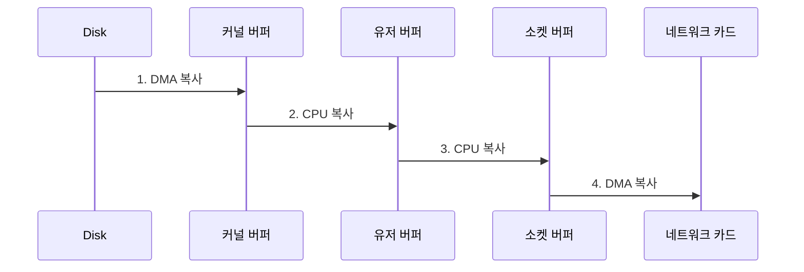
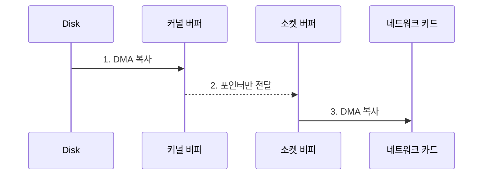
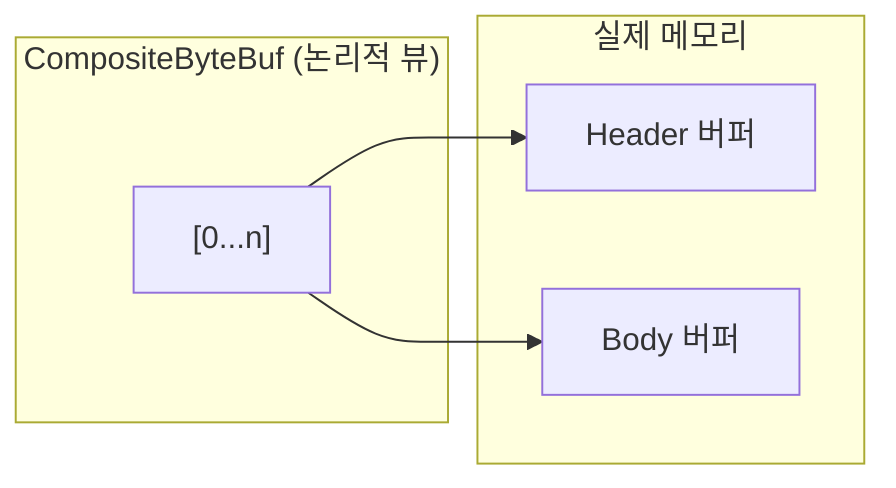

Zero-Copy는 데이터를 전송할 때 불필요한 메모리 복사를 제거하는 최적화 기법이다. CPU가 데이터를 복사하는 대신, 메모리 참조만 전달하거나 DMA(Direct Memory Access)를 활용해서 성능을 크게 향상시킨다. [[Netty]]는 [[Netty ByteBuf]]에서 다양한 Zero-Copy 기법을 지원한다.

---

## 전통적인 데이터 전송의 문제

파일을 네트워크로 전송하는 전통적인 방식을 보자.

```java
// 전통적인 파일 전송
File file = new File("data.txt");
byte[] buffer = new byte[4096];

FileInputStream fis = new FileInputStream(file);
SocketOutputStream sos = socket.getOutputStream();

int bytesRead;
while ((bytesRead = fis.read(buffer)) != -1) {
    sos.write(buffer, 0, bytesRead);
}
```

이 코드에서 데이터가 몇 번 복사되는지 살펴보면:



**4번의 복사, 4번의 컨텍스트 스위칭**이 발생한다. 데이터는 커널 영역과 유저 영역을 오가며 불필요하게 복사된다.

---

## OS 레벨 Zero-Copy

### sendfile() 시스템 콜

Linux의 `sendfile()`은 커널 내에서 직접 파일 데이터를 소켓으로 전송한다.



유저 공간으로의 복사가 사라졌다. Java NIO의 `FileChannel.transferTo()`가 이를 사용한다.

```java
FileChannel fileChannel = FileChannel.open(Paths.get("data.txt"));
SocketChannel socketChannel = SocketChannel.open(address);

// Zero-Copy 전송
fileChannel.transferTo(0, fileChannel.size(), socketChannel);
```

---

## Netty의 Zero-Copy 기법

[[Netty]]는 애플리케이션 레벨에서 여러 Zero-Copy 최적화를 제공한다.

### 1. CompositeByteBuf

여러 버퍼를 하나처럼 다룰 때 데이터를 복사하지 않는다.

```java
ByteBuf header = Unpooled.copiedBuffer("HTTP/1.1 200 OK\r\n", CharsetUtil.UTF_8);
ByteBuf body = Unpooled.copiedBuffer("<html>...</html>", CharsetUtil.UTF_8);

// 전통적 방식: 새 버퍼에 복사
ByteBuf combined = Unpooled.buffer(header.readableBytes() + body.readableBytes());
combined.writeBytes(header);  // 복사
combined.writeBytes(body);    // 복사

// Zero-Copy: CompositeByteBuf
CompositeByteBuf composite = Unpooled.compositeBuffer();
composite.addComponents(true, header, body);
// 복사 없이 두 버퍼를 하나처럼 사용
```



### 2. slice()

버퍼의 일부분을 새 버퍼로 만들 때 복사하지 않는다.

```java
ByteBuf original = Unpooled.copiedBuffer("Hello World", CharsetUtil.UTF_8);

// 전통적 방식: 복사
ByteBuf copied = original.copy(0, 5);  // "Hello" 복사

// Zero-Copy: slice
ByteBuf sliced = original.slice(0, 5);  // "Hello"의 뷰
// sliced는 original과 같은 메모리를 참조
```

### 3. Unpooled.wrappedBuffer()

기존 바이트 배열을 ByteBuf로 감쌀 때 복사하지 않는다.

```java
byte[] data = "Hello World".getBytes();

// 전통적 방식: 복사
ByteBuf copied = Unpooled.copiedBuffer(data);

// Zero-Copy: 래핑
ByteBuf wrapped = Unpooled.wrappedBuffer(data);
// wrapped는 data 배열을 직접 참조
// 주의: data 배열을 수정하면 wrapped도 영향받음
```

### 4. FileRegion

파일을 네트워크로 전송할 때 OS의 Zero-Copy를 활용한다.

```java
FileChannel fileChannel = FileChannel.open(Paths.get("large-file.bin"));
FileRegion region = new DefaultFileRegion(fileChannel, 0, fileChannel.size());

// sendfile() 시스템 콜 사용
channel.writeAndFlush(region);
```

### 5. Direct Buffer

JVM 힙이 아닌 네이티브 메모리에 버퍼를 할당해서 I/O 시 복사를 줄인다.

```java
// Heap Buffer: I/O 시 네이티브 메모리로 복사 필요
ByteBuf heapBuf = ctx.alloc().heapBuffer();

// Direct Buffer: 네이티브 메모리에 직접 할당
ByteBuf directBuf = ctx.alloc().directBuffer();
// I/O 시 추가 복사 없음
```

---

## 주의사항

### 참조 카운팅

Zero-Copy로 생성된 버퍼는 원본과 메모리를 공유한다. [[참조 카운팅]]을 올바르게 관리해야 한다.

```java
ByteBuf original = ctx.alloc().buffer();
ByteBuf slice = original.slice();

// slice는 original의 참조 카운트에 의존
slice.retain();  // 필요시 명시적으로 유지

// 사용 후 해제
slice.release();
original.release();
```

### 불변성

공유 메모리를 수정하면 예상치 못한 부작용이 발생할 수 있다.

```java
ByteBuf original = Unpooled.copiedBuffer("Hello", CharsetUtil.UTF_8);
ByteBuf slice = original.slice();

// slice를 수정하면 original도 변경됨!
slice.setByte(0, 'h');
// original도 "hello"가 됨
```

---

## 성능 비교

대용량 파일 전송 시 Zero-Copy의 효과:

| 방식 | 처리량 | CPU 사용률 |
|-----|-------|-----------|
| 전통적 (read + write) | 1x | 높음 |
| transferTo (sendfile) | 2~3x | 낮음 |
| FileRegion (Netty) | 2~3x | 낮음 |

작은 데이터에서는 차이가 미미하지만, 대용량 전송에서는 2~3배의 성능 향상을 얻을 수 있다.

---

## References

- [[Netty]]
- [[Netty ByteBuf]]
- [[참조 카운팅]]
- [Zero Copy I - User Mode Perspective](https://www.linuxjournal.com/article/6345)
