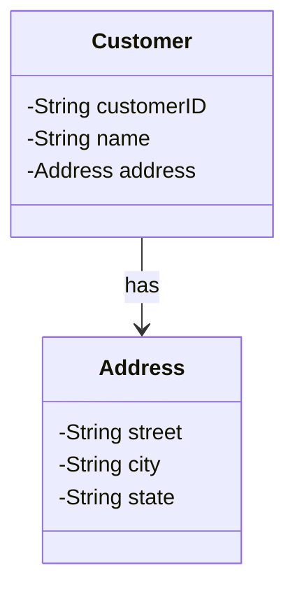

객체지향 설계에서 가장 흔히 접하는 객체는 [[엔티티(Entity)]]입니다. 하지만 도메인 모델링에서 똑같이 중요하지만 종종 간과되는 것이 바로 값 객체(Value Object)입니다. 오늘은 값 객체의 개념, 특성, 설계 방법 및 활용 사례에 대해 자세히 알아보겠습니다.

## 값 객체란 무엇인가?

값 객체는 개념적 식별성(conceptual identity)이 없는 도메인 객체입니다. 쉽게 말해, 값 객체는 '무엇(what)'인지가 중요하지 '누구(who)'인지는 중요하지 않은 객체입니다.

이해를 돕기 위해 간단한 예를 들어보겠습니다. 아이가 그림을 그릴 때 사용하는 마커펜을 생각해보세요. 아이는 마커의 색상이나 펜 끝의 두께에는 관심이 있지만, 동일한 색상과 모양의 마커가 두 개 있다면 어느 것을 사용하든 상관하지 않습니다. 마커가 없어져서 새 팩에서 같은 색상의 다른 마커로 대체해도 아이는 계속해서 그림을 그릴 수 있습니다.

반면, 냉장고에 붙어있는 여러 그림 중에서 자신이 그린 그림과 누나가 그린 그림은 쉽게 구별할 수 있습니다. 아이와 그의 누나, 그리고 완성된 그림들은 식별성을 가지는 유용한 엔티티입니다. 그러나 그림의 각 선이 어떤 마커로 그려졌는지 추적해야 한다면 그림 그리기는 더 이상 아이 장난이 아닐 것입니다.

## 값 객체의 특성

값 객체의 핵심 특성은 다음과 같습니다:

1. **식별성 없음**: 값 객체는 ID로 식별되지 않으며, 속성 값으로만 구별됩니다.
2. **불변성(Immutability)**: 값 객체는 생성 후 변경되지 않아야 합니다.
3. **개념적 완전함**: 값 객체는 개념적으로 하나의 완전한 단위를 형성해야 합니다.
4. **교체 가능성**: 값 객체의 상태를 변경하려면 완전히 새로운 객체로 교체해야 합니다.

이러한 특성은 시스템의 복잡성을 줄이고, 모델을 명확하게 하며, 성능 최적화 기회를 제공합니다.

## 값 객체의 예시

값 객체는 단순할 수도 있고 복잡할 수도 있습니다:

- **단순한 값 객체**: 문자열, 숫자, 날짜, 색상 등
- **복합 값 객체**: 주소, 돈, 날짜 범위, 좌표 등

예를 들어, 색상 혼합 프로그램에서는 색상 객체가 다른 색상과 결합하여 새로운 색상을 만들어내는 복잡한 알고리즘을 가질 수 있습니다.

또한 값 객체는 다른 값 객체나 심지어 엔티티를 참조할 수도 있습니다. 예를 들어, 온라인 지도 서비스에서 샌프란시스코에서 로스앤젤레스까지의 경로 객체는 값 객체일 수 있습니다. 비록 이 경로가 참조하는 두 도시와 고속도로는 모두 엔티티이지만, 경로 자체는 값 객체입니다.

## 값 객체 설계하기

값 객체를 설계할 때는 다음과 같은 원칙을 고려해야 합니다:

### 1. 불변성 유지하기

값 객체는 생성 후에 상태가 변경되지 않도록 설계하는 것이 중요합니다. 이렇게 하면 값 객체를 안전하게 공유하고 참조로 전달할 수 있습니다.

```java
public final class Money {
    private final BigDecimal amount;
    private final Currency currency;
    
    public Money(BigDecimal amount, Currency currency) {
        this.amount = amount;
        this.currency = currency;
    }
    
    // 새로운 Money 객체를 반환하는 연산
    public Money add(Money other) {
        if (!currency.equals(other.currency)) {
            throw new IllegalArgumentException("통화가 다릅니다");
        }
        return new Money(amount.add(other.amount), currency);
    }
    
    // 값 접근자
    public BigDecimal getAmount() {
        return amount;
    }
    
    public Currency getCurrency() {
        return currency;
    }
    
    // equals와 hashCode 구현
    @Override
    public boolean equals(Object o) {
        if (this == o) return true;
        if (o == null || getClass() != o.getClass()) return false;
        Money money = (Money) o;
        return amount.compareTo(money.amount) == 0 && 
               currency.equals(money.currency);
    }
    
    @Override
    public int hashCode() {
        return Objects.hash(amount, currency);
    }
}
```

위 코드에서 `Money` 클래스는 불변으로 설계되었습니다. 모든 필드가 `final`이며, 값을 변경하는 대신 새로운 객체를 생성하여 반환합니다.

### 2. 개념적 완전함 보장하기

값 객체를 구성하는 속성들은 개념적으로 하나의 완전한 단위를 형성해야 합니다. 예를 들어, 거리, 도시, 우편번호는 개별 속성이 아니라 주소라는 하나의 완전한 값 객체로 모델링하는 것이 좋습니다.



이렇게 하면 `Customer` 객체는 더 단순해지고, `Address`는 더 응집력 있는 값 객체가 됩니다.

### 3. equals()와 hashCode() 구현하기

값 객체는 속성 값으로만 동등성을 판단하므로, `equals()`와 `hashCode()` 메서드를 올바르게 구현하는 것이 중요합니다.

```java
@Override
public boolean equals(Object o) {
    if (this == o) return true;
    if (o == null || getClass() != o.getClass()) return false;
    Address address = (Address) o;
    return Objects.equals(street, address.street) && 
           Objects.equals(city, address.city) && 
           Objects.equals(state, address.state);
}

@Override
public int hashCode() {
    return Objects.hash(street, city, state);
}
```

### 4. 방어적 복사 활용하기

변경 가능한 객체를 값 객체의 속성으로 사용할 경우, 생성자와 접근자에서 방어적 복사를 사용하여 불변성을 보장해야 합니다.

```java
public class Period {
    private final Date start;
    private final Date end;
    
    public Period(Date start, Date end) {
        // 방어적 복사
        this.start = new Date(start.getTime());
        this.end = new Date(end.getTime());
        
        // 유효성 검사
        if (this.start.compareTo(this.end) > 0) {
            throw new IllegalArgumentException("시작 날짜가 종료 날짜보다 늦을 수 없습니다");
        }
    }
    
    public Date getStart() {
        // 방어적 복사로 반환
        return new Date(start.getTime());
    }
    
    public Date getEnd() {
        // 방어적 복사로 반환
        return new Date(end.getTime());
    }
}
```

## 값 객체의 성능 최적화

값 객체의 불변성과 식별성 부재는 다양한 성능 최적화 기회를 제공합니다:

### 1. 값 객체 공유

동일한 값을 가진 여러 객체가 필요한 경우, 불변 값 객체를 공유하여 메모리 사용량을 줄일 수 있습니다. 이는 [[플라이웨이트 패턴(Flyweight Pattern)]]의 예시입니다.

```java
public class ColorFactory {
    private static final Map<String, Color> colors = new HashMap<>();
    
    public static Color getColor(int red, int green, int blue) {
        String key = red + "-" + green + "-" + blue;
        
        // 이미 존재하는 색상이면 재사용
        if (colors.containsKey(key)) {
            return colors.get(key);
        }
        
        // 새로운 색상 생성 및 저장
        Color color = new Color(red, green, blue);
        colors.put(key, color);
        return color;
    }
}
```

### 2. 데이터베이스 최적화

값 객체를 데이터베이스에 저장할 때 다양한 최적화가 가능합니다:

- **비정규화(Denormalization)**: 값 객체를 엔티티 테이블에 인라인으로 저장하여 조인 없이 데이터에 접근할 수 있습니다.
- **임베디드 값 객체**: JPA와 같은 ORM 프레임워크에서는 `@Embeddable`과 `@Embedded` 애노테이션을 사용하여 값 객체를 엔티티 테이블에 직접 매핑할 수 있습니다.

```java
@Entity
public class Customer {
    @Id
    private String id;
    private String name;
    
    @Embedded
    private Address address;
    
    // ...
}

@Embeddable
public class Address {
    private String street;
    private String city;
    private String state;
    
    // ...
}
```

## 값 객체와 도메인 모델

값 객체를 활용한 도메인 모델링은 다음과 같은 이점을 제공합니다:

1. **도메인 언어 강화**: 값 객체는 도메인 개념을 더 명확하게 표현합니다.
2. **부수 효과 감소**: 불변 객체는 부수 효과를 줄여 버그 발생 가능성을 낮춥니다.
3. **테스트 용이성**: 상태가 변하지 않기 때문에 테스트하기 쉽습니다.
4. **분산 시스템 적합성**: 값 객체는 분산 시스템에서 안전하게 전달될 수 있습니다.

## 값 객체인가, 엔티티인가?

객체가 값 객체인지 엔티티인지 결정할 때는 도메인 컨텍스트를 고려해야 합니다. 같은 개념이라도 다른 컨텍스트에서는 다르게 모델링될 수 있습니다.

예를 들어, 주소(Address)의 경우:

- **통신판매 회사 소프트웨어**: 주소는 신용카드 확인과 소포 배송을 위해 필요하지만, 같은 위치에 있는 룸메이트가 별도로 주문하는 경우 그들이 같은 위치에 있다는 것을 인식하는 것은 중요하지 않습니다. 이 경우 주소는 값 객체입니다.
    
- **우편 서비스 소프트웨어**: 배달 경로를 조직화하기 위한 소프트웨어에서는 국가가 지역, 도시, 우편 구역, 블록 등으로 계층화되고, 개별 주소로 끝납니다. 이러한 주소 객체는 계층 구조에서 부모로부터 우편번호를 파생하고, 우편 서비스가 우편 구역을 재할당하면 그 안의 모든 주소가 함께 변경됩니다. 이 경우 주소는 엔티티입니다.
    
- **전기 유틸리티 회사 소프트웨어**: 주소는 전선과 서비스의 목적지에 해당합니다. 룸메이트는 별도의, 독립적인 전기 서비스를 주문하지 않으며, 만약 그렇게 한다면 회사는 그것을 인식해야 합니다. 이 경우 주소는 엔티티입니다. 또는 "주거지(Dwelling)"가 엔티티이고, 주소는 그 속성일 수 있습니다. 그렇다면 주소는 값 객체입니다.
    

## 값 객체 관련 연관관계 설계

값 객체와 관련된 연관관계를 설계할 때는 다음 사항을 고려해야 합니다:

1. **단방향 연관관계 선호**: 두 값 객체 간의 양방향 연관관계는 의미가 없습니다. 식별성이 없기 때문에, 한 객체가 자신을 가리키는 동일한 값 객체를 다시 가리킨다는 것은 의미가 없습니다.
    
2. **값 객체 컬렉션 관리**: 값 객체의 컬렉션을 관리할 때는 불변성을 유지하기 위해 추가/제거 작업 시 새로운 컬렉션을 반환하는 방식을 고려해야 합니다.
    

```java
public class Order {
    private Set<OrderLineItem> lineItems;
    
    public Order addLineItem(Product product, int quantity) {
        Set<OrderLineItem> newLineItems = new HashSet<>(lineItems);
        newLineItems.add(new OrderLineItem(product, quantity));
        return new Order(newLineItems);
    }
}
```

## 예외적으로 가변성을 허용하는 경우

일반적으로 값 객체는 불변이어야 하지만, 다음과 같은 경우에는 성능상의 이유로 가변성을 허용할 수 있습니다:

1. **값이 자주 변경되는 경우**
2. **객체 생성이나 삭제 비용이 높은 경우**
3. **교체(대체)가 클러스터링을 방해하는 경우**
4. **값 객체의 공유가 많지 않거나 클러스터링 개선 등의 이유로 공유를 포기한 경우**

단, 값 객체가 가변적이라면 절대 공유해서는 안 됩니다. 공유 여부와 관계없이 가능한 한 값 객체는 불변으로 설계하는 것이 좋습니다.

## 스프링에서의 값 객체 구현

스프링 프레임워크에서 값 객체를 구현할 때는 다음과 같은 기능을 활용할 수 있습니다:

### JPA와 값 객체

```java
@Entity
public class Order {
    @Id
    @GeneratedValue
    private Long id;
    
    private String customerName;
    
    @Embedded
    private Address shippingAddress;
    
    @Embedded
    @AttributeOverrides({
        @AttributeOverride(name = "street", column = @Column(name = "billing_street")),
        @AttributeOverride(name = "city", column = @Column(name = "billing_city")),
        @AttributeOverride(name = "state", column = @Column(name = "billing_state"))
    })
    private Address billingAddress;
    
    // ...
}
```

### 스프링 부트 컨버터

스프링 부트에서는 `Converter` 인터페이스를 구현하여 값 객체와 데이터베이스 값 사이의 변환을 처리할 수 있습니다:

```java
@Converter(autoApply = true)
public class MoneyConverter implements AttributeConverter<Money, String> {
    
    @Override
    public String convertToDatabaseColumn(Money money) {
        return money == null ? null : money.getAmount() + "," + money.getCurrency();
    }
    
    @Override
    public Money convertToEntityAttribute(String dbData) {
        if (dbData == null || dbData.isEmpty()) {
            return null;
        }
        
        String[] parts = dbData.split(",");
        return new Money(new BigDecimal(parts[0]), Currency.getInstance(parts[1]));
    }
}
```

## 결론

값 객체는 도메인 모델링에서 중요한 구성 요소입니다. 식별성 없이 속성 값으로만 정의되는 값 객체는 시스템을 단순화하고, 성능을 최적화하며, 도메인 개념을 더 명확하게 표현하는 데 도움이 됩니다.

값 객체를 효과적으로 설계하기 위해서는 불변성을 유지하고, 개념적 완전함을 보장하며, 도메인 컨텍스트에 맞게 엔티티와 값 객체를 구분해야 합니다. 이러한 원칙을 따르면 더 견고하고 표현력이 풍부한 도메인 모델을 구축할 수 있습니다.

## 참고 자료

- Domain-Driven Design: Tackling Complexity in the Heart of Software by Eric Evans
- Implementing Domain-Driven Design by Vaughn Vernon
- Patterns of Enterprise Application Architecture by Martin Fowler
- [[엔티티(Entity) 와 Value Objects 의 차이]]