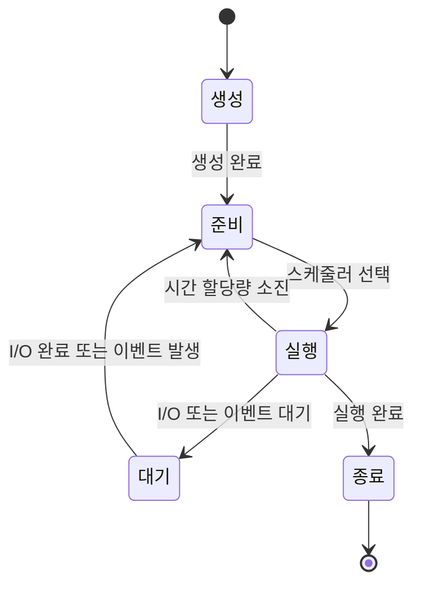

프로세스는 컴퓨터 시스템에서 실행 중인 프로그램의 인스턴스를 의미합니다. 운영체제는 이러한 프로세스들을 관리하고, 각 프로세스에 필요한 자원을 할당하며, 프로세스 간의 상호작용을 조정합니다. 프로세스는 현대 컴퓨팅 환경의 핵심 개념으로, 다중 작업 처리와 시스템 자원의 효율적 활용을 가능하게 합니다.

## 프로세스의 기본 구성 요소

프로세스는 다음과 같은 주요 구성 요소로 이루어져 있습니다:

1. **코드 세그먼트(Code Segment)**: 실행될 프로그램의 기계어 코드가 저장된 영역입니다.
2. **데이터 세그먼트(Data Segment)**: 전역 변수와 정적 변수가 저장되는 영역입니다.
3. **힙(Heap)**: 동적으로 할당되는 메모리 영역으로, 프로그램 실행 중에 크기가 변할 수 있습니다.
4. **스택(Stack)**: 함수 호출 정보, 지역 변수, 매개변수 등이 저장되는 영역입니다.
5. **프로세스 제어 블록(PCB)**: 프로세스의 상태 정보를 포함하는 자료구조입니다.

자세한 메모리 구조는 [[프로세스 메모리 구조]]를 참고해주세요.

## 프로세스의 생명주기

프로세스는 생성부터 종료까지 여러 상태를 거치게 됩니다. 주요 상태는 다음과 같습니다:



1. **생성(Created)**: 프로세스가 생성되었으나 아직 시스템에 완전히 로드되지 않은 상태입니다.
2. **준비(Ready)**: 프로세스가 실행을 위해 준비되었지만 CPU가 할당되지 않은 상태입니다.
3. **실행(Running)**: 프로세스가 CPU를 할당받아 명령어를 실행하고 있는 상태입니다.
4. **대기(Waiting/Blocked)**: 프로세스가 I/O 작업이나 이벤트 발생을 기다리는 상태입니다.
5. **종료(Terminated)**: 프로세스 실행이 완료되어 자원을 반환하고 시스템에서 제거되는 상태입니다.

프로세스 상태 전이에 대한 자세한 내용은 [[프로세스 상태 전이]]를 참고해주세요.

## 프로세스 제어 블록(PCB)

프로세스 제어 블록(Process Control Block)은 운영체제가 프로세스를 관리하기 위해 유지하는 자료구조입니다. PCB에는 다음과 같은 정보가 포함됩니다:

1. **프로세스 식별자(PID)**: 각 프로세스를 고유하게 식별하는 번호입니다.
2. **프로세스 상태**: 현재 프로세스의 상태(준비, 실행, 대기 등)를 나타냅니다.
3. **프로그램 카운터(PC)**: 다음에 실행할 명령어의 주소를 가리킵니다.
4. **CPU 레지스터**: 프로세스가 CPU를 사용할 때 저장되는 레지스터 값들입니다.
5. **CPU 스케줄링 정보**: 프로세스의 우선순위, 스케줄링 큐 포인터 등의 정보입니다.
6. **메모리 관리 정보**: 프로세스에 할당된 메모리 경계, 페이지 테이블 등의 정보입니다.
7. **자원 사용 정보**: 프로세스가 사용한 CPU 시간, 실제 사용된 시간 등의 정보입니다.
8. **I/O 상태 정보**: 프로세스에 할당된 입출력 장치, 열린 파일 목록 등의 정보입니다.

PCB에 대한 자세한 내용은 [[프로세스 제어 블록]]을 참고해주세요.

## 프로세스 스케줄링

프로세스 스케줄링은 다수의 프로세스가 제한된 CPU 자원을 효율적으로 사용하기 위한 기법입니다. 주요 스케줄링 알고리즘은 다음과 같습니다:

1. **선입선출(FIFO)**: 프로세스가 준비 큐에 도착한 순서대로 CPU를 할당받는 방식입니다.
2. **최단 작업 우선(SJF)**: 실행 시간이 가장 짧은 프로세스에게 CPU를 먼저 할당하는 방식입니다.
3. **우선순위 기반**: 각 프로세스에 우선순위를 부여하고, 높은 우선순위를 가진 프로세스에게 CPU를 먼저 할당하는 방식입니다.
4. **라운드 로빈(RR)**: 각 프로세스에 동일한 시간 할당량을 부여하고, 시간이 만료되면 다음 프로세스에게 CPU를 넘기는 방식입니다.
5. **다단계 큐**: 프로세스를 여러 종류의 큐로 분류하고, 각 큐마다 다른 스케줄링 알고리즘을 적용하는 방식입니다.

다양한 스케줄링 알고리즘과 그 특성에 대한 자세한 내용은 [[프로세스 스케줄링 알고리즘]]을 참고해주세요.

## 프로세스 간 통신(IPC)

프로세스 간 통신(Inter-Process Communication, IPC)은 프로세스들이 서로 데이터를 주고받을 수 있게 하는 메커니즘입니다. 주요 IPC 방식은 다음과 같습니다:

1. **파이프(Pipe)**: 단방향 통신을 위한 채널로, 주로 부모-자식 프로세스 간 통신에 사용됩니다.
2. **명명된 파이프(Named Pipe)**: 관련 없는 프로세스들 간의 통신을 위한 파이프입니다.
3. **메시지 큐(Message Queue)**: 프로세스들이 메시지를 교환할 수 있는 큐 기반의 통신 방식입니다.
4. **공유 메모리(Shared Memory)**: 여러 프로세스가 동일한 메모리 영역에 접근하여 데이터를 공유하는 방식입니다.
5. **세마포어(Semaphore)**: 프로세스 간의 동기화와 공유 자원 접근 제어에 사용되는 기법입니다.
6. **소켓(Socket)**: 네트워크를 통한 원격 프로세스 간 통신을 위한 방식입니다.

각 IPC 방식의 특징과 사용 방법에 대한 자세한 내용은 [[IPC(Inter-Process Communication)]]을 참고해주세요.

## 프로세스와 스레드의 차이

프로세스는 독립적인 실행 환경을 가진 프로그램의 인스턴스인 반면, 스레드는 프로세스 내에서 실행되는 작은 실행 단위입니다. 주요 차이점은 다음과 같습니다:

1. **자원 공유**: 프로세스는 독립적인 메모리 공간을 가지지만, 스레드는 프로세스의 자원을 공유합니다.
2. **생성 비용**: 프로세스 생성은 상대적으로 많은 자원을 필요로 하지만, 스레드 생성은 더 적은 자원을 필요로 합니다.
3. **문맥 교환**: 프로세스 간 문맥 교환은 비용이 크지만, 같은 프로세스 내 스레드 간 문맥 교환은 상대적으로 비용이 적습니다.
4. **통신**: 프로세스 간 통신은 IPC 메커니즘을 필요로 하지만, 스레드는 공유 메모리를 통해 직접 통신할 수 있습니다.

프로세스와 스레드의 관계와 차이점에 대한 자세한 내용은 [[프로세스와 스레드 비교]]를 참고해주세요.

## 자바에서의 프로세스 관리

자바는 `ProcessBuilder` 클래스와 `Process` 클래스를 통해 외부 프로세스를 생성하고 제어할 수 있습니다. 다음은 자바에서 외부 프로세스를 실행하는 간단한 예시입니다:

```java
import java.io.BufferedReader;
import java.io.IOException;
import java.io.InputStreamReader;

public class ProcessExample {
    public static void main(String[] args) {
        try {
            // 외부 명령어 실행을 위한 ProcessBuilder 생성
            ProcessBuilder processBuilder = new ProcessBuilder("ls", "-l");
            
            // 프로세스 생성 및 시작
            Process process = processBuilder.start();
            
            // 프로세스의 출력 스트림 읽기
            BufferedReader reader = new BufferedReader(
                new InputStreamReader(process.getInputStream()));
            
            String line;
            while ((line = reader.readLine()) != null) {
                System.out.println(line);
            }
            
            // 프로세스 종료 대기
            int exitCode = process.waitFor();
            System.out.println("프로세스 종료 코드: " + exitCode);
            
        } catch (IOException | InterruptedException e) {
            e.printStackTrace();
        }
    }
}
```

자바에서의 프로세스 관리에 대한 자세한 내용은 [[자바 프로세스 관리]]를 참고해주세요.

## 스프링 프레임워크에서의 프로세스 관리

스프링 프레임워크에서는 `TaskExecutor` 인터페이스와 `@Async` 애노테이션을 통해 비동기 처리를 구현할 수 있습니다. 또한 `@Scheduled` 애노테이션을 사용하여 주기적인 작업을 스케줄링할 수 있습니다.

스프링에서의 비동기 처리와 스케줄링에 대한 자세한 내용은 [[스프링 비동기 처리]]와 [[스프링 스케줄링]]을 참고해주세요.

## 프로세스 모니터링과 관리

운영체제는 프로세스를 모니터링하고 관리하기 위한 다양한 도구와 명령어를 제공합니다:

1. **Unix/Linux**: `ps`, `top`, `htop`, `kill` 등의 명령어
2. **Windows**: 작업 관리자, `tasklist`, `taskkill` 등의 명령어
3. **모니터링 도구**: Nagios, Zabbix, Prometheus 등의 도구

프로세스 모니터링과 관리에 대한 자세한 내용은 [[프로세스 모니터링 도구]]를 참고해주세요.

## 결론

프로세스는 현대 운영체제의 핵심 개념으로, 다중 작업 처리와 시스템 자원의 효율적 활용을 가능하게 합니다. 이 문서에서는 프로세스의 기본 개념, 생명주기, 관리 방법 등에 대해 살펴보았습니다. 개발자로서 프로세스의 동작 원리를 이해하면 더 효율적인 프로그램을 작성하고 시스템 자원을 최적화하는 데 도움이 됩니다.

프로세스와 관련된 더 자세한 주제들은 이 문서에서 링크된 관련 문서들을 참고해주세요.