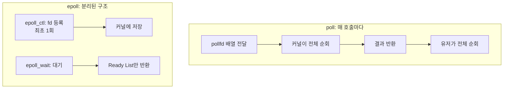
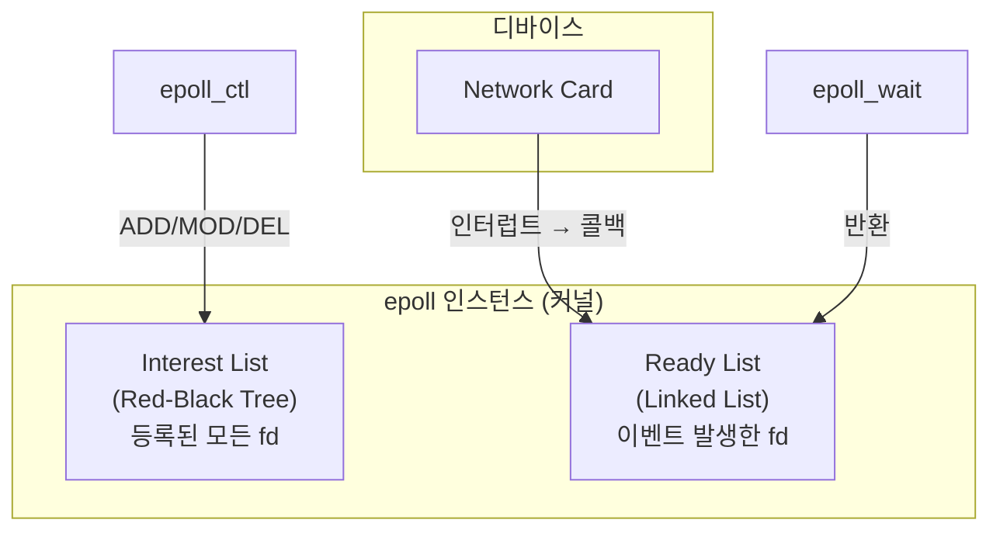
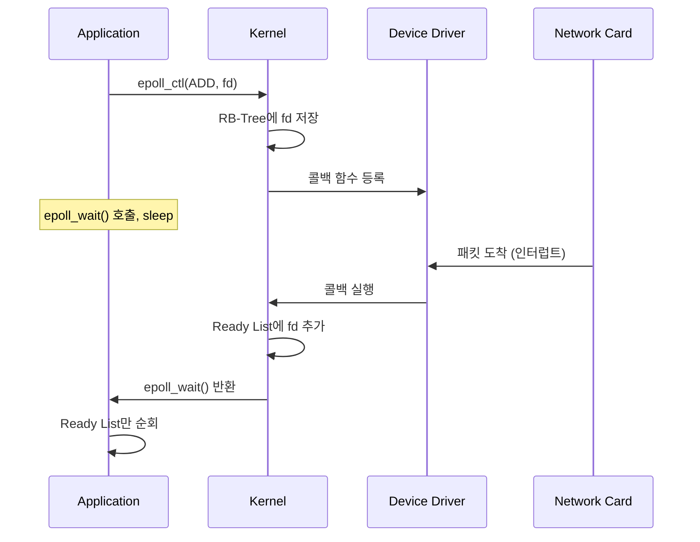

---
tags:
  - linux
  - io
  - system-call
  - performance
---

epoll은 Linux 2.5.45(2002년)에서 도입된 고성능 [[IO 멀티플렉싱(IO Multiplexing)]] API다. [[select]]와 [[poll]]이 O(n) 시간복잡도를 가지는 것과 달리, epoll은 O(1)로 동작해 수만 개의 동시 연결을 효율적으로 처리할 수 있다. Nginx, HAProxy, Redis 등 고성능 서버들이 epoll을 사용하며, [[Java NIO]]의 Selector도 Linux에서는 내부적으로 epoll을 사용한다.

---

## 핵심 API

epoll은 세 가지 시스템 콜로 구성된다:

```c
#include <sys/epoll.h>

// 1. epoll 인스턴스 생성
int epfd = epoll_create(1);  // 또는 epoll_create1(0)

// 2. fd 등록/수정/삭제
struct epoll_event ev;
ev.events = EPOLLIN;
ev.data.fd = socket_fd;
epoll_ctl(epfd, EPOLL_CTL_ADD, socket_fd, &ev);

// 3. 이벤트 대기
struct epoll_event events[MAX_EVENTS];
int nfds = epoll_wait(epfd, events, MAX_EVENTS, timeout);

for (int i = 0; i < nfds; i++) {
    // 준비된 fd만 순회 (핵심!)
    int fd = events[i].data.fd;
    if (events[i].events & EPOLLIN) {
        read(fd, buf, sizeof(buf));
    }
}
```

| 함수 | 역할 |
|------|------|
| `epoll_create()` | epoll 인스턴스 생성, fd 반환 |
| `epoll_ctl()` | fd 추가(ADD), 수정(MOD), 삭제(DEL) |
| `epoll_wait()` | 이벤트 대기, 준비된 fd 목록 반환 |

---

## poll과의 결정적 차이



| 항목 | [[poll]] | epoll |
|------|----------|-------|
| fd 등록 | 매 호출마다 전달 | 최초 1회 (`epoll_ctl`) |
| 커널 검사 | 전체 순회 O(n) | [[Ready List]] 확인 O(1) |
| 결과 반환 | 전체 배열 | 준비된 것만 |
| 메모리 복사 | 매번 전체 | 없음 |

---

## 내부 구조

epoll 인스턴스는 커널에서 두 가지 자료구조를 관리한다:



### Interest List (Red-Black Tree)

`epoll_ctl()`로 등록된 모든 fd를 저장한다. Red-Black Tree를 사용해 O(log n)으로 추가/삭제/검색이 가능하다.

### Ready List (Linked List)

이벤트가 발생한 fd만 저장한다. 커널이 인터럽트 처리 시 콜백을 통해 이 리스트에 fd를 추가한다.

---

## 콜백 메커니즘

epoll이 O(1)인 핵심 이유는 **콜백 방식**이다:



[[poll]]은 "내가 확인할게"(polling) 방식이지만, epoll은 "준비되면 알려줘"(callback) 방식이다.

---

## Level Triggered vs Edge Triggered

epoll은 두 가지 트리거 모드를 지원한다:

```c
// Level Triggered (기본값)
ev.events = EPOLLIN;

// Edge Triggered
ev.events = EPOLLIN | EPOLLET;
```

| 모드 | 동작 | 특징 |
|------|------|------|
| **LT** (Level) | 데이터 있으면 계속 알림 | 안전, 구현 쉬움 |
| **ET** (Edge) | 상태 변화 시 1번만 알림 | 고성능, 구현 까다로움 |

### 예시: 100바이트 도착, 50바이트만 읽음

```
Level Triggered:
  epoll_wait() → EPOLLIN (아직 50바이트 있으니까)
  epoll_wait() → EPOLLIN (계속 알림)

Edge Triggered:
  epoll_wait() → EPOLLIN (최초 1회)
  epoll_wait() → 블로킹 (새 데이터 올 때까지 알림 없음!)
```

Edge Triggered 사용 시 반드시 EAGAIN까지 읽어야 한다:

```c
// ET 모드에서 올바른 읽기
while (1) {
    ssize_t n = read(fd, buf, sizeof(buf));
    if (n == -1) {
        if (errno == EAGAIN) break;  // 다 읽음
        // 에러 처리
    }
    process(buf, n);
}
```

---

## 성능 비교

10,000개 fd 감시, 100개 활성 기준:

| fd 수 | poll (µs) | epoll (µs) |
|-------|-----------|------------|
| 10 | 0.61 | 0.41 |
| 100 | 2.9 | 0.42 |
| 1,000 | 35 | 0.53 |
| 10,000 | 990 | 0.66 |

fd 수가 늘어도 epoll은 거의 일정한 성능을 유지한다. 이것이 C10K 문제 해결의 핵심이다.

---

## EPOLLONESHOT

한 번 이벤트를 받으면 자동으로 비활성화되는 옵션:

```c
ev.events = EPOLLIN | EPOLLONESHOT;
```

멀티스레드 환경에서 같은 fd를 여러 스레드가 동시에 처리하는 것을 방지한다. 다시 활성화하려면 `epoll_ctl(MOD)`를 호출해야 한다.

Edge Triggered 모드에서 여러 청크의 데이터가 도착하면 여러 이벤트가 발생할 수 있는데, EPOLLONESHOT을 사용하면 첫 이벤트 이후 자동으로 비활성화된다.

---

## Thundering Herd 최적화

여러 스레드(또는 프로세스)가 같은 epoll fd에서 `epoll_wait()`로 대기 중일 때, Edge Triggered 모드에서는 이벤트 발생 시 **하나의 스레드만** 깨운다. 이는 "thundering herd" 문제를 방지하는 최적화다.

---

## 주의사항

### 1. epoll_wait의 maxevents

```c
// 너무 작으면 여러 번 호출 필요
epoll_wait(epfd, events, 1, -1);  // 비효율

// 적절한 크기 사용
epoll_wait(epfd, events, 1024, -1);
```

### 2. fd 닫기 전 삭제

```c
// fd를 닫으면 자동으로 epoll에서 제거되지만,
// dup()된 fd가 있으면 제거되지 않음
epoll_ctl(epfd, EPOLL_CTL_DEL, fd, NULL);
close(fd);
```

### 3. fork() 주의

fork() 후 자식 프로세스도 같은 epoll 인스턴스를 공유한다. 의도치 않은 동작을 막으려면 fork 후 새 epoll 인스턴스를 생성해야 한다.

---

## io_uring과의 비교

Linux 5.1에서 도입된 io_uring은 epoll보다 더 발전된 비동기 I/O API다:

| 항목 | epoll | io_uring |
|------|-------|----------|
| 방식 | 이벤트 알림 (준비되면 알려줌) | 완전 비동기 (완료되면 알려줌) |
| 시스템 콜 | 매 작업마다 필요 | 배치 처리 가능 |
| 사용 난이도 | 중간 | 높음 |

epoll은 "읽을 준비됐어"라고 알려주지만, 실제 read()는 개발자가 해야 한다. io_uring은 read() 자체를 비동기로 처리한다.

---

## References

- [[select]]
- [[poll]]
- [[IO 멀티플렉싱(IO Multiplexing)]]
- [[Java NIO]]
- [[Reactor 패턴]]
- [epoll(7) - Linux manual page](https://man7.org/linux/man-pages/man7/epoll.7.html)
- [epoll_ctl(2) - Linux manual page](https://man7.org/linux/man-pages/man2/epoll_ctl.2.html)
- [The method to epoll's madness](https://copyconstruct.medium.com/the-method-to-epolls-madness-d9d2d6378642)
