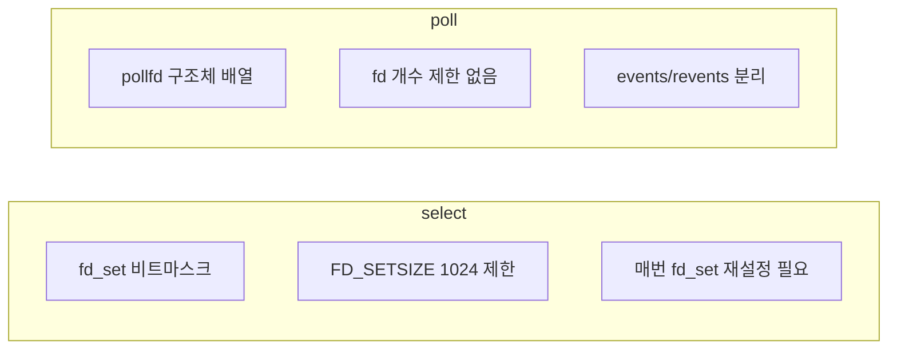
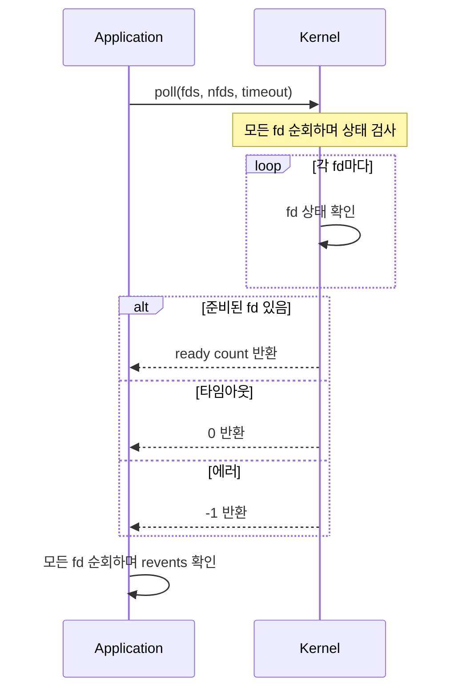

poll은 [[select]]의 개선된 버전으로, 여러 파일 디스크립터를 동시에 감시하는 [[IO 멀티플렉싱(IO Multiplexing)]] 시스템 콜이다. select의 fd 개수 제한(1024개)을 없앴지만, 여전히 O(n) 시간복잡도를 가진다. 대규모 연결에서는 [[epoll]]이 더 효율적이다.

---

## 기본 사용법

```c
#include <poll.h>

struct pollfd {
    int fd;         // 감시할 파일 디스크립터
    short events;   // 관심 이벤트 (입력)
    short revents;  // 발생한 이벤트 (출력, 커널이 채움)
};

struct pollfd fds[3];

// stdin 감시
fds[0].fd = STDIN_FILENO;
fds[0].events = POLLIN;

// 소켓 감시
fds[1].fd = socket_fd;
fds[1].events = POLLIN | POLLOUT;

// 타임아웃 5초로 대기
int ready = poll(fds, 3, 5000);

if (ready > 0) {
    if (fds[0].revents & POLLIN) {
        // stdin에서 읽기 가능
    }
    if (fds[1].revents & POLLIN) {
        // 소켓에서 읽기 가능
    }
}
```

---

## 이벤트 종류

| 이벤트 | 설명 | events | revents |
|--------|------|--------|---------|
| POLLIN | 읽기 가능 | O | O |
| POLLOUT | 쓰기 가능 | O | O |
| POLLPRI | 긴급 데이터 | O | O |
| POLLERR | 에러 발생 | X | O |
| POLLHUP | 연결 끊김 | X | O |
| POLLNVAL | 잘못된 fd | X | O |

`POLLERR`, `POLLHUP`, `POLLNVAL`은 events에 설정하지 않아도 revents에서 자동으로 반환된다.

---

## select와의 비교



| 항목 | select | poll |
|------|--------|------|
| fd 저장 방식 | 비트마스크 (fd_set) | 구조체 배열 (pollfd) |
| fd 개수 제한 | 1024개 (FD_SETSIZE) | 제한 없음 |
| 호출 후 상태 | fd_set 변경됨 (재설정 필요) | events 유지, revents만 변경 |
| 시간복잡도 | O(n) | O(n) |

---

## 동작 방식



매 호출마다 커널이 모든 fd를 순회하고, 반환 후 애플리케이션도 모든 fd를 순회해야 한다. 이것이 O(n)인 이유다.

---

## poll의 한계

10,000개 연결을 감시한다고 가정하면:

```
매 poll() 호출마다:
1. 유저 → 커널: 10,000개 pollfd 복사
2. 커널: 10,000개 fd 상태 검사
3. 커널 → 유저: 결과 반환
4. 유저: 10,000개 순회하며 ready 찾기

→ 실제 ready가 2개뿐이어도 10,000개 전부 처리
```

이 문제를 해결한 것이 [[epoll]]이다. epoll은 커널에 fd 목록을 저장하고, [[Ready List]]를 통해 준비된 fd만 반환한다.

---

## 언제 poll을 사용하나?

poll이 적합한 경우:
- Linux 외 다른 Unix 시스템도 지원해야 할 때 (epoll은 Linux 전용)
- 감시할 fd가 수백 개 이하일 때
- 연결이 매우 짧은 수명일 때

1,000개 이상의 동시 연결에서는 [[epoll]]을 사용하는 것이 좋다.

---

## References

- [[select]]
- [[epoll]]
- [[IO 멀티플렉싱(IO Multiplexing)]]
- [[Java NIO]]
- [Linux poll(2) man page](https://man7.org/linux/man-pages/man2/poll.2.html)
