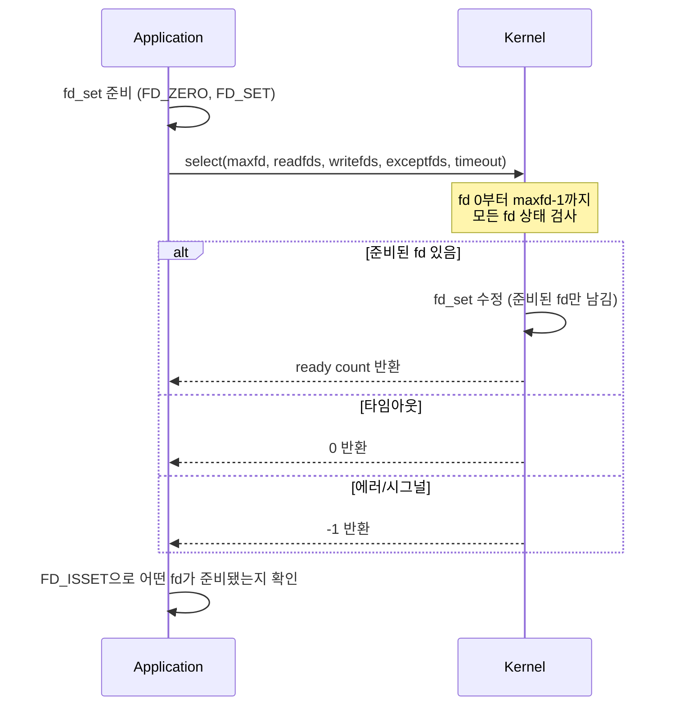

select는 여러 파일 디스크립터를 동시에 감시하는 가장 오래된 [[IO 멀티플렉싱(IO Multiplexing)]] 시스템 콜이다. POSIX 표준의 일부로 거의 모든 Unix 계열 시스템에서 사용할 수 있지만, 1024개의 fd 제한과 O(n) 시간복잡도라는 한계가 있다. 현대 애플리케이션에서는 [[poll]]이나 [[epoll]]을 사용하는 것이 권장된다.

---

## 기본 사용법

```c
#include <sys/select.h>

fd_set readfds, writefds, exceptfds;
struct timeval timeout;

// fd_set 초기화
FD_ZERO(&readfds);
FD_ZERO(&writefds);

// 감시할 fd 추가
FD_SET(socket_fd, &readfds);
FD_SET(STDIN_FILENO, &readfds);

// 타임아웃 설정 (5초)
timeout.tv_sec = 5;
timeout.tv_usec = 0;

// 가장 높은 fd + 1
int maxfd = socket_fd + 1;

// select 호출
int ready = select(maxfd, &readfds, &writefds, &exceptfds, &timeout);

if (ready > 0) {
    if (FD_ISSET(socket_fd, &readfds)) {
        // 소켓에서 읽기 가능
    }
    if (FD_ISSET(STDIN_FILENO, &readfds)) {
        // stdin에서 읽기 가능
    }
}
```

---

## fd_set 매크로

| 매크로 | 설명 |
|--------|------|
| `FD_ZERO(&set)` | fd_set 초기화 (모든 비트 0) |
| `FD_SET(fd, &set)` | fd를 set에 추가 |
| `FD_CLR(fd, &set)` | fd를 set에서 제거 |
| `FD_ISSET(fd, &set)` | fd가 set에 있는지 확인 |

fd_set은 내부적으로 비트마스크로 구현되어 있다. 각 비트가 하나의 파일 디스크립터를 나타낸다.

---

## 동작 방식



중요한 점은 select가 **fd_set을 수정**한다는 것이다. 따라서 매 호출마다 fd_set을 다시 설정해야 한다.

---

## FD_SETSIZE 제한

select의 가장 큰 한계는 **FD_SETSIZE(1024)** 제한이다.

```c
// /usr/include/bits/typesizes.h
#define __FD_SETSIZE 1024
```

이 제한은 glibc에 하드코딩되어 있어 변경할 수 없다. fd 번호가 1024 이상인 파일 디스크립터를 FD_SET하면 정의되지 않은 동작(undefined behavior)이 발생한다.

```c
// 위험한 코드 - fd가 1024 이상이면 버퍼 오버플로우
int big_fd = 1500;
FD_SET(big_fd, &readfds);  // undefined behavior!
```

이 문제를 해결하려면 [[poll]]이나 [[epoll]]을 사용해야 한다.

---

## select의 비효율성

### 1. 매번 전체 복사

```
매 select() 호출마다:
1. 유저 공간 → 커널 공간: fd_set 복사
2. 커널: 0부터 maxfd-1까지 모든 fd 검사
3. 커널 공간 → 유저 공간: 결과 복사
```

fd가 많을수록 복사량이 증가한다.

### 2. O(n) 검사

커널이 매번 모든 fd를 순회하며 상태를 확인한다. 10,000개 fd 중 1개만 ready여도 10,000개를 전부 검사한다.

### 3. fd_set 재설정 필요

select가 fd_set을 수정하므로 매 루프마다 다시 설정해야 한다:

```c
fd_set master_set, read_set;
FD_ZERO(&master_set);
FD_SET(server_fd, &master_set);

while (1) {
    read_set = master_set;  // 매번 복사 필요!
    select(maxfd, &read_set, NULL, NULL, NULL);
    // ...
}
```

---

## select vs poll vs epoll

```mermaid
flowchart TB
    subgraph "select"
        S1[fd_set 비트마스크]
        S2[FD_SETSIZE 1024 제한]
        S3[O&#40;n&#41; 시간복잡도]
        S4[매번 fd_set 재설정]
    end

    subgraph "poll"
        P1[pollfd 구조체 배열]
        P2[fd 개수 제한 없음]
        P3[O&#40;n&#41; 시간복잡도]
        P4[events/revents 분리]
    end

    subgraph "epoll"
        E1[커널에 fd 목록 저장]
        E2[fd 개수 제한 없음]
        E3[O&#40;1&#41; 시간복잡도]
        E4[Ready List 방식]
    end
```



| 항목 | select | [[poll]] | [[epoll]] |
|------|--------|----------|-----------|
| fd 저장 | 비트마스크 | 구조체 배열 | 커널 내부 RB-Tree |
| fd 제한 | 1024 (FD_SETSIZE) | 없음 | 없음 |
| 호출 후 상태 | fd_set 변경됨 | events 유지 | 상태 유지 |
| 시간복잡도 | O(n) | O(n) | O(1) |
| 이식성 | 모든 Unix | 대부분 Unix | Linux 전용 |

---

## 언제 select를 사용하나?

select가 적합한 경우:
- **이식성이 최우선**일 때 (거의 모든 플랫폼에서 동작)
- 감시할 fd가 **수십 개 이하**일 때
- 레거시 코드와의 **호환성**이 필요할 때

그러나 대부분의 현대 애플리케이션에서는 select 대신:
- **이식성 필요**: [[poll]] 사용
- **Linux 고성능**: [[epoll]] 사용
- **BSD/macOS 고성능**: kqueue 사용

---

## pselect

`pselect`는 select의 개선 버전으로, 시그널 마스크를 원자적으로 설정할 수 있다:

```c
int pselect(int nfds, fd_set *readfds, fd_set *writefds,
            fd_set *exceptfds, const struct timespec *timeout,
            const sigset_t *sigmask);
```

주요 차이점:
1. **타임아웃**: `timespec` 사용 (나노초 정밀도)
2. **시그널 마스크**: 원자적 시그널 블로킹
3. **타임아웃 불변**: timeout 파라미터를 수정하지 않음

---

## References

- [[poll]]
- [[epoll]]
- [[IO 멀티플렉싱(IO Multiplexing)]]
- [[블로킹(blocking)]]
- [[논블로킹(Non-blocking)]]
- [Linux select(2) man page](https://man7.org/linux/man-pages/man2/select.2.html)
