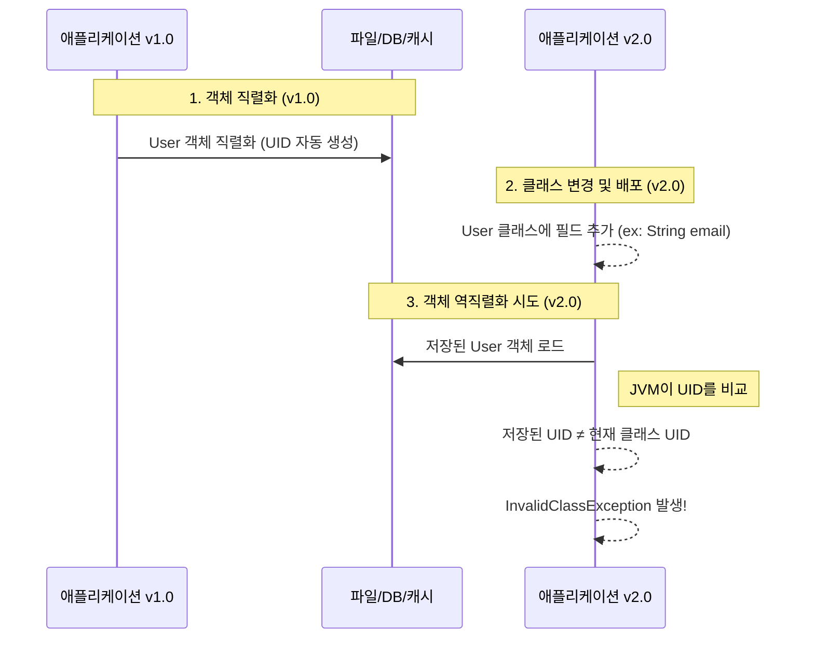

자바 개발을 하다 보면 `Serializable` 인터페이스를 구현할 때 `serialVersionUID`를 추가하라는 경고를 종종 마주하게 됩니다. 많은 개발자들이 무심코 이 경고를 넘기거나 IDE가 자동으로 생성해 주는 값을 그대로 사용하곤 합니다. 하지만 이 작은 ID 값이 왜 필요하며, 이를 선언하지 않았을 때 어떤 심각한 버그가 발생할 수 있는지 정확히 이해하는 것은 매우 중요합니다.

이 글에서는 `serialVersionUID`의 부재가 어떻게 역직렬화(Deserialization) 과정에서 예기치 않은 오류로 이어지는지, 그리고 왜 명시적으로 선언해야 하는지 그 원리를 명확하게 설명합니다.

---

## `serialVersionUID`란 무엇일까요?

`serialVersionUID`는 **자바 직렬화(Serialization) 메커니즘이 클래스의 버전을 구분하기 위해 사용하는 고유 식별자**입니다. `Serializable` 인터페이스를 구현한 클래스는 직렬화될 때 이 ID 값을 함께 저장합니다. 이후 역직렬화 과정에서는 저장된 객체의 `serialVersionUID`와 현재 로드된 클래스의 `serialVersionUID`를 비교하여 두 클래스가 호환되는 버전인지를 검사합니다.

만약 개발자가 클래스에 `serialVersionUID`를 명시적으로 선언하지 않으면, JVM은 클래스의 구조(클래스명, 필드, 메서드 등)를 기반으로 **해시(hash) 값을 계산하여 자동으로 이 값을 할당**합니다. 바로 이 '자동 할당' 정책이 버그의 핵심 원인이 됩니다.

---

## 버그 발생 시나리오

`serialVersionUID`를 선언하지 않았을 때 역직렬화 버그가 발생하는 과정을 순서대로 살펴보겠습니다.



1. 초기 버전의 클래스 (v1.0)
    
    User라는 클래스를 Serializable로 만들었지만, serialVersionUID는 선언하지 않았습니다.
    ```java
    // v1.0
    import java.io.Serializable;
    
    public class User implements Serializable {
        private String name;
        private int age;
        // serialVersionUID 선언 없음
    }
    ```
    
2. 객체 직렬화 및 저장
    
    v1.0 애플리케이션에서 User 객체를 생성하고 파일이나 데이터베이스, 캐시 등에 직렬화하여 저장합니다. 이때 JVM은 User 클래스의 구조를 바탕으로 serialVersionUID를 자동으로 생성하여 객체와 함께 저장합니다.
    
3. 클래스 수정 (v2.0)
    
    이후 비즈니스 요구사항이 변경되어 User 클래스에 email 필드를 하나 추가했습니다. 사소한 변경처럼 보이지만, 이로 인해 클래스의 구조가 바뀌었습니다.
    
    ```java
    // v2.0
    import java.io.Serializable;
    
    public class User implements Serializable {
        private String name;
        private int age;
        private String email; // 필드 추가
        // 여전히 serialVersionUID 선언 없음
    }
    ```
    
4. 역직렬화 시도와 실패
    
    새로운 버전(v2.0)의 애플리케이션을 배포한 뒤, 이전에 저장해 둔 User 객체를 역직렬화하려고 시도합니다. 이때 JVM은 다음과 같은 절차를 밟습니다.
    
    - 저장된 객체의 `serialVersionUID`를 읽습니다.
        
    - 현재 애플리케이션에 로드된 `User` 클래스(v2.0)의 구조를 기반으로 `serialVersionUID`를 **다시 동적으로 계산**합니다.
        
    - `email` 필드가 추가되면서 클래스 구조가 바뀌었기 때문에, 두 `serialVersionUID`는 **서로 다른 값**을 갖게 됩니다.
        
    - JVM은 두 클래스가 서로 호환되지 않는다고 판단하고 `java.io.InvalidClassException` 예외를 발생시킵니다.
        

이 버그는 특히 분산 환경의 서버나 MSA 구조에서 심각한 문제를 일으킬 수 있습니다. 예를 들어, 구버전 서버에서 직렬화한 세션 데이터를 신버전 서버가 이어받아 처리하려 할 때, 혹은 캐시에 저장된 객체를 업데이트된 애플리케이션이 읽어오려 할 때 시스템 전체의 장애로 이어질 수 있습니다.

---

## 해결 방법
이 문제의 해결 방법은 매우 간단합니다. `Serializable`을 구현하는 클래스에 `serialVersionUID`를 **직접 선언하고 값을 고정**하는 것입니다.

```java
import java.io.Serializable;

public class User implements Serializable {
    // serialVersionUID를 1L로 명시적으로 선언
    private static final long serialVersionUID = 1L;

    private String name;
    private int age;
    private String email; // 필드가 추가되어도 UID는 동일하게 유지됨
}
```

이렇게 `serialVersionUID`를 `1L`과 같은 특정 값으로 고정하면, 클래스의 구조가 약간 변경되더라도 JVM은 더 이상 해시 값을 동적으로 계산하지 않습니다. 대신 **개발자가 선언한 `serialVersionUID`를 사용**합니다.

이제 v2.0 애플리케이션이 이전에 저장된 객체를 역직렬화할 때, 저장된 객체의 `serialVersionUID`(1L)와 현재 클래스의 `serialVersionUID`(1L)가 일치하므로 JVM은 두 클래스를 호환 가능한 버전으로 간주합니다. 역직렬화는 성공적으로 완료되며, 새로 추가된 `email` 필드는 `null`이나 해당 타입의 기본값으로 초기화됩니다.

---

## 결론

`serialVersionUID`는 단순히 컴파일러 경고를 없애기 위한 값이 아닙니다. 이는 **클래스의 버전을 명시적으로 제어하여 시스템의 안정성과 호환성을 보장하는 핵심적인 장치**입니다. `Serializable` 인터페이스를 구현한다면, 사소한 변경에도 시스템이 중단되는 위험을 막기 위해 반드시 `serialVersionUID`를 명시적으로 선언하는 습관을 들여야 합니다.

---

## 참고 자료

- Java™ Object Serialization Specification ([https://docs.oracle.com/javase/8/docs/platform/serialization/spec/version.html](https://docs.oracle.com/javase/8/docs/platform/serialization/spec/version.html))
    
- Baeldung - The serialVersionUID in Java ([https://www.baeldung.com/java-serial-version-uid](https://www.baeldung.com/java-serial-version-uid))