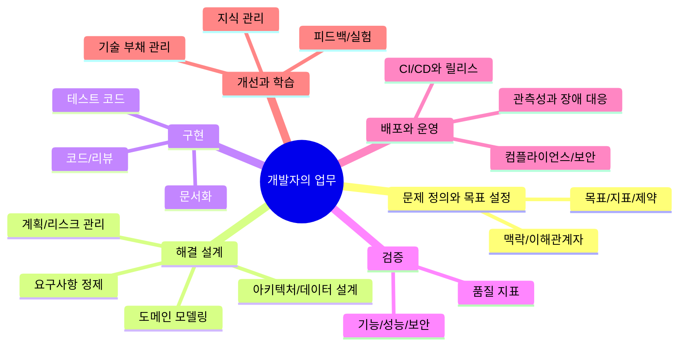
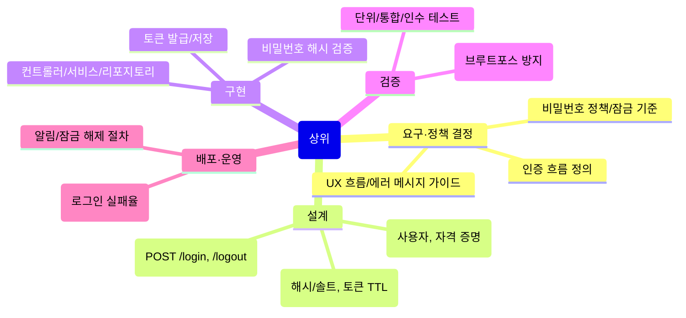

AI를 잘 활용하려면 먼저 개발자의 업무가 어떤 흐름으로 이어지는지 구조적으로 이해하는 것이 필요합니다. 우연히 떠오르는 아이디어를 코드로 옮기는 것이 개발의 전부가 아니듯, AI 역시 어느 지점에서 어떤 문제를 돕는지가 분명해야 효과가 극대화됩니다. 이 글은 개발자의 업무를 정리하고, 각 단계가 어떤 목적과 산출물을 갖는지 자연스럽게 이어 설명함으로써 AI를 얹을 수 있는 지점을 식별할 수 있도록 돕고자 합니다.

## 개발 업무
개발 업무는 문제 정의, 해결, 유지 그리고 개선의 연속입니다. AI 를 개발 업무에 활용하기 위해서 먼저 개발 업무에는 어떤 것들이 있는지 정리해보겠습니다. 

### 문제 정의

개발 업무는 항상 문제를 정확히 정의하는 데서 시작합니다. 조직과 제품의 맥락을 이해하고, 관련된 이해관계자의 관점을 정렬하며, 무엇을 성공으로 볼 것인지 합의하는 일이 선행되지 않으면 이후의 모든 작업이 흔들리기 쉽습니다. 이 단계에서 정리되는 문제 진술과 성공 지표는 다음 단계의 판단 근거가 되며, 범위와 제약 조건은 계획의 현실성을 보장합니다. 정교한 요구의 언어를 만드는 과정은 요구사항 정의의 핵심이며, 품질과 속도 사이의 균형을 설계할 수 있도록 초기부터 기준선을 마련하는 것이 중요합니다.

### 해결 설계

문제가 명확해지면 해결의 모양을 그립니다. 사용자 시나리오와 규칙을 정제하면서 개념과 관계를 잡아가는 작업이 곧 도메인 모델링입니다. 개념이 서면 구조가 따라옵니다. 서비스가 응답해야 하는 품질 속성, 예컨대 확장성이나 신뢰성 같은 비기능 목표를 근거로 아키텍처를 선택하고, 데이터가 어떻게 생성·흐름·보존되는지를 고려하여 데이터 모델을 정리합니다. 이 과정에서 기술 선택의 장단을 비교하고, 리스크를 식별해 대응 전략을 준비합니다. 일정과 마일스톤, 의존성과 선후 관계까지 한 호흡으로 묶어내면 팀이 같은 방향을 보며 움직일 수 있습니다.

### 구현

설계가 실체를 얻는 순간은 언제나 코드에서 시작합니다. 기능을 작은 단위로 나누어 신뢰 가능한 기준으로 개발하고, 동료와 함께 코드 리뷰를 통해 결함을 이른 시점에 제거합니다. 자동화된 검증의 토대가 되는 테스트 코드는 구현과 동시에 짝을 이뤄야 하며, 문서화는 미래의 자신과 팀을 위한 설명이라는 마음가짐으로 축적하는 편이 좋습니다. 명확한 명명과 일관된 스타일은 팀의 속도를 높이고, 작은 리팩토링의 반복은 큰 품질 저하를 예방합니다.

### 검증

검증은 단순한 통과 여부의 문제가 아니라, 의도와 실제 사이의 간극을 줄이는 작업입니다. 구성 요소의 동작을 빠르게 확인하는 [[단위 테스트(Unit Test)]]와 상호작용을 확인하는 통합 검증, 사용자 관점의 흐름을 확인하는 인수 검증이 서로 보완되어야 의미가 생깁니다. 성능과 보안 같은 비기능 영역도 동일한 무게로 다루어야 하며, 객관적인 품질 지표를 정기적으로 관찰하면 리그레션을 조기에 감지할 수 있습니다. 검증 결과는 다시 설계와 구현으로 되돌아가 수정의 근거가 되고, 팀의 기준선을 한 단계 끌어올립니다.

### 배포와 운영

소프트웨어는 사용될 때 비로소 가치를 드러냅니다. 안전하고 반복 가능한 전달을 위해서는 CI/CD 파이프라인을 통해 빌드와 테스트, 배포의 흐름을 자동화하고, 릴리스 전략을 제품과 조직의 리스크 허용도에 맞게 선택해야 합니다. 운영 환경에서는 가시성이 곧 안정성입니다. 로그·지표·트레이스를 아우르는 관측성(Observability)을 확보하면 이상 징후를 빠르게 감지하고, 장애의 전개를 이해하며, 근본 원인에 도달할 수 있습니다. 데이터 보호와 접근 통제, 규정 준수 같은 보안 및 컴플라이언스 요구는 운영 단계의 부가 요소가 아니라 제품 신뢰의 기초입니다.

### 개선과 학습

운영에서 얻은 신호는 다시 개선의 출발점이 됩니다. 사용자 행동과 피드백을 분석해 가설을 세우고, 검증 가능한 방식으로 실험을 설계하여 학습합니다. 점진적 배포나 A/B 테스트는 안전하게 변화를 시험하는 대표적인 방법입니다. 장기적으로는 기술 부채를 의식적으로 관리하여 변화 비용을 통제하고, 의사결정과 배운 점을 체계적으로 기록해 재사용 가능한 지식으로 전환해야 합니다. 이렇게 쌓인 학습은 다시 문제 정의의 정확도를 높이고, 설계와 구현의 질을 개선하여 선순환을 이룹니다.

## 업무의 특성

위 업무들에는 공통적인 특성이 있습니다. 바로 쪼개면 쪼갤수록 점점 더 구체적인 행동에 가깝게 됩니다. 예를 들어 예를 들어, 코드 작성의 경우 어떻게 디렉토리 구조를 설계할 것인지, 파일, 함수, 변수 이름은 어떻게 정할것인지 코드 스타일은 어떻게 정할 것인지 말이조 이를 더 세부적으로 쪼갠다면 문자하나 타이핑하는 것까지 정할수도 있습니다.

즉, 하위 업무일 수록 직관적이고 구체적이며 누구나 즉시 실행가능할수 있게 됩니다. 상위 업무의 경우 전체적인 방향성을 결정하고 하위 업무의 경우 이를 구현하기 위한 한 걸음 한 걸음이 됩니다. 

## LLM의 특성

그럼 이제 개발 업무와 업무의 특성에 대해서 알아보았으니 LLM 을 최대한 활용하기 위해서 LLM의 특성에 대해서 간단히 알아보겠습니다. LLM을 가장 간단하게 말하면 `이어질 다음 단어를 예측`하는 계산기입니다.

스마트폰의 자동완성과 같은 원리입니다. 문장을 한 단어씩 이어 가면서, 매 순간 현재까지의 문맥을 보고 다음에 올 단어의 확률을 계산해 가장 그럴듯한 단어를 선택합니다.

- 시작 문장: "오늘 날씨가 너무"
- 다음 단어 후보(가상의 확률 예시): 좋습니다(0.42), 덥습니다(0.28), 춥습니다(0.18), 비(0.04), …
- 선택: "좋습니다" → "오늘 날씨가 너무 좋습니다."
- 같은 방식으로 다음 단어를 순차적으로 골라 문장을 완성합니다(예: "그래서", "산책", "가고", "싶습니다").

핵심은 정답을 "조회"하기보다 "그럴듯함"을 최적화한다는 점입니다. 따라서 사실을 착각하는 환각(Hallucination)이 발생할 수 있어 중요한 용도에서는 근거 확인과 검증이 필요합니다. 

## AI를 개발 업무에 활용하기

지금까지 개발 업무와 LLM의 특성에 대해서 알아보았습니다. 이제 이를 토대로 구체적인 활용 방법에 대해서 설명해보겠습니다.

개발 업무는 하위 단계일 수록 구체적이며, LLM 은 확률을 확률을 기반으로 다음 단어를 생성합니다. 즉, 구체적인 업무일 수록 LLM은 더 정확한 답을 산출할 수 있습니다. 

### 탑다운 방식
먼저 문제 정의, 해결 설계 과정을 여러 사람들과 논의하고 결정해 가장 상위 업무의 내용을 정의합니다. 그리고 이를 LLM 이 수행할 수 있을 정도로 하위 업무로 나누어 정의합니다. 물론 문제 정의, 해결 설계 과정을 LLM 없이 해야한다는 뜻은 아닙니다. 유사 사례를 참조하기 위해서 사용할 수 있습니다. 하지만 제약사항이나 도메인 특성을 고려해 결과적으로 검증하고 결정해야하는 것은 개발자가 해야할 일입니다.

### 에이전트 활용
구체적인 업무를 정의했다고 해도 이를 LLM 만으로 수행하는 건 어려울 수 있습니다. LLM 은 텍스트를 입력받아야 계산이 가능한다. 현재는 챗봇 방식으로 작업자가 수동으로 입력해주는 경우가 많고 그 결과를 사람이 직접 옮겨 반영합니다. 이는 매번 번거로운 작업이 되며 결과적으로 작업자 없이 LLM 만으로 개발 업무를 수행할수 없습니다.

이를 해결하기 위해선 에이전트를 사용할 수 있습니다. Claude Code, Cursor, Gemini CLI 그리고 Codex 와 같은 LLM 기반 개발툴은 LLM 이 직접 파일을 CRUD 하면서 코드를 작성할 수 있습니다.

또한, MCP 를 이용해서 코드 뿐만 아니라 GitHib/GitLab, Confluence, Jira, Kibana, Rancher 등 개발 업무에 필요한 다양한 플랫폼의 정보를 읽고 업데이트 할 수 있습니다.

이를 통해 LLM 은 작업자 없이 자율적으로 하위 개발 업무를 수행할 수 있게 됩니다.

### 휴먼 인 더 루프

앞서 말했을 LLM 은 확률을 기반으로 작업하기 때문에 잘못된 결과를 생성할 수 있습니다. 이 때문에 작업자는 각 업무 단계마다 수시로 결과를 확인하고 잘못된 경우가 있으면 프롬프트를 수정하고 상위 업무에 방향성을 더 세부적으로 명시해야합니다. 

## 결론

이 글에서는 개발 업무와 LLM의 특성에 대해 알아보고 탑다운 방식의 업무 세분화, 에이전트와 휴먼 인더 루프를 통해 LLM을 개발 업무에 활용하는 방안에 대해서 설명해보았습니다. 다음 글에서는 MCP와 Cursor 를 이용한 구체적인 방법에 대한 글로 돌아오겠습니다.

