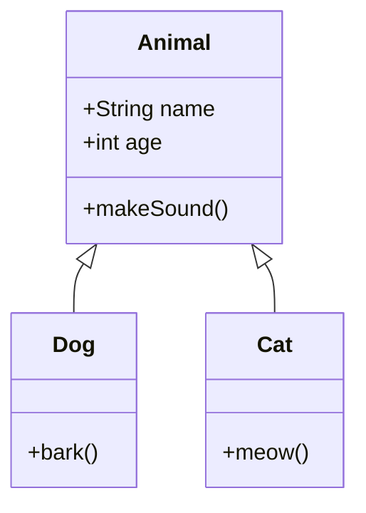
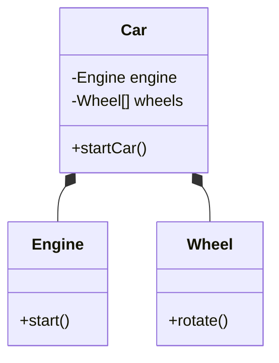

객체 지향 프로그래밍(Object-Oriented Programming, OOP)은 프로그램을 객체들의 집합으로 모델링하는 프로그래밍 패러다임입니다. 각 객체는 데이터와 해당 데이터를 조작하는 메서드를 함께 캡슐화하며, 이를 통해 복잡한 소프트웨어 시스템을 보다 모듈화하고 유지보수하기 쉽게 구성할 수 있습니다.

객체 지향 프로그래밍은 현대 소프트웨어 개발에서 가장 널리 사용되는 패러다임 중 하나로, Java, C++, C#, Python 등 많은 주요 프로그래밍 언어에서 지원됩니다. OOP를 이해하기 위해서는 먼저 절차적 프로그래밍(Procedural Programming)과의 차이점을 이해하는 것이 중요합니다.

## 객체 지향 프로그래밍의 4가지 핵심 원칙

객체 지향 프로그래밍은 다음 네 가지 핵심 원칙을 기반으로 합니다:

1. **[[캡슐화(Encapsulation)]]**: 데이터와 해당 데이터를 조작하는 메서드를 하나의 단위로 묶고, 객체 내부 구현을 외부로부터 숨기는 원칙입니다.
2. **[[상속(Inheritance)]]**: 기존 클래스의 특성을 새로운 클래스가 재사용할 수 있게 하는 메커니즘입니다.
3. **[[다형성(Polymorphism)]]**: 동일한 인터페이스를 사용하여 다양한 객체 유형을 처리할 수 있는 능력입니다.
4. **[[추상화(Abstraction)]]**: 복잡한 시스템을 단순화하여 필수적인 측면만 표현하는 과정입니다.

## 객체와 클래스

### 객체(Object)

객체는 데이터(속성)와 동작(메서드)을 포함하는 소프트웨어 번들입니다. 현실 세계의 개체를 모델링한 것으로 생각할 수 있습니다.

### 클래스(Class)

클래스는 객체를 생성하기 위한 청사진 또는 템플릿입니다. 클래스는 객체가 가질 수 있는 속성과 메서드를 정의합니다.

```java
public class Car {
    // 속성(필드)
    private String model;
    private String color;
    private int year;
    
    // 생성자
    public Car(String model, String color, int year) {
        this.model = model;
        this.color = color;
        this.year = year;
    }
    
    // 메서드
    public void startEngine() {
        System.out.println("엔진이 시작되었습니다.");
    }
    
    public void stopEngine() {
        System.out.println("엔진이 정지되었습니다.");
    }
    
    // Getter 및 Setter
    public String getModel() {
        return model;
    }
    
    public void setModel(String model) {
        this.model = model;
    }
    
    // 기타 getter, setter 메서드...
}
```

이 예시에서 `Car`는 클래스이며, 이 클래스를 사용하여 다양한 자동차 객체를 생성할 수 있습니다:

```java
Car myCar = new Car("테슬라 모델 3", "빨간색", 2023);
Car friendsCar = new Car("현대 아이오닉", "파란색", 2022);
```

객체와 클래스에 대한 자세한 내용은 객체와 클래스의 관계를 참고해주세요.

## 객체 지향 설계 원칙

객체 지향 설계를 위한 몇 가지 중요한 원칙이 있습니다:

### SOLID 원칙

SOLID는 객체 지향 설계의 다섯 가지 기본 원칙을 나타내는 약어입니다:

1. **S - 단일 책임 원칙(Single Responsibility Principle)**: 클래스는 단 하나의 책임만 가져야 합니다.
2. **O - 개방-폐쇄 원칙(Open-Closed Principle)**: 클래스는 확장에는 열려 있고, 수정에는 닫혀 있어야 합니다.
3. **L - 리스코프 치환 원칙(Liskov Substitution Principle)**: 상위 타입의 객체를 하위 타입의 객체로 치환해도 프로그램은 정상적으로 동작해야 합니다.
4. **I - 인터페이스 분리 원칙(Interface Segregation Principle)**: 클라이언트가 사용하지 않는 메서드에 의존하지 않도록 큰 인터페이스를 작은 인터페이스로 분리해야 합니다.
5. **D - 의존성 역전 원칙(Dependency Inversion Principle)**: 추상화에 의존해야 하며, 구체적인 구현에 의존하지 않아야 합니다.

SOLID 원칙에 대한 자세한 내용은 SOLID 원칙 상세 설명을 참고해주세요.

## 객체 지향 프로그래밍의 구성 요소

### 클래스(Class)

위에서 설명한 대로, 클래스는 객체의 청사진입니다.

### 인터페이스(Interface)

인터페이스는 클래스가 구현해야 하는 메서드를 정의하지만, 그 구현은 제공하지 않습니다. 인터페이스는 다형성을 구현하는 강력한 방법입니다.

```java
public interface Vehicle {
    void startEngine();
    void stopEngine();
    void accelerate(int speed);
    void brake();
}

public class Car implements Vehicle {
    @Override
    public void startEngine() {
        // 구현 내용
    }
    
    @Override
    public void stopEngine() {
        // 구현 내용
    }
    
    @Override
    public void accelerate(int speed) {
        // 구현 내용
    }
    
    @Override
    public void brake() {
        // 구현 내용
    }
}
```

### 추상 클래스(Abstract Class)

추상 클래스는 일부 구현을 제공하면서도 완전하지 않은 클래스로, 상속을 통해 구체적인 구현을 완성해야 합니다.

```java
public abstract class Shape {
    protected String color;
    
    public Shape(String color) {
        this.color = color;
    }
    
    public String getColor() {
        return color;
    }
    
    // 추상 메서드 - 하위 클래스에서 반드시 구현해야 함
    public abstract double calculateArea();
    
    // 일반 메서드 - 공통 기능 제공
    public void displayColor() {
        System.out.println("도형의 색상: " + color);
    }
}

public class Circle extends Shape {
    private double radius;
    
    public Circle(String color, double radius) {
        super(color);
        this.radius = radius;
    }
    
    @Override
    public double calculateArea() {
        return Math.PI * radius * radius;
    }
}
```

인터페이스와 추상 클래스의 차이점에 대한 자세한 내용은 인터페이스와 추상 클래스 비교를 참고해주세요.

## 객체 간의 관계

객체 지향 설계에서는 객체 간의 다양한 관계가 존재합니다:

### 1. 상속(Inheritance)

상속은 한 클래스가 다른 클래스의 특성을 물려받는 관계입니다.



### 2. 구성(Composition)

구성은 한 클래스가 다른 클래스의 객체를 포함하는 관계입니다.



### 3. 집합(Aggregation)

집합은 구성과 유사하지만, 포함된 객체가 독립적으로 존재할 수 있는 관계입니다.

### 4. 연관(Association)

연관은 서로 독립적인 객체 간의 관계를 나타냅니다.

객체 간 관계에 대한 자세한 내용은 객체 관계 모델링을 참고해주세요.

## 객체 지향 프로그래밍의 장단점

### 장점

- **모듈성**: 객체 단위로 코드를 분리하여 개발과 유지보수가 용이합니다.
- **재사용성**: 클래스와 객체를 여러 곳에서 재사용할 수 있습니다.
- **확장성**: 기존 코드를 수정하지 않고 새로운 기능을 추가할 수 있습니다.
- **캡슐화**: 구현 세부 정보를 숨기고 인터페이스만 노출하여 코드의 안정성을 높입니다.
- **유지보수성**: 객체별로 독립적인 기능을 수행하므로 유지보수가 쉽습니다.

### 단점

- **복잡성**: 절차적 프로그래밍에 비해 초기 설계가 더 복잡할 수 있습니다.
- **성능**: 대규모 객체 생성과 메서드 호출은 성능 오버헤드를 발생시킬 수 있습니다.
- **학습 곡선**: 객체 지향 개념을 완전히 이해하고 적용하는 데 시간이 걸릴 수 있습니다.
- **과도한 추상화**: 때로는 불필요하게 복잡한 추상화로 이어질 수 있습니다.

## Java에서의 객체 지향 프로그래밍

Java는 완전한 객체 지향 언어로, 모든 코드가 클래스 내에 존재합니다.

### 클래스 정의

```java
public class Person {
    // 속성(필드)
    private String name;
    private int age;
    
    // 생성자
    public Person(String name, int age) {
        this.name = name;
        this.age = age;
    }
    
    // 메서드
    public void introduce() {
        System.out.println("안녕하세요, 제 이름은 " + name + "이고, " + age + "살입니다.");
    }
    
    // getter와 setter
    public String getName() {
        return name;
    }
    
    public void setName(String name) {
        this.name = name;
    }
    
    public int getAge() {
        return age;
    }
    
    public void setAge(int age) {
        if (age > 0) {
            this.age = age;
        }
    }
}
```

### 상속

```java
public class Student extends Person {
    private String studentId;
    
    public Student(String name, int age, String studentId) {
        super(name, age);
        this.studentId = studentId;
    }
    
    @Override
    public void introduce() {
        System.out.println("안녕하세요, 제 이름은 " + getName() + "이고, " + getAge() + "살입니다. 학번은 " + studentId + "입니다.");
    }
    
    public void study() {
        System.out.println(getName() + "이(가) 공부하고 있습니다.");
    }
}
```

Java에서의 객체 지향 프로그래밍에 대한 자세한 내용은 Java의 객체 지향 특징을 참고해주세요.

## 스프링 프레임워크에서의 객체 지향 프로그래밍

스프링 프레임워크는 객체 지향 원칙을 적극적으로 활용하는 Java 기반 프레임워크입니다. 스프링의 핵심 기능 중 하나는 의존성 주입(Dependency Injection)을 통한 느슨한 결합을 구현하는 것입니다.

### 의존성 주입 예시

```java
@Service
public class UserService {
    private final UserRepository userRepository;
    
    // 생성자 주입
    @Autowired
    public UserService(UserRepository userRepository) {
        this.userRepository = userRepository;
    }
    
    public User getUserById(Long id) {
        return userRepository.findById(id).orElse(null);
    }
}

@Repository
public interface UserRepository extends JpaRepository<User, Long> {
    // Spring Data JPA가 구현을 제공
}
```

이 예시에서는 UserService가 UserRepository에 의존하지만, 구체적인 구현체가 아닌 인터페이스에 의존하고 있습니다. 이는 의존성 역전 원칙(DIP)을 적용한 예입니다.

스프링 프레임워크에서의 객체 지향 활용에 대한 자세한 내용은 스프링과 객체 지향 설계를 참고해주세요.

## 객체 지향 설계 패턴

설계 패턴은 소프트웨어 설계에서 자주 발생하는 문제에 대한 재사용 가능한 해결책입니다. 다음은 몇 가지 주요 패턴입니다:

### 싱글톤 패턴(Singleton Pattern)

클래스의 인스턴스가 오직 하나만 생성되도록 보장하는 패턴입니다.

```java
public class Singleton {
    private static Singleton instance;
    
    // 외부에서 생성자 호출 방지
    private Singleton() {}
    
    // 인스턴스 접근 메서드
    public static synchronized Singleton getInstance() {
        if (instance == null) {
            instance = new Singleton();
        }
        return instance;
    }
}
```

### 팩토리 패턴(Factory Pattern)

객체 생성 로직을 캡슐화하여 클라이언트 코드와 분리하는 패턴입니다.

```java
// 제품 인터페이스
interface Product {
    void operation();
}

// 구체적인 제품 클래스
class ConcreteProductA implements Product {
    @Override
    public void operation() {
        System.out.println("ConcreteProductA 작업 실행");
    }
}

class ConcreteProductB implements Product {
    @Override
    public void operation() {
        System.out.println("ConcreteProductB 작업 실행");
    }
}

// 팩토리 클래스
class ProductFactory {
    public Product createProduct(String type) {
        if ("A".equals(type)) {
            return new ConcreteProductA();
        } else if ("B".equals(type)) {
            return new ConcreteProductB();
        }
        throw new IllegalArgumentException("알 수 없는 제품 유형: " + type);
    }
}
```

더 많은 설계 패턴에 대한 내용은 객체 지향 디자인 패턴을 참고해주세요.

## 실제 사용 사례

객체 지향 프로그래밍은 다양한 분야에서 활용됩니다:

1. **웹 애플리케이션**: 사용자, 주문, 제품 등을 객체로 모델링합니다.
2. **게임 개발**: 캐릭터, 아이템, 이벤트 등을 객체로 표현합니다.
3. **모바일 앱**: UI 컴포넌트, 데이터 모델 등을 객체 지향적으로 설계합니다.
4. **기업용 소프트웨어**: 비즈니스 로직을 객체로 모델링하고 재사용성을 높입니다.

## 객체 지향 프로그래밍 디버깅 기법

객체 지향 프로그램 디버깅에는 다음과 같은 기법이 유용합니다:

1. **단위 테스트**: 각 클래스와 메서드를 독립적으로 테스트합니다.
2. **로깅**: 객체의 상태 변화를 로그로 기록합니다.
3. **디버거 활용**: IDE의 디버깅 도구를 사용하여 객체 상태를 관찰합니다.
4. **코드 리뷰**: 다른 개발자와 함께 코드를 검토하여 문제점을 발견합니다.

자세한 디버깅 기법은 객체 지향 프로그램 디버깅 전략을 참고해주세요.

## 결론

객체 지향 프로그래밍은 복잡한 소프트웨어 시스템을 개발하는 강력한 패러다임입니다. 캡슐화, 상속, 다형성, 추상화의 네 가지 핵심 원칙을 통해 코드의 재사용성, 유지보수성, 확장성을 향상시킬 수 있습니다.

하지만 객체 지향 프로그래밍이 모든 문제에 대한 최적의 해결책은 아닙니다. 때로는 함수형 프로그래밍(Functional Programming)이나 절차적 프로그래밍(Procedural Programming) 같은 다른 패러다임이 더 적합할 수 있습니다. 현대적인 소프트웨어 개발에서는 이러한 패러다임을 상황에 맞게 조합하는 다중 패러다임 프로그래밍(Multi-paradigm Programming)이 점점 더 보편화되고 있습니다.

효과적인 객체 지향 프로그래밍을 위해서는 SOLID 원칙과 같은 설계 지침을 따르고, 적절한 디자인 패턴을 적용하며, 지속적인 리팩토링을 통해 코드 품질을 개선하는 노력이 필요합니다.

## 참고 자료

- Clean Code - Robert C. Martin
- Head First Design Patterns - Eric Freeman, Elisabeth Robson
- Effective Java - Joshua Bloch
- 객체지향의 사실과 오해 - 조영호
- 스프링 공식 문서(https://docs.spring.io/spring-framework/docs/current/reference/html/)