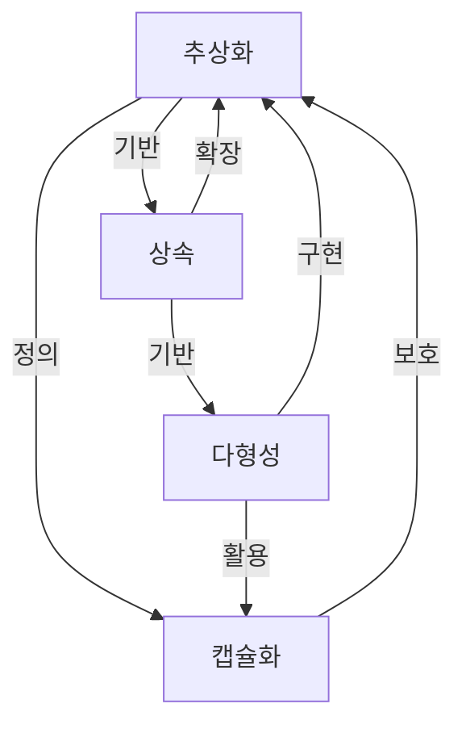

[[객체 지향 프로그래밍(OOP)]]은 현대 소프트웨어 개발의 핵심 패러다임으로, 복잡한 시스템을 객체라는 단위로 모델링하여 개발하는 방법론입니다. 객체 지향 프로그래밍의 근간이 되는 네 가지 핵심 원칙은 [[캡슐화(Encapsulation)]], [[상속(Inheritance)]], [[다형성(Polymorphism)]], [[추상화(Abstraction)]]입니다. 이 네 가지 원칙은 상호 보완적으로 작용하여 유지보수가 용이하고, 확장성이 높으며, 재사용 가능한 코드를 작성할 수 있게 해줍니다.

## 1. 캡슐화(Encapsulation)

캡슐화는 데이터(속성)와 해당 데이터를 처리하는 메서드(행위)를 하나의 단위로 묶고, 외부로부터 객체의 내부 구현을 숨기는 메커니즘입니다.

### 캡슐화의 핵심 개념

1. **데이터 은닉(Data Hiding)**: 객체의 속성을 private으로 선언하여 외부에서 직접 접근하지 못하도록 합니다.
2. **접근 제어**: getter와 setter 메서드를 통해 객체의 상태에 대한 접근을 제어합니다.
3. **구현 세부 사항 숨기기**: 객체가 어떻게 구현되었는지 외부에 노출하지 않고, 필요한 인터페이스만 제공합니다.

### 자바에서의 캡슐화 구현 예시

```java
public class BankAccount {
    // private 필드: 외부에서 직접 접근 불가
    private String accountNumber;
    private double balance;
    
    // 생성자
    public BankAccount(String accountNumber, double initialBalance) {
        this.accountNumber = accountNumber;
        this.balance = initialBalance;
    }
    
    // getter 메서드: 필드 값 읽기
    public String getAccountNumber() {
        return accountNumber;
    }
    
    public double getBalance() {
        return balance;
    }
    
    // public 메서드를 통한 상태 변경
    public void deposit(double amount) {
        if (amount > 0) {
            balance += amount;
        } else {
            throw new IllegalArgumentException("입금액은 0보다 커야 합니다.");
        }
    }
    
    public boolean withdraw(double amount) {
        if (amount > 0 && amount <= balance) {
            balance -= amount;
            return true;
        }
        return false;
    }
}
```

이 예제에서 `accountNumber`와 `balance` 필드는 private으로 선언되어 외부에서 직접 접근할 수 없습니다. 대신, 공개된 메서드(`getAccountNumber()`, `getBalance()`, `deposit()`, `withdraw()`)를 통해서만 이 필드들에 접근하고 조작할 수 있습니다.

### 캡슐화의 이점

- **데이터 보호**: 객체의 상태를 직접 조작할 수 없게 함으로써 객체의 무결성을 보장합니다.
- **유지보수성 향상**: 내부 구현을 변경해도 외부 인터페이스가 같다면 클라이언트 코드에 영향을 주지 않습니다.
- **사용 편의성**: 복잡한 내부 구현을 숨기고 단순한 인터페이스를 제공함으로써 사용자가 객체를 더 쉽게 사용할 수 있습니다.
- **유효성 검증**: setter 메서드나 기타 상태 변경 메서드에서 유효성 검증을 수행할 수 있습니다.

캡슐화에 대한 자세한 내용은 [[캡슐화(Encapsulation)]]를 참고해주세요.

## 2. 상속(Inheritance)

상속은 기존 클래스의 속성과 메서드를 새로운 클래스가 재사용하는 메커니즘입니다. 이를 통해 코드 재사용성을 높이고 계층적인 관계를 표현할 수 있습니다.

### 상속의 핵심 개념

1. **부모 클래스(상위 클래스)**: 속성과 메서드를 제공하는 클래스입니다.
2. **자식 클래스(하위 클래스)**: 부모 클래스의 속성과 메서드를 상속받는 클래스입니다.
3. **메서드 오버라이딩(Method Overriding)**: 자식 클래스에서 부모 클래스의 메서드를 재정의하는 것입니다.
4. **확장(Extension)**: 자식 클래스는 부모 클래스의 기능을 확장하여 새로운 기능을 추가할 수 있습니다.

### 자바에서의 상속 구현 예시

```java
// 부모 클래스
public class Vehicle {
    protected String brand;
    protected String model;
    protected int year;
    
    public Vehicle(String brand, String model, int year) {
        this.brand = brand;
        this.model = model;
        this.year = year;
    }
    
    public void displayInfo() {
        System.out.println("브랜드: " + brand);
        System.out.println("모델: " + model);
        System.out.println("연식: " + year);
    }
    
    public void start() {
        System.out.println("차량이 시동됩니다.");
    }
    
    public void stop() {
        System.out.println("차량이 정지합니다.");
    }
}

// 자식 클래스
public class Car extends Vehicle {
    private int numDoors;
    private boolean isConvertible;
    
    public Car(String brand, String model, int year, int numDoors, boolean isConvertible) {
        super(brand, model, year); // 부모 클래스의 생성자 호출
        this.numDoors = numDoors;
        this.isConvertible = isConvertible;
    }
    
    // 메서드 오버라이딩
    @Override
    public void displayInfo() {
        super.displayInfo(); // 부모 클래스의 메서드 호출
        System.out.println("문 개수: " + numDoors);
        System.out.println("컨버터블 여부: " + (isConvertible ? "예" : "아니오"));
    }
    
    // 새로운 메서드 추가
    public void honk() {
        System.out.println("빵빵!");
    }
}
```

이 예제에서 `Car` 클래스는 `Vehicle` 클래스를 상속받아 기본 기능을 재사용하면서 추가 기능(`numDoors`, `isConvertible`, `honk()`)을 정의하고 있습니다. 또한, `displayInfo()` 메서드를 오버라이딩하여 자신만의 정보 표시 방식을 구현하고 있습니다.

### 상속의 이점

- **코드 재사용**: 기존 클래스의 기능을 재사용하여 중복 코드를 줄일 수 있습니다.
- **확장성**: 기존 코드를 변경하지 않고 새로운 기능을 추가할 수 있습니다.
- **계층적 분류**: 객체 간의 계층적 관계를 모델링할 수 있습니다.
- **다형성의 기반**: 상속은 다형성을 구현하는 기반이 됩니다.

### 상속의 주의점

- **긴밀한 결합**: 상속은 부모 클래스와 자식 클래스 간의 강한 결합을 만들어, 부모 클래스의 변경이 자식 클래스에 영향을 미칠 수 있습니다.
- **다중 상속의 제한**: 자바는 다중 상속을 지원하지 않아 여러 클래스에서 기능을 상속받기 어렵습니다. 이 제한은 인터페이스를 통해 부분적으로 해결할 수 있습니다.
- **상속의 오용**: "is-a" 관계가 아닌 경우에 상속을 사용하면 설계가 복잡해질 수 있습니다. 상속보다 [[컴포지션(Composition)]]이 더 적합한 경우도 많습니다.

상속에 대한 자세한 내용은 [[상속(Inheritance)]]을 참고해주세요.

## 3. 다형성(Polymorphism)

다형성은 하나의 인터페이스나 메서드가 여러 다른 형태로 동작할 수 있는 능력을 의미합니다. 이를 통해 유연하고 확장 가능한 코드를 작성할 수 있습니다.

### 다형성의 핵심 개념

1. **메서드 오버라이딩(Method Overriding)**: 자식 클래스에서 부모 클래스의 메서드를 재정의합니다.
2. **메서드 오버로딩(Method Overloading)**: 동일한 이름의 메서드를 매개변수 유형이나 개수를 달리하여 여러 개 정의합니다.
3. **인터페이스와 추상 클래스**: 여러 클래스가 동일한 인터페이스나 추상 클래스를 구현하여 다형성을 실현합니다.
4. **타입 캐스팅**: 상위 클래스 타입으로 하위 클래스 객체를 참조할 수 있습니다.

### 자바에서의 다형성 구현 예시

```java
// 공통 인터페이스
public interface Shape {
    double calculateArea();
    void draw();
}

// 구현 클래스 1
public class Circle implements Shape {
    private double radius;
    
    public Circle(double radius) {
        this.radius = radius;
    }
    
    @Override
    public double calculateArea() {
        return Math.PI * radius * radius;
    }
    
    @Override
    public void draw() {
        System.out.println("원을 그립니다.");
    }
}

// 구현 클래스 2
public class Rectangle implements Shape {
    private double width;
    private double height;
    
    public Rectangle(double width, double height) {
        this.width = width;
        this.height = height;
    }
    
    @Override
    public double calculateArea() {
        return width * height;
    }
    
    @Override
    public void draw() {
        System.out.println("사각형을 그립니다.");
    }
}

// 다형성 활용
public class ShapeDemo {
    public static void main(String[] args) {
        // 다형성을 활용한 객체 참조
        Shape circle = new Circle(5.0);
        Shape rectangle = new Rectangle(4.0, 6.0);
        
        // 동일한 메서드 호출이지만 다른 동작 수행
        System.out.println("원의 면적: " + circle.calculateArea());
        System.out.println("사각형의 면적: " + rectangle.calculateArea());
        
        circle.draw();
        rectangle.draw();
        
        // 도형 배열을 통한 다형성 활용
        Shape[] shapes = new Shape[2];
        shapes[0] = circle;
        shapes[1] = rectangle;
        
        for (Shape shape : shapes) {
            System.out.println("면적: " + shape.calculateArea());
            shape.draw();
        }
    }
}
```

이 예제에서 `Circle`과 `Rectangle` 클래스는 모두 `Shape` 인터페이스를 구현합니다. `ShapeDemo` 클래스에서는 `Shape` 타입 변수를 사용하여 여러 도형 객체를 참조하고, 동일한 메서드 호출(`calculateArea()`, `draw()`)이 객체의 실제 타입에 따라 다르게 동작하는 다형성을 보여줍니다.

### 다형성의 이점

- **코드 유연성**: 새로운 클래스를 추가해도 기존 코드를 수정할 필요가 없습니다.
- **코드 재사용**: 공통 인터페이스를 사용하여 여러 객체를 일관되게 처리할 수 있습니다.
- **유지보수성**: 타입에 따른 조건문(if-else, switch)을 줄여 코드의 복잡성을 감소시킵니다.
- **확장성**: 새로운 기능을 추가할 때 기존 코드의 변경을 최소화할 수 있습니다.

다형성에 대한 자세한 내용은 [[다형성(Polymorphism)]]을 참고해주세요.

## 4. 추상화(Abstraction)

추상화는 복잡한 시스템에서 핵심적인 개념이나 기능을 간추려내는 과정입니다. 불필요한 세부 사항을 제거하고 본질적인 특성만을 표현함으로써 복잡성을 관리합니다.

### 추상화의 핵심 개념

1. **세부 사항 숨기기**: 구현의 복잡성을 숨기고 사용자에게 필요한 기능만 노출합니다.
2. **인터페이스 정의**: 객체가 어떤 기능을 제공하는지 명확하게 정의합니다.
3. **추상 클래스와 인터페이스**: 자바에서는 추상 클래스와 인터페이스를 통해 추상화를 구현합니다.
4. **모델링**: 현실 세계의 개체나 개념을 소프트웨어에서 표현할 때 필요한 속성과 동작만 선택합니다.

### 자바에서의 추상화 구현 예시

```java
// 추상 클래스
public abstract class DatabaseConnection {
    protected String url;
    protected String username;
    protected String password;
    
    public DatabaseConnection(String url, String username, String password) {
        this.url = url;
        this.username = username;
        this.password = password;
    }
    
    // 공통 메서드
    public void connect() {
        System.out.println("데이터베이스 연결 시도: " + url);
        // 실제 연결 로직
    }
    
    public void disconnect() {
        System.out.println("데이터베이스 연결 종료");
        // 실제 연결 종료 로직
    }
    
    // 추상 메서드 - 구체적인 구현은 하위 클래스에서 제공
    public abstract void executeQuery(String query);
    public abstract void executeUpdate(String query);
}

// 구체적인 구현 클래스
public class MySQLConnection extends DatabaseConnection {
    public MySQLConnection(String url, String username, String password) {
        super(url, username, password);
    }
    
    @Override
    public void executeQuery(String query) {
        System.out.println("MySQL에서 쿼리 실행: " + query);
        // MySQL 특화 쿼리 실행 로직
    }
    
    @Override
    public void executeUpdate(String query) {
        System.out.println("MySQL에서 업데이트 실행: " + query);
        // MySQL 특화 업데이트 실행 로직
    }
}

// 다른 구현 클래스
public class PostgreSQLConnection extends DatabaseConnection {
    public PostgreSQLConnection(String url, String username, String password) {
        super(url, username, password);
    }
    
    @Override
    public void executeQuery(String query) {
        System.out.println("PostgreSQL에서 쿼리 실행: " + query);
        // PostgreSQL 특화 쿼리 실행 로직
    }
    
    @Override
    public void executeUpdate(String query) {
        System.out.println("PostgreSQL에서 업데이트 실행: " + query);
        // PostgreSQL 특화 업데이트 실행 로직
    }
}
```

이 예제에서 `DatabaseConnection` 추상 클래스는 데이터베이스 연결의 공통 속성과 메서드를 정의하면서, 데이터베이스마다 다르게 구현해야 하는 메서드(`executeQuery`, `executeUpdate`)는 추상 메서드로 선언하여 하위 클래스에서 구현하도록 합니다. 이를 통해 데이터베이스 연결의 핵심 개념은 추상화하면서도 구체적인 구현은 각 데이터베이스 유형에 맞게 제공할 수 있습니다.

### 추상화의 이점

- **복잡성 감소**: 필수적인 세부 사항만 다루어 시스템의 복잡성을 줄입니다.
- **모듈성**: 시스템을 독립적인 모듈로 나누어 개발과 유지보수를 용이하게 합니다.
- **재사용성**: 일반적인 개념을 추상화하여 여러 상황에서 재사용할 수 있습니다.
- **유연성**: 구현 세부 사항을 분리함으로써 시스템의 유연성을 높입니다.

추상화에 대한 자세한 내용은 [[추상화]]를 참고해주세요.

## 스프링 프레임워크에서의 객체 지향 원칙 적용

스프링 프레임워크는 객체 지향 원칙을 효과적으로 적용하여 확장 가능하고 유지보수하기 쉬운 애플리케이션 개발을 지원합니다.

### 1. 캡슐화 적용 예시

스프링의 빈(Bean) 정의와 의존성 주입(DI)은 캡슐화의 좋은 예입니다:

```java
@Service
public class UserServiceImpl implements UserService {
    
    private final UserRepository userRepository;
    
    @Autowired
    public UserServiceImpl(UserRepository userRepository) {
        this.userRepository = userRepository;
    }
    
    @Override
    public User getUserById(Long id) {
        return userRepository.findById(id).orElse(null);
    }
    
    // 기타 메서드...
}
```

여기서 `UserServiceImpl` 클래스는 `UserRepository`의 구현 세부 사항에 신경 쓰지 않고, 인터페이스를 통해 상호작용합니다. 이는 구현 세부 사항을 캡슐화하는 좋은 예입니다.

### 2. 상속과 다형성 적용 예시

스프링의 템플릿 메서드 패턴 활용:

```java
// 추상 기본 클래스
@Component
public abstract class AbstractEmailService {
    
    // 템플릿 메서드
    public final void sendEmail(String to, String subject, String content) {
        validateEmailAddress(to);
        prepareEmail(subject, content);
        deliverEmail(to, subject, content);
        logEmailSent(to);
    }
    
    // 공통 구현
    private void validateEmailAddress(String to) {
        // 이메일 주소 유효성 검증 로직
    }
    
    protected abstract void prepareEmail(String subject, String content);
    
    protected abstract void deliverEmail(String to, String subject, String content);
    
    private void logEmailSent(String to) {
        // 이메일 발송 로깅 로직
    }
}

// 구체적인 구현 클래스
@Service
public class SmtpEmailService extends AbstractEmailService {
    
    @Override
    protected void prepareEmail(String subject, String content) {
        // SMTP 특화 이메일 준비 로직
    }
    
    @Override
    protected void deliverEmail(String to, String subject, String content) {
        // SMTP를 통한 이메일 발송 로직
    }
}
```

### 3. 추상화 적용 예시

스프링의 DAO(Data Access Object) 패턴:

```java
// 인터페이스를 통한 추상화
public interface ProductRepository extends JpaRepository<Product, Long> {
    List<Product> findByCategory(String category);
    List<Product> findByPriceBetween(double minPrice, double maxPrice);
    Optional<Product> findByCode(String code);
}
```

이 인터페이스는 제품 데이터 접근에 필요한 메서드만 정의하고, 실제 데이터베이스 접근 로직의 세부 사항은 Spring Data JPA가 자동으로 구현 클래스를 생성하여 처리합니다.

스프링 프레임워크에서의 객체 지향 원칙 적용에 대한 자세한 내용은 [[스프링과 객체 지향 설계]]를 참고해주세요.

## 객체 지향 원칙 간의 상호 관계

네 가지 객체 지향 원칙은 서로 독립적이면서도 상호 보완적인 관계를 가집니다:



- **추상화와 캡슐화**: 추상화는 무엇을 보여줄지 결정하고, 캡슐화는 어떻게 구현 세부 사항을 숨길지 결정합니다.
- **상속과 다형성**: 상속은 다형성의 기반이 되며, 다형성을 통해 상속의 이점을 최대화할 수 있습니다.
- **추상화와 상속**: 추상화된 개념(추상 클래스, 인터페이스)을 상속/구현하여 구체적인 클래스를 만듭니다.
- **캡슐화와 다형성**: 캡슐화를 통해 구현 세부 사항을 숨기면 다형성을 통한 유연한 설계가 가능해집니다.

## 객체 지향 프로그래밍의 4대 원칙 활용 전략

객체 지향 프로그래밍의 4대 원칙을 효과적으로 활용하기 위한 전략을 살펴보겠습니다:

### 1. 인터페이스와 구현 분리

인터페이스를 통해 추상화를 적용하고, 구체적인 구현은 별도의 클래스에서 캡슐화합니다. 이를 통해 시스템의 유연성과 확장성을 높일 수 있습니다.

```java
// 인터페이스 (추상화)
public interface PaymentProcessor {
    boolean processPayment(double amount);
    void refundPayment(String transactionId);
}

// 구현 클래스 (캡슐화)
public class CreditCardProcessor implements PaymentProcessor {
    private String apiKey;
    private String merchantId;
    
    // 구현 세부 사항 캡슐화
    @Override
    public boolean processPayment(double amount) {
        // 신용카드 결제 처리 로직
        return true;
    }
    
    @Override
    public void refundPayment(String transactionId) {
        // 신용카드 환불 처리 로직
    }
}
```

### 2. 상속보다 컴포지션 선호

상속은 강한 결합을 만들기 때문에, 가능한 경우 [[컴포지션(Composition)]]을 선호하는 것이 좋습니다. 컴포지션은 더 유연하고 느슨한 결합을 제공합니다.

```java
// 상속 대신 컴포지션 사용
public class Car {
    // 구성 요소를 필드로 포함(컴포지션)
    private Engine engine;
    private Transmission transmission;
    private Chassis chassis;
    
    public Car(Engine engine, Transmission transmission, Chassis chassis) {
        this.engine = engine;
        this.transmission = transmission;
        this.chassis = chassis;
    }
    
    public void start() {
        engine.start();
    }
    
    public void shift(int gear) {
        transmission.shift(gear);
    }
    
    public void accelerate(double amount) {
        engine.increaseRPM(amount);
        transmission.adjustForRPM(engine.getCurrentRPM());
    }
}
```

### 3. SOLID 원칙 적용

객체 지향 설계의 [[SOLID 원칙]]을 적용하여 4대 원칙을 더욱 효과적으로 활용할 수 있습니다:

- **단일 책임 원칙(SRP)**: 클래스는 단 하나의 책임만 가져야 합니다.
- **개방-폐쇄 원칙(OCP)**: 확장에는 열려 있고, 수정에는 닫혀 있어야 합니다.
- **리스코프 치환 원칙(LSP)**: 하위 타입은 상위 타입을 대체할 수 있어야 합니다.
- **인터페이스 분리 원칙(ISP)**: 클라이언트는 사용하지 않는 메서드에 의존하지 않아야 합니다.
- **의존성 역전 원칙(DIP)**: 추상화에 의존해야 하며, 구체적인 구현에 의존하지 않아야 합니다.

### 4. 디자인 패턴 활용

객체 지향 디자인 패턴은 4대 원칙을 효과적으로 적용한 검증된 솔루션입니다. 상황에 맞는 패턴을 활용하면 더 견고한 설계가 가능합니다:

- **전략 패턴(Strategy Pattern)**: 다형성을 활용하여 알고리즘을 캡슐화하고 교체 가능하게 합니다.
- **팩토리 패턴(Factory Pattern)**: 객체 생성 로직을 캡슐화하여 클라이언트 코드와 분리합니다.
- **옵저버 패턴(Observer Pattern)**: 객체 간의 일대다 의존 관계를 정의하여 한 객체의 상태 변화를 다른 객체들에게 통지합니다.

디자인 패턴에 대한 자세한 내용은 [[객체 지향 디자인 패턴]]을 참고해주세요.

## 객체 지향 프로그래밍 원칙의 실제 적용 사례

### 1. 웹 애플리케이션 개발

스프링 MVC 기반 웹 애플리케이션에서는 각 계층(컨트롤러, 서비스, 리포지토리)이 명확한 책임을 가지고 추상화와 캡슐화를 통해 분리됩니다:

```java
// 컨트롤러 계층
@RestController
@RequestMapping("/api/users")
public class UserController {
    private final UserService userService;
    
    @Autowired
    public UserController(UserService userService) {
        this.userService = userService;
    }
    
    @GetMapping("/{id}")
    public ResponseEntity<UserDto> getUserById(@PathVariable Long id) {
        return ResponseEntity.ok(userService.getUserById(id));
    }
    
    // 기타 엔드포인트...
}

// 서비스 계층 (인터페이스)
public interface UserService {
    UserDto getUserById(Long id);
    List<UserDto> getAllUsers();
    UserDto createUser(UserDto userDto);
    // 기타 메서드...
}

// 서비스 구현
@Service
public class UserServiceImpl implements UserService {
    private final UserRepository userRepository;
    
    @Autowired
    public UserServiceImpl(UserRepository userRepository) {
        this.userRepository = userRepository;
    }
    
    @Override
    public UserDto getUserById(Long id) {
        User user = userRepository.findById(id)
            .orElseThrow(() -> new ResourceNotFoundException("User not found"));
        return mapToDto(user);
    }
    
    // 기타 메서드 구현...
}
```

### 2. 게임 개발

게임 개발에서는 캐릭터, 아이템, 적 등 다양한 게임 요소를 클래스 계층 구조로 모델링하고, 다형성을 활용하여 유연한 게임 로직을 구현합니다:

```java
// 게임 캐릭터 추상화
public abstract class GameCharacter {
    protected String name;
    protected int health;
    protected int level;
    
    // 공통 메서드
    public void takeDamage(int damage) {
        health -= damage;
        if (health < 0) health = 0;
    }
    
    // 추상 메서드
    public abstract void attack(GameCharacter target);
    public abstract void useSpecialAbility();
}

// 구체적인 캐릭터 클래스
public class Warrior extends GameCharacter {
    private int strength;
    private String weaponType;
    
    @Override
    public void attack(GameCharacter target) {
        int damage = calculateDamage();
        target.takeDamage(damage);
    }
    
    @Override
    public void useSpecialAbility() {
        // 전사 특수 능력 구현
    }
    
    private int calculateDamage() {
        // 전사 공격력 계산 로직
        return strength * 2 + level * 5;
    }
}
```

## 결론

객체 지향 프로그래밍의 4대 원칙인 캡슐화, 상속, 다형성, 추상화는 소프트웨어 설계와 개발의 기본 토대입니다. 이 원칙들을 적절히 활용하면 유지보수하기 쉽고, 확장 가능하며, 재사용 가능한 코드를 작성할 수 있습니다.

각 원칙은 독립적으로도 강력하지만, 함께 적용될 때 더 큰 시너지 효과를 발휘합니다. 추상화를 통해 복잡성을 관리하고, 캡슐화로 구현 세부 사항을 숨기며, 상속으로 코드를 재사용하고, 다형성으로 유연한 설계를 가능하게 합니다.

객체 지향 원칙을 효과적으로 적용하기 위해서는 SOLID 원칙과 디자인 패턴에 대한 이해도 중요합니다. 또한 상황에 따라 상속보다는 컴포지션을 활용하는 등의 현대적인 객체 지향 설계 접근법을 적용하는 것이 좋습니다.

마지막으로, 객체 지향 프로그래밍의 원칙은 코드를 위한 목적이 아닌, 더 나은 소프트웨어를 만들기 위한 수단임을 기억해야 합니다. 원칙을 맹목적으로 따르기보다는 상황에 맞게 적절히 적용하여 실질적인 이점을 얻는 것이 중요합니다.

## 참고 자료

- Clean Code - Robert C. Martin
- Head First Design Patterns - Eric Freeman, Elisabeth Robson
- Effective Java - Joshua Bloch
- 객체지향의 사실과 오해 - 조영호
- Design Patterns: Elements of Reusable Object-Oriented Software - Gang of Four