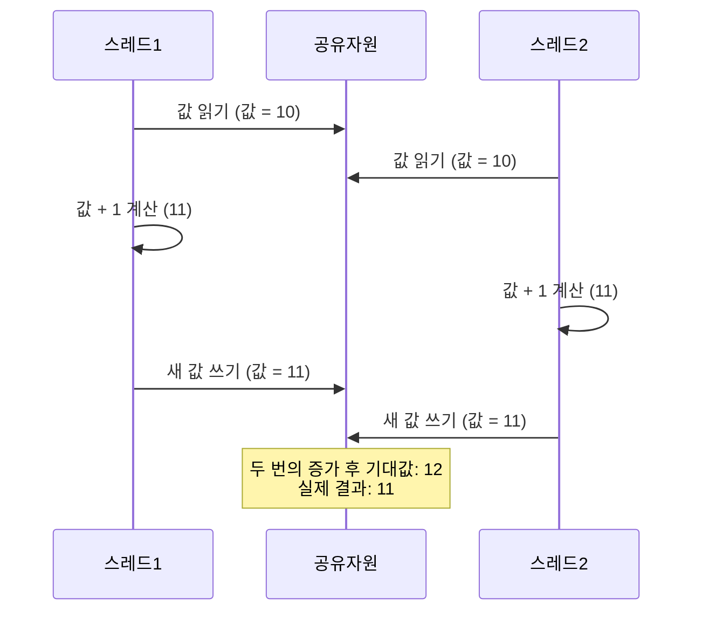

경쟁 상태(Race Condition)는 둘 이상의 스레드나 프로세스가 공유 자원에 동시에 접근하여 결과값이 실행 순서에 따라 예측할 수 없게 변하는 상황을 의미합니다. 이는 [[멀티스레딩(Multithreading)]]과 [[병렬 프로그래밍(Parallel Programming)]]에서 발생하는 가장 흔하고 위험한 문제 중 하나입니다.

경쟁 상태는 스레드가 자원을 수정하는 동안 다른 스레드의 간섭으로 인해 발생하며, 이로 인해 데이터 불일치, 프로그램 오류, 그리고 예측 불가능한 동작을 초래할 수 있습니다. 이러한 문제는 디버깅이 매우 어렵고, 특정 조건에서만 간헐적으로 발생하기 때문에 개발자들이 해결하기 까다로운 문제로 꼽힙니다.

## 경쟁 상태의 발생 조건

경쟁 상태가 발생하기 위해서는 다음 세 가지 조건이 동시에 충족되어야 합니다:

1. **공유 자원**: 여러 스레드나 프로세스가 접근할 수 있는 공유 데이터나 리소스가 있어야 합니다.
2. **수정 작업**: 최소 하나 이상의 스레드가 해당 자원을 수정(읽기 및 쓰기)해야 합니다.
3. **동시 접근**: 여러 스레드가 동시에 또는 거의 동시에 해당 자원에 접근해야 합니다.

이 세 조건이 모두 충족되면 경쟁 상태가 발생할 위험이 있습니다. 이러한 위험을 관리하지 않으면 데이터 불일치(Data Inconsistency)와 같은 심각한 문제가 발생할 수 있습니다.

## 경쟁 상태의 종류

경쟁 상태는 크게 다음과 같이 분류할 수 있습니다:

### 1. 읽기-수정-쓰기(Read-Modify-Write) 경쟁 상태

가장 일반적인 형태로, 한 스레드가 값을 읽고, 수정하고, 다시 쓰는 작업을 수행하는 도중에 다른 스레드가 개입하여 발생합니다.

### 2. 검사 후 행동(Check-Then-Act) 경쟁 상태

스레드가 조건을 검사한 후 해당 조건에 기반하여 행동을 취하는 동안, 다른 스레드가 그 조건을 변경할 때 발생합니다.

### 3. 시간 종속적(Time-of-check-to-time-of-use, TOCTTOU) 경쟁 상태

특히 파일 시스템 작업에서 자주 발생하는 형태로, 자원 상태를 확인한 시점과 실제 사용하는 시점 사이에 다른 프로세스가 자원을 변경할 때 발생합니다.

## 경쟁 상태 예시

경쟁 상태를 이해하기 위한 가장 간단한 예시는 카운터 증가 작업입니다:

```java
public class Counter {
    private int count = 0;
    
    public void increment() {
        count++; // 이 작업은 원자적이지 않습니다!
    }
    
    public int getCount() {
        return count;
    }
    
    public static void main(String[] args) throws InterruptedException {
        Counter counter = new Counter();
        Thread t1 = new Thread(() -> {
            for (int i = 0; i < 1000; i++) {
                counter.increment();
            }
        });
        
        Thread t2 = new Thread(() -> {
            for (int i = 0; i < 1000; i++) {
                counter.increment();
            }
        });
        
        t1.start();
        t2.start();
        
        t1.join();
        t2.join();
        
        System.out.println("최종 카운트: " + counter.getCount());
        // 예상 결과: 2000
        // 실제 결과: 2000보다 작은 값
    }
}
```

위 코드에서 `count++` 연산은 실제로 세 가지 단계로 이루어집니다:

1. 현재 값 읽기
2. 값에 1 더하기
3. 새 값 저장하기

이 세 단계 사이에 다른 스레드가 개입하여 값을 변경할 수 있기 때문에, 최종 결과는 예상한 2000보다 작을 수 있습니다.

## 경쟁 상태의 시각적 표현

경쟁 상태가 발생하는 과정을 시각적으로 표현하면 다음과 같습니다:



이 다이어그램은 두 스레드가 동시에 같은 값을 읽고, 각각 증가시킨 후, 같은 값을 다시 쓰는 상황을 보여줍니다. 결과적으로 두 번의 증가 연산이 수행되었음에도 불구하고 값은 한 번만 증가한 것처럼 보입니다.

## 경쟁 상태 방지 기법

경쟁 상태를 방지하기 위한 다양한 기법이 있습니다:

### 1. 동기화(Synchronization)

Java에서는 `synchronized` 키워드를 사용하여 임계 영역에 한 번에 하나의 스레드만 접근할 수 있도록 제한할 수 있습니다:

```java
public class SynchronizedCounter {
    private int count = 0;
    
    public synchronized void increment() {
        count++;
    }
    
    public synchronized int getCount() {
        return count;
    }
}
```

### 2. 락(Lock) 사용

`java.util.concurrent.locks` 패키지는 더 유연한 락 메커니즘을 제공합니다:

```java
import java.util.concurrent.locks.Lock;
import java.util.concurrent.locks.ReentrantLock;

public class LockCounter {
    private int count = 0;
    private final Lock lock = new ReentrantLock();
    
    public void increment() {
        lock.lock();
        try {
            count++;
        } finally {
            lock.unlock(); // 반드시 unlock 호출
        }
    }
    
    public int getCount() {
        lock.lock();
        try {
            return count;
        } finally {
            lock.unlock();
        }
    }
}
```

### 3. 원자적 변수(Atomic Variables)

`java.util.concurrent.atomic` 패키지는 원자적 연산을 지원하는 클래스를 제공합니다:

```java
import java.util.concurrent.atomic.AtomicInteger;

public class AtomicCounter {
    private AtomicInteger count = new AtomicInteger(0);
    
    public void increment() {
        count.incrementAndGet();
    }
    
    public int getCount() {
        return count.get();
    }
}
```

### 4. 불변 객체(Immutable Objects) 사용

불변 객체는 생성 후 상태가 변경되지 않기 때문에 경쟁 상태가 발생하지 않습니다. 가능한 경우 불변 객체를 사용하는 것이 좋습니다.

### 5. 스레드 로컬 변수(ThreadLocal Variables)

각 스레드가 자신만의 독립적인 변수 사본을 가지도록 하여 공유를 방지합니다:

```java
public class ThreadLocalExample {
    private static ThreadLocal<Integer> threadLocalValue = ThreadLocal.withInitial(() -> 0);
    
    public void increment() {
        threadLocalValue.set(threadLocalValue.get() + 1);
    }
    
    public int getValue() {
        return threadLocalValue.get();
    }
}
```

더 자세한 방지 기법은 경쟁 상태 방지 기법을 참고해주세요.

## 스프링 프레임워크에서의 경쟁 상태

스프링 프레임워크를 사용하는 웹 애플리케이션에서도 경쟁 상태는 발생할 수 있습니다. 특히 다음과 같은 경우에 주의해야 합니다:

### 1. 싱글톤 빈(Singleton Bean)의 상태 변경

스프링의 기본 빈 스코프는 싱글톤입니다. 싱글톤 빈의 상태를 변경하는 경우 경쟁 상태가 발생할 수 있습니다:

```java
@Service
public class UserService {
    private List<User> cachedUsers; // 상태를 가진 필드
    
    // 위험: 여러 스레드가 동시에 이 메서드를 호출할 수 있습니다
    public void addUser(User user) {
        cachedUsers.add(user);
    }
}
```

### 2. 스프링에서의 해결 방법

#### @Transactional을 이용한 데이터베이스 레벨 동기화

```java
@Service
public class TransactionalUserService {
    
    @Autowired
    private UserRepository userRepository;
    
    @Transactional
    public void incrementUserLoginCount(Long userId) {
        User user = userRepository.findById(userId).orElseThrow();
        user.setLoginCount(user.getLoginCount() + 1);
        userRepository.save(user);
    }
}
```

#### 스레드 안전한 컬렉션 사용

```java
@Service
public class ConcurrentUserService {
    private final ConcurrentHashMap<Long, User> userCache = new ConcurrentHashMap<>();
    
    public void addUser(User user) {
        userCache.put(user.getId(), user);
    }
}
```

스프링에서의 경쟁 상태 관리에 대한 더 자세한 내용은 스프링에서의 동시성 관리를 참고해주세요.

## 경쟁 상태 디버깅

경쟁 상태는 간헐적으로 발생하기 때문에 디버깅이 어렵습니다. 다음은 경쟁 상태를 디버깅하기 위한 몇 가지 방법입니다:

### 1. 로깅(Logging)

문제가 발생하는 지점 전후에 상세한 로그를 남겨 상태 변화를 추적합니다.

### 2. 스레드 덤프(Thread Dump)

문제가 발생할 때 스레드 덤프를 생성하여 각 스레드의 상태와 잠금 정보를 분석합니다.

### 3. 정적 분석 도구

FindBugs, SpotBugs와 같은 정적 분석 도구를 사용하여 잠재적인 경쟁 상태를 미리 발견합니다.

### 4. 부하 테스트(Load Testing)

높은 동시성 환경에서 애플리케이션을 테스트하여 경쟁 상태를 재현합니다.

경쟁 상태 디버깅에 대한 더 자세한 방법은 경쟁 상태 디버깅 기법을 참고해주세요.

## 실제 사용 사례

경쟁 상태는 다양한 상황에서 발생할 수 있습니다:

### 1. 온라인 예약 시스템

한정된 좌석에 대해 여러 사용자가 동시에 예약을 시도하는 경우

### 2. 금융 거래 시스템

계좌 잔액 업데이트가 동시에 발생하는 경우

### 3. 소셜 미디어 카운터

좋아요, 조회수 등의 카운터가 동시에 업데이트되는 경우

### 4. 재고 관리 시스템

여러 사용자가 동시에 재고를 확인하고 구매하는 경우

## 결론

경쟁 상태는 멀티스레드 프로그래밍에서 가장 흔하고 까다로운 문제 중 하나입니다. 공유 자원에 대한 동시 접근을 적절히 관리하지 않으면 예측할 수 없는 결과와 버그가 발생할 수 있습니다.

이 문제를 해결하기 위해서는 동기화, 락, 원자적 변수, 스레드 로컬 변수 등 다양한 기법을 적절히 활용해야 합니다. 특히 스프링과 같은 프레임워크를 사용할 때는 빈의 상태 관리와 트랜잭션 처리에 주의를 기울여야 합니다.

또한 경쟁 상태를 방지하는 것만큼이나 디버깅과 테스트를 통해 발견하는 것도 중요합니다. 로깅, 스레드 덤프, 정적 분석 도구, 부하 테스트 등을 활용하여 잠재적인 문제를 미리 발견하고 해결해야 합니다.

멀티스레드 환경에서 안정적인 소프트웨어를 개발하기 위해서는 경쟁 상태에 대한 이해와 적절한 대응 방법을 숙지하는 것이 필수적입니다. 경쟁 상태를 고려한 설계와 구현은 더 안정적이고 예측 가능한 시스템을 구축하는 데 큰 도움이 될 것입니다.

## 참고 자료

- Java Concurrency in Practice - Brian Goetz
- Effective Java, 3rd Edition - Joshua Bloch
- 스프링 공식 문서(https://docs.spring.io/spring-framework/docs/current/reference/html/core.html#beans-factory-scopes)
- Java SE 동시성 API 문서(https://docs.oracle.com/javase/8/docs/api/java/util/concurrent/package-summary.html)