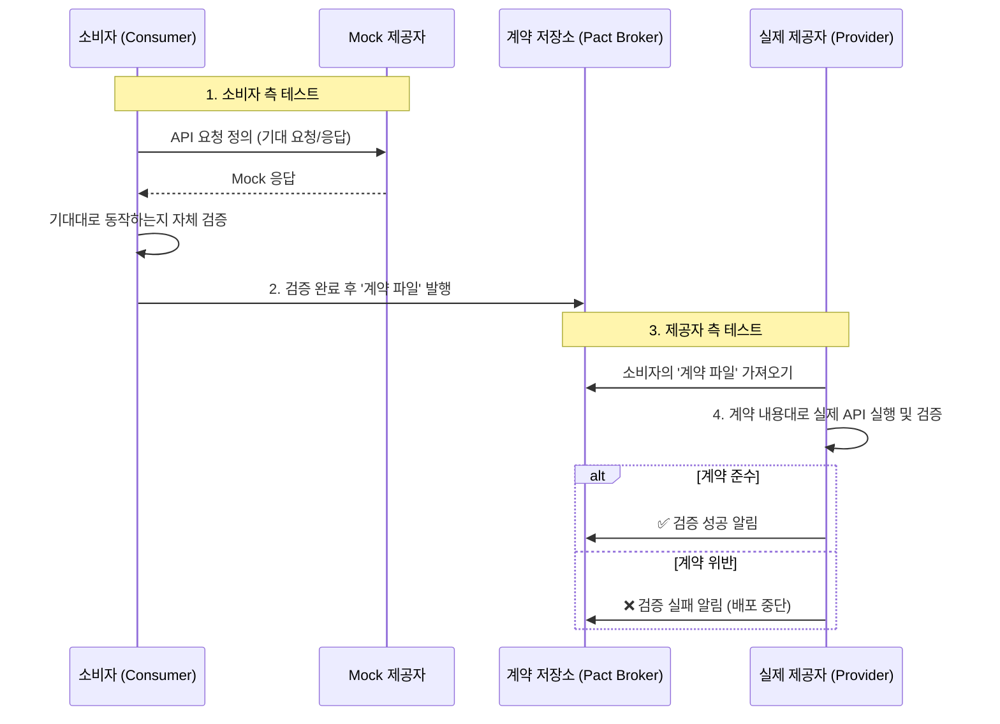

계약 테스트(Contract Test)는 분산 시스템 환경, 특히 [[마이크로서비스 아키텍처(Microservice Architecture)]]에서 각 서비스가 서로에게 기대하는 **상호작용 규약(Contract)을 정의하고, 이 규약을 각 서비스가 독립적으로 준수하는지 검증**하는 테스트 기법입니다.

이는 전체 서비스를 모두 연결하여 테스트하는 전통적인 [[통합 테스트(Integration Test)]]의 복잡성과 느린 피드백 주기를 해결하기 위해 등장했습니다. 계약 테스트의 핵심은 실제 서비스를 직접 호출하는 대신, **'계약'이라는 명문화된 문서를 중심으로 소비자와 제공자가 각자 테스트를 진행**한다는 점입니다.

---

### 계약 테스트는 왜 필요한가요?

마이크로서비스 환경에서는 여러 팀이 각기 다른 서비스를 독립적으로 개발하고 배포합니다. 이때 한 서비스(제공자, Provider)가 API의 응답 형식을 바꾸면, 그 API를 사용하는 다른 서비스(소비자, Consumer)는 예기치 않게 기능 장애를 겪을 수 있습니다.

이러한 문제를 방지하기 위해 모든 서비스를 연결하여 E2E 테스트나 통합 테스트를 실행할 수 있지만, 이는 다음과 같은 문제를 야기합니다.

- **느린 피드백**: 모든 연관 서비스가 특정 버전에 맞게 배포되어야 하므로 테스트 환경 구성이 복잡하고 실행 시간이 깁니다.
- **높은 불안정성**: 테스트 실패 시, 원인이 내 서비스의 문제인지, 연동된 다른 서비스의 문제인지, 혹은 네트워크 문제인지 파악하기 어렵습니다.
- **팀 간의 의존성 증가**: 특정 서비스의 변경이 전체 테스트의 실패로 이어져, 다른 팀의 배포를 막는 병목 현상이 발생합니다.

계약 테스트는 이러한 문제들을 해결합니다. 제공자와 소비자가 **'계약'**에만 의존하여 서로를 테스트하므로, 다른 서비스의 상태와 관계없이 **독립적으로, 그리고 빠르게** 통합 지점의 신뢰성을 검증할 수 있습니다.

---

### 계약 테스트의 작동 방식

계약 테스트는 주로 **소비자 주도 계약 테스트(Consumer-Driven Contract Test)** 방식으로 이루어집니다. 흐름은 다음과 같습니다.

1. **(소비자 측)** 소비자는 제공자 API에게 기대하는 요청과 받아야 할 응답을 코드로 정의합니다. (예: "`/users/1`로 GET 요청을 보내면, `id`와 `name`을 포함한 JSON을 200 OK로 응답받아야 한다.")
2. **(소비자 측)** 이 정의를 바탕으로 테스트를 실행하면, **가짜(Mock) 제공자 서버**가 생성되어 기대한 대로 응답을 반환하는지 검증하고, 이 상호작용은 **'계약 파일'**로 생성됩니다.
3. **(계약 공유)** 생성된 '계약 파일'은 제공자 팀에게 전달됩니다. 보통 Pact Broker나 Git 저장소 같은 중앙화된 저장소를 통해 공유됩니다.
4. **(제공자 측)** 제공자는 공유받은 '계약 파일'에 명시된 모든 요청을 자신의 실제 서비스에 보냅니다.
5. **(제공자 측)** 실제 서비스가 계약 파일에 정의된 것과 **정확히 동일한 응답**을 반환하는지 검증합니다. 만약 하나라도 다르면 테스트는 실패하고, 이는 소비자와의 계약을 위반했음을 의미합니다.

이 과정을 시각화하면 다음과 같습니다.

이러한 방식을 지원하는 대표적인 도구로는 Pact와 [[Spring Cloud Config]]가 있습니다.

---

### 계약 테스트 vs 통합 테스트

|   |   |   |
|---|---|---|
|**특징**|**계약 테스트 (Contract Test)**|**통합 테스트 (Integration Test)**|
|**목표**|두 서비스 간의 상호작용 '규약' 준수 여부 검증|여러 컴포넌트나 서비스가 통합된 후의 '동작' 검증|
|**범위**|소비자-제공자, 단 두 서비스 간의 경계면에 집중|두 개 이상의 서비스, 데이터베이스 등 넓은 범위의 연동을 포함|
|**속도**|매우 빠름 (실제 서비스를 띄우지 않음)|느림 (실제 서비스와 의존성을 모두 띄워야 함)|
|**격리성**|매우 높음 (각자 독립적으로 테스트)|낮음 (하나의 서비스 장애가 전체 테스트에 영향을 줌)|
|**피드백**|계약 위반 시 즉시 원인 파악 가능|실패 시 원인 파악이 복잡하고 오래 걸림|
|**주요 용도**|서비스 간 API 호환성이 깨지는 것을 사전에 방지|전체 비즈니스 로직 플로우가 올바르게 작동하는지 확인|

결론적으로, 계약 테스트는 통합 테스트를 대체하는 것이 아니라 **보완**하는 관계입니다. 계약 테스트로 서비스 간의 연결을 빠르고 확실하게 보장하고, 더 중요한 비즈니스 시나리오는 통합 테스트나 E2E 테스트로 검증하는 것이 효과적입니다.

---

### 장점과 단점

**장점:**

- **빠른 피드백과 높은 안정성**: 다른 서비스의 상태에 구애받지 않고 독립적으로 빠르게 실행할 수 있습니다.
- **결함의 조기 발견**: 제공자가 API를 변경하여 호환성이 깨지는 순간, CI 파이프라인에서 즉시 발견하여 배포를 막을 수 있습니다.
- **독립적인 개발 및 배포 촉진**: 팀 간의 강한 결합을 끊어주고, 각 팀이 자신감을 가지고 서비스를 개발하고 배포할 수 있게 합니다.
- **살아있는 문서**: 계약 파일 자체가 소비자가 API를 어떻게 사용하는지 보여주는 명확하고 항상 최신인 문서가 됩니다.

**단점:**

- **초기 구축의 복잡성**: Pact Broker와 같은 인프라 구축 및 CI/CD 파이프라인 연동에 초기 학습 비용과 노력이 필요합니다.
- **테스트 범위의 한계**: 서비스 간의 '규약'만을 검증할 뿐, 비즈니스 로직의 정확성이나 성능까지 보장하지는 않습니다.
- **계약 관리 오버헤드**: 서비스가 많아지고 계약이 복잡해질수록 관리해야 할 계약 파일의 수가 늘어납니다.

---

### 결론

계약 테스트는 수많은 마이크로서비스가 서로 얽혀있는 현대적인 분산 시스템에서 **"신뢰할 수 있는 빠른 피드백"**을 제공하는 강력한 무기입니다. 통합 테스트의 무거움과 불안정성에서 벗어나, 각 서비스가 독립적으로 진화하면서도 서로의 약속을 깨지 않도록 보장해 줍니다. 초기 도입 비용은 있지만, 장기적으로는 팀의 개발 속도를 높이고 시스템 전체의 안정성을 크게 향상시키는 중요한 전략입니다.

---

### 참고 자료

- [Martin Fowler - ContractTest](https://martinfowler.com/bliki/ContractTest.html)
- [Pact - Official Documentation](https://docs.pact.io/)
- [Spring Cloud Contract - Official Documentation](https://spring.io/projects/spring-cloud-contract)