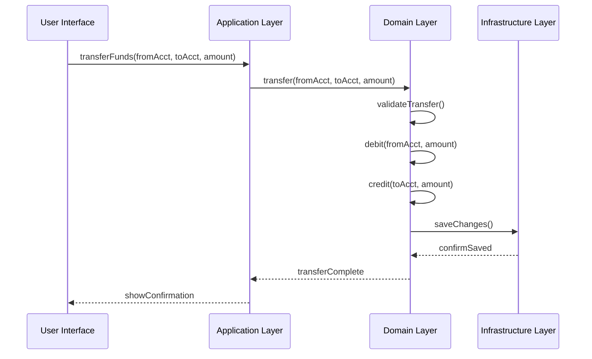

복잡한 비즈니스 도메인을 다루는 소프트웨어 시스템은 수많은 책임과 기능을 가지고 있습니다. 이러한 복잡성을 효율적으로 관리하기 위해 [[도메인 주도 설계(DDD,Domain Driven Design)]]에서는 계층형 아키텍처(Layered Architecture)를 적용합니다. 이 아키텍처는 소프트웨어의 다양한 측면을 분리하여 각 계층이 고유한 책임에 집중할 수 있게 함으로써, 시스템의 복잡성을 관리하고 유지보수성을 높이는 데 중요한 역할을 합니다.

## 계층형 아키텍처의 필요성

소프트웨어 시스템은 사용자 입력 처리, 비즈니스 로직 실행, 데이터베이스 접근, 네트워크 통신, 정보 표시 등 다양한 기능을 수행합니다. 이러한 기능들이 하나의 코드 베이스에 섞여 있다면 다음과 같은 문제가 발생합니다:

1. 비즈니스 로직이 UI, 데이터베이스 코드 등과 혼재되어 파악하기 어려워집니다.
2. UI 변경이 비즈니스 로직에 영향을 줄 수 있습니다.
3. 비즈니스 규칙을 변경할 때 UI 코드, 데이터베이스 코드 등을 모두 검토해야 합니다.
4. 일관된 모델 기반 객체 구현이 어려워집니다.
5. 자동화된 테스트가 복잡해집니다.

이러한 문제를 해결하기 위해 계층형 아키텍처는 **관심사의 분리**(Separation of Concerns)를 제공합니다. 각 계층은 특정 측면에 집중하고, 다른 계층과의 상호작용은 정의된 인터페이스를 통해 이루어집니다.

## 계층형 아키텍처의 구조
### 1. 사용자 인터페이스 계층 (User Interface Layer)

- **책임**: 사용자에게 정보를 표시하고 사용자 명령을 해석합니다.
- **특징**: 외부 행위자는 사람일 수도 있고 다른 컴퓨터 시스템일 수도 있습니다.
- **역할**: 사용자와의 상호작용을 담당합니다.

### 2. 애플리케이션 계층 (Application Layer)

- **책임**: 소프트웨어가 수행해야 할 작업을 정의하고 도메인 객체를 조율합니다.
- **특징**: 이 계층은 얇게 유지되며, 비즈니스 규칙이나 지식을 포함하지 않습니다.
- **역할**: 작업을 조정하고 도메인 객체에 작업을 위임합니다.
- **상태**: 비즈니스 상황을 반영하는 상태를 갖지 않지만, 사용자 또는 프로그램의 작업 진행 상태를 반영할 수 있습니다.

### 3. 도메인 계층 (Domain Layer)

- **책임**: 비즈니스 개념, 비즈니스 상황에 대한 정보, 비즈니스 규칙을 표현합니다.
- **특징**: 비즈니스 상황을 반영하는 상태를 제어하고 사용하며, 이를 저장하는 기술적 세부사항은 인프라스트럭처 계층에 위임합니다.
- **역할**: 비즈니스 소프트웨어의 핵심입니다.

### 4. 인프라스트럭처 계층 (Infrastructure Layer)

- **책임**: 상위 계층을 지원하는 일반적인 기술적 기능을 제공합니다.
- **특징**: 애플리케이션을 위한 메시지 전송, 도메인을 위한 영속성, UI를 위한 위젯 그리기 등을 담당합니다.
- **역할**: 인프라스트럭처 계층은 아키텍처 프레임워크를 통해 네 계층 간의 상호작용 패턴을 지원할 수도 있습니다.

## 계층 간 관계

계층형 아키텍처에서는 의존성이 한 방향으로만 흐르는 것이 원칙입니다. 상위 계층은 하위 계층의 요소를 직접 사용할 수 있지만, 하위 계층이 상위 계층과 통신해야 할 때는 다른 메커니즘이 필요합니다.

### 상위 계층에서 하위 계층으로의 의존성

상위 계층은 하위 계층의 공개 인터페이스를 호출하거나 참조를 유지함으로써 하위 계층과 상호작용할 수 있습니다. 이는 일반적인 방식으로 이루어집니다.

### 하위 계층에서 상위 계층으로의 의존성

하위 계층이 상위 계층과 통신해야 할 경우, 다음과 같은 메커니즘을 사용할 수 있습니다:

1. **콜백(Callbacks)**: 상위 계층이 하위 계층에 콜백 함수를 제공하여 특정 이벤트 발생 시 호출되도록 합니다.
2. **옵저버 패턴(Observer Pattern)**: 하위 계층의 객체가 변경될 때 이를 구독하는 상위 계층의 객체에게 알립니다.
3. **이벤트 기반 통신**: 하위 계층이 이벤트를 발생시키고 상위 계층이 이를 수신하는 방식입니다.

### UI와 도메인 계층의 연결

UI와 도메인 계층을 연결하는 대표적인 패턴으로는 [[Model-View-Controller 패턴]]이 있습니다. 이 패턴은 1970년대 Smalltalk 세계에서 처음 도입되었으며, 많은 UI 아키텍처에 영향을 주었습니다.

### 인프라스트럭처 계층과 도메인 계층의 연결

인프라스트럭처 계층은 일반적으로 도메인 계층에서 액션을 시작하지 않습니다. 도메인 계층 "아래"에 위치하므로, 서비스하는 도메인에 대한 특정 지식을 가지지 않아야 합니다. 대신, 기술적 기능은 주로 **서비스**로 제공됩니다.

## 예시: 계층형 아키텍처를 적용한 자금 이체 기능

은행 계좌 관리를 위한 애플리케이션의 자금 이체 기능을 계층형 아키텍처로 구현하는 예시를 살펴보겠습니다.



### 각 계층의 책임

이 예시에서 각 계층의 책임은 다음과 같습니다:

1. **UI 계층**: 사용자로부터 출발 계좌, 도착 계좌, 금액을 입력받고 이체 요청을 시작합니다.
2. **애플리케이션 계층**: 이체 작업을 조정하고 도메인 계층에 작업을 위임합니다.
3. **도메인 계층**: 계좌 간 이체에 대한 비즈니스 규칙(예: "모든 출금에는 해당하는 입금이 있어야 함")을 구현합니다.
4. **인프라스트럭처 계층**: 데이터베이스에 변경 사항을 저장하고 트랜잭션을 관리합니다.

### 예시 코드

```java
// 도메인 계층
public class Account {
    private String accountNumber;
    private BigDecimal balance;
    
    public void debit(BigDecimal amount) {
        if (balance.compareTo(amount) < 0) {
            throw new InsufficientFundsException();
        }
        balance = balance.subtract(amount);
    }
    
    public void credit(BigDecimal amount) {
        balance = balance.add(amount);
    }
}

// 애플리케이션 계층
@Service
public class FundsTransferService {
    private final AccountRepository accountRepository;
    
    public FundsTransferService(AccountRepository accountRepository) {
        this.accountRepository = accountRepository;
    }
    
    @Transactional
    public void transfer(String fromAccountNumber, String toAccountNumber, BigDecimal amount) {
        Account fromAccount = accountRepository.findByAccountNumber(fromAccountNumber);
        Account toAccount = accountRepository.findByAccountNumber(toAccountNumber);
        
        fromAccount.debit(amount);
        toAccount.credit(amount);
        
        accountRepository.save(fromAccount);
        accountRepository.save(toAccount);
    }
}
```

이 코드 예시에서 도메인 계층은 `Account` 클래스로 구현되며, 비즈니스 규칙을 캡슐화합니다. 애플리케이션 계층은 `FundsTransferService`로 구현되어 작업을 조정하고 도메인 객체에 작업을 위임합니다.

## 계층형 아키텍처의 이점

계층형 아키텍처를 적용함으로써 얻을 수 있는 이점은 다음과 같습니다:

1. **관심사의 분리**: 각 계층이 특정 측면에 집중함으로써 더 응집력 있는 설계를 만들 수 있습니다.
2. **유지보수성 향상**: 각 계층은 서로 다른 속도로 진화하고 다른 요구사항에 대응하기 때문에, 분리된 계층은 유지보수 비용을 줄여줍니다.
3. **분산 시스템 지원**: 다른 계층을 다른 서버나 클라이언트에 유연하게 배치할 수 있어 통신 오버헤드를 최소화하고 성능을 향상시킬 수 있습니다.
4. **테스트 용이성**: 계층이 분리되어 있어 개별 계층을 독립적으로 테스트하기 쉬워집니다.
5. **코드 재사용**: 공통 기능을 적절한 계층에 배치함으로써 코드 재사용성이 향상됩니다.
6. **확장성**: 특정 계층만 교체하거나 확장할 수 있어 시스템의 확장성이 향상됩니다.

## 계층형 아키텍처 구현 시 고려사항

계층형 아키텍처를 효과적으로 구현하기 위해서는 다음 사항을 고려해야 합니다:

1. **계층 간 명확한 경계**: 각 계층의 책임을 명확히 정의하고 경계를 설정해야 합니다.
2. **의존성 방향**: 의존성은 항상 상위 계층에서 하위 계층으로 향해야 합니다.
3. **계층 간 통신**: 계층 간 통신은 잘 정의된 인터페이스를 통해 이루어져야 합니다.
4. **도메인 계층의 중요성**:
5. **도메인 계층의 중요성**: 도메인 계층은 비즈니스 소프트웨어의 핵심이므로, 다른 계층과 완전히 분리하여 순수한 비즈니스 로직에 집중할 수 있도록 해야 합니다.
6. **인프라스트럭처 추상화**: 도메인 계층이 특정 인프라스트럭처 기술에 의존하지 않도록 추상화된 인터페이스를 사용해야 합니다.
7. **적절한 패턴 적용**: 계층 간 통신을 위해 [[의존성 역전 원칙]](Dependency Inversion Principle)과 같은 적절한 패턴을 적용해야 합니다.

## 아키텍처 프레임워크

일부 시스템에서는 인프라스트럭처가 서비스 형태로 제공되고 인터페이스를 통해 호출됩니다. 이런 경우 계층화가 어떻게 작동하는지, 그리고 계층을 느슨하게 결합하는 방법이 직관적입니다. 그러나 일부 기술적 문제는 더 긴밀한 상호작용이 필요합니다.

아키텍처 프레임워크는 다른 계층의 기본 기능을 직접 지원하고 상호 관계를 위한 메커니즘을 제공하는 인프라스트럭처의 형태입니다. 스프링 프레임워크와 같은 아키텍처 프레임워크는 다음과 같은 기능을 제공합니다:

1. **의존성 주입**: 객체 간의 의존성을 외부에서 주입함으로써 결합도를 낮춥니다.
2. **AOP(관점 지향 프로그래밍)**: 트랜잭션 관리, 로깅 등의 공통 관심사를 분리합니다.
3. **선언적 트랜잭션**: 트랜잭션 경계를 선언적으로 정의할 수 있습니다.
4. **ORM 통합**: 객체-관계 매핑을 통해 도메인 객체와 데이터베이스 간의 변환을 처리합니다.

## 스프링 프레임워크에서의 계층형 아키텍처 구현

스프링 프레임워크는 계층형 아키텍처를 구현하는 데 필요한 다양한 기능을 제공합니다. 다음은 스프링에서 각 계층을 구현하는 일반적인 방법입니다:

### 1. 사용자 인터페이스 계층

스프링 MVC를 사용하여 구현됩니다:

```java
@Controller
public class AccountController {
    private final FundsTransferService transferService;
    
    public AccountController(FundsTransferService transferService) {
        this.transferService = transferService;
    }
    
    @PostMapping("/transfer")
    public String transferFunds(@RequestParam String fromAccount, 
                              @RequestParam String toAccount,
                              @RequestParam BigDecimal amount,
                              Model model) {
        transferService.transfer(fromAccount, toAccount, amount);
        model.addAttribute("message", "이체가 성공적으로 완료되었습니다.");
        return "transfer-confirmation";
    }
}
```

### 2. 애플리케이션 계층

서비스 클래스를 사용하여 구현됩니다:

```java
@Service
public class FundsTransferServiceImpl implements FundsTransferService {
    private final AccountRepository accountRepository;
    
    public FundsTransferServiceImpl(AccountRepository accountRepository) {
        this.accountRepository = accountRepository;
    }
    
    @Transactional
    @Override
    public void transfer(String fromAccountNumber, String toAccountNumber, BigDecimal amount) {
        Account fromAccount = accountRepository.findByAccountNumber(fromAccountNumber);
        Account toAccount = accountRepository.findByAccountNumber(toAccountNumber);
        
        fromAccount.debit(amount);
        toAccount.credit(amount);
    }
}
```

### 3. 도메인 계층

엔티티 클래스와 도메인 서비스를 사용하여 구현됩니다:

```java
@Entity
public class Account {
    @Id
    private String accountNumber;
    private BigDecimal balance;
    
    // 비즈니스 로직
    public void debit(BigDecimal amount) {
        if (balance.compareTo(amount) < 0) {
            throw new InsufficientFundsException("잔액이 부족합니다.");
        }
        balance = balance.subtract(amount);
    }
    
    public void credit(BigDecimal amount) {
        balance = balance.add(amount);
    }
}
```

### 4. 인프라스트럭처 계층

리포지토리 인터페이스와 구현체를 사용하여 구현됩니다:

```java
public interface AccountRepository {
    Account findByAccountNumber(String accountNumber);
    void save(Account account);
}

@Repository
public class JpaAccountRepository implements AccountRepository {
    private final EntityManager entityManager;
    
    public JpaAccountRepository(EntityManager entityManager) {
        this.entityManager = entityManager;
    }
    
    @Override
    public Account findByAccountNumber(String accountNumber) {
        return entityManager.find(Account.class, accountNumber);
    }
    
    @Override
    public void save(Account account) {
        entityManager.persist(account);
    }
}
```

## 계층형 아키텍처의 진화

계층형 아키텍처는 시간이 지남에 따라 다양한 형태로 진화하고 있습니다:

1. **육각형 아키텍처(Hexagonal Architecture)**: 포트와 어댑터를 사용하여 도메인 모델을 외부 시스템으로부터 더 독립적으로 만듭니다.
2. **클린 아키텍처(Clean Architecture)**: 의존성 규칙을 중심으로 계층을 정의하며, 도메인 모델이 모든 것의 중심에 있습니다.
3. **마이크로서비스 아키텍처**: 각 서비스가 자체적인 계층형 아키텍처를 가질 수 있습니다.

이러한 아키텍처 스타일은 기본적인 계층형 아키텍처의 개념을 확장하고 개선한 것으로 볼 수 있습니다.

## 결론

DDD의 계층형 아키텍처는 복잡한 비즈니스 도메인을 다루는 소프트웨어 시스템에서 관심사를 효과적으로 분리하는 방법을 제공합니다. 사용자 인터페이스, 애플리케이션, 도메인, 인프라스트럭처 계층으로 시스템을 나누어 각 계층이 자신의 책임에 집중할 수 있게 함으로써, 시스템의 복잡성을 관리하고 유지보수성을 향상시킬 수 있습니다.

특히 도메인 계층을 다른 계층으로부터 분리함으로써, 비즈니스 로직에 집중하고 풍부한 도메인 모델을 진화시킬 수 있습니다. 이는 결국 비즈니스 지식을 효과적으로 캡처하고 활용하는 소프트웨어 시스템을 구축하는 데 기여합니다.

## 참고자료

1. Evans, Eric. "Domain-Driven Design: Tackling Complexity in the Heart of Software." Addison-Wesley, 2003.
2. Fowler, Martin. "Patterns of Enterprise Application Architecture." Addison-Wesley, 2002.
3. Vernon, Vaughn. "Implementing Domain-Driven Design." Addison-Wesley, 2013.
4. 조영호. "개발자가 반드시 정복해야 할 객체 지향과 디자인 패턴." 인사이트, 2014.
5. 그렉 영. "스프링 인 액션." 제이펍, 2020.