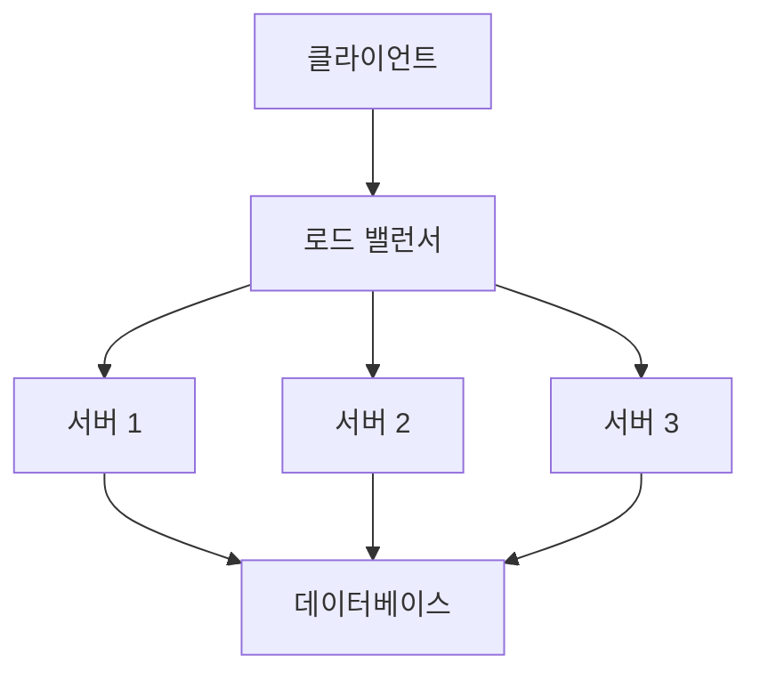

고가용성(High Availability, HA)은 시스템이나 서비스가 중단 없이 지속적으로 운영될 수 있도록 보장하는 특성입니다. 이는 시스템 장애가 발생하더라도 사용자에게 서비스를 계속 제공할 수 있는 능력을 의미합니다. 고가용성은 현대 시스템 설계에서 핵심적인 요구사항으로, 특히 금융, 의료, 전자상거래와 같이 서비스 중단이 심각한 결과를 초래할 수 있는 분야에서 중요합니다.

## 고가용성의 중요성

고가용성을 구현하는 이유는 다음과 같습니다:

1. **비즈니스 연속성**: 서비스 중단은 직접적인 수익 손실로 이어질 수 있습니다.
2. **사용자 신뢰**: 안정적인 서비스는 사용자 신뢰를 구축하는 데 필수적입니다.
3. **규제 준수**: 많은 산업 분야에서 일정 수준의 가용성을 요구하는 규제가 있습니다.
4. **경쟁 우위**: 안정적인 서비스는 경쟁사와 차별화되는 요소가 될 수 있습니다.

## 가용성 측정

가용성은 일반적으로 시스템이 정상 작동하는 시간의 비율로 측정되며, 다음과 같이 계산됩니다:

```
가용성(%) = (총 운영 시간 - 중단 시간) / 총 운영 시간 × 100
```

가용성 수준은 보통 "9의 개수"로 표현됩니다:

|가용성 수준|표현|연간 허용 중단 시간|
|---|---|---|
|99%|"2개의 9"|87.6시간 (3.65일)|
|99.9%|"3개의 9"|8.76시간|
|99.99%|"4개의 9"|52.56분|
|99.999%|"5개의 9"|5.26분|
|99.9999%|"6개의 9"|31.5초|

## 고가용성 설계 원칙

### 1. 단일 장애점(SPOF) 제거

단일 장애점(Single Point of Failure, SPOF)은 해당 구성 요소가 실패하면 전체 시스템이 중단되는 요소를 의미합니다. 고가용성 시스템은 이러한 단일 장애점을 제거하거나 최소화해야 합니다.

### 2. 중복성(Redundancy)

중복성은 시스템의 핵심 구성 요소를 여러 개 두어 하나가 실패해도 다른 것이 그 역할을 대신할 수 있도록 하는 것입니다. 이는 [[중복성]]의 두 가지 주요 형태로 구현될 수 있습니다:

- **활성-활성(Active-Active)**: 모든 중복 구성 요소가 동시에 작동하며 부하를 분산합니다.
- **활성-대기(Active-Passive)**: 주 구성 요소가 작동하고 장애 발생 시 대기 구성 요소가 활성화됩니다.

### 3. 장애 감지 및 복구

시스템은 장애를 신속하게 감지하고 자동으로 복구할 수 있어야 합니다. 이를 위해 다음과 같은 방법을 사용할 수 있습니다:

- **헬스 체크(Health Check)**: 구성 요소의 상태를 주기적으로 확인합니다.
- **자동 복구 메커니즘**: 장애 감지 시 자동으로 대체 리소스로 전환합니다.
- **자가 치유(Self-healing)**: 시스템이 장애를 감지하고 자동으로 복구할 수 있는 능력입니다.

### 4. 장애 격리

장애가 발생해도 전체 시스템에 영향을 미치지 않도록 시스템을 설계해야 합니다. 이를 위해 [[서킷 브레이커(Circuit Breaker) 패턴]]과 같은 기술을 사용할 수 있습니다.

### 5. 탄력성(Resilience)

시스템은 예상치 못한 부하 증가나 자원 부족과 같은 스트레스 상황에서도 기능을 유지할 수 있어야 합니다.

## 고가용성 구현 전략

### 1. 로드 밸런싱

[[로드 밸런싱]]은 여러 서버에 트래픽을 분산하여 부하를 균등하게 분배하는 기술입니다. 이는 단일 서버의 과부하를 방지하고, 서버 장애 시 트래픽을 정상 서버로 리디렉션할 수 있습니다.



### 2. 데이터 복제

데이터 손실을 방지하고 데이터베이스 가용성을 높이기 위해 데이터를 여러 위치에 복제합니다. 주요 복제 전략으로는 다음과 같은 것들이 있습니다:

- **마스터-슬레이브 복제**: 쓰기는 마스터에서, 읽기는 슬레이브에서 수행됩니다.
- **다중 마스터 복제**: 여러 마스터가 쓰기와 읽기를 모두 처리합니다.
- **샤딩(Sharding)**: 데이터를 여러 서버에 분산 저장합니다.

### 3. 분산 시스템 설계

[[분산 시스템(Distributed System)]]은 여러 노드에 걸쳐 작업을 분산하여 단일 장애점을 제거하고 확장성을 높입니다. 분산 시스템 설계에는 다음과 같은 고려사항이 포함됩니다:

- **일관성 vs 가용성**: [[CAP 정리]]에 따라 분산 시스템은 일관성, 가용성, 분할 허용성 중 최대 두 가지만 동시에 보장할 수 있습니다.
- **데이터 일관성**: 분산 환경에서 데이터 일관성을 유지하는 방법을 고려해야 합니다.

### 4. 지역 분산(Geo-distribution)

서비스를 여러 지역에 분산 배치하면 지역적 장애나 자연 재해로부터 보호할 수 있습니다. 또한 사용자에게 더 빠른 응답 시간을 제공할 수 있습니다.

### 5. 자동화된 모니터링 및 알림

시스템 상태를 지속적으로 모니터링하고 문제 발생 시 즉시 알림을 보내는 시스템을 구축해야 합니다. 이를 통해 문제가 심각해지기 전에 대응할 수 있습니다.

## 고가용성 구현 예시 (Java/Spring)

다음은 Spring 애플리케이션에서 고가용성을 구현하는 간단한 예시입니다:

### 1. 서킷 브레이커 패턴 구현 (Spring Cloud Circuit Breaker)

```java
@Service
public class ProductService {
    
    @Autowired
    private RestTemplate restTemplate;
    
    @CircuitBreaker(name = "productService", fallbackMethod = "getProductFallback")
    public Product getProduct(Long id) {
        return restTemplate.getForObject("http://product-api/products/" + id, Product.class);
    }
    
    public Product getProductFallback(Long id, Exception e) {
        // 장애 발생 시 대체 로직 (캐시된 데이터 반환 또는 기본 값 반환)
        return new Product(id, "대체 상품", 0);
    }
}
```

### 2. 로드 밸런싱 구성 (Spring Cloud LoadBalancer)

```java
@Configuration
public class LoadBalancerConfig {
    
    @Bean
    @LoadBalanced
    public RestTemplate restTemplate() {
        return new RestTemplate();
    }
}
```

## 고가용성 설계 시 고려사항

### 1. 비용과 복잡성

고가용성 시스템은 중복 리소스와 복잡한 아키텍처로 인해 비용이 증가할 수 있습니다. 따라서 비즈니스 요구사항과 비용 사이의 균형을 찾는 것이 중요합니다.

### 2. 성능 영향

고가용성 구현(예: 데이터 복제, 일관성 유지)은 시스템 성능에 영향을 미칠 수 있습니다. 이러한 트레이드오프를 고려하여 설계해야 합니다.

### 3. 테스트와 검증

고가용성 시스템은 다양한 장애 시나리오에 대한 철저한 테스트가 필요합니다. [[카오스 엔지니어링]]과 같은 접근 방식을 사용하여 시스템의 복원력을 검증할 수 있습니다.

### 4. 점진적 업그레이드

시스템 업그레이드 시 서비스 중단을 최소화하기 위해 [[블루-그린 배포]] 또는 [[카나리 배포]]와 같은 전략을 사용할 수 있습니다.

## 결론

고가용성은 현대 시스템 설계의 핵심 요구사항입니다. 중복성, 장애 감지 및 복구, 분산 시스템 설계 등의 원칙을 적용하여 시스템 가용성을 높일 수 있습니다. 그러나 비용, 복잡성, 성능 영향 등의 트레이드오프를 고려하여 비즈니스 요구사항에 맞는 적절한 수준의 가용성을 설계하는 것이 중요합니다.

고가용성 시스템을 설계할 때는 단일 장애점을 제거하고, 중복성을 구현하며, 자동화된 모니터링 및 복구 메커니즘을 구축하는 것이 핵심입니다. 또한 실제 장애 상황을 시뮬레이션하여 시스템의 복원력을 지속적으로 검증하는 것이 중요합니다.

## 관련 노트

- [[중복성]]
- [[서킷 브레이커(Circuit Breaker) 패턴]]
- [[로드 밸런싱]]
- [[분산 시스템(Distributed System)]]
- [[CAP 정리]]
- [[카오스 엔지니어링]]
- [[블루-그린 배포]]
- [[카나리 배포]]