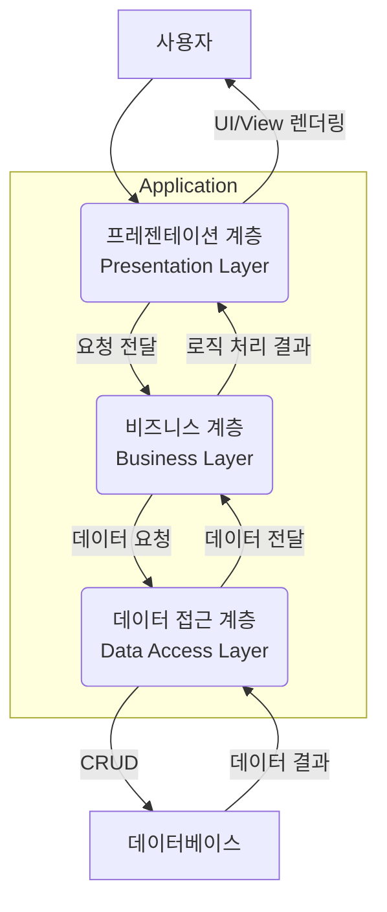

안녕하세요! 오늘은 소프트웨어 설계의 가장 기본적이면서도 중요한 원칙 중 하나인 **관심사 분리(Separation of Concerns, SoC)**에 대해 이야기해보려고 합니다. 아마 많은 개발자분들이 이미 들어보셨거나, 자신도 모르게 코드에 적용하고 계실 개념일 겁니다.

관심사 분리란, 쉽게 말해 **컴퓨터 프로그램을 각기 다른 기능을 수행하는 별개의 영역으로 나누는 것**을 의미합니다. 마치 잘 정리된 주방에서 각 요리사가 에피타이저, 메인 요리, 디저트를 전담하여 효율적으로 일하는 것처럼, 소프트웨어도 각자의 '관심사' 또는 '책임'에 따라 코드를 분리하는 것이죠.

이 원칙을 제대로 이해하고 적용하면 코드의 가독성, 유지보수성, 재사용성이 극적으로 향상되어 더 나은 소프트웨어를 만들 수 있는 튼튼한 기반이 됩니다.

## 왜 관심사를 분리해야 할까요?

관심사 분리를 통해 얻을 수 있는 핵심적인 이점은 다음과 같습니다. 이는 MECE 원칙에 따라 상호 배타적이면서 전체를 포괄하는 형태로 정리할 수 있습니다.

1. **이해도 및 가독성 향상**: 하나의 코드 덩어리가 하나의 명확한 목적만 가지게 됩니다. 이로 인해 코드를 처음 보는 사람도 그 역할을 쉽게 파악할 수 있으며, 전체 시스템의 구조를 이해하기 쉬워집니다.
2. **유지보수성 증대**: 요구사항 변경이나 버그 수정이 필요할 때, 관련된 부분만 수정하면 되므로 파급 효과(Side Effect)를 최소화할 수 있습니다. 예를 들어, UI 디자인을 변경하는 작업이 데이터베이스 로직에 영향을 주지 않게 됩니다.
3. **재사용성 강화**: 특정 관심사에 집중하여 만들어진 모듈이나 컴포넌트는 다른 시스템이나 프로젝트에서도 쉽게 가져다 쓸 수 있는 독립적인 부품이 됩니다.
4. **팀 협업 효율 증진**: 각기 다른 관심사를 다른 개발자나 팀이 동시에 독립적으로 개발할 수 있습니다. 프론트엔드 개발자는 화면을, 백엔드 개발자는 비즈니스 로직을, DBA는 데이터베이스를 병렬로 작업하는 것이 가능해집니다.

## 관심사 분리 적용 방법

그렇다면 이 좋은 원칙을 어떻게 실제 코드에 적용할 수 있을까요? 관심사 분리는 특정 기술이나 프레임워크에 국한된 개념이 아니라, 다양한 수준에서 적용할 수 있는 설계 철학입니다.

### 1. [[계층형 아키텍처(Layered Architecture)]]

가장 대표적인 관심사 분리 적용 사례는 시스템을 여러 개의 수평적인 계층으로 나누는 **계층형 아키텍처**입니다. 각 계층은 자신만의 명확한 책임을 가집니다.

일반적인 웹 애플리케이션은 다음과 같은 3-Tier 아키텍처로 관심사를 분리합니다.

- **프레젠테이션 계층 (Presentation Layer)**: 사용자와 직접 상호작용하는 부분입니다. UI를 표시하고, 사용자 입력을 받아 비즈니스 계층으로 전달하는 '관심사'를 가집니다. (예: Spring MVC의 Controller, JSP/Thymeleaf 뷰)
- **비즈니스 계층 (Business Layer)**: 애플리케이션의 핵심 비즈니스 로직을 처리하는 '관심사'를 가집니다. 프레젠테이션 계층에서 받은 요청을 처리하고, 필요하다면 데이터 접근 계층에 데이터 처리를 위임합니다. (예: Spring의 Service 클래스)
- **데이터 접근 계층 (Data Access Layer)**: 데이터베이스와의 통신을 전담합니다. 데이터의 영속성(Persistence), 즉 데이터를 생성(Create), 조회(Read), 수정(Update), 삭제(Delete)하는 '관심사'를 가집니다. (예: Spring Data JPA의 Repository 인터페이스, MyBatis의 Mapper)

이러한 계층 간의 상호작용은 다음과 같이 시각화할 수 있습니다.



이 구조에서는 각 계층이 바로 아래 계층에만 의존하는 것을 원칙으로 하여, 계층 간의 결합도를 낮추고 독립성을 높입니다.

### 2. 디자인 패턴을 통한 분리

많은 [[디자인 패턴(Design Pattern)]]은 관심사 분리 원칙에 깊이 뿌리를 두고 있습니다.

대표적인 예가 바로 **[[MVC (Model-View-Controller) 패턴]]** 입니다. MVC 패턴은 특히 웹 프레임워크에서 프레젠테이션 계층 내부의 관심사를 더욱 세분화하여 분리합니다.

- **Model**: 데이터와 비즈니스 로직 (애플리케이션의 '상태')
- **View**: 사용자에게 보여지는 UI (모델을 '표현')
- **Controller**: 사용자 입력을 받아 모델을 업데이트하고, 어떤 뷰를 보여줄지 결정 ('제어')

스프링 프레임워크는 이 MVC 패턴을 통해 개발자가 각자의 관심사에만 집중할 수 있도록 돕습니다.

```java
// Controller: 사용자 요청 처리와 뷰 선택에만 '관심'
@Controller
public class UserController {
    private final UserService userService;

    // 생성자를 통한 의존성 주입
    public UserController(UserService userService) {
        this.userService = userService;
    }

    @GetMapping("/users/{id}")
    public String getUser(@PathVariable Long id, Model model) {
        User user = userService.findUserById(id); // 비즈니스 로직은 Service에 위임
        model.addAttribute("user", user);
        return "userView"; // 보여줄 뷰의 이름을 반환
    }
}

// Service: 비즈니스 로직 처리에만 '관심'
@Service
public class UserService {
    private final UserRepository userRepository;

    // 생성자를 통한 의존성 주입
    public UserService(UserRepository userRepository) {
        this.userRepository = userRepository;
    }

    public User findUserById(Long id) {
        // 사용자를 찾는 핵심 로직
        return userRepository.findById(id).orElseThrow();
    }
}
```

위 코드에서 `UserController`는 "HTTP 요청을 어떻게 받고 어떻게 응답할 것인가"에만 집중하고, `UserService`는 "사용자를 찾는 비즈니스 규칙"에만 집중하여 각자의 역할이 명확하게 분리되어 있습니다.

### 3. 횡단 관심사 분리 (Cross-cutting Concerns)

로깅, 보안, 트랜잭션 처리와 같이 시스템 전반에 걸쳐 나타나는 기능들이 있습니다. 이를 **횡단 관심사**라고 부릅니다. 이러한 기능들을 모든 비즈니스 로직 코드에 직접 작성한다면, 핵심 로직의 가독성을 해치고 코드 중복을 유발할 것입니다.

**[[관점 지향 프로그래밍 (AOP, Aspect-Oriented Programming)]]**은 이러한 횡단 관심사를 핵심 비즈니스 로직으로부터 분리하는 강력한 방법입니다. 스프링 AOP를 사용하면 로깅이나 트랜잭션 코드를 비즈니스 로직과 완전히 분리하여 모듈화할 수 있습니다.


## 관련 원칙과의 관계

관심사 분리는 다른 중요한 소프트웨어 원칙들과도 깊은 관련이 있습니다.

특히 [[SOLID 원칙]] 중 하나인 **[[단일 책임 원칙(Single Responsibility Principle)]]** 과 매우 유사합니다. SRP는 "하나의 클래스는 하나의 책임만 가져야 한다"고 정의하며, 이는 관심사 분리를 클래스 수준에서 적용하는 구체적인 실천 방안으로 볼 수 있습니다. 관심사 분리가 좀 더 거시적이고 아키텍처 수준까지 아우르는 넓은 개념이라면, SRP는 개별 클래스나 모듈에 초점을 맞춘 미시적인 원칙입니다.

## 결론

관심사 분리는 단순히 코드를 나누는 행위를 넘어, 소프트웨어를 더 유연하고, 견고하며, 지속 가능하게 만드는 핵심적인 설계 철학입니다. 처음에는 어디까지, 어떻게 분리해야 할지 막막할 수 있지만, 계층형 아키텍처, MVC 패턴, AOP와 같은 검증된 방법들을 의식적으로 적용하며 연습하다 보면 자연스럽게 체득할 수 있습니다.

"이 코드는 어떤 책임(관심사)을 가지고 있는가?" 라는 질문을 스스로에게 던지는 습관을 통해 더 나은 코드를 작성하는 개발자로 성장하시길 바랍니다.

---

### 참고 자료

- Clean Architecture: A Craftsman's Guide to Software Structure and Design - Robert C. Martin
- [Spring Framework Documentation](https://docs.spring.io/spring-framework/docs/current/reference/html/)
- [MDN Web Docs - Separation of concerns](https://www.google.com/search?q=https://developer.mozilla.org/en-US/docs/Glossary/Separation_of_concerns)