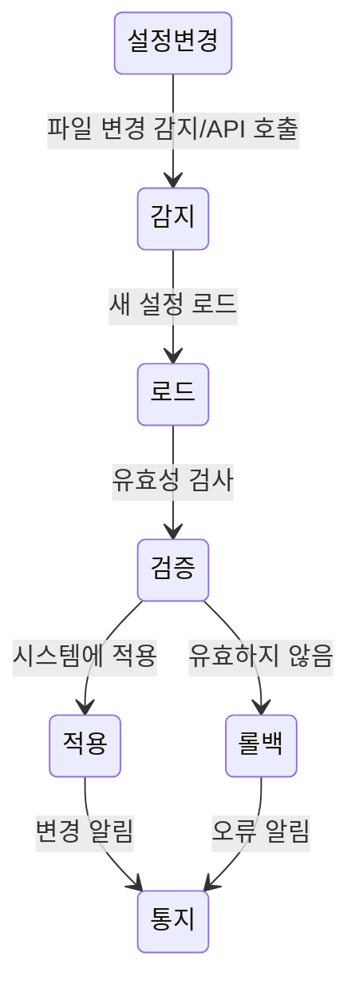

Configuration Driven Development(구성 기반 개발)는 애플리케이션의 동작을 코드로 하드코딩하는 대신 외부 설정을 통해 정의하고 제어하는 소프트웨어 개발 방법론입니다. 이 접근 방식은 비즈니스 로직과 규칙이 자주 변경되는 현대 소프트웨어 환경에서 특히 유용합니다.

## 기본 개념

구성 기반 개발의 핵심 아이디어는 애플리케이션의 가변적인 부분을 코드에서 분리하여 외부 설정으로 관리하는 것입니다. 이를 통해 개발자가 아닌 비즈니스 담당자나 관리자도 시스템의 동작을 변경할 수 있으며, 코드 수정 없이 애플리케이션의 동작을 실시간으로 조정할 수 있습니다.

구성 기반 개발은 [[관심사의 분리(Separation of Concerns)]] 원칙을 실천하는 방법 중 하나로, 애플리케이션 로직과 설정을 명확히 구분합니다.

## 구성 기반 개발의 이점

1. **유연성 향상**: 코드 변경 없이 애플리케이션의 동작을 수정할 수 있습니다.
2. **개발 주기 단축**: 설정 변경만으로 새로운 기능이나 동작을 구현할 수 있어 개발-테스트-배포 주기가 단축됩니다.
3. **비개발자 참여 가능**: 기술적 지식이 적은 도메인 전문가도 시스템 동작을 정의하고 관리할 수 있습니다.
4. **유지보수성 향상**: 코드 베이스가 더 안정적이고 예측 가능해집니다.
5. **다양한 환경 지원**: 개발, 테스트, 프로덕션 등 서로 다른 환경에 맞는 설정을 쉽게 적용할 수 있습니다.
6. **A/B 테스트 용이**: 설정만 변경하여 다양한 비즈니스 규칙을 실험할 수 있습니다.

## 구성 정보의 저장 형식과 위치

구성 정보는 다양한 형식과 위치에 저장될 수 있습니다:

### 형식

- **구조화된 텍스트 파일**: JSON, YAML, XML, Properties 등
- **데이터베이스**: 관계형 DB, NoSQL, 키-값 저장소 등
- **구성 서버**: Spring Cloud Config, HashiCorp Consul 등
- **환경 변수**: 컨테이너 환경에서 많이 사용됨
- **특수 목적 DSL(Domain Specific Language)**: 특정 도메인에 최적화된 문법

### 위치

- 파일 시스템
- 데이터베이스
- 분산 구성 저장소
- 클라우드 서비스(AWS Parameter Store, Azure App Configuration 등)
- 환경 변수

## 구성 기반 개발 구현 방법

구성 기반 개발을 구현하는 방법은 다양하지만, 일반적으로 다음과 같은 접근 방식이 사용됩니다:

### 1. 설정 모델 정의

애플리케이션에서 설정으로 제어할 부분을 식별하고, 이를 표현할 수 있는 모델을 정의합니다.

```java
public class PricingRule {
    private String service;
    private double markupPercentage;
    private double minimumCharge;
    private List<VolumeDiscount> volumeDiscounts;
    
    // Getters, setters, constructors...
}

public class VolumeDiscount {
    private double threshold;
    private double discountPercentage;
    
    // Getters, setters, constructors...
}
```

### 2. 설정 로더 구현

외부 설정을 로드하고 파싱하는 컴포넌트를 구현합니다.

```java
@Component
public class ConfigurationLoader {
    
    @Value("${config.location}")
    private String configLocation;
    
    private ObjectMapper objectMapper = new ObjectMapper();
    
    public PricingRules loadPricingRules() {
        try {
            File configFile = new File(configLocation);
            return objectMapper.readValue(configFile, PricingRules.class);
        } catch (IOException e) {
            throw new ConfigurationException("Failed to load pricing rules", e);
        }
    }
}
```

### 3. 설정 기반 로직 구현

설정을 사용하여 비즈니스 로직을 처리하는 컴포넌트를 구현합니다.

```java
@Service
public class PricingService {
    
    private final ConfigurationLoader configLoader;
    
    public PricingService(ConfigurationLoader configLoader) {
        this.configLoader = configLoader;
    }
    
    public double calculatePrice(String service, double baseAmount) {
        PricingRules rules = configLoader.loadPricingRules();
        PricingRule rule = rules.getRuleForService(service);
        
        if (rule == null) {
            return baseAmount; // 기본 가격 적용
        }
        
        double price = baseAmount * (1 + rule.getMarkupPercentage() / 100);
        
        // 최소 요금 적용
        price = Math.max(price, rule.getMinimumCharge());
        
        // 볼륨 할인 적용
        for (VolumeDiscount discount : rule.getVolumeDiscounts()) {
            if (baseAmount >= discount.getThreshold()) {
                price = price * (1 - discount.getDiscountPercentage() / 100);
                break;
            }
        }
        
        return price;
    }
}
```

### 4. 설정 관리 인터페이스 구현

비개발자가 설정을 쉽게 관리할 수 있는 인터페이스를 제공합니다. 이는 웹 기반 대시보드, CLI 도구, 또는 GUI 애플리케이션 형태가 될 수 있습니다.

설정 관리 인터페이스 구현에 대한 자세한 내용은 [[설정 관리 인터페이스 구현 방법]]을 참고해주세요.

## 구성 리프레시 전략

실시간으로 설정 변경을 적용하는 방법에는 여러 가지가 있습니다:



1. **폴링(Polling)**: 주기적으로 설정 소스를 확인하여 변경 사항을 감지합니다.
2. **이벤트 기반 감지**: 설정 변경 시 이벤트를 발생시켜 애플리케이션에 알립니다.
3. **웹훅(Webhook)**: 설정 변경 시 웹훅을 통해 애플리케이션에 알립니다.
4. **설정 서버**: 중앙 집중식 설정 서버를 사용하여 변경 사항을 관리하고 배포합니다.

설정 리프레시에 대한 자세한 내용은 [[실시간 설정 리프레시 전략]]을 참고해주세요.

## 스프링 프레임워크에서의 구성 기반 개발

스프링 프레임워크는 구성 기반 개발을 위한 다양한 기능을 제공합니다:

### Spring Boot의 외부 설정

Spring Boot는 다양한 방식으로 외부 설정을 로드하고 관리할 수 있습니다:

- application.properties/yml 파일
- 환경 변수
- 명령행 인수
- 프로필(Profiles)을 통한 환경별 설정

```java
@ConfigurationProperties(prefix = "pricing")
@Component
public class PricingConfiguration {
    private List<ServicePricing> services;
    
    // Getters, setters...
    
    public static class ServicePricing {
        private String name;
        private double markup;
        // Other properties...
        
        // Getters, setters...
    }
}
```

### Spring Cloud Config

분산 시스템에서의 중앙 집중식 구성 관리를 위한 솔루션입니다:

- 설정을 Git 저장소에 저장하고 관리
- 설정 변경 시 애플리케이션에 자동 알림
- 다양한 환경(개발, 테스트, 운영 등)에 대한 설정 관리
- 설정 암호화 지원

Spring Cloud Config에 대한 자세한 내용은  [[Spring Cloud Config]]을 참고해주세요.

## 고급 구성 기반 개발 패턴

### 1. 동적 규칙 엔진

설정을 넘어 복잡한 비즈니스 규칙을 외부에서 정의하고 실행할 수 있는 규칙 엔진을 구현합니다.

```java
@Service
public class RuleEngineService {
    
    private final RuleRepository ruleRepository;
    
    public RuleEngineService(RuleRepository ruleRepository) {
        this.ruleRepository = ruleRepository;
    }
    
    public Object executeRules(String ruleSetName, Map<String, Object> facts) {
        List<Rule> rules = ruleRepository.findByRuleSetName(ruleSetName);
        RuleContext context = new RuleContext(facts);
        
        for (Rule rule : rules) {
            if (rule.evaluateCondition(context)) {
                rule.executeAction(context);
            }
        }
        
        return context.getResult();
    }
}
```

규칙 엔진에 대한 자세한 내용은 [[비즈니스 규칙 엔진 구현]]을 참고해주세요.

### 2. 기능 토글(Feature Toggles)

기능 토글은 코드를 변경하지 않고도 특정 기능을 활성화하거나 비활성화할 수 있게 해주는 패턴입니다.

```java
@Service
public class FeatureService {
    
    private final FeatureToggleRepository repository;
    
    public FeatureService(FeatureToggleRepository repository) {
        this.repository = repository;
    }
    
    public boolean isFeatureEnabled(String featureName, String userId) {
        FeatureToggle toggle = repository.findByName(featureName);
        
        if (toggle == null || !toggle.isEnabled()) {
            return false;
        }
        
        // 사용자별, 지역별, 비율별 등 다양한 조건에 따라 기능 활성화 여부 결정
        return toggle.evaluateForUser(userId);
    }
}
```

기능 토글에 대한 자세한 내용은 [[기능 토글 패턴]]을 참고해주세요.

### 3. 설정 버전 관리 및 롤백

설정 변경의 이력을 관리하고 필요시 이전 버전으로 롤백할 수 있는 기능을 구현합니다.

```java
@Service
public class ConfigurationVersionService {
    
    private final ConfigVersionRepository repository;
    
    public ConfigurationVersionService(ConfigVersionRepository repository) {
        this.repository = repository;
    }
    
    public void saveNewVersion(String configType, String content, String author) {
        ConfigVersion version = new ConfigVersion();
        version.setConfigType(configType);
        version.setContent(content);
        version.setAuthor(author);
        version.setCreatedAt(LocalDateTime.now());
        
        repository.save(version);
    }
    
    public void rollbackToVersion(Long versionId) {
        ConfigVersion version = repository.findById(versionId)
            .orElseThrow(() -> new VersionNotFoundException("Version not found"));
        
        // 현재 설정을 이전 버전으로 롤백
        setCurrentConfiguration(version.getConfigType(), version.getContent());
        
        // 롤백 이벤트 발행
        publishRollbackEvent(version);
    }
}
```

설정 버전 관리에 대한 자세한 내용은 [[설정 버전 관리 전략]]을 참고해주세요.

## 구성 기반 개발의 단점과 극복 방법

구성 기반 개발이 모든 상황에 적합한 것은 아닙니다. 다음과 같은 단점이 있을 수 있습니다:

1. **디버깅 어려움**: 문제가 코드가 아닌 설정에 있을 때 디버깅이 더 어려울 수 있습니다.
2. **성능 오버헤드**: 설정을 동적으로 로드하고 해석하는 과정에서 성능 저하가 발생할 수 있습니다.
3. **복잡성 증가**: 설정이 너무 복잡해지면 관리하기 어려워질 수 있습니다.
4. **테스트 복잡성**: 다양한 설정에 대한 테스트가 필요해져 테스트 복잡성이 증가합니다.

이러한 단점을 극복하기 위한 방법들은 [[구성 기반 개발의 단점 극복 전략]]을 참고해주세요.

## 실제 사용 사례

구성 기반 개발은 다양한 영역에서 활용되고 있습니다:

1. **클라우드 비용 관리 시스템**: AWS, Azure 등의 클라우드 리소스 사용량에 대한 요금 계산 및 청구 시스템
2. **금융 규정 준수 시스템**: 국가별, 지역별로 다른 금융 규제에 대응하는 시스템
3. **E-commerce 플랫폼**: 가격 정책, 할인, 프로모션 등을 동적으로 관리하는 시스템
4. **콘텐츠 관리 시스템(CMS)**: 콘텐츠의 구조와 표현을 설정으로 관리하는 시스템
5. **ETL(Extract, Transform, Load) 도구**: 데이터 변환 규칙을 설정으로 관리하는 시스템

## 결론

구성 기반 개발은 비즈니스 로직과 규칙이 자주 변경되는 현대 소프트웨어 환경에서 유연성과 대응성을 높이는 강력한 접근 방식입니다. 적절히 구현하면 개발 주기를 단축하고, 비개발자의 참여를 촉진하며, 시스템의 유지보수성을 향상시킬 수 있습니다.

하지만 모든 개발 패러다임과 마찬가지로, 구성 기반 개발도 올바른 상황에서 적절한 방식으로 적용해야 합니다. 시스템의 복잡성, 성능 요구사항, 팀의 역량 등을 고려하여 구성 기반 개발의 적용 범위와 방식을 결정하는 것이 중요합니다.

특히 AWS CUR 데이터와 같이 형식과 정책이 자주 변경되는 환경에서는 구성 기반 개발이 제공하는 유연성이 큰 가치를 발휘할 수 있습니다.

## 참고 자료

- Designing Configuration-Driven Applications - Peter Evans
- Building Evolutionary Architectures - Neal Ford, Rebecca Parsons, Patrick Kua
- Spring Boot 공식 문서(https://docs.spring.io/spring-boot/docs/current/reference/html/features.html#features.external-config)
- AWS 비용 관리 모범 사례(https://aws.amazon.com/blogs/aws-cost-management/)